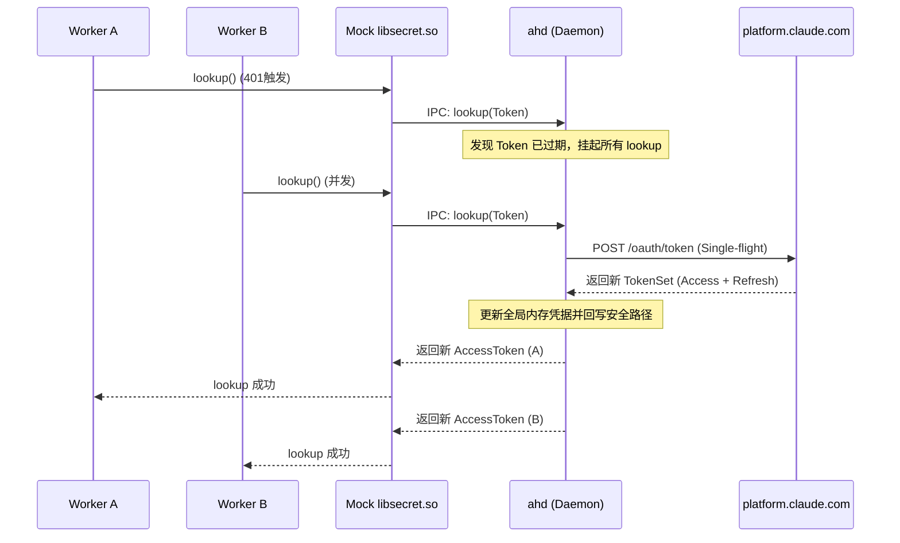

# Per-Worker Credentials 重做 · 设计发散与红队批判

> **角色声明**：本文件由 `o1-antigravity` (设计对抗/发散席) 产出。根据项目协作铁律，本席只负责提供多路可能、红队对抗与边界条件，不执笔最终冻结设计，最终冻结稿将由设计主笔 `d1-claude` 收敛落笔。

---

## 零、既有方案红队剖析 (为什么我们需要重做)

### 1. 既有 Gateway 方案 (Plan B / Module D) 的失效模式
* **全局代理秒死 (已实证)**：前序 PR (#146/#147/#149) 试图将 `ANTHROPIC_BASE_URL` 全局代理到本地 Bridge。由于 Claude 内部在处理常规 Chat/API 通讯时对网络吞吐、握手时序和 TLS 证书链有极强依赖，全局代理极易因环境（如 `current_exe` 兄弟二进制解析、UDS 权限、沙箱隔离）的细微差异导致 Worker 启动时 `AGENT_UNEXPECTED_EXIT` 秒死。
* **证书信赖瓶颈**：解密全局 HTTPS 流量需要注入 CA 证书，在复杂的 Node.js 沙箱环境下，这会因为 SSL Pinning 或环境变量缺失而频繁报握手失败，维护成本极高。

### 2. Operator 草稿方案 (单一刷新器 + 保鲜拷贝) 的失效模式
* **RTR (Refresh Token Rotation) 级联击穿**：该方案试图将 `.credentials.json` 拷贝多份供各 Worker 独立使用。然而，只要这些拷贝中含有真实的 `refreshToken`，任何 Worker 在面临内存/磁盘 Token 过期并撞上上游 401 时，均会**独立**发起上游刷新。由于 Auth0 等 OAuth 服务端的 RTR 机制，第一个刷新的 Worker 会导致原 `refreshToken` 被作废，第二个 Worker 稍后并发刷新时就会吃到 `invalid_grant`，从而触发安全盗用检测，导致**整个全局凭据血缘（包括宿主机 Windows 原生登录态）被级联注销**。

---

## 一、方案 A：Keystore-Backends 系统密钥库劫持与单点仲裁 (底层的核心突破)

### 1. 机制原理
根据逆向实证，Claude 在 Linux 下会优先通过 `node-keytar` 模块加载系统密钥库接口 `libsecret`。只有在密钥库探测失败时，才会退化到 `plaintext` 文件后端。
* **系统密钥库桥接**：在 WSL2 内提供一个 Mock 的 D-Bus `org.freedesktop.secrets` 守护进程，或者使用 Rust 实现一个极简的劫持动态链接库（如 `libsecret-1.so.0`），通过 `LD_PRELOAD` 在 Worker 启动时注入。
* **单点仲裁**：所有 Worker 调用 `keytar` 进行 lookup (读取 Token) 和 store (写入 Token) 时，请求均被 Mock 劫持库拦截并转发到宿主 Daemon `ahd` 的 IPC 端口。
* **Single-flight Lookup**：当并发 401 发生、N 个 Worker 同时尝试 lookup 刷新时，`ahd` 会挂起这些 lookup 请求，单点向上游发起一次 refresh 请求，更新内存中的 `TokenSet` 后，再统一将最新的 `accessToken` 返回给所有挂起的 lookup 调用。



### 2. 如何满足核心不变量
Worker 本身物理上根本没有 `.credentials.json` 文件，也无法独立触碰到真实的 `refreshToken`。一切凭据的读写和刷新都被收拢到了宿主 `ahd` 这一侧 hometown D-Bus/Mock 接口层，从协议底层杜绝了并发刷新的可能。

### 3. Load-bearing 假设 & 验证 Spike
* **关键假设**：Claude 在执行每次 API 会话/请求前，是否会重新向系统 KeyStore Lookup 凭据？如果它只在启动时 Lookup 一次并常驻内存，则本方案无法在运行中无感刷新 Token。
* **Spike 验证**：
  * 编写极简的 C 程序编译为 `libsecret-1.so.0` 的 Lookup 劫持存根，使用 `LD_PRELOAD` 运行 Claude CLI，观察其执行 API 请求时是否频繁触发 `secret_password_lookup_sync`。

### 4. 复杂度与失效模式
* **复杂度**：高。需要维护动态库劫持或 D-Bus 通信协议，且要对齐 `node-keytar` 内部的底层调用。
* **红队失效模式**：
  1. **沙箱环境变量擦除**：在极高隔离强度的容器/沙箱中，`LD_PRELOAD` 或 D-Bus socket 路径环境变量可能被过滤擦除，导致劫持失效，Worker 直接退化为 Plainsheet 文件后端报错。
  2. **静态链接击穿**：若未来的 Claude 版本将其 `node-keytar` 或相应的凭证后端静态编译（不动态链接 `libsecret`），则动态库劫持失效。

---

## 二、方案 B：去 Refresh Token 化的“纯 Access Token”明文拷贝

### 1. 机制原理
* **精简版凭证**：摒弃让 Worker 见证完整凭证的思路。Host 侧 `ahd` 持有唯一合法的 `~/.claude/.credentials.json`（含真实 `refreshToken`），并拥有全局唯一的刷新 Loop。
* **安全拷贝**：在 Worker 沙箱初始化时，`ahd` 将一份**阉割版**的凭证文件拷贝进沙箱。该文件仅保留 `accessToken` 和 `expiresAt`，而将 `refreshToken` 字段彻底删除或填充为 dummy 脏数据（例如 `"dummy-revoked-token-by-ahd"`）。
* **保鲜更新**：Host 侧的刷新 Daemon 在 Token 生命周期剩余 20% 时，主动向上游发起刷新，拿到新 Access Token 后，原子覆盖写入各个 Worker 的沙箱明文文件。

### 2. 如何满足核心不变量
即使 Worker 遇到 401 尝试在自己沙箱内发起刷新，由于其持有的 `refreshToken` 物理上为无效值，其刷新请求必定被 Auth0 拒绝（不产生上游 RTR 轮换），保护了全局凭据血缘的安全性。

### 3. Load-bearing 假设 & 验证 Spike
* **关键假设**：
  1. Claude 在检测到凭证文件中没有合法的 `refreshToken`（或者没有该字段）时，是否能在启动时正常加载 `accessToken` 进行工作？
  2. Claude 在遇到 401 失败时，如果向磁盘重读文件，能否热重载已被 Daemon 更新的 `accessToken`？
* **Spike 验证**：
  * 手动修改宿主 `~/.credentials.json`，将 `refreshToken` 字段篡改或清空，修改 `expiresAt`，执行常规 `claude` 命令测试其鉴权反应。

### 4. 复杂度与失效模式
* **复杂度**：极低。只需普通的文件写入与宿主定时任务，无需网络代理或链接库劫持。
* **红队失效模式**：
  * **长生命周期内存失效**：若某个 Agent 执行复杂长任务耗时超过 Access Token 的 TTL（例如持续 10 小时），而 Claude CLI 在运行中只认内存中的 Access Token，不重读磁盘。此时哪怕宿主在磁盘上同步了最新 Token，Worker 仍会因内存 Token 过期遭遇 401 崩溃，且因无有效 RT 而无法自愈。

---

## 三、方案 C：OAuth Endpoint 定点 HTTP 代理拦截

### 1. 机制原理
* **微型定向网关**：不代理任何 `api.anthropic.com` 的模型请求流量（100% 直连，防秒死）。
* **拦截特定端点**：通过注入 `HTTPS_PROXY`，本地代理**仅仅**对域名为 `platform.claude.com` 且路径为 `/v1/oauth/token` 的 Token 轮换请求进行拦截与解析。
* **代理合并**：当 Worker A 触发被动刷新并向 `platform.claude.com` 发送 POST 刷新请求时，代理拦截它并代表所有 Worker 挂起。`ahd` 统一向真实上游完成一次刷新，取得新 `TokenSet`，然后向所有并发 Worker 返回相同的格式化 JSON 响应。

```
[ Worker A (401 刷新) ] ----(platform.claude.com/v1/oauth/token)----> [ 代理拦截 (ahd) ] ---> [ 真实 Auth0 上游 ]
[ Worker B (401 刷新) ] ----------------------------------------------> [ Single-flight ]
```

### 2. 如何满足核心不变量
所有的刷新网络请求均无法直接穿透到公网，而是在 HTTP 传输层被 `ahd` 强制收拢。即使 Worker 内存中持有并发送了不同的旧 RT，代理服务器也能拦截并将其规范为单一真实的串行刷新动作。

### 3. Load-bearing 假设 & 验证 Spike
* **关键假设**：
  1. Claude CLI 的 Auth 客户端在请求 `platform.claude.com` 时是否尊重大局的 `HTTPS_PROXY` 环境变量？
  2. 该请求是否实施了客户端证书 Pinning？（如果是，拦截 HTTPS 流量将导致 TLS 握手失败而直接秒死）。
* **Spike 验证**：
  * 在本地启动 `mitmproxy`，设置全局 `HTTPS_PROXY`，运行 `claude` CLI 触发一次刷新，观察 `mitmproxy` 中能否成功解密并替换响应。

### 4. 复杂度与失效模式
* **复杂度**：中等。需要轻量级的 HTTPS 拦截代理。
* **红队失效模式**：
  * **SSL Pinning 强制阻断**：若 Anthropic 对其 OAuth 接口进行了内置证书校验，自签名 CA 根证书将无法被信任，导致所有 Worker 在触发刷新时全部秒死。

---

## 四、方案 D：生命周期安全线——Worker 滚动平滑重启与永不过期欺骗

### 1. 机制原理
* **冷更新策略**：不试图在 Worker 进程存活期间动态修改其内存中的 Token，也不劫持其网络或动态库。
* **只读凭证与欺骗**：Worker 的 credentials 设为只读，且无 `refreshToken`。同时，Daemon 将沙箱内的 `.credentials.json` 中的 `expiresAt` 设置为极远的未来值（如 2099 年）。
* **内存欺骗**：使 Claude 进程在本地永远不会因为本地时间戳判定而发起被动刷新。
* **任务间隙滚动重启**：所有真实的刷新动作由宿主 `ahd` 异步完成。一旦 `ahd` 刷新了 Host Token，它将监测 Worker 的运行状态。当 Worker 处于任务间隙（IDLE）时，`ahd` 自动对其执行平滑重启（Kill & Spawn，对用户无感），令其加载最新的 Token 磁盘映像。

### 2. 如何满足核心不变量
通过剔除 RT 且欺骗内存中的过期时钟，Worker 在物理上和逻辑上都绝不会、也不可能发起刷新。

### 3. Load-bearing 假设 & 验证 Spike
* **关键假设**：
  1. Claude CLI 判定过期的判据是单纯依赖本地 `expiresAt`，还是当遇到服务器端真正的 401 响应时也会被动触发刷新？（如果是后者，上游撤销 Token 时仍会触发刷新报错，需要有隔离逻辑）。
  2. 平滑重启 Worker 对当前的 Session 编排与通信状态机是否具有无损兼容性？
* **Spike 验证**：
  * 审计 `src/rpc/handlers/agent.rs` 中的 spawn 与销毁流程，测试在 agent 处于 IDLE 状态时强制重启对上层 RPC 调用的影响。

### 4. 复杂度与失效模式
* **复杂度**：低。纯粹的进程生命周期编排与文件读写。
* **红队失效模式**：
  * **长任务突发失效**：如果一个复杂任务持续运行 12 小时且无法重启（非 IDLE），在此期间服务器端因其他原因（如用户注销或 Auth0 会话过期）使 Token 失效返回了 401。Worker 此时由于无法刷新且无法重启，将导致该任务中途遭遇鉴权失败直接中断。

---

## 五、四套方案对比矩阵与对抗裁决

| 维度 | 方案 A (Keystore 劫持) | 方案 B (去 RT 明文同步) | 方案 C (HTTP 代理拦截) | 方案 D (平滑滚动重启) |
| :--- | :--- | :--- | :--- | :--- |
| **底层度** | 极高 (对齐 CLI 内部抽象) | 低 (外部同步) | 中 (网络层收拢) | 低 (生命周期强编排) |
| **代码侵入度**| 高 (需实现 mock so/D-Bus) | 极低 (仅文件同步) | 中 (需 proxy module) | 低 (需 Ctx 编排) |
| **RTR 隔离性**| 完美 (Lookup 合并) | 完美 (物理无 RT) | 完美 (网络层 single-flight) | 完美 (物理无 RT) |
| **WSL2 可行性**| 依赖 D-Bus 桥接或 so 注入 | 极高 | 依赖系统 HTTPS_PROXY 尊重 | 极高 |
| **核心爆破点**| `LD_PRELOAD` 或 D-Bus 被擦除 | 长周期任务内存未重载 401 | 强制 SSL Pinning 导致秒死 | 超长任务无法在中途无损重启 |

> **对抗裁决立场**：
> * **方案 A** 最为优雅且对齐 Claude CLI 的原生 OS Keychain 机制，是解决 headless 问题的终极武器，但需要验证 native 插件 of keytar 动态链接特征。
> * **方案 B** 虽然最简单，但**长周期任务不重载内存**是其致命死穴。
> * **方案 C** 是对原有全局网关方案的克制性回退，仅对 Auth 域名拦截，风险大为降低，但受制于 SSL Pinning。
> * **方案 D** 属于系统工程层面的“防守反击”方案，对业务流程和编排的健壮性要求极高。
>
> 建议下一步优先针对 **方案 A 的 so 劫持可行性** 与 **方案 B 的内存缓存特性** 展开 Spike 验证。
