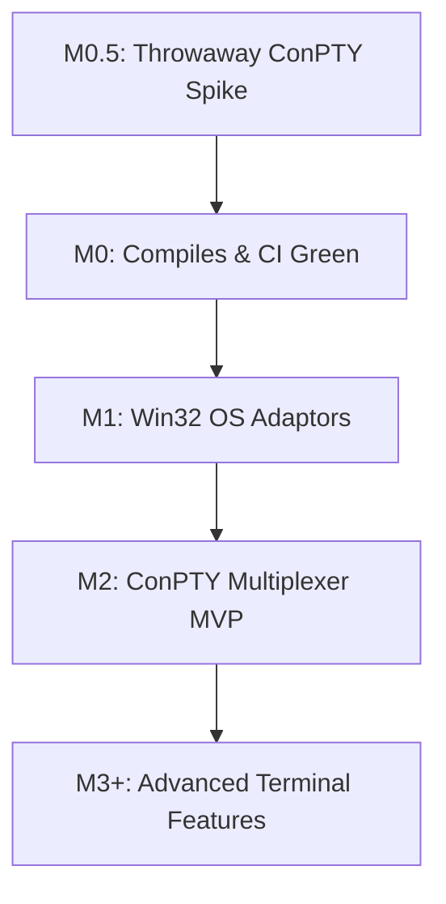

# Windows Native Support Design Document: MVP-First Porting Plan

## 1. Executive Summary

This document proposes the architecture for porting the `ah` daemon (`ahd`) and client CLI natively to Windows without relying on WSL. It is a design document for approval, not a line-by-line implementation spec. The plan is constrained by the current code shape: the production code mostly calls platform modules through statically dispatched `crate::platform::sys::*` free functions and uses a concrete `TmuxServer` API, not broad trait objects.

### 1.1. Core Feasibility Verdict

A native Windows port is feasible, but the first user-usable increment is the combined MVP of M0 + M1 + M2. M0 and M1 are internal engineering milestones: they make the tree compile and make Win32 OS primitives available, but they do not by themselves deliver a usable native Windows `ah` workflow.

The main mappings are:

- **Process supervision**: Windows process `HANDLE`s plus `RegisterWaitForSingleObject` and `GetExitCodeProcess` replace Linux pidfds while avoiding PID reuse as long as handles are retained.
- **Process containment**: Windows Job Objects configured with `JOB_OBJECT_LIMIT_KILL_ON_JOB_CLOSE` replace systemd scopes and cgroup kill behavior.
- **User daemon supervision**: Windows Task Scheduler COM APIs provide non-admin user-level persistence for `ahd`.
- **Terminal multiplexing**: Windows has no native `tmux`; `ahd` must host ConPTY sessions and virtual terminal state.

### 1.2. The Multiplexing Strategy

The Windows MVP will implement a daemon-hosted multiplexer. `ahd` spawns a ConPTY host through `portable-pty`, keeps the PTY writer/reader alive after CLI disconnect, feeds output into a terminal state engine, and exposes the subset of tmux behavior currently used by production code.

The terminal grid design uses `alacritty_terminal` to substantially reduce terminal parsing risk, not to eliminate it. The existing code also has a `vt100::Parser` registry used by marker matching (`Cargo.toml`, `src/marker/parser_registry.rs`, `agent_io`, ack handling). The Windows design must either adapt the ConPTY output stream into the existing `vt100` registry for prompt/marker consumers, or introduce a compatibility layer so the alacritty-backed capture path and the vt100 marker path receive the same byte stream and remain behaviorally consistent.

---

## 2. Phased Roadmap (MVP-First)



### M0.5 — Throwaway ConPTY/Grid Spike (Est. several days)

* **Goal**: Prove or falsify the largest engineering assumption before investing in broad platform adaptors.
* **Scope**:
  - Build a disposable Windows-only spike, outside the production API surface, that spawns `cmd.exe` or PowerShell through ConPTY/`portable-pty`.
  - Feed PTY output into `alacritty_terminal` and serialize a capture containing `READY`.
  - Verify that input written through the PTY writer can drive a shell command and that output can be observed without an attached interactive terminal.
* **Exit Gate**: On `windows-latest`, the spike sends a command, observes `READY` in the parsed grid, and documents any API or terminal-state blockers. If this fails, M2 scope must be revised before continuing.

### M0 — Windows Target Compilation (Est. ~1-2 weeks)

* **Goal**: Make Windows target compilation real, not aspirational, and block compile regressions in CI. The estimate includes the required IPC and monitor-handle abstraction boundaries plus broad cfg cleanup for `--all-targets`.
* **Scope**:
  - Add the Windows target dependency block in `Cargo.toml`: `rusqlite` with `bundled`, `windows-sys`, `portable-pty`, and the selected terminal grid dependency.
  - Standardize CI and release artifacts on `x86_64-pc-windows-msvc`. Do not add `x86_64-pc-windows-gnu` to the required matrix unless there is a concrete distribution need; GNU adds linker/runtime variance without improving the native COM/Win32 path.
  - Add `#[cfg(windows)] pub mod windows; pub use windows as sys;` and signature-complete Windows modules under `src/platform/windows/`.
  - Gate or abstract all currently non-cfg Unix-only imports and calls that prevent Windows compilation, including:
    - `src/rpc/mod.rs` and `src/cli/rpc_client.rs`: Unix socket imports and listener/client construction must move behind an IPC transport abstraction with Windows Named Pipes as the Windows backend.
    - `src/monitor/mod.rs` and `src/monitor/agent_watch.rs`: `OwnedFd`, `BorrowedFd`, and `AsyncFd` assumptions must become platform-neutral monitor handles.
    - `src/rpc/handlers/agent.rs`: Unix FIFO creation, `OpenOptionsExt`, `nix::mkfifo`, and `libc::O_NONBLOCK` must be cfg-gated or replaced by the Windows agent-output path.
    - Tests and benches pulled in by `cargo check --all-targets` must be cfg-correct when they assume Unix sockets, FIFOs, pidfds, or tmux.
* **Exit Gate**: `cargo check --all-targets --target x86_64-pc-windows-msvc` runs green on `windows-latest`. This gate requires the Unix-only call sites above to be cfg-clean or abstracted; stubs plus `Cargo.toml` are not sufficient.

### M1 — Win32 Platform Adaptors (Est. 2-3 weeks)

* **Goal**: Provide Windows implementations for the real static module API consumed by the current codebase.
* **Interface Mapping**:
  - The traits in `src/platform/mod.rs` are documentation-thin and not the main production call surface. M1 aligns `src/platform/windows/*` with the Linux module functions called through wrappers.
  - `process.rs` must support the monitor wrapper surface in `src/monitor/mod.rs`: `pidfd_open`, `pidfd_send_sigkill`, `register`, `remove`, `with_borrowed`, `contains`, and `list_keys`. The Windows type behind this surface should be a retained process `HANDLE`, not a numeric PID.
  - `scope.rs` must support the command-construction surface used by `src/tmux/scope.rs` and `src/sandbox/systemd.rs`: `wrap_in_scope`, `unit_name_for_socket`, `detect_scope_policy*`, `wrap_command*`, and `master_command*`. M1 keeps these signatures compatible with the current code: `wrap_command*` and `master_command*` return `Vec<String>`, and `wrap_in_scope` returns `std::process::Command`. Because those return types cannot carry a Job Object handle or assignment callback without widening the production API, Job Object assignment is explicitly owned by the M2 multiplexer spawn layer. The M1 command builders only produce the direct argv/`Command` that M2 will spawn suspended, assign to the job, then resume.
  - `service.rs` must support the CLI service helper surface: unit/task name derivation, transient daemon launch command construction, reset-failed equivalent, rendered persistent configuration, user configuration location, and atomic persistence where applicable. It must also export the same compile-visible symbols used by `src/cli/service_unit.rs`: `ServiceUnitError`, `escape_systemd_env_value`, and `escape_systemd_exec_token`. On Windows those escape helpers may be no-ops or Task Scheduler argument/env escaping equivalents, but the names must exist for the M0 compile gate. On Windows the persistent representation is a Task Scheduler registration rather than a systemd unit file.
  - `identity.rs` and `proc_info.rs` must preserve the existing call shape for daemon identity, liveness, process state, and exit-code queries while mapping to Windows APIs.
* **Process Handles**:
  - `pidfd_open` maps to `OpenProcess(SYNCHRONIZE | PROCESS_QUERY_LIMITED_INFORMATION, FALSE, pid)` and stores/returns a platform monitor handle.
  - `pidfd_send_sigkill` maps to `TerminateProcess` against the retained/opened process handle.
  - The registry retains handles until monitor cleanup. Windows keeps the process object alive while a handle is open, so the design should prove that monitoring and kill decisions do not depend on a later numeric PID lookup.
* **Job Objects**:
  - Create a named Job Object per supervised scope, for example `Local\ah-job-<scope_id>`.
  - Configure `JOB_OBJECT_LIMIT_KILL_ON_JOB_CLOSE` for cascading termination.
  - Do **not** combine the cascade-kill MVP path with `JOB_OBJECT_LIMIT_SILENT_BREAKAWAY_OK`: breakaway weakens the guarantee that closing the job handle kills the whole tree. If a later compatibility mode needs breakaway for a constrained host, it must be explicitly opt-in and excluded from the cascading-kill exit gate.
  - Spawn containment-sensitive processes suspended, assign them to the Job Object, then resume them. This avoids a race where a just-spawned process can create children before `AssignProcessToJobObject` runs.
* **Task Scheduler**:
  - Register a per-user logon task through COM (`ITaskService`) with restart settings and an action pointing to `ahd.exe`.
  - Inject identity/state through environment or task action arguments, including `AH_STATE_DIR` and an `AH_DAEMON_UNIT`-equivalent task name.
* **Exit Gate**:
  1. Job Object test spawns a process tree using suspended -> assign -> resume, closes the job handle, and verifies the full tree exits without `SILENT_BREAKAWAY_OK`.
  2. Process monitor test holds a process handle, terminates the process, then continues querying exit status through the same handle to prove the monitor path does not rely on PID reuse-sensitive numeric lookup.
  3. Task Scheduler test performs non-admin create/query/run/delete for a dummy user task.

### M2 — Minimum ConPTY Multiplexer (Est. 4-6 weeks after spike)

* **Goal**: Deliver the first user-usable native Windows MVP by replacing the tmux behavior required by normal agent and master workflows. This estimate assumes the spike has de-risked ConPTY/grid basics; FIFO-to-stream replacement and alacritty/vt100 coexistence may require schedule buffer.
* **Scope**:
  - Introduce a multiplexer boundary that covers the current `TmuxServer` production surface, not only `capture-pane` and `send-keys`.
  - Keep Linux/macOS on the existing tmux implementation.
  - Implement a Windows ConPTY multiplexer hosted by `ahd`.
* **Required Multiplexer Capabilities**:
  - Session/window lifecycle: `ensure_session`, `spawn_window`, `window_exists`, `kill_session`, `kill_window`, and `kill_pane`.
  - Pane identity and process monitoring: `get_pane_pid` or an equivalent stable process-handle identity usable by monitor code.
  - Output stream plumbing for agent IO: replace `pipe_pane_to_fifo` with a Windows-safe stream registration that feeds the same agent IO reader and marker parser semantics. The design cannot depend on Unix FIFOs on Windows.
  - Pane metadata: `set_pane_title`.
  - Input: `send_keys_literal`, `send_keys_keysym`, `send_enter`, and `send_ctrl_c`.
  - Buffered paste path: `load_buffer`, `paste_buffer`, and `delete_buffer`, or a Windows implementation that preserves the existing large-text send semantics used by `agent_io::writer`.
  - Discovery: `list_panes` for recovery/cleanup flows.
  - Capture: `capture_pane` with at least the current tmux behavior of `capture-pane -p -S -200`.
* **Capture Semantics**:
  - M2 must serialize the visible grid plus the last N lines of scrollback history, with N initially matching the existing `-S -200` behavior. Health checks, master watch, prompt handling, pane diff, and death-capture paths depend on this history. Interactive scrollback paging can wait for M3+, but the 200-line programmatic capture cannot.
* **Keysym Semantics**:
  - M2 must translate the keysym subset already used by production code: at minimum `Enter -> \r`, `C-c -> 0x03`, and the cancel/submit keysyms used by job and prompt flows. Literal text plus a separate `Enter` keysym is the standard dispatch path.
* **Agent Spawn Integration**:
  - Current agent spawn depends on tmux window creation, pane PID lookup, FIFO piping, pidfd watch, and `vt100::Parser` registry setup. M2 must preserve that behavioral chain using Windows-safe handles and streams before declaring the MVP usable.
* **Terminal Query Responses**:
  - The Windows multiplexer read loop must retain access to the PTY writer and answer terminal queries initiated by ConPTY or the hosted program. The M0.5 spike showed that ConPTY emits a DSR cursor-position query `\x1b[6n` (`1B 5B 36 6E`) during shell startup and waits for a terminal response such as `\x1b[1;1R`; if the host only reads and never replies, `cmd.exe` can stall in initialization, commands never execute, teardown reports `STATUS_CONTROL_C_EXIT` (`0xC000013A`), and the PTY output may contain only the initial query bytes. M2 must detect DSR across chunk boundaries and answer every occurrence through the writer. The query responder should be extensible for other common terminal queries observed in practice, such as DA `\x1b[c -> \x1b[?1;0c`.
* **MVP Exclusions**:
  - Interactive `ah attach`, user-driven scrollback paging, pane layout management beyond the single-pane workflow, resize propagation, and daemon crash recovery of in-memory terminal grids.
* **Exit Gate**:
  1. Spawn a ConPTY-backed shell in `ahd`, disconnect the CLI, and verify the shell remains alive under daemon ownership.
  2. Send `pwd` or an equivalent current-directory command using `send_keys_literal`, then submit it with `send_keys_keysym("Enter")`; `capture_pane` must show the command executed and returned output.
  3. Emit more than one screen of output and verify `capture_pane` includes the last 200 lines of history, not only the visible viewport.
  4. Spawn an agent through the normal RPC path and verify output reaches the marker/parser pipeline without Unix FIFOs.

### M3+ — Advanced Capabilities (Post-MVP, Est. 4-8+ weeks)

* **Goal**: Move from Windows MVP to broader tmux parity and operational polish.
* **Scope**:
  - Interactive attach/detach by proxying terminal input and output between client terminals and daemon-hosted ConPTY sessions.
  - User-facing scrollback navigation and pagination beyond the programmatic last-200-line capture required in M2.
  - Resize propagation using PTY window-size APIs and terminal-grid resizing.
  - Multi-pane layout parity where product workflows actually need it.
  - Crash recovery for daemon-hosted terminal sessions, or explicit degraded recovery semantics if ConPTY handles cannot survive daemon restart.
  - Broader parity and hardening work beyond the MVP. The 8-12+ person-week research estimate should be read as MVP-scale work for M0.5 + M0 + M1 + M2; full Windows parity including M3+ is closer to 11-19+ person-weeks and remains sensitive to tmux-equivalence risk.

---

## 3. Key Cross-Cutting Decisions

| Decision Area | Chosen Conclusion | Principal Rationale |
| --- | --- | --- |
| IPC Transport | Win32 Named Pipes on Windows, UDS on Unix | Native ACL support and secure per-user daemon access |
| Paths/Locations | `%LOCALAPPDATA%\ah\...` | Persistent non-admin user state |
| Process Containment | Job Objects without breakaway in MVP | Preserve cascading kill semantics |
| VT Grid Engine | `alacritty_terminal` plus vt100 compatibility path | Reduces grid parsing risk while preserving marker consumers |
| Test Matrix | MSVC compile gate plus Windows CI smoke tests | COM, ConPTY, Job Objects require real Windows |
| Artifact Toolchain | MSVC | Best fit for COM/Win32 and single-binary distribution |

### 3.1. IPC Transport Abstraction

Windows communication should use Win32 Named Pipes such as `\\.\pipe\ahd-<hash>`, while Linux/macOS keep Unix Domain Sockets. The current code imports `tokio::net::UnixListener` and `std::os::unix::net::UnixStream` directly, so the design requires an IPC transport boundary exposing common async read/write behavior for the daemon and sync request/response behavior for the CLI.

### 3.2. Temporary Paths & Config Directory Layout

Windows state should live under `%LOCALAPPDATA%\ah\` rather than emulating `/tmp/tmux-<uid>`. Temp directories may be cleaned by the OS and are a poor home for persistent daemon identity, named-pipe names, Task Scheduler task metadata, and recovery state.

### 3.3. Terminal Grid Engine Selection

`alacritty_terminal` is preferred over a custom grid built directly on `vte` because it already handles wrapping, alternate screens, scroll regions, character width, and attributes. This substantially reduces risk and schedule, but it is not risk-free: it is a terminal-emulator engine rather than a stable high-level multiplexer API.

The current marker stack uses `vt100::Parser` handles registered by agent id. Windows M2 should feed the same ConPTY byte stream into that registry or provide a compatibility adapter before replacing marker matching. Capture rendering may use alacritty, while prompt/marker detection can continue using vt100 until a separate migration is justified.

### 3.4. Test Matrix & Validation Strategy

Local Linux can validate cfg correctness and type checking only if the Windows target toolchain is installed. Behavioral tests for ConPTY, Job Objects, Task Scheduler COM, and Named Pipes must run on Windows CI. The required compile gate is:

```bash
cargo check --all-targets --target x86_64-pc-windows-msvc
```

### 3.5. Release Artifact & Compiler Toolchain

Release binaries should use `x86_64-pc-windows-msvc`. The MSVC ABI integrates cleanly with COM and Win32 APIs and avoids MinGW runtime distribution issues. GNU target support can remain a future compatibility option, but it is not part of the MVP acceptance matrix.

---

## 4. Risks & Uncertainties

1. **ConPTY + grid fidelity is the largest uncertainty**:
   * *Risk*: `portable-pty` plus `alacritty_terminal` may not reproduce enough tmux `capture-pane` and input behavior for agent orchestration.
   * *Mitigation*: Run the throwaway spike before M0/M1 investment and make M2 acceptance cover literal input, keysym input, and 200-line capture history.
2. **`alacritty_terminal` dependency stability**:
   * *Risk*: `alacritty_terminal` is a pre-1.0 terminal-engine crate whose internals can break across upgrades.
   * *Mitigation*: Pin the version, isolate it behind a small grid/capture adapter, and treat dependency upgrades as explicit compatibility work.
3. **COM threading models**:
   * *Risk*: Task Scheduler COM calls require correct `CoInitializeEx` apartment handling and can fail if mixed casually with Tokio worker threads.
   * *Mitigation*: Run COM registration on a dedicated thread with explicit apartment initialization.
4. **Job Object host constraints**:
   * *Risk*: Some CI or enterprise environments may already place processes in restrictive jobs.
   * *Mitigation*: Detect assignment failures and report an explicit unsupported-environment error. Do not weaken MVP cascading-kill semantics with silent breakaway.
5. **Daemon-hosted PTY crash model**:
   * *Risk*: Unlike tmux, in-memory ConPTY sessions owned by `ahd` may not survive daemon crash.
   * *Mitigation*: M2 documents this as an MVP limitation; M3+ decides whether to implement recovery or formalize degraded semantics.

---

## 5. Verification & Test Matrix

| Test Item | Target Component | Run Environment | Verification Method / Assertions |
| --- | --- | --- | --- |
| Cargo Check | Complete codebase | Windows CI | `cargo check --all-targets --target x86_64-pc-windows-msvc` passes, including tests/benches cfg cleanup. |
| Unix-only Gate | RPC, monitor, agent spawn | Windows CI | No unconditional `std::os::unix`, `tokio::net::Unix*`, Unix FIFO, `OwnedFd/BorrowedFd`, or `libc::O_NONBLOCK` usage reaches Windows builds. |
| Job Object Cascading Kill | `platform/windows/scope.rs` | Windows CI | Suspended child is assigned to a job, resumed, creates a child, then all descendants exit when the job handle closes. |
| Process Handle Guard | `platform/windows/process.rs` | Windows CI | Hold a process handle, terminate the process, and continue querying exit state through the same handle to prove no numeric-PID reuse dependency. |
| Task Scheduler COM CRUD | `platform/windows/service.rs` | Windows CI | Create, query, run, and delete a non-admin user task. |
| ConPTY Spike | Disposable spike | Windows CI | Spawn shell, send command, parse `READY` from grid. |
| ConPTY Query Response | Windows multiplexer | Windows CI | Before and during interactive command dispatch, answer DSR and assert real command output such as `AH_CONPTY_READY` is captured live, not only the initialization sequence. |
| ConPTY Dispatch | Windows multiplexer | Windows CI | Send `pwd` literal plus `Enter` keysym and capture the executed command output. |
| Capture History | Windows multiplexer | Windows CI | Produce more than one viewport of output and verify capture includes the last 200 lines. |
| Agent Spawn Path | RPC + multiplexer + monitor | Windows CI | Spawn an agent through RPC, observe output in marker/parser pipeline, and monitor process exit without Unix FIFOs or pidfds. |
| Daemon Persistence | `ahd` hosted PTY | Windows CI | Disconnect CLI and assert the daemon and ConPTY child continue running. |
