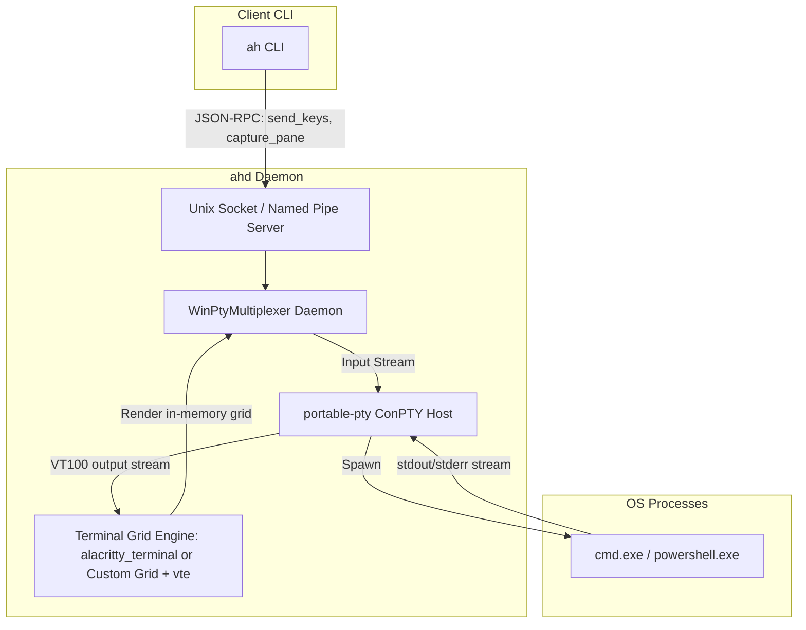

# Windows Native Support (No WSL) Feasibility & Design Research

## 1. Executive Summary & Feasibility Verdict

* **Verdict**: **Highly Feasible, but requires significant engineering investment (high effort) due to the complexity of building a tmux replacement layer.**
* **Core Findings**:
  * **Process Control & Containment**: Windows **Job Objects** map closely to Linux `cgroups` / `systemd scopes`. Specifically, configuring the job object with the `JOB_OBJECT_LIMIT_KILL_ON_JOB_CLOSE` flag ensures cascading termination semantics similar to `systemd`’s `BindsTo` / `PartOf` properties.
  * **Process Exit & Supervision**: Windows process `HANDLE`s, combined with `RegisterWaitForSingleObject` or `GetExitCodeProcess`, provide process monitoring superior to Linux `pidfd`. As long as `ahd` holds an open process handle, the Windows OS kernel prevents PID reuse, completely eliminating PID recycling race conditions.
  * **User Daemon Manager**: Rather than Windows Services (which require local administrator rights to install), the **Windows Task Scheduler** (accessed via COM interfaces) offers a native, non-privileged path for persistent user services that start on logon and auto-restart on failure.
  * **PTY & Terminal Multiplexing (The Core Hurdle)**: Windows has no native `tmux`. While Windows 10 (1809+) includes **ConPTY** (Pseudo Console) for raw PTY spawning, it lacks multi-session multiplexing, buffer capturing (`capture-pane`), and cross-process keystroke injection (`send-keys`). To achieve native compatibility, `ah` must implement an in-memory virtual terminal host inside the `ahd` daemon.
* **Estimated Engineering Cost**: **8 to 12+ person-weeks** (upward revision from 5-8 weeks).
  * **Phase 1: Windows Platform Adaptors** (Process, Job Objects, Task Scheduler): 2-3 weeks.
  * **Phase 2: Win32 Virtual PTY Multiplexer Daemon** (ConPTY + virtual terminal buffers): 5-8 weeks. (This remains the largest source of engineering uncertainty).
  * **Phase 3: Integration, E2E tests, and Windows CI Configuration**: 1-2 weeks.

---

## 2. Linux-to-Windows Native Dependency Mapping

| Linux Capability | Windows Native Equivalent | Target Rust Crate(s) | Feasibility / Effort | Target Windows OS | Crate Details & License |
| --- | --- | --- | --- | --- | --- |
| **pidfd Process Monitoring** (`pidfd_open`, `waitid`) | Process `HANDLE` + `RegisterWaitForSingleObject` / `GetExitCodeProcess` | `windows-sys` | **Feasible / Low-to-Medium Effort** | Windows XP / Server 2003+ | **windows-sys** (0.61.2): MIT OR Apache-2.0, Microsoft official, pure Rust, active. |
| **systemd scope / cgroup containment** (cascading kill, `BindsTo`/`PartOf`) | **Job Objects** + `SetInformationJobObject` with `JOB_OBJECT_LIMIT_KILL_ON_JOB_CLOSE` | `windows-sys` | **Feasible / Medium Effort** | Windows 8 / Server 2012+ | Built-in Win32 Kernel subsystem. |
| **systemd user service (`ahd.service`)** | **Windows Task Scheduler** (using COM `ITaskService`) | `windows-sys` (direct COM calls) | **Feasible / Medium Effort** | Windows XP / Server 2003+ | Native COM API. Avoids admin UAC prompts required by SCM. |
| **Process State & Liveness check** (`/proc/{pid}/stat` Zombie status) | `GetExitCodeProcess`, `GetProcessTimes`, `QueryFullProcessImageName` | `windows-sys` | **Feasible / Low Effort** | Windows XP+ | Standard Win32 Process APIs. |
| **Terminal Multiplexing (tmux)** (`capture-pane`, `send-keys`, pane layouts) | **Win32 ConPTY** + in-memory virtual terminal grid buffers | `portable-pty` (by WezTerm), `alacritty_terminal` or custom grid + `vte` (parser) | **Feasible / Very High Effort** | Windows 10 1809 / Server 2019+ | `portable-pty` (0.9.0): MIT, WezTerm ecosystem, crates.io version >1 year without release, relies on FFI. `vte`: Apache-2.0 OR MIT, pure ANSI parser. `alacritty_terminal` (0.26.0): Apache-2.0, active grid engine. |

---

## 3. Code-Level Site Inventory & Windows Implementation Design

The existing `src/platform/` abstraction uses conditional module re-exports (`crate::platform::sys::*`) rather than trait objects. The traits themselves are defined in [src/platform/mod.rs:47](file:///home/sevenx/coding/ccbd-rust/src/platform/mod.rs#L47) (e.g., `ProcessWatcher`, `ProcessReaper`, `ScopeManager`, `ServiceSupervisor`, `DaemonIdentity`, `ProcInfo`). Caller files invoke methods directly through the `platform::sys` module path, statically dispatched at compile time.

A Windows port will introduce `src/platform/windows/` containing equivalents for each of the Linux implementation files.

### 3.1. Process Monitoring & PID reuse fencing
* **Linux Real Implementation (真身)**:
  * [src/platform/linux/process.rs:8](file:///home/sevenx/coding/ccbd-rust/src/platform/linux/process.rs#L8) (`PIDFD_REGISTRY` global registry of process file descriptors to track monitors).
  * [src/platform/linux/process.rs:13](file:///home/sevenx/coding/ccbd-rust/src/platform/linux/process.rs#L13) (`pidfd_open` syscall to get process fd).
  * [src/platform/linux/process.rs:38](file:///home/sevenx/coding/ccbd-rust/src/platform/linux/process.rs#L38) (`pidfd_send_sigkill` using `SYS_pidfd_send_signal` with `SIGKILL`).
* **Wrapper & Calling Points**:
  * [src/monitor/mod.rs:10-43](file:///home/sevenx/coding/ccbd-rust/src/monitor/mod.rs#L10-L43) delegates `pidfd_open`, `pidfd_send_sigkill`, `register`, `remove`, `with_borrowed`, `contains`, and `list_keys` to `sys::process`.
  * The actual monitoring logic in [src/monitor/agent_watch.rs](file:///home/sevenx/coding/ccbd-rust/src/monitor/agent_watch.rs) and [src/monitor/master_watch.rs](file:///home/sevenx/coding/ccbd-rust/src/monitor/master_watch.rs) calls these wrappers to watch processes and handle exits.
* **Windows Implementation Design**:
  * Implement `src/platform/windows/process.rs`. Define `PROCESS_REGISTRY` to hold duplicate process `HANDLE`s.
  * `pidfd_open` -> `OpenProcess(SYNCHRONIZE | PROCESS_QUERY_LIMITED_INFORMATION, FALSE, pid)`. The returned `HANDLE` acts as a unique token.
  * **PID Reuse Fencing**: Windows keeps the process kernel object alive as long as there is an open handle to it. Holding the handle prevents the OS from reusing the PID for new processes, eliminating recycling race conditions.
  * `pidfd_send_sigkill` -> `OpenProcess(PROCESS_TERMINATE, FALSE, pid)` then `TerminateProcess(handle, exit_code)`.

### 3.2. Scope Containment & Cascading Kill
* **Linux Real Implementation (真身)**:
  * [src/platform/linux/scope.rs:115](file:///home/sevenx/coding/ccbd-rust/src/platform/linux/scope.rs#L115) (`wrap_in_scope` wrapping tmux in systemd-run).
  * [src/platform/linux/scope.rs:141](file:///home/sevenx/coding/ccbd-rust/src/platform/linux/scope.rs#L141) / [src/platform/linux/scope.rs:149](file:///home/sevenx/coding/ccbd-rust/src/platform/linux/scope.rs#L149) / [src/platform/linux/scope.rs:156](file:///home/sevenx/coding/ccbd-rust/src/platform/linux/scope.rs#L156) (`unit_name_for_socket`, `detect_scope_policy*`).
  * [src/platform/linux/scope.rs:180](file:///home/sevenx/coding/ccbd-rust/src/platform/linux/scope.rs#L180) / [src/platform/linux/scope.rs:215](file:///home/sevenx/coding/ccbd-rust/src/platform/linux/scope.rs#L215) / [src/platform/linux/scope.rs:238](file:///home/sevenx/coding/ccbd-rust/src/platform/linux/scope.rs#L238) (`wrap_command` and variations wrapping provider processes).
  * [src/platform/linux/scope.rs:270](file:///home/sevenx/coding/ccbd-rust/src/platform/linux/scope.rs#L270) / [src/platform/linux/scope.rs:279](file:///home/sevenx/coding/ccbd-rust/src/platform/linux/scope.rs#L279) (`master_command*` wrapping master shell commands).
  * [src/platform/linux/scope.rs:308](file:///home/sevenx/coding/ccbd-rust/src/platform/linux/scope.rs#L308) (`append_daemon_unit_dependencies` using systemd `BindsTo` / `PartOf` properties for cascading kill).
* **Wrapper & Calling Points**:
  * [src/tmux/scope.rs:20-37](file:///home/sevenx/coding/ccbd-rust/src/tmux/scope.rs#L20-L37) wraps `wrap_in_scope`, `unit_name_for_socket`, and `detect_scope_policy*`, called by [src/tmux/session.rs](file:///home/sevenx/coding/ccbd-rust/src/tmux/session.rs).
  * [src/sandbox/systemd.rs:9-100](file:///home/sevenx/coding/ccbd-rust/src/sandbox/systemd.rs#L9-L100) wraps `wrap_command*` and `master_command*`, called by RPC spawn handlers.
* **Windows Implementation Design**:
  * Implement `src/platform/windows/scope.rs`.
  * **Job Objects**: When spawning a new provider session or master, `ahd` will create a Named Job Object (e.g., `Local\\ccb-job-<scope_id>`) using `CreateJobObjectW`.
  * **Cascading Kill**: Apply extended limits via `SetInformationJobObject`:
    ```rust
    JOBOBJECT_EXTENDED_LIMIT_INFORMATION {
        BasicLimitInformation: JOBOBJECT_BASIC_LIMIT_INFORMATION {
            LimitFlags: JOB_OBJECT_LIMIT_KILL_ON_JOB_CLOSE | JOB_OBJECT_LIMIT_SILENT_BREAKAWAY_OK,
            ..
        },
        ..
    }
    ```
    Once the job handle is closed (by normal teardown, `ahd` exit, or crash), the Windows kernel automatically terminates all processes in the job tree, perfectly mimicking `BindsTo` / `PartOf`.
  * **Process Association**: Call `AssignProcessToJobObject(job_handle, child_process_handle)` immediately after spawning the child process.
  * **Command Wrapping**: Skip prefixing command strings with external tools like `systemd-run`. Spawn the command directly and associate its handle with the Job Object.

### 3.3. Daemon Service Supervisor
* **Linux Real Implementation (真身)**:
  * [src/platform/linux/service.rs:25](file:///home/sevenx/coding/ccbd-rust/src/platform/linux/service.rs#L25) (`derive_unit_name`).
  * [src/platform/linux/service.rs:34](file:///home/sevenx/coding/ccbd-rust/src/platform/linux/service.rs#L34) / [src/platform/linux/service.rs:46](file:///home/sevenx/coding/ccbd-rust/src/platform/linux/service.rs#L46) (`build_ahd_systemd_run_command*`).
  * [src/platform/linux/service.rs:73](file:///home/sevenx/coding/ccbd-rust/src/platform/linux/service.rs#L73) (`ahd_reset_failed_is_best_effort`).
  * [src/platform/linux/service.rs:93](file:///home/sevenx/coding/ccbd-rust/src/platform/linux/service.rs#L93) (`render_unit_file`).
  * [src/platform/linux/service.rs:137](file:///home/sevenx/coding/ccbd-rust/src/platform/linux/service.rs#L137) / [src/platform/linux/service.rs:150](file:///home/sevenx/coding/ccbd-rust/src/platform/linux/service.rs#L150) (`resolve_user_systemd_dir*`).
  * [src/platform/linux/service.rs:156](file:///home/sevenx/coding/ccbd-rust/src/platform/linux/service.rs#L156) (`atomic_write_unit`).
* **Wrapper & Calling Points**:
  * [src/cli/service_unit.rs:5-39](file:///home/sevenx/coding/ccbd-rust/src/cli/service_unit.rs#L5-L39) wraps these helpers for unit file creation, called by CLI service installation flows in `src/bin/ah.rs`.
  * [src/cli/start.rs:29-48](file:///home/sevenx/coding/ccbd-rust/src/cli/start.rs#L29-L48) wraps transient command builder and reset-failed helpers, used in CLI start fallback.
* **Windows Implementation Design**:
  * Implement `src/platform/windows/service.rs`.
  * **Windows Task Scheduler**: Services registered through the Service Control Manager (SCM) require administrative rights. The Task Scheduler allows non-privileged background persistence.
  * Interact with the Task Scheduler via COM interfaces (`ITaskService`, `ITaskFolder`, `ITaskDefinition`).
  * **Registration Flow**:
    1. Call `CoCreateInstance` to get `ITaskService`.
    2. Connect using `Connect` (using the current user context).
    3. Define a Logon trigger using `ITriggerCollection::Create(TriggerTypeLogon)`.
    4. Define a launch action using `IActionCollection::Create(ActionTypeExecute)` pointing to `ahd.exe`.
    5. Set restart recovery policies via `ITaskSettings::put_RestartCount(3)` and `ITaskSettings::put_RestartInterval("PT1M")` (restarts on failure after 1 minute).
    6. Register the task under a hashed folder name like `\ah\ahd-<hash>` derived from the state directory path.
  * **Lifecycle Operations**: Start/stop using `IRegisteredTask::Run` and `IRegisteredTask::Stop`.
  * **Unit File Writing**: No physical file will be written to disk; instead, the registry-backed task config is persisted via COM API registration.

### 3.4. Daemon Identity & Process Info
* **Linux Real Implementation (真身)**:
  * [src/platform/linux/identity.rs:3](file:///home/sevenx/coding/ccbd-rust/src/platform/linux/identity.rs#L3) / [src/platform/linux/identity.rs:9](file:///home/sevenx/coding/ccbd-rust/src/platform/linux/identity.rs#L9) (`detect_current_service_unit` parsing `/proc/self/cgroup`).
  * [src/platform/linux/proc_info.rs:12](file:///home/sevenx/coding/ccbd-rust/src/platform/linux/proc_info.rs#L12) (`kill_zero_check` checking process liveness).
  * [src/platform/linux/proc_info.rs:29](file:///home/sevenx/coding/ccbd-rust/src/platform/linux/proc_info.rs#L29) / [src/platform/linux/proc_info.rs:33](file:///home/sevenx/coding/ccbd-rust/src/platform/linux/proc_info.rs#L33) (`proc_state` and zombie checking).
  * [src/platform/linux/proc_info.rs:39](file:///home/sevenx/coding/ccbd-rust/src/platform/linux/proc_info.rs#L39) (`waitid_exit_code` waiting for child exit code).
* **Wrapper & Calling Points**:
  * [src/systemd_unit.rs:1-8](file:///home/sevenx/coding/ccbd-rust/src/systemd_unit.rs#L1-L8) wraps daemon identity discovery, called in CLI check blocks.
  * [src/monitor/agent_watch.rs](file:///home/sevenx/coding/ccbd-rust/src/monitor/agent_watch.rs) imports and directly calls `proc_info::*` helpers.
* **Windows Implementation Design**:
  * Implement `src/platform/windows/identity.rs` and `src/platform/windows/proc_info.rs`.
  * **Daemon Identity**: Since Windows lacks `/proc/self/cgroup`, the task action definition will set an environment variable `AH_DAEMON_UNIT=ah-task-<hash>`. The daemon queries `std::env::var("AH_DAEMON_UNIT")` to detect its identity.
  * **Liveness & Zombie Detection**: `OpenProcess(PROCESS_QUERY_LIMITED_INFORMATION)` is used to query liveness. Call `GetExitCodeProcess`. If it returns `STILL_ACTIVE`, the process is running. Windows does not have a "zombie" state; exited processes stay terminated until all handles are closed, so checking exit codes is sufficient.
  * **Exit Code Waiting**: We register the process handle with `RegisterWaitForSingleObject` to trigger a callback on exit, or use an asynchronous worker thread pool to await completion.

---

## 4. Deep-Dive: tmux Replacement via ConPTY and Virtual Multiplexing

Since `tmux` is unavailable natively on Windows, `ah` must substitute it. This is the single largest engineering hurdle.



### 4.1. The Gap Analysis: tmux vs. ConPTY
* `portable-pty` provides the raw process execution terminal abstraction, but it has no memory of terminal layout or history.
* **No `capture-pane`**: There is no built-in way to read what the console looks like.
* **No `send-keys`**: There is no public OS API to inject terminal keystroke streams into a background PTY process from a separate CLI program.
* **No Detached Sessions**: If the spawning process exits, the PTY connection dies unless a daemon process maintains the PTY handles.

### 4.2. Recommended Architecture: `WinPtyMultiplexer`
We must implement a virtual terminal host server directly in the `ahd` daemon.

1. **PTY Spawning & Lifecycle**:
   * For each provider session spawned, `ahd` maintains an instance of `portable-pty`.
   * `portable-pty` exposes:
     * `openpty` to establish Master/Slave terminal pairs.
     * `spawn_command` to execute processes.
     * `try_clone_reader` to read stdout/stderr output.
     * `take_writer` to write stdin inputs.
   * `portable-pty` relies internally on Windows FFI to map these to native pseudo-console APIs (ConPTY).
2. **Implementing `send-keys`**:
   * *The Keystroke Injection Gap*: Windows lacks a native equivalent to tmux's command injection. Direct backend injection of keystrokes into a separate running PTY process is not supported by the OS.
   * *The Solution*: Since `ahd` acts as the daemon hosting the PTY, it holds the `MasterPty` writer. The `ah` CLI transmits keystroke sequences to `ahd` via IPC (Unix Domain Sockets or Named Pipes), and `ahd` calls `writer.write(keys)` to pipe them directly. This successfully implements `send-keys` semantics.
3. **Implementing `capture-pane`**:
   * *ANSI Parsing & Grid Buffering*: The `vte` crate is only an ANSI parser and does not maintain the screen grid. To support `capture-pane`, `ahd` must maintain an in-memory representation of the active screen.
   * *Design Trade-off*:
     * **Option A: Custom Grid Engine + `vte`**: Build a custom 2D grid structure in memory, using `vte` to parse escape sequences and update character cells. Lightweight, but complex to implement correctly (must handle cursor movements, scrolling margins, alternate screens, wrapping).
     * **Option B: `alacritty_terminal`**: Use `alacritty_terminal` (version 0.26.0, Apache-2.0). It provides a complete, battle-tested terminal grid (`Term` and `Grid`) used in a high-performance terminal emulator. It handles all ANSI and VT100 escapes correctly and maintains a stable scrollback buffer, though it increases binary size and dependency complexity.
4. **Interactive Attach (`ah attach`)**:
   * When attaching, `ahd` acts as a stream proxy. It forwards local keyboard inputs to the PTY input, and pushes screen delta escape sequences from the virtual buffer back to the client terminal.

---

## 5. Phased Implementation Roadmap

* **Phase 1: Windows Adaptors & OS Bridging (Low-to-Medium Difficulty)**
  * Implement the traits under `src/platform/windows/`:
    * `process.rs` (using Win32 handles for `ProcessWatcher` and `ProcessReaper`).
    * `scope.rs` (wrapping master/worker processes in named Job Objects).
    * `service.rs` (integrating with Windows Task Scheduler via COM APIs).
  * Build target configurations in `Cargo.toml` and setup `#![cfg(windows)]` gating.

* **Phase 2: Terminal Multiplexer Core (High Difficulty)**
  * **ConPTY Multiplexing is the largest source of engineering uncertainty.**
  * Introduce a `TerminalMultiplexer` trait in the codebase to abstract the `tmux` CLI shell-outs.
  * Implement `LinuxMacosTmuxMultiplexer` (traditional shell-out code).
  * Implement `WinPtyMultiplexer` (ConPTY + `alacritty_terminal` or custom grid virtual daemon).
  * Update `ahd` state machine to hold the virtual terminal instances in memory.
  * Support attaching, detaching, resizing, scrollback buffer indexing, and crash recovery.

* **Phase 3: Materialization & E2E Validation (Medium Difficulty)**
  * Replace Unix-specific path structures (e.g., `/tmp/tmux-<uid>`) with Windows-compliant Named Pipes (`\\\\.\\pipe\\ahd-*`) or Local AppData temp directories.
  * Enable Windows test runners in GitHub Actions CI using `windows-latest` nodes.

---

## 6. Unresolved Risks & Mitigations

1. **Named Pipe & Socket Security**:
   * *Risk*: Unix domain sockets on Windows have minor differences in permissions (`chmod`).
   * *Mitigation*: Windows has full support for Named Pipes (`\\\\.\\pipe\\*`) which offer fine-grained Access Control Lists (ACLs). If Unix socket permissions prove fragile, migrate connection abstraction to Named Pipes on Windows.
2. **Console Color / ANSI Translation**:
   * *Risk*: Different shells (`cmd`, `powershell`, `git-bash`) output varying ANSI escapes that can confuse raw parsers.
   * *Mitigation*: Leverage the `alacritty_terminal` crate parser engine. It is highly robust, heavily optimized, and handles edge-case terminal escapes correctly.
3. **Task Scheduler Registration Latency**:
   * *Risk*: Registering a task via COM APIs can sometimes take up to 200-500ms, slowing down bootstrap.
   * *Mitigation*: Use transient background processes launched directly under a Job Object as a fallback start-up path, reserving the Task Scheduler only for persistent `ah start` daemons.

---

## 7. 可验证性清单 (Verifiability Checklist)

### 7.1. 本地可验证项 (Local Verification)
Since the local development machine only has `linux-gnu` installed and lacks MinGW or lld-link, native compilation into Windows executables is not supported locally. However, static verification can be fully performed:

1. **Install Cross-Compile Targets**:
   ```bash
   rustup target add x86_64-pc-windows-gnu
   rustup target add x86_64-pc-windows-msvc
   ```
2. **Static Check Compilation**:
   ```bash
   cargo check --target x86_64-pc-windows-gnu --all-targets
   cargo check --target x86_64-pc-windows-msvc --all-targets
   ```
   This will verify:
   * Target-conditional compilation blocks (`#[cfg(windows)]`) are syntax-valid.
   * Native structure definitions, type signatures, and Win32 COM/API integrations compile successfully.
   * All external crates resolve and build for Windows target architectures.

### 7.2. 本地不可验证项 (Non-Verifiable Locally)
The following behaviors cannot be executed or tested on the local Linux host:
* Creating and running executable Windows binaries (`cargo build` fails to link without the MSVC linker or MinGW environment).
* Native behavior of pseudo-consoles via ConPTY.
* Job Object cascading containment and auto-kill behaviors.
* COM registration and task execution through Task Scheduler.
* Named pipe client/server communications on Windows.
* Multi-session multiplexing and screen captures.

### 7.3. CI 自动化验证方案 (CI Automation Plan)
A public repository offers free GitHub Actions runner time on `windows-latest` nodes. The automation CI configuration must run:

1. **Compilation Validation**:
   ```yaml
   - name: Run Windows Cargo Check
     run: cargo check --all-targets --target x86_64-pc-windows-msvc
   ```
2. **Unit Test Executions**:
   ```yaml
   - name: Run Platform Tests
     run: cargo test --lib --platform::windows
   ```
3. **Dedicated Smoke Tests**:
   Integrate five smoke tests representing critical platform features to run on the Windows CI runner:
   * **ConPTY Smoke Test**: Spawns a dummy process (e.g. `cmd.exe /c echo hello`) via `portable-pty` and verifies stdout.
   * **Capture Smoke Test**: Feeds escape sequences to the virtual terminal emulator grid and asserts on the parsed buffer.
   * **Job Object Smoke Test**: Spawns a child process inside a Job Object, closes the job handle, and asserts that the child process is terminated.
   * **Named Pipe Smoke Test**: Opens a named pipe client/server connection, sends bytes, and verifies receipt.
   * **Task Scheduler Smoke Test**: Attempts a COM initialization and queries existing tasks (runs as a non-privileged check).

### 7.4. Cargo.toml 依赖适配注意事项
* Currently, `Cargo.toml` declares target-specific dependencies only under `[target.'cfg(target_os = "linux")'.dependencies]` and `[target.'cfg(target_os = "macos")'.dependencies]`. It lacks any Windows block.
* Because `rusqlite` is missing for Windows, running `cargo check --target x86_64-pc-windows-msvc` will fail immediately due to compile errors on references to SQLite.
* **Mitigation**: Update `Cargo.toml` to add target dependencies for Windows (must be planned/done in Phase 1):
  ```toml
  [target.'cfg(windows)'.dependencies]
  rusqlite = { version = "0.32", features = ["bundled"] }
  windows-sys = { version = "0.61.2", features = [
      "Win32_System_JobObjects",
      "Win32_System_Threading",
      "Win32_System_Com",
      "Win32_System_TaskScheduler",
      "Win32_Foundation"
  ] }
  portable-pty = "0.9.0"
  alacritty_terminal = "0.26.0"
  ```
