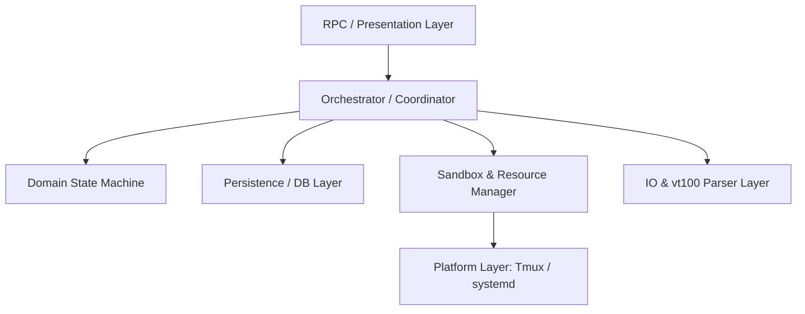

# ccbd-rust 全量架构与模块设计评估报告 (2026-07-09)

> **评估者**: Worker a3 · Antigravity 设计者
> **基本准则**: 忠实度对抗审, 绝不妥协, grep-before-claim (全部结论锚定到真实代码 `file:line`).

---

## 1. 从问题出发总结需求域 (Requirement Domains)

通过对 [outstanding-problems-2026-07-09.md](file:///home/sevenx/coding/ccbd-rust/research/outstanding-problems-2026-07-09.md) 以及相关事故记录的深度阅读与验证，我们将所有痛点归纳为系统必须满足的四个核心需求域：

### 需求域 A：感知层与完成检测的物理一致性 (Physical-Logical Perception Parity)
逻辑状态的“已完成”或“已空闲”必须与底层进程及 shell 的物理状态保持绝对一致，避免由于粗糙的启发式规则导致过早收尾或日志截断。

1. **多级 Shell/进程敏感的完成检测**：
   - **问题锚点**: [incident-claude-premature-completion-2026-07-08.md:4-9](file:///home/sevenx/coding/ccbd-rust/research/incident-claude-premature-completion-2026-07-08.md#L4-L9) / [src/completion/monitor.rs:32-35](file:///home/sevenx/coding/ccbd-rust/src/completion/monitor.rs#L32-L35)
   - **痛点**: Claude 等 Provider 发出 `end_turn` 信号以等待后台任务（如 `cargo test`），但完成检测器仅监控日志流中的完成标示（`task_complete` / `turn_complete`），立即判定任务完成，导致随后由后台任务产生的物理输出被截断丢失。
   - **需求**: 完成检测机制必须不仅是“日志流解析器”，更需是“进程敏感的监控器”。在判定 `COMPLETED` 之前，必须通过 sandbox/tmux 验证该 Agent 的 Pane 下是否仍有存活的非 shell 子进程（如 `cargo test`、`sleep` 等）。
2. **显式完成协议与起止双向 Hook**：
   - **问题锚点**: [outstanding-problems-2026-07-09.md:17-21](file:///home/sevenx/coding/ccbd-rust/research/outstanding-problems-2026-07-09.md#L17-L21) / [src/prompt_handler/integration.rs](file:///home/sevenx/coding/ccbd-rust/src/prompt_handler/integration.rs) 全目录零 Hook 引用
   - **痛点**: “停止不等同于完成”。目前靠猜测 Pane 静默或扫描日志，缺乏 Agent 与 Hypervisor 之间的“双向握手协议”。任务启动侧 Hook 缺失，且 Hook 的发送属于“fire-and-forget”，无 ACK 或 Outbox 机制，易导致事件蒸发。
   - **需求**: 需引入 R2 显式完成协议，并在 `prompt_handler` 中完整接入起止双向 Hook，具备可靠的 Outbox/重放机制。

### 需求域 B：状态机跃迁与自愈容错的健壮性 (State Machine & Recovery Robustness)
状态机必须能够自愈，不能有死胡同；自愈机制必须具备熔断和安全检查，防止故障放大。

1. **非对称终态的 CAS 自愈 (STUCK 状态解锁)**：
   - **问题锚点**: [src/db/state_machine.rs:1018-1028](file:///home/sevenx/coding/ccbd-rust/src/db/state_machine.rs#L1018-L1028) 限制了 STUCK 转换 / [src/orchestrator/mod.rs:504-507](file:///home/sevenx/coding/ccbd-rust/src/orchestrator/mod.rs#L504-L507)
   - **痛点**: 目前仅 `CRASHED` 状态的 Agent 能进入自愈重启，而 `STUCK` 状态由于 `late_health_completion_stuck_allows_terminal` 对非 `HEALTH_CHECK_STUCK` 状态（如 `PANE_DIFF_STUCK`）的硬性排斥，会导致 Agent 物理运行完成却在逻辑上永远卡死。
   - **需求**: 自愈机制必须覆盖 `STUCK` 状态，或支持 CAS 乐观锁自愈，允许物理输出产生的完成信号将 `STUCK` 状态安全退回 `IDLE` 或 `COMPLETED`。
2. **带熔断与取消感知（Cancel-Aware）的自动重派 (Revival Circuit Breaker)**：
   - **问题锚点**: [outstanding-problems-2026-07-09.md:36-37](file:///home/sevenx/coding/ccbd-rust/research/outstanding-problems-2026-07-09.md#L36-L37) / [src/orchestrator/mod.rs:499-524](file:///home/sevenx/coding/ccbd-rust/src/orchestrator/mod.rs#L499-L524)
   - **痛点**: 当任务本身（如包含错误系统调用的测试）导致进程不断崩溃时，Revive 机制无熔断器，会陷入“崩溃->重启->重派->崩溃”的无限自燃循环；同时，即使任务已标记 `cancel_requested`，自动重派依然视而不见。
   - **需求**: 自动重派路径必须引入熔断限制（如单 Job 重试不超过 3 次）并优先检测 `cancel_requested`。

### 需求域 C：资源全生命周期的精确隔离与归属判定 (Resource & Identity Isolation)
每一个进程、每一个 Tmux 会话、每一个沙箱目录，乃至每一项凭据，都必须有明确的归属标识，禁止越权操作。

1. **凭据级别的沙箱隔离 (Credential Isolation)**：
   - **问题锚点**: [src/provider/home_layout.rs:658-664](file:///home/sevenx/coding/ccbd-rust/src/provider/home_layout.rs#L658-L664) 软链接共享
   - **痛点**: 多个并发 Worker 共享软链接指向宿主机上的同一个 `.claude/.credentials.json`，任一 Worker 的凭据刷新或登出均会导致其他所有 Worker 失效。
   - **需求**: 必须实现 per-worker 独立凭据的沙箱内拷贝或代理隔离。
2. **Tmux 与进程清理的归属校验 (Tmux & Process Ownership)**：
   - **问题锚点**: [src/agent_io/registry.rs:145-160](file:///home/sevenx/coding/ccbd-rust/src/agent_io/registry.rs#L145-L160) / [src/tmux/session.rs:464-481](file:///home/sevenx/coding/ccbd-rust/src/tmux/session.rs#L464-L481)
   - **痛点**: 在 `kill/teardown` 阶段，如果 shell 的 `expected_pid` 已不存在，系统会完全跳过 Tmux 进程清理，导致 Tmux 会话泄露；或者由于缺乏所有权（Ownership）校验，只凭 Stale Pane ID 进行 Kill，导致误杀活栈（[incident-stale-session-kill-cascade-2026-07-08.md](file:///home/sevenx/coding/ccbd-rust/research/incident-stale-session-kill-cascade-2026-07-08.md)）。
   - **需求**: 所有的清理与杀进程操作必须有严密的归属校验（如物理 Socket 拥有者或 PID 验证），即使 expected_pid 不存活也必须能够兜底销毁 Tmux 会话。
3. **显式配置判定，禁止环境身份嗅探 (Explicit Daemon Identity)**：
   - **问题锚点**: [src/platform/linux/identity.rs:3-7](file:///home/sevenx/coding/ccbd-rust/src/platform/linux/identity.rs#L3-L7) 通过 cgroup 嗅探身份
   - **痛点**: 守护进程通过读取 `/proc/self/cgroup` 嗅探自身 systemd unit 名称。一旦测试子进程（如 e2e test）在某个 Worker 沙箱内运行，它将误认当前活栈的 unit 为自身，导致在 teardown 时将活栈的整个 cgroup 掐死。
   - **需求**: 身份标识必须由显式配置（例如启动参数或 socket path 派生）传入，绝不允许运行时基于环境隐式嗅探。

---

## 2. 第一性原理评估架构与现状差距 (First-principles Architecture & Gaps)

### 2.1 理想的 Agent Hypervisor 架构 (First-Principles Model)
基于第一性原理，一个健壮的 Agent Hypervisor 在架构上应当是**分层单向依赖、声明式状态管理、物理与逻辑解耦**的系统，主要包含以下层次：

1. **Platform Layer (平台级原语)**: 纯粹的 OS 系统调用包装与 Tmux/systemd 进程边界控制。不包含任何业务逻辑，仅接受显式参数并保证执行的原子性。
2. **Sandbox & Resource Manager (沙箱与物理资源生命周期)**: 依据配置为 Agent 创建隔离环境（fifo、文件系统、独立凭据）。负责物理清理，不负责逻辑状态跃迁。
3. **IO Streams & vt100 Parser (输入输出流与终端解析器)**: 采用响应式设计。它从底层 FIFO/TTY 读取流数据，解析 vt100 编码，匹配特定 Marker 并以 Event 形式向上抛出。**它是无状态的，绝不直接操作数据库**。
4. **Domain State Machine (领域状态机)**: **纯逻辑层**。定义 Agent 的状态（IDLE, BUSY, STUCK...）和跃迁规则（Transitions）。不依赖 rusqlite 或 IO，可进行 100% 内存单测。
5. **Persistence Layer / Repository (持久化仓储)**: 负责将领域对象（Job, Agent, Session）映射到 SQLite 数据库。仅提供事务边界与 CRUD 方法，不包含流程控制。
6. **Orchestrator / Coordinator (编排器/超级监督环)**: 唯一的业务逻辑驱动中枢。它作为反应式引擎，接收 RPC 输入、定时器 tick、IO 事件和崩溃信号，调用 Domain State Machine 校验合法性，写入 Repository，并通知 Sandbox 进行物理操作。

---

### 2.2 现状差距评估 (Actual Gaps)

对照理想架构，现状代码存在四个根本性的“架构硬伤”：

#### 伤口一：领域状态机逻辑严重下沉并锁死在持久化层 (Database Coupling)
- **现状锚点**: [src/db/state_machine.rs:980-1050](file:///home/sevenx/coding/ccbd-rust/src/db/state_machine.rs#L980-L1050) / [src/db/state_machine.rs:1392-1450](file:///home/sevenx/coding/ccbd-rust/src/db/state_machine.rs#L1392-L1450)
- **差距**: 状态机的跳转判断、Optimistic Lock (CAS 校验)、甚至是收集 Job 回执文本、触发校验约束等业务逻辑，全在 `src/db/state_machine.rs` 的同步 rusqlite 事务里执行。数据库层不再是一个简单的 Repository，而变成了超级控制器。这导致状态转移逻辑无法单独进行单测，且必须高度依赖 Mock DB 基础设施。

#### 伤口二：去中心化、相互冲突的“多头监控犬” (Spaghetti Monitoring)
- **现状锚点**: 
  - 监控一：`src/completion/monitor.rs` (日志监测) -> 直接修改 DB 状态
  - 监控二：`src/pane_diff/mod.rs` (Pane Diff 监测) -> 直接修改 DB 状态
  - 监控三：`src/provider/health_check.rs` (物理健康检测) -> 直接修改 DB 状态
- **差距**: 系统缺乏一个统一的编排器来整合各类监控信号，三个监控后台并发运行并独立写库修改 Agent 状态。这导致极大的竞态风险。例如，`pane_diff` 发现界面无变化，直接判定 `PANE_DIFF_STUCK`；而 `health_check` 的自愈白名单没有同步该原因，导致这个 Agent 彻底卡死在 `STUCK` 终态（死胡同问题）。

#### 伤口三：弱类型的物理资源注册表与清理漏网 (Fragile Resource Lifecycle)
- **现状锚点**: [src/agent_io/registry.rs:141-153](file:///home/sevenx/coding/ccbd-rust/src/agent_io/registry.rs#L141-L153)
- **差距**: 物理资源（Tmux Pane、FIFO）的清理深度绑定了 `expected_pid`。如果物理进程由于 OOM 或外界因素意外崩溃使得 PID 对应不上，资源清理就会彻底跳过。此外，内存注册表 `TMUX_PANE_MAP` 独立于 DB，当两者状态不一致时，缺乏任何协调/GC 回收机制。

#### 伤口四：环境隐式身份注入导致的越权连锁崩溃 (Identity Sniffing Risk)
- **现状锚点**: [src/platform/linux/identity.rs:3-7](file:///home/sevenx/coding/ccbd-rust/src/platform/linux/identity.rs#L3-L7)
- **差距**: 平台身份的识别不是强参数化的，而是基于系统环境隐式嗅探。测试守护进程收养了活栈的 cgroup，直接在生命周期清理中摧毁了活栈（PR4 屠活栈事故）。这违反了容器/沙箱设计的“边界不可泄漏”第一性原理。

---

## 3. 模块设计评估 (Module-by-Module Assessment)

针对 `src/` 目录下的一级模块，我们逐一从**定位、依赖方向、边界清晰度**三个维度进行审查评估：

### 3.1 `agent_io`
- **定位**: 维护 Agent 物理 I/O 通路（FIFOs）与 Tmux Pane PID 的关联。
- **现状锚点**: [src/agent_io/registry.rs:7-18](file:///home/sevenx/coding/ccbd-rust/src/agent_io/registry.rs#L7-L18) 定义了全局内存图 `TMUX_PANE_MAP`。
- **评估**: 
  - **严重耦合**: 在 `cleanup_agent_runtime_resources_with_policy` ([src/agent_io/registry.rs:165](file:///home/sevenx/coding/ccbd-rust/src/agent_io/registry.rs#L165)) 中直接调用了 `crate::db::system::remove_agent_sandbox_dir_sync`；在 [src/agent_io/registry.rs:190-194](file:///home/sevenx/coding/ccbd-rust/src/agent_io/registry.rs#L190-L194) 交叉清空 `marker` 与 `completion` 两个上层模块的内存状态。
  - **职责越界**: 作为一个 I/O 原语层，它承担了太多“生命周期注销编排”的工作。应该只提供 I/O 关闭和句柄销毁方法，注销的编排应上提至 Orchestrator 或专门的 Lifecycle Manager。

### 3.2 `cli`
- **定位**: 守护进程命令行前端及初始化。
- **现状锚点**: `src/cli/setup.rs` 及 `src/cli/up.rs`。
- **评估**: 
  - **定位合理**: 仅依赖底层的 `rpc_client` 或直接操作本地 DB 初始化。
  - **隐患**: 初始化与检测逻辑（如 WSL 配置 [src/cli/wsl.rs](file:///home/sevenx/coding/ccbd-rust/src/cli/wsl.rs)）过于冗长，包含大量 OS 命令拼凑，缺乏良好的平台接口层隔离。

### 3.3 `completion`
- **定位**: 负责分析 Agent 的输出日志，判定轮次/任务完成（Task Completion）。
- **现状锚点**: [src/completion/monitor.rs:20-26](file:///home/sevenx/coding/ccbd-rust/src/completion/monitor.rs#L20-L26) 定义了 Tick 监听任务。
- **评估**: 
  - **多头控制**: 在检测到完成信号后，`run_log_monitor_tick` 绕过编排器，直接调用 [src/completion/monitor.rs:37-46](file:///home/sevenx/coding/ccbd-rust/src/completion/monitor.rs#L37-L46) 写入数据库。这打破了单向依赖原则，使 completion 反向依赖了 db 状态机并主导了调度行为。

### 3.4 `db`
- **定位**: 数据存储持久化层。
- **现状锚点**: [src/db/state_machine.rs](file:///home/sevenx/coding/ccbd-rust/src/db/state_machine.rs) (约 3200 行).
- **评估**: 
  - **严重内聚不足 (胖 DB 伤口)**: 包含了本应由 Orchestrator 执行的核心领域逻辑。如 [src/db/state_machine.rs:1032-1041](file:///home/sevenx/coding/ccbd-rust/src/db/state_machine.rs#L1032-L1041) 中的“证据验证拦截（Evidence Denial）”，以及 [src/db/system.rs:598](file:///home/sevenx/coding/ccbd-rust/src/db/system.rs#L598) 的 Systemd Scope 清理。
  - **改进方向**: 必须做“瘦身”，将状态机转移判定和资源清理剥离成纯 Rust 内存逻辑。

### 3.5 `marker`
- **定位**: 用于在输出字符流中，使用 vt100 缓冲区解析和扫描特定边界标记（如输入 prompt 等待指示器）。
- **现状锚点**: [src/marker/matcher.rs:16](file:///home/sevenx/coding/ccbd-rust/src/marker/matcher.rs#L16) 定义了匹配引擎。
- **评估**: 
  - **职责清晰**: 纯粹的底层解析工具，几乎无外部依赖。依赖方向符合低耦合标准。

### 3.6 `monitor`
- **定位**: 监控系统，用于守护 master 进程并在其崩溃时实施 Revival/Cutover。
- **现状锚点**: `src/monitor/master_watch.rs` (约 190KB).
- **评估**: 
  - **架构冗余与职责重叠**: `master_watch.rs` 不仅监控状态，还亲自负责通过 [src/rpc/handlers/realign.rs](file:///home/sevenx/coding/ccbd-rust/src/rpc/handlers/realign.rs) 重启 Worker ([src/monitor/master_watch.rs:540-549](file:///home/sevenx/coding/ccbd-rust/git_diff.patch#L540-L549))。它与 `orchestrator` 的 Recovery 逻辑双向耦合，成了另一套备用编排器，增加了系统极大的不确定性。

### 3.7 `orchestrator`
- **定位**: 任务调度的反应式中枢环（Event-loop）。
- **现状锚点**: [src/orchestrator/mod.rs:93-95](file:///home/sevenx/coding/ccbd-rust/src/orchestrator/mod.rs#L93-L95) (`run_once`).
- **评估**: 
  - **定位正确但权力被削弱**: 作为编排器，它在向 Agent 注入 prompt 时有良好的双重校验 ([src/orchestrator/mod.rs:166-175](file:///home/sevenx/coding/ccbd-rust/src/orchestrator/mod.rs#L166-L175))，但由于 `monitor`、`db`、`completion` 都会强行写库修改状态，使得 Orchestrator 的 Tick 循环时常面临脏状态，且对 cancel 信号反应迟缓。

### 3.8 `pane_diff`
- **定位**: 通过定期截屏对比画面变化（Content Hash / mtime）检测 Agent 是否卡死在无终端输出的状态。
- **现状锚点**: [src/pane_diff/mod.rs:323](file:///home/sevenx/coding/ccbd-rust/src/pane_diff/mod.rs#L323) 的 stuck 状态标注。
- **评估**: 
  - **多头控制典型**: 发现 stuck 后直接操作 DB 修改状态，未通过编排器汇总。而且与 `completion`、`health_check` 的判定规则缺乏一致的退避逻辑（Backoff）。

### 3.9 `platform`
- **定位**: 针对 Linux, Mac, Windows 的 OS 兼容原语。
- **现状锚点**: `src/platform/linux/identity.rs`.
- **评估**: 
  - **问题**: 虽然封装了平台层接口，但 `identity.rs` 提供的 cgroup 隐式嗅探将宿主系统状态污染进了沙箱，是 PR4 事故的核心代码根源。

### 3.10 `prompt_handler`
- **定位**: 处理 Prompt 模板插值、安全及信心闸门拦截（Slow Path）。
- **现状锚点**: [src/prompt_handler/runner.rs:416-431](file:///home/sevenx/coding/ccbd-rust/src/prompt_handler/runner.rs#L416-L431)。
- **评估**: 
  - **内聚良好**: 专注于 Prompt 处理，拦截后通过 `PromptRunOutcome::Pending` 向上汇报，设计符合分层标准。

### 3.11 `provider`
- **定位**: 各类 AI 代理客户端的接口能力定义。
- **现状锚点**: [src/provider/health_check.rs:195-202](file:///home/sevenx/coding/ccbd-rust/src/provider/health_check.rs#L195-L202) 的健康检查守护环。
- **评估**: 
  - **严重越权与混乱依赖**: `health_check.rs` 在 `provider` 目录下跑起了一个全局循环，且自主去查 DB 状态，并直接执行 `escalate_health_stuck` 写入 STUCK。一个能力描述模块（provider）直接对系统运行状态和持久化层进行了反向调用。

### 3.12 `rpc`
- **定位**: JSON-RPC IPC 通信路由与请求分发。
- **现状锚点**: `src/rpc/router.rs` 及 `src/rpc/handlers/agent.rs`。
- **评估**: 
  - **职责合理**: 属于典型的 Presentation 层。但在处理诸如 `ReplaceKilledAndRequeue` ([src/rpc/handlers/agent.rs:741-753](file:///home/sevenx/coding/ccbd-rust/git_diff.patch#L741-L753)) 时，承载了具体的数据库事务组合逻辑，应将其重构下沉。

### 3.13 `sandbox`
- **定位**: 进程沙箱隔离（Systemd transient scopes 等）。
- **现状锚点**: `src/sandbox/systemd.rs`。
- **评估**: 
  - **边界清晰**: 仅接收强参数，不向外嗅探，不依赖业务逻辑。

### 3.14 `tmux`
- **定位**: 驱动本地 Tmux Server 的进程外 CLI 代理包装。
- **现状锚点**: `src/tmux/session.rs`。
- **评估**: 
  - **问题**: 测试卫生度极低。多个测试文件引入了真 tmux 启动与强杀 ([src/agent_io/mod.rs:101](file:///home/sevenx/coding/ccbd-rust/src/agent_io/mod.rs#L101))，易在 loaded 环境中锁死并弄脏宿主进程环境。

---

## 4. 行业最佳实践对照 (Industry Best Practices Comparison)

对照业界在**虚拟化监控（Hypervisor）、容器管理（Container Manager）以及进程管理监督（Supervisor）**领域的成熟模式，ccbd-rust 架构的异同与改进空间如下：

### 4.1 反应式单向控制流 vs 多头写库 (Control Loop Pattern)
- **业界实践**: 在 Kubernetes (Kubelet/Controller Manager) 或 containerd 中，系统采用**声明式控制环（Reconciliation Loop）**。外部监控器（Liveness/Readiness Probe）仅向主循环发布事件/状态更新请求（如 PodCondition），绝不直接写库修改 Pod 状态。
- **现状差距**: ccbd-rust 将状态写入权力下放到各子监控（[completion/monitor.rs](file:///home/sevenx/coding/ccbd-rust/src/completion/monitor.rs), [pane_diff/mod.rs](file:///home/sevenx/coding/ccbd-rust/src/pane_diff/mod.rs), [provider/health_check.rs](file:///home/sevenx/coding/ccbd-rust/src/provider/health_check.rs)），造成事实上的“多头政治”。

### 4.2 Actor 模型与并发状态转换隔离 (Actor Model)
- **业界实践**: 在 Akka 或 Erlang/OTP 进程管理中，Agent 的状态转换由一个专有的 Actor 串行化处理。所有 I/O 事件、超时和监控信号都转换为消息发送给 Actor，消除了悲观锁和数据库 CAS 碰撞的需要。
- **现状差距**: ccbd-rust 在同步数据库层利用 rusqlite 事务与 `state_version` CAS 强行保证一致性，导致数据库锁开销大，且容易在多头写入时发生死锁或写入冲突。

### 4.3 显式容器身份注入 vs 隐式环境嗅探 (Explicit Identity Injection)
- **业界实践**: OCI 规范与容器引擎（如 runc）严禁容器或其子进程基于 `/proc` 隐式判定全局身份。容器身份必须在创建时作为环境变量或启动参数（如 Container ID）**显式且强参数化地**传入。
- **现状差距**: ccbd-rust 中基于 cgroup 的环境身份嗅探 ([src/platform/linux/identity.rs:3-7](file:///home/sevenx/coding/ccbd-rust/src/platform/linux/identity.rs#L3-L7)) 导致了极其严重的越权清理，将宿主守护进程环境与隔离测试环境混淆。

---

## 5. 重构优先顺序建议 (Refactoring Roadmap)

为解决上述架构弊病，我们建议按以下顺序启动重构（共 8 条，按收益/风险排序）：

| 优先级 | 重构主题 | 收益说明 | 风险评估 | 核心代码锚点 |
| :--- | :--- | :--- | :--- | :--- |
| **1** | **cgroup 嗅探全灭，改显式参数注入** | 彻底杜绝测试环境或子容器误杀宿主活栈守护进程的致命灾难。 | **极低** (仅涉及启动参数与配置传递逻辑) | [src/platform/linux/identity.rs:3](file:///home/sevenx/coding/ccbd-rust/src/platform/linux/identity.rs#L3) / [src/systemd_unit.rs:5](file:///home/sevenx/coding/ccbd-rust/src/systemd_unit.rs#L5) |
| **2** | **并发 Worker 的 OAuth 凭据独立沙箱化** | 避免并发 Agent 在刷新 Token 时产生交叉登出与认证死锁，实现真正的凭据隔离。 | **低** (需在每个 sandbox 独立维护凭据拷贝/映射) | [src/provider/home_layout.rs:658-664](file:///home/sevenx/coding/ccbd-rust/src/provider/home_layout.rs#L658-L664) |
| **3** | **改多头直接写库为事件驱动投递 (Event Channel)** | 将 `pane_diff`、`health_check`、`completion` 的直接 DB 操作全部替换为事件发送通道，收拢到 `Orchestrator` 单点串行处理。 | **中** (需要调整三个监控模块的 tick 返回语义与 channel 接入) | [src/completion/monitor.rs:37](file:///home/sevenx/coding/ccbd-rust/src/completion/monitor.rs#L37) / [src/pane_diff/mod.rs:323](file:///home/sevenx/coding/ccbd-rust/src/pane_diff/mod.rs#L323) / [src/provider/health_check.rs:236](file:///home/sevenx/coding/ccbd-rust/src/provider/health_check.rs#L236) |
| **4** | **闭环 Tmux 进程逃逸漏网与所有权验证** | 修正 teardown 路径，即便 expected_pid 丢失或不符，也必须具备终极手段强杀 Tmux 会话，且 kill 操作必须携带严格的 session-token/generation 归属权校验。 | **低** (重写 `agent_io` 与 `tmux::session` 的 kill-session 校验逻辑) | [src/agent_io/registry.rs:145-160](file:///home/sevenx/coding/ccbd-rust/src/agent_io/registry.rs#L145-L160) / [src/tmux/session.rs:464](file:///home/sevenx/coding/ccbd-rust/src/tmux/session.rs#L464) |
| **5** | **自愈 (Revive) 重派引入熔断与 Cancel 校验** | 引入 Crash-loop Backoff 熔断计数器以断开无限自燃崩溃循环，且在重派前强检 `cancel_requested`。 | **低** (修改 `run_recovery_once` 与 `requeue` 判定) | [src/orchestrator/mod.rs:499-565](file:///home/sevenx/coding/ccbd-rust/src/orchestrator/mod.rs#L499-L565) |
| **6** | **STUCK 状态自愈解锁 (解除非对称限制)** | 允许由 `PANE_DIFF_STUCK` 导致的逻辑卡死能够被真实的物理完成标示/输出流所唤醒。 | **低** (放宽 `late_health_completion_stuck_allows_terminal` 对 stuck 原因的过滤条件) | [src/db/state_machine.rs:1009-1028](file:///home/sevenx/coding/ccbd-rust/src/db/state_machine.rs#L1009-L1028) |
| **7** | **统一接线 Systemd Orphan Scope 回收器** | 将已经写好的 `reconcile_orphan_scopes_sync` 接入 Orchestrator 的定时 GC tick 循环，防止系统长时间运行产生僵尸 transient scopes 堆积。 | **低** (Orchestrator 增加定时 GC 任务调用该方法) | [src/db/system.rs:598](file:///home/sevenx/coding/ccbd-rust/src/db/system.rs#L598) |
| **8** | **单元测试重构，废除物理 Tmux 进程** | 使用 mock tty 或抽象的 IO 模拟器替换单元测试中对真实 tmux server 的拉起与销毁，消除测试对物理环境的强依赖。 | **高** (涉及大量现有单元测试用例的改造与 Mock 层的编写) | [src/agent_io/mod.rs:101](file:///home/sevenx/coding/ccbd-rust/src/agent_io/mod.rs#L101) / `src/tmux/session.rs` 单元测试 |

