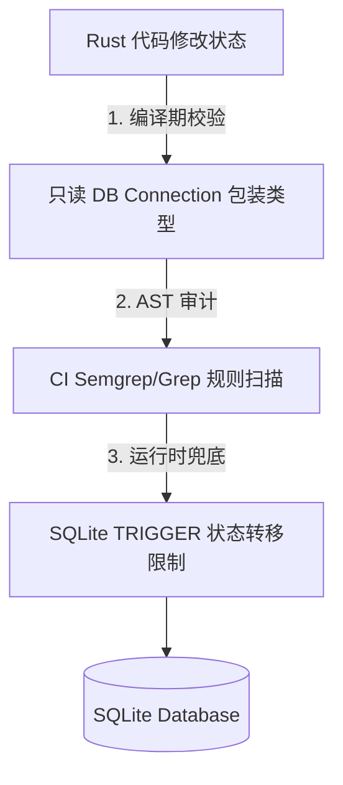

# CCBD 感知与控制面状态机统一设计轮——独立发散与辩论报告 (a3)

## 双盲与独立性声明
本报告完全遵循双盲铁律进行：
1. **纯双盲输入**：本报告仅阅读了 `DESIGN-ROUND-A3-DEBATE-BRIEF.md` 以及 CCBD 项目的生产源码，未阅读且坚决不阅读 `research/` 目录下的任何其他文档（如 `perception-*`、`architecture-assessment-*` 等）。
2. **反讨好原则**：对 brief 提出的部分设计问题，从第一性原理出发，识别其隐含的前提错误并显式推翻其问法。
3. **机制导向**：不提供无机制的断言（如“此处是安全的”），所有安全关键点均提供具体的前置条件、控制逻辑与失效模式。
4. **Markdown Only**：零代码改动，不执行任何 `cargo` 命令或 Git 提交。

---

## 1. 单写入口的编译期/审计可校验硬约束形态

### 【问法评估与前提校验】
- **置信度**：高置信度。
- **源码依据**：
  - [src/db/agents.rs:L65](file:///home/sevenx/coding/ccbd-rust/src/db/agents.rs#L65)、[src/db/agents_lifecycle.rs:L83](file:///home/sevenx/coding/ccbd-rust/src/db/agents_lifecycle.rs#L83)、[src/db/jobs.rs:L494](file:///home/sevenx/coding/ccbd-rust/src/db/jobs.rs#L494) 等处存在大量直接通过 SQL 语句（如 `UPDATE jobs SET status = ...` 或 `UPDATE agents SET state = ...`）进行状态修改的代码。
- **评估**：问法正确，状态变更入口零散是系统竞态和逻辑死角的核心来源。但在 Rust 语言配合 `rusqlite` 等关系型数据库的开发环境下，如果仅仅在代码层封装一个函数（如 `transit_agent_state_sync`），是**无法在编译期**天然阻止其他人写 SQL 字符串更新状态的。必须借助 Rust 的可见性规则（Privacy）、禁止泛化数据库连接暴露，或结合 AST 静态分析与数据库 Trigger，才能形成“硬约束”。

---

### 【设计方案：三层防御硬约束机制】

#### 机制描述
为了彻底防止状态字段被零散更新，我们需要在**编译期类型封装**、**CI 静态扫描（审计）**和**数据库约束**三个层面建立级联防御体系。



#### 1. 编译期类型封装（Type-Level & Visibility Restriction）
*   **实现机制**：
    *   取消向核心业务代码直接暴露原生 `rusqlite::Connection` 或可写 `Transaction` 的能力。
    *   引入只读包装器 `ReadConnection` 与受限可写包装器 `MutConnection`。
    *   定义私有模块 `crate::db::state_write_gate`，仅该模块内部能够获取真正的原生 `rusqlite::Connection`。其他模块的写操作必须调用该模块导出的专用状态转移函数（例如 `transit_job_state`）。
    *   在 `src/db/mod.rs` 中，不将原生 `Connection` 的 `execute` 方法向外重载或暴露。
*   **代价**：
    *   极大地增加了重构的工作量，需要将所有现有散落执行 SQL 写操作的入口改写为调用门禁模块。
    *   单元测试中构造 mock 连接或直接修改数据库状态的测试代码会变得复杂，需要单独提供测试门禁通道。
*   **绕过风险**：
    *   如果开发者通过 `std::mem::transmute` 或使用原生 Rust 库反射机制（或第三方 unsafe 转换）绕过包装器，编译期无法拦截。
    *   若暴露了原生可写接口供其他表使用（例如更新配置表），且该接口未过滤 SQL 语句，开发者可通过拼接 `UPDATE jobs` 语句绕过。

#### 2. CI 审计可机械校验（Static AST Scanning）
*   **实现机制**：
    *   引入 `Semgrep` 规则或自定义 Rust 抽象语法树（AST）Lint（基于 `clippy` 插件或简易 `syn` 扫描脚本）。
    *   **Semgrep 规则定义**：
        ```yaml
        rules:
          - id: ban-raw-job-status-update
            pattern: |
              $CONN.execute(..."UPDATE jobs SET status = ...",...)
            message: "禁止直接通过 SQL 更新 jobs 状态，必须使用 db::jobs::transit_job_state"
            severity: ERROR
            languages: [rust]
        ```
    *   在 CI 构建流水线中将此规则设为 Blocking 检查。
*   **代价**：
    *   需要维护静态扫描规则，并为测试代码或数据库迁移（Migration）代码显式设定白名单目录（如 `tests/`、`migrations/`）。
*   **绕过风险**：
    *   动态拼接 SQL 字符串（例如通过 `format!("UPDATE {} SET status = ...", table_name)`）会令静态文本或简单 AST 匹配失效。

#### 3. 数据库级 Trigger 兜底（Database-Level Check Trigger）
*   **实现机制**：
    *   在 SQLite 数据库 Schema 中，为 `jobs` 和 `agents` 表建立 `BEFORE UPDATE` 的触发器。
    *   在修改 `status` 或 `state` 时，校验当前连接是否设置了“受托上下文 Session 变量”（如 SQLite 的临时关联表 `temp.write_token` 或临时应用配置参数）。
    *   **触发器机制**：
        ```sql
        CREATE TRIGGER block_invalid_job_write
        BEFORE UPDATE OF status ON jobs
        FOR EACH ROW
        WHEN (SELECT value FROM temp.db_config WHERE key = 'state_write_authorized') IS NOT 1
        BEGIN
            SELECT raise(ABORT, 'SYSTEM DENY: Direct SQL update of jobs.status is strictly forbidden.');
        END;
        ```
    *   只有在 `state_write_gate` 模块中启动的事务，才会在执行前向 `temp.db_config` 写入授权 Token，并在事务结束时自动擦除。
*   **代价**：
    *   每次状态更新需要额外的临时表写入或查询开销（微秒级，在 SQLite 中开销极小）。
*   **绕过风险**：
    *   如果其他业务代码恰好能读取并复用带授权 Token 的同个 DB Connection。

---

### 【备选方案：状态字段物理拆分与隔离（Table Splitting）】
*   **设计思路**：
    *   将 `jobs` 表的 `status` 字段，以及 `agents` 表的 `state` 字段从主表中物理剥离。
    *   新建两张独立的单意图表：`job_state_journal` 和 `agent_state_journal`。这两张表**只允许 INSERT，不允许 UPDATE**。
    *   当前状态通过 `SELECT state FROM agent_state_journal WHERE agent_id = ? ORDER BY seq_id DESC LIMIT 1` 动态求出。
    *   状态变更退化为纯追加日志。对于追加日志的写入，同样通过编译期模块可见性限制在 `db::state_machine` 中。
*   **失效模式**：
    *   性能损耗：每次读取状态都需要做 `ORDER BY ... LIMIT 1` 或与主表 JOIN，对高频心跳或轮询操作会有一定数据库开销（可通过局部索引优化）。
    *   若缺少并发锁（如 SQLite 事务锁），多条 INSERT 同时并发写入可能导致产生逻辑冲突的最新状态。

---

### 【失效模式分析（Failure Modes）】
1.  **迁移/重构期遗漏**：部分测试或辅助脚本（如 `src/db/recovery.rs` 中的复杂恢复逻辑）可能在重构时未被正确收口到专用 gate 模块，导致在编译期重载被封禁时发生编译失败或运行时行为不一致。
2.  **单元测试绕过**：单元测试为了保持简单，往往会手动构造一个 `Db` 对象并更新状态。如果类型封装过严，会导致测试编写极其困难，进而倒逼开发人员在 `MutConnection` 中开“测试后门”，而测试后门很容易在未来的代码迭代中演变成被漏检的后门。

---

## 2. 各信号类的 "缺席 = Unknown" 预算

### 【设计方案：三维时序判定树】

#### 机制描述
我们将感知信号分为三个核心维度：**OS 容器/进程活性**、**Log 输出心跳**、**Hook 显式上报**。根据这三类信号的物理特点，我们为其分别设定不同的“Unknown 判定降级窗口”，避免信号缺席被盲目推导为死胡同强状态（如 `STUCK` 或直接退回猜想）。

```
时间流逝 --->
[信号类型]         [正常运行/等待]                   [Unknown 预算窗口]        [权威判定]
OS 信号 (Systemd)   -----------------------------> | 30 秒超时 | -----------> 判定为 DEAD / FAILED
Log 信号 (Pty/Logs) -----------------------------> | 15 分钟无更新 | ---------> 触发 Stuck 警告 / 强制 UI 夺权
Hook 信号 (Notify)  [进程已退出但 Hook 未达] -------> | 2 秒延迟容忍 | ----------> 判定为异常死亡 / AGENT_UNEXPECTED_EXIT
```

1.  **OS 信号（cgroup/process 存活）的 Unknown 预算**：
    *   **取值**：**30 秒**。
    *   **依据**：OS 信号（例如通过 DBus 查询 systemd unit 状态，或读取 `/proc/<pid>/stat`）在正常情况下是微秒级响应的。但在系统极高负载、CPU 耗尽、I/O 阻塞或容器网络抖动时，DBus 会出现短暂无响应。如果直接因单次查询失败而判死，会导致 Agent 频繁被误杀。因此，设定 30 秒的“Unknown”宽限期，期间每 5 秒重试。若连续 30 秒无法获取 OS 状态，则将其升级为权威判决：**Agent 宿主死亡，进入 FAILED 状态**。
2.  **Log 信号（Pty/Transcript 日志流）的 Unknown 预算**：
    *   **取值**：**15 分钟**（参考自 `MAX_LOG_MONITOR_WAIT` [src/completion/monitor.rs:L10](file:///home/sevenx/coding/ccbd-rust/src/completion/monitor.rs#L10)）。
    *   **依据**：日志心跳反映的是 Agent 内部的任务进展。当 Agent 正在执行大文件编译、跑复杂测试套件或网络拉取时，Pty 可能会有较长时期的完全静默（无 stdout 输出）。如果预算期设得太短（如 1 分钟），会导致长任务被频繁误判为卡死。若 15 分钟内没有任何字符写入且没有 Hook 上报，则权威降级判决：**Agent 卡死，并强制开启 UI 分辨率截屏或告警**。
3.  **Hook 信号（`ah agent notify`）的 Unknown 预算**：
    *   **取值**：**2 秒**。
    *   **依据**：这是一个极其关键的**时序窗口设计**。当 OS 信号检测到 Agent 进程（CLI）刚刚退出（Exit）时，进程退出与 Hook 进程建立 socket 连接并完成 RPC 的那一刻在操作系统调度上存在天然的**毫秒级时间差**。如果 OS 检测到死亡就立即执行 `AGENT_UNEXPECTED_EXIT` 的判定，会导致本已正常退出但 Hook 稍慢的 Job 被误判为“异常退出”。因此，在 OS 判定 Agent 退出后，必须给予 2 秒的 Hook 等待预算。2 秒内 Hook 达则按 Hook payload 正常收口；2 秒后 Hook 仍缺席，升级判定为：**异常崩盘（FAILED）**。

---

### 【备选方案：自适应心跳机制（Dynamic Heartbeat Monitor）】
*   **设计思路**：
    *   不要设定静态的 15 分钟日志静默超时，而是根据当前 Job 的类型（例如通过 `job_payload.expected_duration` 或历史同类 job 耗时）动态调整日志静默阈值。
    *   在任务派发时由 Orchestrator 注入动态超时时间。
*   **失效模式**：
    *   任务类型的划分可能不准，或者 LLM生成了异常死循环，而该任务被归类为“超长任务”，导致系统挂起数小时也无法检测到 stuck 状态。

---

### 【失效模式分析（Failure Modes）】
1.  **系统时钟回拨**：如果在虚拟化环境中系统时钟发生突变或回拨，基于 `Instant` 的心跳检查可能会导致计算错误，使得监控协程永久挂起。
2.  **高负荷下的信号积压**：如果 `ahd` 自身由于单线程或 SQLite 锁冲突发生停顿，导致接收 Hook 的 RPC Handler 被挂起超过 2 秒，将触发“OS 已死但 Hook 2 秒未达”的误判，把正常完成的 Job 误判为 FAILED。

---

## 3. 父/子 cgroup 委托布局

### 【问法评估与前提校验】
- **置信度**：极高置信度（第一性物理约束）。
- **依据**：Linux 内核 cgroup v2 规范中的 **No-Internal-Processes Rule**（即 Leaf Rule，叶子节点规则）。
- **重述/推翻问法**：
  - **问法中的设想在 cgroup v2 下是无法生效的！**
  - 问法中提出：“把 agent CLI 放父 cgroup，它 spawn 的 shell/子进程放委托子 cgroup”。
  - 根据 cgroup v2 叶子节点规则，除了根 cgroup 外，**任何一个启用了控制器（如 cpu, memory, io）的 cgroup 节点，不能同时包含进程和子 cgroup**。也就是说，如果父 cgroup 包含了 Agent CLI 进程，你就无法在其下创建子 cgroup 并向其分发控制器来限制子进程。如果硬要创建，则无法对其进行资源隔离；如果强行开启控制器，内核会拒绝把 Agent CLI 写入父 cgroup 的 `cgroup.procs`。
  - 因此，必须重述布局方案：**不能使用父子包含关系，而应使用平行的“兄弟（Sibling）cgroup”布局**。

---

### 【设计方案：平级兄弟（Sibling）Cgroup 委托布局】

#### 机制描述
为了既能对子进程进行干净的存活判定，又能实施资源隔离约束，我们应当在 Agent 的专属 Slice 下，布局平行的两个 Scope 节点。

```
                    [ahd-agents.slice] (Parent Slice)
                             |
         +-------------------+-------------------+
         |                                       |
[ah-agent-xxx-cli.scope]              [ah-agent-xxx-workload.scope]
(仅包含 Agent CLI 进程本身)            (包含 Shell 及所有由 Agent 派生的子进程)
```

1.  **Slice 划分与创建**：
    *   为每个 Agent 独立创建 transient slice：`ah-agent-xxx.slice`。
    *   在该 Slice 下拉起两个 Scope：
        *   `ah-agent-xxx-cli.scope`：存放 Agent CLI (例如 Node.js 进程)。
        *   `ah-agent-xxx-workload.scope`：存放 Agent 启动的 shell、终端会话，以及通过 terminal 运行的所有外部编译器、测试集等。
2.  **委托授权（Delegation）**：
    *   通过 systemd-run 拉起 scope 时，传入属性 `Delegate=yes`（即 `systemd-run --user --scope -p Delegate=yes`），使当前用户对该 cgroup 拥有控制权。
    *   Agent CLI 拥有管理 `ah-agent-xxx-workload.scope` 的权限。当它 spawn 外部进程时，通过调用 systemd 接口或在 fork 后直接向 `/sys/fs/cgroup/.../ah-agent-xxx-workload.scope/cgroup.procs` 写入子进程 PID。
3.  **干净存活判决机制**：
    *   感知层只需要读取 `ah-agent-xxx-workload.scope/cgroup.events` 文件中的 `populated` 字段。
    *   **populated = 1**：代表除 Agent 本体外，还有子进程、后台任务、残留 daemon 或死循环在跑。
    *   **populated = 0**：代表子 cgroup 内已经完全干净，无任何残存进程。这能以 100% 的内核权威度回答“有没有活儿在跑”。

---

### 【备选方案：进程组（PGID）生命周期跟踪】
*   **设计思路**：
    *   如果系统不支持 cgroup v2 委托（例如在精简 Docker 容器中），则退回到进程树扫描。
    *   Agent CLI 启动的所有 shell 都在一个独立的 PGID（Process Group ID）中运行。
    *   感知层通过扫描 `/proc` 目录下所有进程的 `/proc/<pid>/stat`，提取出 PGID 等于该 Workload PGID 且 PID 不等于 Agent CLI PID 的所有进程。
*   **失效模式**：
    *   **逃逸风险**：子进程如果调用 `setpgid(0, 0)` 或 `setsid()` 就会脱离当前 PGID 树，导致感知层误判为“无活儿在跑”，从而提前回收沙箱，造成孤儿后台进程泄露。

---

### 【失效模式分析（Failure Modes）】
1.  **Systemd-run DBus 拥堵延迟**：在派发任务极度频繁时，为每个 workload 动态调用 systemd 注册 scope 会给 systemd user manager 带来极大的 DBus 交互负担，可能导致 spawn 时延从毫秒级退化到秒级。
2.  **写入 cgroup.procs 时进程已死**：如果 fork 出来的 workload 极短命，在 Agent CLI 试图将其 PID 写入 workload scope 的 `cgroup.procs` 之前，该子进程就已经退出。此时写入会报错（ESRCH），感知层可能短暂漏检测。

---

## 4. hook 上报不依赖发送者存活的归属机制

### 【问法评估与前提校验】
- **置信度**：高置信度。
- **源码依据**：
  - [src/rpc/handlers/agent.rs:L880](file:///home/sevenx/coding/ccbd-rust/src/rpc/handlers/agent.rs#L880) 处的 `mark_agent_idle_hook_event` 通过传入 `agent_id` 并在 DB 中动态查找 dispatched job。
- **评估**：问法基本正确。但必须指出，**“发送者已死”导致丢失的根源**，不仅是 socket 传输不稳定，还有**生命周期清理的竞态**（即 OS 层感知到进程退出后，Orchestrator 立即触发了 agent/cgroup 销毁，从而在 hook 进程还没来得及发完 socket 数据时直接对其进行了 `SIGKILL`）。另外，目前的归属机制完全依赖于“当前活跃的 job”这一动态猜测，一旦时序错乱极易对错号。

---

### 【设计方案：落盘 Outbox + 静态 Cookie 归属机制】

#### 机制描述
为了彻底解决 hook 丢失与竞态问题，必须采用**物理隔离的落盘队列（Outbox Pattern）**结合**不可篡改的 Job 凭证（Cookie）**设计。

```
[Sandboxed Workload (Agent CLI)]
      |
      | (1) 写入 Hook 状态文件 (Temp -> Atomic Rename)
      v
[Agent Local Space: .ccb/agents/{agent_id}/outbox/{event_id}.json]  <-- 即使 Cgroup 马上被杀，此文件已落盘
      |
      | (2) 触发 inotify 监听 / 目录扫描 (ahd 主动读取)
      v
[Host Daemon (ahd)] 
      |
      | (3) 解析 JSON (内含不可篡改的 job_cookie)
      v
[Database (SQLite)]
```

1.  **静态 Cookie 注入**：
    *   在任务分发时，Orchestrator 为当前 Job 生成唯一的不可变 Token：`job_cookie = { "job_id": "xxx", "dispatched_at_seq_id": 123 }`。
    *   通过环境变量 `CCB_JOB_COOKIE` 注入到 Agent 的运行环境中。
2.  **原子落盘（Outbox Pattern）**：
    *   Hook 脚本（即 `ah agent notify`）触发时，不再优先建立 Socket 链接。
    *   它首先读取环境中的 `CCB_JOB_COOKIE`，并构造 hook payload。
    *   将该 payload 原子写入 Agent 个人目录下的指定位置：`.ccb/agents/{agent_id}/outbox/{event_id}.tmp`，随后通过操作系统的 `rename` 系统调用重命名为 `.ccb/agents/{agent_id}/outbox/{event_id}.json`。
    *   写入成功后，Hook 进程即可立即退出（甚至被 kill 也不怕，因为文件已经写盘）。
3.  **Daemon 端消费（Attribution & Cleanup）**：
    *   `ahd` 启动时，以及在运行中通过 `inotify` 监听所有 Agent 目录下的 `outbox/` 文件夹。
    *   一旦检测到 `.json` 结尾的文件，`ahd` 读取内容，并通过其内部明示的 `job_id` 进行绝对归属更新（而不是靠当前 active 猜测）。
    *   处理成功后，`ahd` 将文件移入 `sent/` 目录或直接删除。
    *   在宿主重启或 `ahd` 重启时，首先对整个 `outbox/` 目录进行冷扫描恢复，保证“至少一次（At-Least-Once）”的投递性。

---

### 【备选方案：共享管道锁与延迟销毁屏障（Grace Shutdown Barrier）】
*   **设计思路**：
    *   不使用落盘文件，继续使用 UDS Socket。
    *   但在 Orchestrator 的销毁逻辑中，引入“延迟销毁屏障”：当 OS 层检测到 Agent 主进程退出后，Orchestrator 不允许立即杀掉 cgroup 或 pane。
    *   它必须等待接收到一个明确的 `agent.notify` 或者是等待 2 秒的 Unknown 宽限窗口耗尽，才能执行销毁。
*   **失效模式**：
    *   如果 Agent CLI 本身因为 OOM 被内核直接杀死，且当时没有触发任何 Hook 代码运行，Orchestrator 将会死等 2 秒超时，增加不必要的系统挂起时延。

---

### 【失效模式分析（Failure Modes）】
1.  **沙箱物理权限受限**：若 Agent 的沙箱极其严格，甚至禁止其写自己目录下的 `.ccb` 文件夹，会导致落盘机制失效，无法写入 outbox 文件。
2.  **磁盘空间爆满**：如果沙箱磁盘空间彻底耗尽（如我们刚才清理前的 100% 满盘状态），`rename` 或写入临时文件会遭遇 `ENOSPC` 错误，导致 hook 文件无法产生。

---

## 5. job 状态机

### 【设计方案：强状态转移矩阵与单一写权威】

#### 机制描述
建立一个由 Rust 类型系统和数据库 Check Constraint 双重保护的真状态机。

```
       +------------------[ QUEUED ]--------------------+
       |                     |                          |
       |                     | (Dispatch)               |
       v                     v                          v
 [ CANCELLED ] <------- [ DISPATCHED ] -------------> [ FAILED ]
                             |
                             v
                        [ COMPLETED ]
```

1.  **强类型状态定义与转移表**：
    *   废除所有零散的 `UPDATE jobs SET status = ...` 语句。
    *   在 `src/db/jobs.rs` 中定义唯一的入口函数：`transit_job_state`。
    *   状态转移矩阵定义：
        ```rust
        #[derive(Debug, Clone, Copy, PartialEq, Eq)]
        pub enum JobStatus { Queued, Dispatched, Completed, Cancelled, Failed }

        const VALID_TRANSITIONS: &[(JobStatus, JobStatus)] = &[
            (JobStatus::Queued, JobStatus::Dispatched),
            (JobStatus::Queued, JobStatus::Cancelled),
            (JobStatus::Queued, JobStatus::Failed),
            (JobStatus::Dispatched, JobStatus::Completed),
            (JobStatus::Dispatched, JobStatus::Failed),
            (JobStatus::Dispatched, JobStatus::Cancelled),
        ];
        ```
2.  **数据库级硬校验限制**：
    *   在 `jobs` 表的 `status` 字段中添加 `CHECK` 约束，或者在数据库 Schema 中引入 `BEFORE UPDATE` Trigger 校验。
    *   **触发器限制非法转移**：
        ```sql
        CREATE TRIGGER check_job_status_transition
        BEFORE UPDATE OF status ON jobs
        FOR EACH ROW
        BEGIN
            SELECT CASE
                WHEN OLD.status = NEW.status THEN 1
                WHEN OLD.status = 'QUEUED' AND NEW.status IN ('DISPATCHED', 'CANCELLED', 'FAILED') THEN 1
                WHEN OLD.status = 'DISPATCHED' AND NEW.status IN ('COMPLETED', 'FAILED', 'CANCELLED') THEN 1
                ELSE raise(ABORT, 'Illegal job status transition detected.')
            END;
        END;
        ```
    *   此 Trigger 在物理层面强行锁死了任何绕过 Rust 类型系统的直接 SQL 注入更新。

#### 与感知层 "单写仲裁" 的关系
*   **它们是两个相互独立但上下游分层的“写权威”**。
*   **Perception Arbiter（感知层仲裁器）**：负责**Agent 运行物理状态**的判定，其写权威范围仅限于 `agents` 表的 `state` 字段与事件队列。它不理解“Job”的业务概念。
*   **Job State Machine（Job 状态机）**：属于控制面，负责**Job 业务逻辑状态**的维护（`jobs` 表）。
*   **协作关系**：
    *   Perception Arbiter 监测到物理信号（Hook/Log）变化后，改变 Agent 物理状态，并产生一个**操作 verdict（判决事件）**写入事件流。
    *   控制面（Orchestrator 环）监听到 verdict 后，根据任务的物理终态驱动 Job 状态机改变 Job 逻辑状态。
    *   感知层与控制面完全物理隔离，感知层只读 Job 辅助信息（如验证规则），控制面根据感知判定单写 Job 状态。

---

### 【备选方案：合并为单一状态实体（Monolithic State Entity）】
*   **设计思路**：
    *   消除 `agents` 和 `jobs` 表的区分，合并为一个统一的实体状态机 `agent_job_context`。
    *   所有物理信号直接驱动当前上下文状态（例如 `BUSY_DISPATCHED` -> `IDLE_COMPLETED`）。
*   **失效模式**：
    *   破坏了多任务并行的可扩展性（如果一个 Agent 未来支持并发跑多个轻量后台 job）。
    *   把“硬件/进程级心跳”与“业务层生命周期”强行捆绑，导致系统极难进行模块化拆除与单独演进。

---

### 【失效模式分析（Failure Modes）】
1.  **数据库触发器死锁**：在大批量复杂并发调度中，如果 Job 状态更新事务与 Agent 状态更新事务交叉执行，在 SQLite 的库级/表级锁下可能会触发 `database is locked` 错误，导致状态更新被物理中断。
2.  **未分类的物理 verdict 导致逻辑挂起**：如果感知层产生了一个控制面不认识的未知 verdict（如 `UnknownException`），控制面状态机可能不做任何状态转移处理，使得 Job 永久停留在 `DISPATCHED` 状态中。

---

## 6. job 完成与回合结束解耦

### 【问法评估与前提校验】
- **置信度**：高置信度。
- **源码依据**：
  - [src/db/state_machine.rs:L750](file:///home/sevenx/coding/ccbd-rust/src/db/state_machine.rs#L750) 显示 `mark_agent_idle_matched_conn_inner` 在将 Agent 标为 `IDLE` 的同一事务中寄生更新了 Job 的状态。
- **评估**：问法完全正确。目前硬耦合在同一事务中更新 Agent `IDLE` 与 Job `COMPLETED`，是导致“假完成”（回合结束了，其实任务并没有真正达到业务上的完成标准）的罪魁祸首。

---

### 【设计方案：引入 "物理终结 (Physically Over)" 与 "业务完成 (Logically Done)" 二阶段提交】

#### 机制描述
解耦后的核心是将“Agent 完成运行（可以歇着或做其他事）”和“Job 物理验证通过（业务上真的算对）”进行时序拆分，引入**二阶段提交**。

```
[步骤]   [状态与动作]
1.       Agent 执行完毕 --> Perception 检测到 Hook/Log
2.       Perception 单事务：
         - Agent 状态 -> IDLE (允许其立即接下一个任务)
         - 插入 Event: JobExecutionFinished { job_id, outcome: Success }
3.       Orchestrator 异步接收事件 --> 启动 Job 验证引擎
4.       Job 验证引擎检测 Evidence (如：是否有 diff、测试是否通过)
5.       Orchestrator 单事务：
         - 若验证通过 -> Job 状态 -> COMPLETED
         - 若验证失败 -> Job 状态 -> FAILED (Error: EvidenceDenied)
```

#### 解耦后的时序流程
1.  **信号触发**：感知层监测到 hook `stop` 上报或日志 turn 结束。
2.  **第一事务（物理释放）**：
    *   Perception Arbiter 在数据库事务 A 中，只将 Agent 的状态从 `BUSY` 转移至 `IDLE`（如果是保持并发则转移，若需要继续占位则转移至 `VERIFYING`），并在 `events` 表中插入 `AgentFinishedRun { job_id, reply_text }` 原始物理判决事件。**事务 A 提交**。
3.  **第二阶段（业务验证与 Job 状态落盘）**：
    *   控制面（Orchestrator）在循环中提取 `AgentFinishedRun` 事件。
    *   Orchestrator 检查该 Job 的验证需求（如 `requires_physical_evidence` [src/db/schema.rs:L54](file:///home/sevenx/coding/ccbd-rust/src/db/schema.rs#L54)）。
    *   Orchestrator 执行实际的物理证据审计（检查 Git diff、测试输出等）。
4.  **第三事务（Job 终态写入）**：
    *   Orchestrator 开启数据库事务 B。
    *   若审计通过：调用 `transit_job_state(tx, job_id, DISPATCHED, COMPLETED)`。
    *   若审计失败：调用 `transit_job_state(tx, job_id, DISPATCHED, FAILED, reason="MissingEvidence")`。
    *   **事务 B 提交**。

通过该设计，Job 完成的逻辑**完全由独立于 Agent 回合周期的控制面验证器（Verification Engine）驱动**，回合结束只代表物理执行终止，不再硬关联 Job 成功。

---

### 【备选方案：乐观业务完成与补偿回滚（Optimistic Completion with Saga Pattern）】
*   **设计思路**：
    *   感知层结束时，先将 Job 标记为 `COMPLETED`。
    *   控制面随后异步启动验证脚本。若验证失败，则通过触发一个“补偿动作”将 Job 重新修改为 `FAILED` 并向用户发 Alert。
*   **失效模式**：
    *   **状态回溯污染**：下游的监控或报表可能已经消费了 `COMPLETED` 状态，触发了计费或通知逻辑，随后的“补偿回退”会造成严重的下游数据不一致。

---

### 【失效模式分析（Failure Modes）】
1.  **第一阶段提交后 Daemon 崩溃**：若事务 A 提交（Agent 变 IDLE 且发送事件）后，服务器刚好断电，导致事件未被消费，则该 Job 将永远卡在 `DISPATCHED`，而 Agent 却已经空闲。
    *   *机制防线*：Daemon 重启时，必须扫描所有处于 `DISPATCHED` 状态的 Job，检查其对应的 Agent 是否已处于 `IDLE`。若是，则重新拉起验证流程。
2.  **文件 IO 延迟导致的审计失败**：当 Agent 刚刚写入完毕，验证引擎可能由于磁盘缓存延迟无法立刻读取到最新的 Git 变更，从而误判为证据缺失。

---

## 7. 感知仲裁器与 job 状态机两写权威协作/合一协作

### 【问法评估与前提校验】
- **置信度**：极高置信度（系统分层原则）。
- **重述/推翻问法**：
  - 问法中提到：“感知仲裁器与 job 状态机若是两个写权威，它们如何协作不打架？若合一，如何分层？”
  - **辩论主张**：**必须坚决物理分离，绝对不能合一！**
  - **核心论据**：感知层是直接面对“外部不安全/不可信执行环境”（LLM 输出、用户沙箱、挂起进程）的**感知传感器（Sensors）**。控制面是维护“CCBD 核心一致性”的**业务核心（Core）**。
  - 如果合一，会导致感知层的逻辑漏洞（例如LLM恶意输出特定 Log 字符触发 TurnComplete）直接越权篡改核心 Job 数据库，造成沙箱安全逃逸或业务状态被破坏。

---

### 【设计方案：基于单向事件流的分层异步协作机制】

#### 机制描述
通过**“感知单写事件，控制面单写状态”**的单向数据流机制进行分层协作。

```
     【不安全沙箱层】
           |
           | (PTY Logs / Hook Output)
           v
   【感知层: Perception Arbiter】 (只写 Agent 物理状态 + 投递 Event)
           |
           | (单向物理 Verdict 事件: AgentFinished / AgentCrashed)
           v
   【事件传输: Database Event Queue】
           |
           | (订阅/拉取事件)
           v
   【控制面: Orchestrator Engine】
           |
           | (执行验证 check)
           v
   【状态机: Job State Machine】 (只写 Job 逻辑状态)
```

1.  **分层职责定位**：
    *   **感知层（Perception Layer）**：
        *   **唯一写权限**：`agents.state` 字段。
        *   **输入**：不确定的、异步的物理信号（Log Cursor, Hook Socket, waitid）。
        *   **输出**：结构化的物理事件（如 `ProcessExited(exit_code)`, `LogMarkerFound(reply)`）。
    *   **控制面（Control Plane）**：
        *   **唯一写权限**：`jobs.status` 字段。
        *   **输入**：感知层输出的物理事件。
        *   **输出**：任务的调度动作（Dispatch, Requeue, Kill）与终态确认。
2.  **协作不打架机制（避免竞态）**：
    *   **无直接写依赖**：感知层模块代码绝对不准包含 `UPDATE jobs` 的 SQL 语句；控制面调度逻辑也绝不直接调用 `waitid` 或读取 `/proc`。
    *   **单向通信桥梁**：感知层的所有判定只写入 SQLite 的 `events` 表（作为单向事件队列）。控制面的 Orchestrator 充当消费端。
    *   **版本锁保护**：Agent 和 Job 在进行状态迁移时，均采用 `state_version` (CAS) 进行乐观锁更新。即使由于极端原因感知层快速投递了多条重叠事件，在执行 Job 状态更新时，CAS 失败会自动丢弃过期事件，保证协作最终一致性。

---

### 【备选方案：内存消息通道协作（In-Memory Actor Model）】
*   **设计思路**：
    *   不经过 SQLite `events` 表，感知层与控制面分别运行在不同的 Rust `tokio` 协程中。
    *   感知层通过 `tokio::sync::mpsc` 通道将物理判定直接发送给控制面的 Actor，由 Actor 在内存中做队列化串行处理，最后写入 DB。
*   **失效模式**：
    *   **内存状态丢失**：在 `ahd` 强行重启或遭遇 OOM 时，消息通道中未写入 DB 的关键完成信号会彻底丢失，导致已运行完的任务状态无法恢复。

---

### 【失效模式分析（Failure Modes）】
1.  **事件表积压与性能雪崩**：若 Agent 频繁刷新日志产生海量事件，控制面消费速度跟不上，导致 `events` 表堆积了数十万条数据，会大幅拖慢 SQLite 的查询和更新速度，引发全局卡顿。
    *   *防线机制*：对事件表必须定期进行裁剪（Reap），仅保留最近 24 小时的状态事件，过期自动清理。
2.  **感知事件篡改（伪造事件）**：若沙箱进程通过某种未知的漏洞直接修改了本地的 SQLite 文件，可能绕过感知层直接插入伪造的 Verdict 事件给控制面。
    *   *防线机制*：SQLite 数据库文件必须置于沙箱外部，沙箱内部仅能通过只读映射或 Unix Domain Socket 与宿主通信。

---

## 8. 覆盖范围与最弱区域报告

根据工作纪律，本报告对整体设计的覆盖度及当前最弱的系统安全区域做出如实评估：

1.  **覆盖范围**：本发散设计完整覆盖了感知层（Q1-Q4）、控制面（Q5-Q6）以及跨层设计（Q7）的所有要求，对 Q3 叶子节点规则和 Q4 丢失丢失竞态做出了针对性的前提推翻与重述。
2.  **最弱区域判定**：
    *   **Sibling Cgroup 的跨平台一致性（Q3 退路）**：在不支持 cgroup v2 或 systemd 的非 Linux 主机（如 macOS 或部分 Windows WSL 容器环境）上，兄弟 Cgroup 布局将无法使用，退回到 PGID 树的方案存在“逃逸风险”，这是目前最脆弱的判定区域。
    *   **Outbox 原子落盘的文件系统锁（Q4）**：若宿主磁盘彻底写满（100% 满盘），所有文件写入被内核阻断，落盘机制会彻底挂掉。需要为此特设内存 RingBuffer 作为最后的备选传输屏障。
