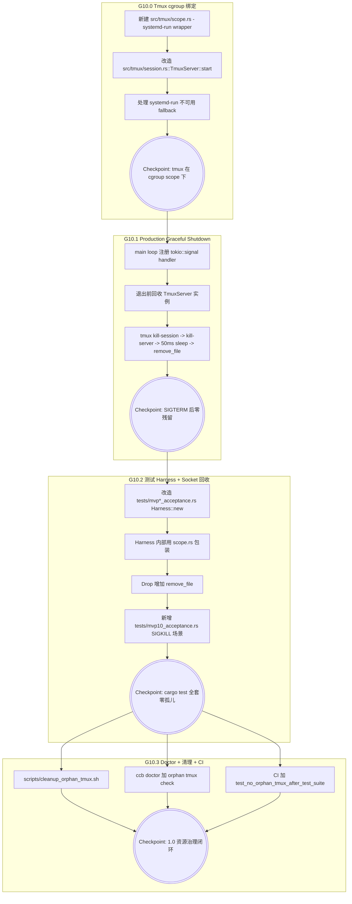

# Kiro Design: MVP 10 (进程生命周期 cgroup 治理与资源彻底回收)

> **文档定位**：本文件是 ccbd-rust MVP 10 阶段的官方 D (Design) 规格。基于 mvp10-R.md 的需求矩阵，落实 tmux server cgroup 绑定、production graceful shutdown、测试 harness 强化、socket 文件显式回收四条结构性修复，把"用 Rust 重写解决 Python ccbd 留孤儿"的核心承诺补完。

---

## 1. 总体架构图与依赖拓扑



---

## 2. G10.0: Tmux cgroup 绑定核心设计

> **Round 1 plan review 修订**（Gemini 2026-05-01）：
> - 把 `use_systemd_scope: bool` 升级为 `enum ScopePolicy`，更彻底的接口契约化
> - 新增 `detect_scope_policy()`，自动检测 ccbd-rust 是否跑在 ccbd-rust.service 下；不在则 fallback 到不带 BindsTo 的 scope（甚至完全不包 scope），避免 `cargo run --bin ccbd` 手动启动场景下 BindsTo unit 不存在导致 systemd-run 启动失败

### 2.1 新增模块 `src/tmux/scope.rs`

引入一个独立的 wrapper 层，把"如何把命令包进 systemd-run scope"的细节集中处理，避免 session.rs 散落 systemd 字符串。

```rust
// src/tmux/scope.rs
use std::process::Command;

#[derive(Clone, Debug, PartialEq, Eq)]
pub struct UnitConfig {
    pub unit_name: String,         // 如 "ccbd-tmux-abcd1234"
    pub slice: String,             // 默认 "ccbd-agents.slice"
    pub binds_to: Option<String>,  // 当 ccbd-rust 跑在 service unit 下才 Some("ccbd-rust.service")
}

#[derive(Clone, Debug, PartialEq, Eq)]
pub enum ScopePolicy {
    /// systemd-run --user --scope 包裹，可选带 BindsTo
    Systemd(UnitConfig),
    /// 直接 spawn，不包 scope（系统级 systemd 不可用的环境，如部分 chroot/受限容器）
    None,
}

/// 返回 Command builder——已经把 cmd/argv 包进 systemd-run --user --scope（如果策略允许）
pub fn wrap_in_scope(
    base_cmd: &str,
    base_args: &[&str],
    policy: &ScopePolicy,
) -> Command {
    let unit = match policy {
        ScopePolicy::None => {
            let mut c = Command::new(base_cmd);
            c.args(base_args);
            return c;
        }
        ScopePolicy::Systemd(u) => u,
    };
    let mut c = Command::new("systemd-run");
    c.args([
        "--user",
        "--scope",
        "--collect",                              // scope 内进程全部退出后自动清理 unit
        &format!("--unit={}", unit.unit_name),
        &format!("--slice={}", unit.slice),
    ]);
    if let Some(binds) = &unit.binds_to {
        c.arg(format!("--property=BindsTo={}", binds));
    }
    c.arg("--").arg(base_cmd).args(base_args);
    c
}

pub fn unit_name_for_socket(socket_name: &str) -> String {
    // socket_name 形如 "ccbd-abcdef0123456789"，截前 8 字符 hex 部分
    let suffix = socket_name.strip_prefix("ccbd-").unwrap_or(socket_name);
    format!("ccbd-tmux-{}", &suffix[..suffix.len().min(8)])
}

/// 启动期一次性探测当前 ccbd-rust 进程的运行模式，返回 ScopePolicy
/// 决策树：
///   1. systemd-run --user 不可用 → ScopePolicy::None
///   2. systemd-run 可用 + 当前进程在 ccbd-rust.service cgroup 下 → Systemd { binds_to: Some("ccbd-rust.service") }
///   3. systemd-run 可用 + 当前进程不在 service 下（cargo run / nohup）→ Systemd { binds_to: None }
pub fn detect_scope_policy(socket_name: &str) -> ScopePolicy {
    if !systemd_run_available() {
        return ScopePolicy::None;
    }
    let binds_to = detect_self_in_service().then(|| "ccbd-rust.service".to_string());
    ScopePolicy::Systemd(UnitConfig {
        unit_name: unit_name_for_socket(socket_name),
        slice: "ccbd-agents.slice".to_string(),
        binds_to,
    })
}

fn systemd_run_available() -> bool {
    Command::new("systemd-run")
        .args(["--user", "--scope", "--", "true"])
        .output()
        .map(|o| o.status.success())
        .unwrap_or(false)
}

fn detect_self_in_service() -> bool {
    // 读 /proc/self/cgroup，看路径是否包含 "ccbd-rust.service"
    std::fs::read_to_string("/proc/self/cgroup")
        .map(|s| s.contains("ccbd-rust.service"))
        .unwrap_or(false)
}
```

**设计要点**：
- `ScopePolicy` 把"开/关 + 是否带 BindsTo"折叠成单一枚举，调用点只看 policy 不再写 if 链
- `detect_scope_policy` 在 ccbd-rust 启动一次性探测，写入 `Ctx` / `EnvState` 复用——不在 hot path 重复探测
- `binds_to: Option<String>` 解决 Gemini 提出的 BindsTo unit 不存在的关键漏点：
  - 通过 systemctl 启动的 service 模式 → 走完整 BindsTo（生产模式）
  - cargo run / nohup 启动的开发模式 → scope 仍然包，但不绑 BindsTo（开发模式 graceful shutdown 走 G10.1）
- `--collect`：scope 内最后一个进程退出后 systemd 自动清理 unit 描述符
- `--user`：跑在用户级 systemd 实例下，不需要 root

### 2.2 改造 `src/tmux/session.rs::TmuxServer`

`TmuxServer` struct 持有 `ScopePolicy`（不再用 bool；与 §2.1 接口一致）：

```rust
#[derive(Clone, Debug, PartialEq, Eq)]
pub struct UnitConfig { ... }    // 字段同 §2.1

#[derive(Clone, Debug, PartialEq, Eq)]
pub enum ScopePolicy { Systemd(UnitConfig), None }

pub struct TmuxServer {
    state_dir: PathBuf,
    socket_name: String,
    scope_policy: ScopePolicy,        // 替换原 use_systemd_scope: bool
}

impl TmuxServer {
    /// 显式注入 policy 的构造（测试 / 进阶用法）
    pub fn new_with_policy(state_dir: &Path, policy: ScopePolicy) -> Self {
        Self {
            state_dir: state_dir.to_path_buf(),
            socket_name: compute_socket_name(state_dir),
            scope_policy: policy,
        }
    }

    /// 默认构造：基于 detect_scope_policy 自动决策
    pub fn new(state_dir: &Path) -> Self {
        let socket_name = compute_socket_name(state_dir);
        let policy = scope::detect_scope_policy(&socket_name);
        Self::new_with_policy(state_dir, policy)
    }

    async fn ensure_session_inner(&self, ...) -> Result<...> {
        let mut cmd = scope::wrap_in_scope(
            "tmux",
            &["-L", &self.socket_name, "new-session", "-d", "-s", session_name,
              "-c", workdir, "-x", "200", "-y", "60"],
            &self.scope_policy,
        );
        cmd.output().await?;
        ...
    }
}
```

**关键决策**：
- **不再保留 use_systemd_scope: bool / new_with_scope(bool)**——所有调用统一通过 ScopePolicy。如果实施期发现某些上层代码需要 bool helper，必须显式新增 `from_bool() -> ScopePolicy` 转换函数，避免 API 不一致
- ScopePolicy / UnitConfig 全部 derive Clone, Debug, PartialEq, Eq，方便 TmuxServer derive、测试断言、tracing 字段记录
- 只有 `new-session -d`（spawn 出 daemon 的命令）需要包 scope。后续 `tmux send-keys` / `kill-pane` / `capture-pane` 等控制命令都是 attach 到现有 server，不 spawn 新进程，**不需要包 scope**——保持原状

### 2.3 启动时 cgroup 验证（可选但推荐）

`TmuxServer::ensure_session` 后增加 sanity check：用 `systemctl --user show ccbd-tmux-<unit>.scope -p ControlGroup` 拿到 cgroup path，写入 `state_dir/.tmux-cgroup` 文件。这是 doctor 的依据之一。失败不阻塞，仅记录 warn。

---

## 3. G10.1: Production Graceful Shutdown

### 3.1 信号注册位置

ccbd-rust 主程序的 main loop 在 `src/bin/ccbd.rs`（如果项目按 mvp9 命名是 `src/bin/ccb-daemon.rs`）。在 tokio runtime 启动后、accept loop 进入前注册：

```rust
use tokio::signal::unix::{signal, SignalKind};

let mut sigterm = signal(SignalKind::terminate())?;
let mut sigint = signal(SignalKind::interrupt())?;

let shutdown_signal = async move {
    tokio::select! {
        _ = sigterm.recv() => { tracing::info!("received SIGTERM"); }
        _ = sigint.recv() => { tracing::info!("received SIGINT"); }
    }
};

tokio::select! {
    res = main_serve_loop(ctx.clone()) => res?,
    _ = shutdown_signal => {
        tracing::info!("shutdown initiated, cleaning tmux resources");
        cleanup_tmux_resources(&ctx).await;
    }
}
```

### 3.2 cleanup_tmux_resources 实现

```rust
async fn cleanup_tmux_resources(ctx: &Ctx) {
    // 1. 拿到当前所有活跃 TmuxServer 实例（一般是 1 个 per ccbd-rust 实例）
    let server = ctx.tmux_server.clone();
    let socket_name = server.socket_name().to_string();

    // 2. 显式 kill-session（关闭整个 ccbd-agents session，不是关 window）
    //    Codex Round 2 plan review 修订：kill_session_window 是 window 级 API，
    //    shutdown 路径需要的是 session 级，应该直接走 tmux kill-session
    let _ = std::process::Command::new("tmux")
        .args(["-L", &socket_name, "kill-session", "-t", SESSION_NAME])
        .output();

    // 3. kill-server
    let _ = std::process::Command::new("tmux")
        .args(["-L", &socket_name, "kill-server"])
        .output();

    // 4. 等 tmux 进程释放 fd（避免 kill-server 与 remove_file 之间的 race）
    tokio::time::sleep(std::time::Duration::from_millis(50)).await;

    // 5. 显式删 socket 文件（tmux 不会自动删）
    let socket_path = format!("/tmp/tmux-{}/{}", nix::unistd::geteuid(), socket_name);
    if let Err(e) = std::fs::remove_file(&socket_path) {
        if e.kind() != std::io::ErrorKind::NotFound {
            tracing::warn!(?e, path = %socket_path, "socket file remove failed");
        }
    }
}
```

**修订说明**：
- 第 2 步直接调 `tmux kill-session -t ccbd-agents`（不调 TmuxServer::kill_session_window）。Codex Round 2 plan review 指出 `kill_session_window(SESSION_NAME)` 在 src/tmux/session.rs 现有语义下是关闭名为 SESSION_NAME 的 window，不是关闭 session。session 没关掉只关 window 时 tmux server 不会因 "session ended" 退出，会留在那等下一次 attach。
- 第 4 步的 50ms sleep 是给 tmux 进程一个释放 fd 的窗口。`kill-server` 信号到内核处理需要时间，立刻 remove_file 可能出现"文件还在被进程持有"的瞬态错误。50ms 是经验值（tmux server 退出在 10ms 量级），既不显著延长 shutdown 也避免 race。

### 3.3 与 systemd-run scope 的协作

systemd-run scope 处理"ccbd-rust 主服务被强杀"路径；graceful shutdown 处理"ccbd-rust 主服务正常退出"路径。**两条路径不重叠不冗余**：
- 正常退出：先跑 graceful shutdown 主动清，scope 在 ccbd-rust 进程结束后被 systemd cleanup（因 BindsTo + 没有进程持有）
- 异常退出：scope 监听到 BindsTo 的 service 死，立即 SIGTERM scope 内所有进程（即 tmux server），cleanup_tmux_resources 没机会跑，但 systemd 确保 tmux 被杀

### 3.4 socket 文件残留处理

异常路径下 systemd 杀 tmux server 时**不会**删 socket 文件——这是 socket 累积的根因。解决：
- **方案 A**（推荐）：在 ccbd-rust startup reconcile 阶段（mvp9 G9.1 已存在）增加一步——扫描 `/tmp/tmux-$UID/` 下 ccbd- 前缀 socket，对每个 socket 尝试 `tmux -L <socket> ls-sessions`，失败即孤儿，删文件
- **方案 B**：把 socket 路径迁移到 `state_dir/.ccb/ccbd/tmux.sock`（用 -S 而非 -L），随 state_dir 一起被 tempfile 清理

**采纳 A**：
- 不破坏现有 mvp1-9 的 socket 命名约定
- reconcile 是 startup 阶段统一兜底，跟 ccbd-rust 自愈策略一致
- 实施代价小（一段 reconcile 逻辑 + remove_file）

---

## 4. G10.2: 测试 Harness 强化与 Socket 回收

### 4.1 Harness 改造模板

**Round 2 修订（Codex Round 2 plan review）**：原方案"Harness 内部用 `Systemd(None)` scope" 不能让 cargo test 被 SIGKILL 时 systemd 自动清 tmux 资源——因为 scope 本身没绑到 cargo test 的生命周期。修订方案分两层：

- **普通测试路径**（多数 acceptance test）：Harness 用 `ScopePolicy::Systemd(UnitConfig { binds_to: env::var("CCBD_TEST_WRAPPER_SCOPE").ok(), ... })`——如果环境变量存在则绑定到 wrapper scope，否则不绑（依赖 Drop + cleanup script 兜底）。多数 panic-unwind 走 Drop。
- **AC3 SIGKILL 专项测试**（`tests/mvp10_acceptance.rs::test_main_sigkill_systemd_cleans`）：测试代码自己 spawn child 进程 + 用 systemd-run 包，确保 wrapper scope 真存在，再向 child 发 SIGKILL 验证 cgroup 清理生效。

```rust
struct Harness {
    ctx: Ctx,
    _state_dir: tempfile::TempDir,
    _db_file: tempfile::NamedTempFile,
    socket_name: String,                       // 用于 Drop 中删 socket
}

impl Harness {
    fn new() -> Self {
        let state_dir = tempfile::TempDir::new().unwrap();
        let socket_name = compute_socket_name(state_dir.path());

        // 测试 harness 探测 wrapper scope 环境变量；CI / 专项 SIGKILL 测试会设置
        let policy = scope_policy_for_test(&socket_name);

        let tmux_server = Arc::new(TmuxServer::new_with_policy(state_dir.path(), policy));
        ...
    }
}

fn scope_policy_for_test(socket_name: &str) -> ScopePolicy {
    if !can_use_systemd_run() {
        return ScopePolicy::None;
    }
    // 优先使用 wrapper scope（CI / SIGKILL 测试通过 env var 注入）
    let binds_to = std::env::var("CCBD_TEST_WRAPPER_SCOPE").ok();
    ScopePolicy::Systemd(UnitConfig {
        unit_name: scope::unit_name_for_socket(socket_name),
        slice: "ccbd-agents.slice".to_string(),
        binds_to,
    })
}

impl Drop for Harness {
    fn drop(&mut self) {
        // belt: 主动 kill-server (Drop 兜底)
        let _ = Command::new("tmux")
            .args(["-L", &self.socket_name, "kill-server"])
            .output();
        // suspenders: 显式删 socket 文件
        let socket_path = format!("/tmp/tmux-{}/{}", nix::unistd::geteuid(), self.socket_name);
        let _ = std::fs::remove_file(&socket_path);
    }
}
```

### 4.2 `can_use_systemd_run` 探测

```rust
fn can_use_systemd_run() -> bool {
    Command::new("systemd-run")
        .args(["--user", "--scope", "--", "true"])
        .output()
        .map(|o| o.status.success())
        .unwrap_or(false)
}
```

CI 环境（必须 user systemd）和本地 dev（绝大多数有）都返回 true；纯 chroot/受限容器环境返回 false 走 fallback。

### 4.3 新增 `tests/mvp10_acceptance.rs`

5 个核心测试（**Round 2 修订**：判据全部从 PPID 改为 cgroup unit / ls-sessions probe）：

1. **test_tmux_server_in_scope**：起一个 TmuxServer，从 `/proc/$pid/cgroup` 读 cgroup 路径，断言路径包含 `ccbd-agents.slice/ccbd-tmux-`
2. **test_main_sigterm_cleans_resources**：spawn 一个 ccbd-rust 子进程持有 TmuxServer，向其发 SIGTERM，5s 内验证：tmux 进程消失（通过 ls-sessions 探测失败判定）+ socket 文件不存在
3. **test_main_sigkill_systemd_cleans**：
   - **测试 wrapper 模型**：测试代码用 systemd-run 包一个 child 进程：
     ```bash
     systemd-run --user --scope --collect \
       --unit=ccbd-test-victim-<ts> \
       --setenv=CCBD_TEST_WRAPPER_SCOPE=ccbd-test-victim-<ts>.scope \
       -- <ccbd_test_helper_binary>
     ```
   - 通过 `--setenv` 显式注入 `CCBD_TEST_WRAPPER_SCOPE` 到 helper 进程环境（不依赖 systemd-run 不同模式下的环境继承差异），让 helper 内的 TmuxServer 把 tmux scope 用 `BindsTo=ccbd-test-victim-<ts>.scope` 绑到 wrapper unit 上（unit-to-unit 依赖）
   - 验证：(a) 起 helper 后 tmux scope 存在（`systemctl --user list-units --type=scope | grep ccbd-tmux-`）；(b) 杀 wrapper scope（`systemctl --user stop ccbd-test-victim-<ts>.scope`）；(c) 5s 内 tmux scope unit 在 systemctl 中消失 + ls-sessions 探测失败 + cgroup 内 tmux 进程消失
4. **test_startup_reconcile_cleans_stale_sockets**：在 `/tmp/tmux-$UID/` 手动放一个 ccbd-fakedeadbeef0000 空文件，启动 ccbd-rust，断言它自动清理这个 stale socket
5. **test_no_orphan_tmux_after_test_suite**（标 `#[ignore]`，CI 单独触发）：跑一遍 mvp 6/7/8/9 的代表性测试，最后断言 `/tmp/tmux-$UID/ccbd-*` 中 ls-sessions 探测失败的孤儿数为 0

### 4.4 socket 显式 remove_file 钩子点

需要在以下路径全部加 `remove_file(socket_path)`：

| 钩子点 | 文件 | 时机 |
|---|---|---|
| Production graceful shutdown | src/bin/ccbd.rs | SIGTERM 退出前 |
| 测试 Harness Drop | tests/mvp*_acceptance.rs | 测试函数结束 |
| Tmux helper cleanup_server | src/tmux/mod.rs | 现有测试 helper 增强 |
| Startup reconcile sweep | src/main loop reconcile | ccbd-rust 启动时清 stale socket |
| cleanup script | scripts/cleanup_orphan_tmux.sh | 用户手动清 |

---

## 5. G10.3: Doctor 与一次性清理

### 5.1 ccb doctor 检查项扩展

`src/cli/doctor.rs`（mvp9 G9.3 已存在）增加新检查项：

```rust
fn check_tmux_orphans() -> CheckResult {
    let uid = nix::unistd::geteuid();
    let socket_dir = format!("/tmp/tmux-{}", uid);
    
    let mut total = 0;
    let mut alive = 0;
    let mut orphan = 0;
    
    if let Ok(entries) = std::fs::read_dir(&socket_dir) {
        for entry in entries.flatten() {
            let name = entry.file_name().to_string_lossy().to_string();
            if !name.starts_with("ccbd-") { continue; }
            total += 1;
            let alive_check = Command::new("tmux")
                .args(["-L", &name, "ls-sessions"])
                .output();
            match alive_check {
                Ok(o) if o.status.success() => alive += 1,
                _ => orphan += 1,
            }
        }
    }
    
    CheckResult {
        title: "tmux server orphans".into(),
        status: if orphan == 0 { Status::Ok } else { Status::Warn },
        message: format!(
            "{} ccbd- sockets total ({} alive, {} stale). \
             Run scripts/cleanup_orphan_tmux.sh to clean.",
            total, alive, orphan
        ),
    }
}
```

### 5.2 scripts/cleanup_orphan_tmux.sh

**判据修订**（Codex Round 2 plan review）：放弃"PPID=1 + ccbd- prefix"作为孤儿判据——daemonized tmux server 即便被 systemd scope 治理也常显示 PPID=1，按 PPID 杀会误判活 server。改用真正鲁棒的判据：**对每个 ccbd- socket 跑 `tmux -L <name> ls-sessions`，失败的才是真孤儿（server 已死或不响应）**。活 server 一律不动。

```bash
#!/usr/bin/env bash
# Idempotent cleanup of orphan ccbd-rust tmux servers and stale sockets.
# Identification rule: a socket is orphan iff `tmux -L <name> ls-sessions` fails.
# This protects all live ccbd-rust instances regardless of their PPID.
# Safe to run multiple times.
set -euo pipefail

UID_NUM=$(id -u)
SOCKET_DIR="/tmp/tmux-${UID_NUM}"

if [ ! -d "$SOCKET_DIR" ]; then
  echo "No tmux socket dir at $SOCKET_DIR — nothing to do."
  exit 0
fi

orphan_count=0
preserved_count=0

# 1) Iterate ccbd- sockets, probe each
for sock in "$SOCKET_DIR"/ccbd-*; do
  [ -e "$sock" ] || continue
  name=$(basename "$sock")

  # Probe: live server responds to ls-sessions
  if tmux -L "$name" ls-sessions >/dev/null 2>&1; then
    preserved_count=$((preserved_count + 1))
    continue
  fi

  # Stale: socket exists but no live server. Try to find any tmux process
  # bound to this socket (might still be hung) and kill it before removing socket.
  # Round 2 修订：用 ps + 字段精确匹配，避免 pgrep regex 误匹配 socket name 中的特殊字符
  mapfile -t pids < <(ps -eo pid,args | awk -v sn="$name" '
    {
      # args 形如 "tmux -L <name> new-session ..."
      for (i=1; i<=NF; i++) {
        if ($i == "-L" && $(i+1) == sn) { print $1; next }
      }
    }
  ')
  for pid in "${pids[@]}"; do
    kill -TERM "$pid" 2>/dev/null || true
  done
  sleep 0.2
  for pid in "${pids[@]}"; do
    kill -KILL "$pid" 2>/dev/null || true
  done

  rm -f "$sock"
  orphan_count=$((orphan_count + 1))
done

echo "Cleanup: removed ${orphan_count} orphan socket(s); preserved ${preserved_count} live server(s)."

# 2) Remove residual /tmp/.tmp?????? workdirs whose owner tmux is gone
#    Only remove dirs that no live process references.
find /tmp -maxdepth 1 -type d -name '.tmp??????' 2>/dev/null | while read -r d; do
  # Skip if any process has cwd or open fd within this dir
  if pgrep -af "$d" >/dev/null 2>&1; then
    continue
  fi
  # Skip if any tmux process still references this dir as -c arg
  if pgrep -af "tmux .* -c $d" >/dev/null 2>&1; then
    continue
  fi
  rm -rf "$d"
done

echo "Cleanup complete."
```

### 5.3 CI 守门

`tests/mvp10_acceptance.rs::test_no_orphan_tmux_after_test_suite` 标记 `#[ignore]`，由 CI 在 cargo test 整套跑完后单独显式触发：

```bash
cargo test --test mvp10_acceptance test_no_orphan_tmux_after_test_suite -- --ignored --nocapture
```

CI 配置（GitHub Actions / GitLab CI）流水线最后一步加这条命令，失败即 hard fail。

---

## 6. RPC Schema 变更摘要

**无变更**。本 MVP 只改内部实现路径，对外 RPC 接口完全保持。

---

## 7. 验收测试场景 (MVP 10 AC Coverage)

| AC | 测试用例位置 | 验证方式 |
|---|---|---|
| AC1 tmux cgroup 绑定 | tests/mvp10_acceptance.rs::test_tmux_server_in_scope | /proc/$pid/cgroup 包含 ccbd-tmux- + systemctl --user list-units --type=scope 可见对应 unit |
| AC2 production graceful shutdown | tests/mvp10_acceptance.rs::test_main_sigterm_cleans_resources | SIGTERM 后 5s 内 ls-sessions 探测失败 + socket 文件不存在 |
| AC3 wrapper scope 模型 | tests/mvp10_acceptance.rs::test_main_sigkill_systemd_cleans | systemd-run wrapper scope + helper child + stop scope 后 tmux scope unit 消失 |
| AC4 socket 文件回收 | tests/mvp10_acceptance.rs::test_cleanup_helper_removes_socket（新增）+ test_startup_reconcile_cleans_stale_sockets | 直接调 cleanup_tmux_resources 后 socket 文件不存在；注入 fake socket 跑 startup reconcile 后被清 |
| AC5 现场清理脚本 | tests/mvp10_acceptance.rs::test_cleanup_script_idempotent + shellcheck | shellcheck 通过；注入 stale socket + 1 个活 ccbd-rust 实例后跑脚本，stale 被清 + 活 socket 保留；二次跑无副作用（exit 0 + 无变化） |
| AC6 doctor 集成 | tests/cli_doctor_test.rs | doctor 输出包含 "tmux server orphans" 行 + 注入 stale socket 后 stale count > 0 |
| AC7 回归测试零孤儿 | tests/mvp10_acceptance.rs::test_no_orphan_tmux_after_test_suite | CI hard fail 守门：跑完整测试套后 ls-sessions probe 失败的 ccbd- 孤儿数为 0 |

---

## 8. 风险与缓解

| 风险 | 影响 | 缓解策略 |
|---|---|---|
| systemd-run --user 在某些 CI 容器不可用 | AC1/AC2 测试在 CI 跑不通 | scope.rs 提供 ScopePolicy::None fallback；CI 文档明确要求支持 user systemd（GitHub Actions 默认支持）|
| BindsTo unit 不存在（cargo run / nohup 模式）| ccbd-rust 启动失败 | `detect_scope_policy` 探测 /proc/self/cgroup，不在 ccbd-rust.service 下时 binds_to=None；G10.1 graceful shutdown 兜底（plan review Round 1 修订点）|
| Scope unit name 跟现存 unit 撞名 | systemd-run 报错 | unit name 用 socket sha256 前缀，撞名概率 < 1e-9 |
| Reconcile sweep 误删活 socket | 当前 ccbd-rust 实例失联 | 只删 `tmux ls-sessions` 失败的 socket，保活检测先行 |
| Graceful shutdown 跟 RPC accept loop race | shutdown 阶段还有新 RPC 进来 | tokio::select 选中 shutdown 时立刻 cancel accept loop |
| kill-server 与 remove_file 之间的 race | socket 文件删除报 EBUSY | cleanup_tmux_resources 加 50ms sleep（plan review Round 1 修订点）|
| 测试 Harness 用 systemd-run 拖慢 cargo test | 单测时长增加 | systemd-run scope 启动 ~10ms 量级，对 acceptance 测试影响可忽略 |
| GitHub Actions Linux runner user systemd 支持不稳定 | CI AC1/AC3 测试不通 | CI 文档把 user systemd 列为 mandatory pre-condition；测试代码探测到 can_use_systemd_run()=false 时 panic-with-message 给出明确指引（不静默 skip）|
| 测试 harness 在 cargo test 直接被 SIGKILL 时 Drop 不跑 | 普通测试路径仍可能留孤儿 | 普通测试路径的 SIGKILL 漏点是已知 limitation；专项 SIGKILL 测试用 wrapper scope 模型兑现 AC3；普通路径的孤儿由 cleanup script 兜底（cleanup script 现在用 ls-sessions probe 判据，不会误杀活 server）|
