# Kiro Design: MVP 11 (Real-World Parity / 生产级对齐)

> **Plan-Review 修订记录（2026-05-03 Round 2）**：
> - [P0.1] 废弃 (a) `PartOf=ccbd-rust.service` 模式（daemon panic+auto-restart 路径下 PartOf 不传 stop 信号 → 幽灵 anchor）。改用 (b) Agent.scope `BindsTo=ccbd-session-<session_id>.service` 模式：anchor 独立于 daemon，agent 反向绑 anchor。Q1 完全重写。
> - [P0.1.1] §3.2 systemd-run 命令去掉 `--property=PartOf=...`；§3.3 新增 BindsTo target 切换（mvp10 模式调整，对应 R-6.4）+ ScopePolicy 分层 fallback 探测。
> - [P0.2] cascade_kill 改 sessions 表 status CAS（替代 Round 1 的"查询活着的 agent 数量"短路 — 那是 TOCTOU race），见 R §2 状态机 Delta + T0.2.1。
> - [P0.4] §7 AC 映射表补 mvp7_real_gemini.rs + AC4 三个独立测试 (T0.3a/b/c) + AC5 sub-tasks (T3.1.1/2/3/4)。
> - [P1.5] 附录 B `CLAUDE_INJECTED_ENV` 补 `CCB_REPLY_LANG` / `CCB_LANG` / `CCB_CTX_TRANSFER_LAST_N` 等 Python `claude/session_runtime/auto_transfer_runtime` + `claude/protocol_runtime/prompt.py` 实际注入的特化变量。
> - [P1.6] §6 "Systemd 兜底" 重写：daemon 死亡不再连带杀 agent（agent BindsTo anchor 而非 daemon），daemon 重启走 reconcile 重新 attach watcher。

> **Plan-Review 修订记录（2026-05-03 Round 1）**：
> - [P0.1] 将 Anchor Service 明确为 `PartOf=ccbd-rust.service`，确保 Daemon 死亡时级联清理，防止僵尸 Session。统一命名为 `ccbd-session-<session_id>.service`。
> - [P0.2] Q5 测试策略变更为本地默认必跑真 Provider，缺失二进制或 Key 直接 FAIL。CI 环境通过 `CCB_TEST_SKIP_REAL_PROVIDER=1` 显式 opt-out。
> - [P1.8] `StartupStep::SendKeysVerified` 增加 `retry_fallback_keys` 字段以支持 `Return, C-m` 退避机制。
> - [P1.9] 附录 B 补齐 `opencode` 和 `pane_log_support` 的特化注入变量。
> - [P2.15] 明确了 Codex (`Update now`), Claude (`Trust`) 等具体 `interactive_prompt_handlers` 的文本正则。

> **文档定位**：本文件是 ccbd-rust MVP 11 阶段的官方 D (Design) 规格。基于 MVP11-R 的要求，提供彻底重构 Launcher 生命周期、引入 Systemd 锚点、以及实现 Provider 真实交互适配层（StartupSequenceEngine + Manifest 升级）的无歧义工程蓝图。

---

## 1. 架构总览

MVP 11 的架构重构集中在两点：**生命周期解绑**与**启动语义引擎**。

```mermaid
graph TD
    subgraph Launcher [G11.0: Launcher Detach]
        CLI[ccb start] -->|1. RPC session.create| Daemon
        Daemon -->|2. systemd-run --user --unit=ccbd-session-X| Anchor[Systemd Anchor Service]
        CLI -.->|3. Exit 瞬时退出| NULL
        Anchor -.->|4. systemctl is-active 轮询| SW[SessionWatch Task]
        SW -->|5. 死亡触发| Cascade[cascade_kill]
    end

    subgraph Startup [G11.2: Startup Engine]
        SPAWN[agent.spawn] --> Env[G11.1: Env Passthrough & Inject]
        Env --> TUI[tmux spawn]
        TUI --> SSE[StartupSequenceEngine]
        SSE -->|WaitMs / ClearLine| TUI
        SSE -->|SendKeysVerified| TUI
        SSE -.->|Capture-pane Regex| Intercept[InteractivePromptInterceptor]
        Intercept -->|发现 Update now| TUI_Send[发送 Skip Keys]
        SSE -->|Done| Marker[稳态 Marker Timer]
    end
```



---

## 2. 数据结构与公开接口

### 2.1 Provider Manifest 升级

```rust
// src/provider/manifest.rs
#[derive(Debug, Clone)]
pub struct ProviderManifest {
    pub provider_name: &'static str,
    pub command: &'static [&'static str],
    
    /// 从宿主环境白名单透传的环境变量键名。
    pub env_passthrough: &'static [&'static str],
    
    /// ccbd 主动注入沙盒的魔法变量 (如 CCB_CLAUDE_MD_MODE=route)
    pub injected_env_vars: &'static [(&'static str, &'static str)],

    pub readiness_timeout_s: u32,
    pub startup_sequence: &'static [StartupStep],
    pub interactive_prompt_handlers: &'static [PromptHandler],

    pub idle_detection_mode: IdleDetectionMode,
    pub marker_pattern: &'static str,
    pub stability_ms: u64,
}

#[derive(Debug, Clone)]
pub enum StartupStep {
    WaitMs(u64),
    SendKeysVerified {
        keys: &'static str,
        verify_pattern: Option<&'static str>,
        verify_timeout_ms: u64,
        retry_fallback_keys: Option<&'static [&'static str]>,
    },
    ClearLine {
        expected_after: Option<&'static str>,
    },
}

#[derive(Debug, Clone)]
pub struct PromptHandler {
    pub pattern: &'static str,
    pub response_keys: &'static str,
    pub max_triggers: u32,
}
```

**Provider 实例参考 (T1.1b 落地基准)**:
- **Codex**: `SendKeysVerified("Enter")` + `PromptHandler(pattern="Update now", response_keys="Escape", max_triggers=3)`
- **Claude**: `SendKeysVerified("Enter")` + `PromptHandler(pattern="Trust", response_keys="1", max_triggers=1)`
- **Gemini**: `WaitMs(500)` -> `SendKeysVerified("Enter")` -> `WaitMs(500)` -> `SendKeysVerified("Enter")`

---

## 3. 关键模块改造路径

### 3.1 `src/bin/ccb.rs` 与 `src/cli/start.rs`
- **[改] `src/bin/ccb.rs:202`**：移除 `master_pid: std::process::id() as i64`。改为 `master_pid: 0`（语义废弃），由 Daemon 自己生成锚点。

### 3.2 `src/rpc/handlers.rs` (Session Create)
- **[删] `handle_session_create`**：移除 `pidfd_open` 和 `spawn_master_pidfd_watch_task`。
- **[增] `handle_session_create`**：生成 `unit_name = format!("ccbd-session-{session_id}.service")`。
- **[增] `handle_session_create`**：执行 `systemd-run --user --unit={unit_name} --remain-after-exit /usr/bin/true`。**注意：不加 PartOf**——anchor 独立于 daemon，daemon 死亡不应连带杀 anchor（Round 2 修订，避免 daemon panic+restart 路径下的幽灵 anchor 陷阱）。
- **[增] `handle_session_create`**：调用 `src/monitor/session_watch.rs::spawn_session_watch_task(session_id, unit_name)`。

### 3.3 `src/sandbox/systemd.rs` & `bwrap.rs` (Env Passthrough & BindsTo)
- **[改] `wrap_command`**：参数构建阶段，遍历 `manifest.env_passthrough`，通过 `std::env::var(key)` 获取宿主值，如果有则拼接 `--setenv key value`。
- **[改] `wrap_command`**：遍历 `manifest.injected_env_vars`，无条件拼接 `--setenv key value`。注入优先级高于透传。
- **[改] `wrap_command` BindsTo 目标**：当前 mvp10 G10.0 把 agent.scope 的 BindsTo 设为 `ccbd-rust.service`。本 MVP 11 改为 `ccbd-session-<session_id>.service`（即 anchor unit name）。这样 anchor stop → agent.scope 自动 stop，不需要 daemon 主动 SIGKILL。
- **[改] ScopePolicy 探测分层 fallback**：参考 mvp10 D §3 detect_scope_policy 模式，分三档：
  - **生产模式**（systemd 探测到 ccbd-rust.service 在跑）：anchor + agent BindsTo anchor
  - **开发模式**（cargo run / nohup）：anchor 创建，agent 仍 BindsTo 当前的 fallback（mvp10 已有）
  - **受限模式**（CI / 容器无 user systemd）：跳过 anchor 创建，cascade_kill 完全靠应用层逻辑

### 3.4 `src/marker/startup_engine.rs` (新增模块)
- **[增] `StartupSequenceEngine::run`**：异步任务。接收 tmux `pane_id`，按序 await 执行 `manifest.startup_sequence`。
- **[增] 包含一个 `tokio::time::interval` 轮询 `tmux capture-pane`**，进行 `verify_pattern` 的确认和 `interactive_prompt_handlers` 的正则拦截。完成后，把控制权交还给传统的 `spawn_marker_timer_task`。

---

## 4. 关键流程

### 4.1 Detach 锚点建立流程（Round 2 重写）

1. `ccb start` 发起 `session.create`（不再传 master_pid）。
2. `Daemon` 收到请求，根据 `detect_scope_policy()` 探测结果：
   - **生产/开发模式**：调用 `systemd-run --user --unit=ccbd-session-<session_id>.service --remain-after-exit /usr/bin/true`（**不带 PartOf**）。
   - **受限模式**：跳过 anchor 创建。
3. agent spawn 路径（mvp10 G10.0 wrap_command）按 ScopePolicy 选择 BindsTo target：
   - 生产模式：`--property=BindsTo=ccbd-session-<session_id>.service`
   - 开发模式：BindsTo None（fallback 到 mvp10 graceful shutdown）
   - 受限模式：scope 不创建，cascade 走应用层
4. `Daemon` 开启 SessionWatch tokio task：每 3 秒执行 `systemctl --user is-active ccbd-session-<session_id>.service`。
5. `ccb start` CLI 打印成功信息并直接 `exit 0`。
6. **正常情况**：CLI 消失，anchor 仍 active，agent.scope 因 BindsTo anchor 也活着。
7. **回收路径 1（ccb kill）**：daemon 调 `systemctl --user stop ccbd-session-<session_id>.service` → 内核 BindsTo 自动 stop agent.scope（系统级杀 agent 进程）→ SessionWatch 检测 inactive 后**仅同步 DB**（标 KILLED + tmux pane 清理）。
8. **回收路径 2（用户手动）**：用户直接 `systemctl --user stop ccbd-session-X.service` → 同路径 1。
9. **daemon 崩溃 + 重启**：anchor 仍 active（无 PartOf 绑定），agent.scope 仍活；daemon 重启时 reconcile 扫 DB 找 ACTIVE session，对每个重新 attach SessionWatch task。**真 detach**。

### 4.2 Startup Sequence 交互流程

1. `agent.spawn` 拉起 PTY 进程。状态 = `SPAWNING`。
2. `StartupSequenceEngine` 启动。
3. 执行 `StartupStep::WaitMs(1000)`。
4. 执行 `StartupStep::ClearLine`：发送 `Escape`, 休眠 50ms, 发送 `C-u`。
5. 执行 `StartupStep::SendKeysVerified("Enter")`：
   - 发送 `Enter`。
   - 每 300ms 循环 `capture-pane`。
   - 发现输出内容发生变化（验证送达），或命中 `verify_pattern`。超时则尝试 `retry_fallback_keys`（如 `Return`）。
6. 期间如果 `capture-pane` 命中 `interactive_prompt_handlers`（如 `Update now`），则插队发送配置的按键（如 `Escape` 或 `N`），并计数器 +1。
7. Sequence 走完，启动稳态的 `MarkerTimer`，等待 TUI 闲置标志（`IDLE`）。

---

## 5. 关键依赖与外部约束

### 5.1 核心架构决断答复 (Q1 - Q9)

**Q1: Detach 锚的具体落地方案 — 最终方案 (b)**
- **选型**：(b) Agent BindsTo Anchor 模式。废弃 (a) PartOf 因为 (a) 在 daemon panic + auto-restart 路径下不传 stop 信号 → 留下幽灵 anchor。
- **机制**：
  - Anchor unit `ccbd-session-<session_id>.service` 完全独立创建：`systemd-run --user --unit=... --remain-after-exit /usr/bin/true`。**不绑** daemon。
  - 全部 agent 的 sandbox scope 在 G10.0 路径上从 `BindsTo=ccbd-rust.service` 改为 `BindsTo=ccbd-session-<session_id>.service`。
- **死亡监听**：daemon 端 `systemctl --user is-active ccbd-session-<session_id>.service` 每 3 秒轮询。检测到 inactive 时**仅同步 DB**（标 session.status=KILLED + agent.state=KILLED），**不主动 SIGKILL**——内核已经做完了。
- **回收路径**：
  - `ccb kill --session X`：daemon 调 `systemctl --user stop ccbd-session-X.service` → 内核 BindsTo 级联 stop 全部 agent.scope → daemon SessionWatch 同步 DB
  - 用户直接 `systemctl stop`：相同
  - daemon panic + restart：anchor 仍活，全部 agent.scope 仍活；daemon reconcile 扫 DB 找出在跑的 session，对每个 session 重新 attach SessionWatch。**真 detach 实现**。
- **fallback**：分层 ScopePolicy（见 §3.3 改动）。生产 / 开发 / 受限三档语义。
- **registry key**：从 `master:<pid>` 改为 `anchor:<session_id>`。

**Q2: ProviderManifest 协议落地**
- **数据存放**：继续 `LazyLock<HashMap>` 静态硬编码。目前没有扩展第三方 Provider 的需求。
- **Env Passthrough**: 见附录 A。
- **Injected Env**: 见附录 B。
- **SendKeysVerified 实现**：通过 `tmux capture-pane -p` 提取快照，对比发送按键前后的快照特征；若提供 `verify_pattern`，则跑 Regex。超时轮询步长 200ms。结合 `retry_fallback_keys` 防止输入黑洞。
- **ClearLine expected_after**：机制相同，发送 `Escape + C-u` 后，确认末尾行匹配 `expected_after`（如 `>_`）。
- **PromptHandler 计数**：每个 handler 在当前 Agent 整个生命周期内单独计数防死锁。

**Q3: StartupSequenceEngine 落地**
- **位置**：放入 `src/marker/startup_engine.rs`。
- **状态机**：它就是一个运行在 `SPAWNING` 阶段的专属 FSM 异步任务。跑完后才把控制权交还给常规的 `marker::timer`。期间 Agent 对外暴露的状态始终为 `SPAWNING`，并不新增 Substate。
- **扫描时机**：只在 `SPAWNING` 的 `startup_sequence` 期间扫描。稳态后的交互（如意外登出）由 L3（Python / ccb ask）处理或标为 `UNKNOWN`。
- **失败处理**：超时或达到最大拦截次数，调用 `mark_agent_crashed_with_exit(..., error_code="STARTUP_TIMEOUT")`，Agent 状态转入 `CRASHED` 终态。

**Q4: Env 拼装顺序**
- **顺序**：基础 bwrap 挂载 -> 宿主 `env_passthrough` 透传 -> `injected_env_vars` 强制注入覆盖。
- **方式**：白名单透传。安全性高，杜绝 `LD_PRELOAD` 或破坏性 PATH 污染沙盒。

**Q5: 真 Provider e2e 测试设计**
- **Harness 运行位置**：仅本地 Dev 机。本地默认**必须运行**。若本地缺失 `codex`/`claude` 二进制或 `ANTHROPIC_API_KEY`，测试直接 `panic!`（FAIL）。CI 上通过显式传入 `CCB_TEST_SKIP_REAL_PROVIDER=1` 环境变量进行主动 opt-out（跳过），杜绝假绿陷阱。
- **测试用例**：`tests/mvp11_real_codex.rs`。基础 spawn、透传断言（通过 `env` 命令查看）、2次串行 ask 验证回复包含特定词汇、force kill 回收。

**Q6: AC4 诊断接口**
- **验证机制**：在 `system.dump` RPC 中，扩展返回 `monitors: Vec<String>`。AC4 脚本读取 Dump，断言不包含 `master:<sid>`。
- **测试 Stop cascade**：测试脚本调用 RPC 建立会话，直接执行 `systemctl --user stop <unit>`，等待 5 秒内 agent state 变为 `KILLED`。

**Q7: Legacy MVP 返工策略**
- **现有测试**：MVP7 确实存在 `test_true_codex_smoke_idle_roundtrip` (当前是 panic 占位符)。
- **策略**：新建文件 `tests/mvp7_real_codex.rs`, `tests/mvp8_real_codex.rs`, `tests/mvp9_real_codex.rs`。隔离出纯真实 Provider 的环境验证逻辑，不污染快速跑通的 mock 测试。
- **运行**：本地执行，总时长约 1 分钟。

**Q8: Plan Review 工艺改动**
- **Rubrics 存放**：写入 `docs/rubrics.md` (新增任务)。
- **评分 Anchor**：1-4=Mock 层面; 5-7=Bash 等效; 8-9=真实 Provider 但无交互干扰; 10=真实 Provider 且扛住 TUI 干扰弹窗。
- **流程**：并行。连续 3 轮 FAIL，Agent 主动提示用户介入。

**Q9: Stage 拆分**
采纳细化建议：
- **G11.-1**: Pre-cleanup (移除 master_pid 代码)。
- **G11.0**: Launcher Detach (Systemd Anchor 建立与监听)。
- **G11.1**: Env Passthrough & Injected 实装。
- **G11.2**: StartupSequenceEngine 实装。
- **G11.3**: 真 Provider Tests 实装。

---

## 6. 安全、边界与失败处理

- **Systemd 兜底（Round 2 重写）**：anchor 不再绑 daemon。daemon 死亡**不**连带杀 agent（agent BindsTo anchor 而非 daemon），实现真 detach。daemon 重启走 reconcile 路径：扫 DB 找 ACTIVE session，对每个 session（前提是 anchor unit 仍 active）重新 attach SessionWatch task。如果 anchor 在 daemon 死期间被外部 stop 了，reconcile 时检测到 `is-active inactive` → 走标准回收（DB 同步 + tmux pane 清理）。
- **Verify 死循环防御**：`verify_timeout_ms` 强制熔断机制，若 TUI 卡死，不会让 Engine 永久挂起，5-15 秒后自动转 `CRASHED`。
- **Prompt 假阳性**：`interactive_prompt_handlers` 必须配备 `max_triggers`（如上限 3 次），超过则判定异常退出。

---

## 7. AC 与测试映射

| 验收标准 | 对应 T 任务 | 对应测试文件与函数 | 验证目标 |
|---|---|---|---|
| AC1 (Codex) | T1.1a/b, T1.2, T2.1-T2.4, T3.2a | `tests/mvp11_real_codex.rs::test_codex_spawn_ask_flow` | 50+ 环境注入，Update now 弹窗跳过，2 次串行 ask 真实 round-trip |
| AC2 (Gemini) | T1.1a/b, T1.2, T2.1-T2.4, T3.2b | `tests/mvp11_real_gemini.rs::test_gemini_spawn_ask_flow` | SecondEnter 验证，启动缓冲期度过，2 次真 ask |
| AC3 (Claude) | T1.1a/b, T1.2, T2.1-T2.4, T3.2c | `tests/mvp11_real_claude.rs::test_claude_spawn_ask_flow` | `CCB_CLAUDE_MD_MODE`/`CCB_REPLY_LANG` 等 injected env 生效，Trust 弹窗跳过，2 次真 ask |
| AC4 (Detach) | `tests/mvp11_acceptance.rs` (`test_no_master_pidfd_watch_after_session_create`等) (T0.3) | `ccb start` 退出不杀进程；`systemctl stop` 触发击杀 |
| AC5 (Legacy 真 Provider 返工) | T3.1.1/2/3/4 | `tests/mvp7_real_codex.rs::test_true_codex_smoke_idle_roundtrip` (T3.1.1), `tests/mvp7_real_gemini.rs::test_true_gemini_smoke_idle_roundtrip` (T3.1.2), `tests/mvp8_real_codex.rs::test_true_codex_ask_pend_roundtrip` (T3.1.3), `tests/mvp9_real_codex_claude.rs::test_launcher_config_parse_and_batch_spawn_real` (T3.1.4) | 替换 panic 占位 / mock provider，全用真实 codex+gemini+claude 跑 fresh sandbox + 真 ask |

---

## 附录 A: Env Passthrough 白名单全表 (50+)
基于 `runtime_env/control_plane.py` 提取：
```rust
pub const ENV_PASSTHROUGH: &[&str] = &[
    "ANTHROPIC_API_KEY", "ANTHROPIC_AUTH_TOKEN", "ANTHROPIC_BASE_URL",
    "CCB_BACKEND_ENV", "CCB_CCBD_MIN_POLL_INTERVAL_S", "CCB_CLAUDE_READY_TIMEOUT_S",
    "CCB_DEBUG", "CCB_GEMINI_READY_TIMEOUT_S", "CCB_KEEPER_PID",
    "CCB_KEEPER_PING_TIMEOUT_S", "CCB_LANG", "CCB_MASTER_CLAUDE_PID",
    "CCB_PER_AGENT_SUBCGROUP", "CCB_NO_ATTACH", "CCB_REPLY_LANG",
    "CCB_STDIN_ENCODING", "CCB_TMUX_ENTER_DELAY", "CCB_TMUX_SECOND_ENTER_DELAY",
    "CCB_TMUX_SOCKET", "CCB_TMUX_SOCKET_PATH", "CCB_VERIFY_DELIVERY",
    "CCB_VERIFY_POST_DELAY_MS", "CCB_VERIFY_RETRY_KEYCODES", "CCB_VERSION",
    "GEMINI_API_KEY", "GOOGLE_API_BASE", "GOOGLE_API_KEY",
    "GOOGLE_GENAI_USE_VERTEXAI", "HOME", "LANG", "LC_ALL", "LC_MESSAGES",
    "LOCALAPPDATA", "OPENAI_API_BASE", "OPENAI_API_KEY", "OPENAI_BASE_URL",
    "OPENAI_ORG_ID", "OPENAI_ORGANIZATION", "PATH", "PYTHONPATH",
    "PYTHONUNBUFFERED", "SHELL", "SYSTEMROOT", "TERM", "TMP", "TEMP", "TMPDIR",
    "USER", "USERPROFILE", "XDG_CACHE_HOME", "XDG_CONFIG_HOME",
    "XDG_DATA_HOME", "XDG_RUNTIME_DIR",
];
```

## 附录 B: Injected Env Vars 全表
基于各 provider 注入提取：
```rust
pub const CLAUDE_INJECTED_ENV: &[(&str, &str)] = &[
    ("CCB_CLAUDE_SKILLS", "true"),
    ("CCB_CLAUDE_READY_TIMEOUT_S", "60.0"),
    ("CCB_CLAUDE_MD_MODE", "route"),
    // Round 2 补遗（来自 Python claude/protocol_runtime/prompt.py + claude/session_runtime/auto_transfer_runtime/）
    ("CCB_REPLY_LANG", "zh"),
    ("CCB_LANG", "zh"),
    ("CCB_CTX_TRANSFER_LAST_N", "20"),
    ("CCB_CTX_TRANSFER_ENABLED", "true"),
];

pub const CODEX_INJECTED_ENV: &[(&str, &str)] = &[
    ("CCB_TMUX_ENTER_DELAY", "0.5"),
    ("CCB_TMUX_SECOND_ENTER_DELAY", "0.0"),
];

pub const GEMINI_INJECTED_ENV: &[(&str, &str)] = &[
    ("CCB_GEMINI_READY_TIMEOUT_S", "60.0"),
];

pub const OPENCODE_INJECTED_ENV: &[(&str, &str)] = &[
    ("CCB_SESSION_ID", "<session_id>"), // 运行时动态替换
];

pub const PANE_LOG_INJECTED_ENV: &[(&str, &str)] = &[
    ("CCB_PANE_LOG_POLL_INTERVAL", "2.0"),
    ("CCB_SYNC_TIMEOUT", "3600"),
];
```
