# Kiro Task List: MVP 11 (Real-World Parity / 生产级对齐)

> **Plan-Review 修订记录（2026-05-03 Round 2）**：
> - [P0.1] T0.1 systemd-run 命令去掉 `--property=PartOf=ccbd-rust.service`（anchor 不再绑 daemon，避免 daemon panic+restart 路径下幽灵 anchor）。
> - [P0.1.1 / R-6.4] T1.2 新增"BindsTo target 切换"步骤——把 mvp10 G10.0 落地的 agent.scope `BindsTo=ccbd-rust.service` 改为 `BindsTo=ccbd-session-{session_id}.service`。
> - [P0.2] T0.2.1 cascade_kill 改用 `sessions.status` 字段做 SQLite 级原子 CAS（替代 Round 1 的"查询活着的 agent 数量"短路 — 那是 TOCTOU race）。
> - [P0.3] T3.2 验证机制改"hard fail"——缺二进制或缺 API key 直接 `panic!`，仅 `CCB_TEST_SKIP_REAL_PROVIDER=1` 显式 opt-out 时才允许 silent return。
> - [P1.6] T-1.0 操作明确：从 RPC 结构体彻底删除 master_pid 字段（不是改成 0）；T-1.1 grep 全部 mvp[0-9]_acceptance.rs 中 master_pid 引用并清理。

> **Plan-Review 修订记录（2026-05-03 Round 1）**：
> - [P0.1, P0.3] 统一 Anchor 命名为 `ccbd-session-<session_id>.service`，并要求绑定 `PartOf=ccbd-rust.service`。
> - [P0.2] 更新测试 Skip 策略，强制本地真环境运行，CI 通过 `--skip-real-provider` (或特定 Env) opt-out。
> - [P1.4, P1.5, P1.6, P1.7, P1.10] 补充了 AC5 遗漏的 Gemini 返工任务；补充了 AC4 的三项独立断言测试任务 (T0.3a-c)；补充了 `system.dump` 扩展任务 (T0.4)；补充了 `docs/rubrics.md` 写入任务 (T3.4)；补充了 `cascade_kill` 的幂等保护任务 (T0.2.1)。
> - [P2.11, P2.12, P2.13, P2.14] 对 T1.1, T2.2, T3.2 进行了细粒度原子化拆分。为 T-1.1 增加了 caller 清理步骤。

> **文档定位**：本文件是 ccbd-rust MVP 11 阶段的官方 T (Task) 清单。基于 MVP11-D 的架构设计，拆解为可独立提交、可追踪、可测试的原子任务。
> **D 反向 patch 记录**：
> 1. 本 T 起草过程中发现 D 文档中对 `StartupSequenceEngine` 失败转态和 ownership 边界定义不清，已补丁至 D 文档 §5 Q3（明确引擎在 `SPAWNING` 内运行，失败调 `mark_agent_crashed_with_exit` 转终态）。
> 2. 发现 D 文档中对测试 skip 策略描述存在 CI 不稳定隐患，已补丁至 D 文档 §5 Q5（明确引入 `CCB_TEST_SKIP_REAL_PROVIDER` 环境变量控制的硬门槛 + opt-out 机制）。

---

## 0. 总览

### 0.1 阶段拆分
*   **G11.-1 Pre-Cleanup**: 移除错误的历史 master_pid 级联自杀代码。
*   **G11.0 Launcher Detach**: 实现 systemd session 锚点服务、状态轮询与细粒度验证。
*   **G11.1 Env Passthrough & Inject**: 实装环境变量透传与覆盖策略。
*   **G11.2 StartupSequenceEngine**: 实现 Provider 冷启动交互跳过与验证。
*   **G11.3 Real Provider Tests + Legacy 返工**: 补齐缺失的真实 Provider 端到端自动化测试与评审文档。

### 0.2 任务依赖图

```mermaid
graph TD
    subgraph G11_M1[G11.-1 Pre-Cleanup]
        T_M1_0[T-1.0 移除 master_pid + RPC schema] --> T_M1_1[T-1.1 移除 master_pidfd_watch_task]
        T_M1_1 --> T_M1_C((T-1.C Commit Checkpoint))
    end

    subgraph G11_0[G11.0 Launcher Detach]
        T_M1_C --> T0_1[T0.1 生成 Systemd Anchor Service]
        T0_1 --> T0_2[T0.2 SessionWatch Task 轮询]
        T0_2 --> T0_2_1[T0.2.1 cascade_kill DB CAS 幂等]
        T0_2_1 --> T0_3[T0.3 增加 AC4 相关独立测试]
        T0_3 --> T0_4[T0.4 system.dump 暴露 monitors]
        T0_4 --> T0_C((T0.C Commit Checkpoint))
    end

    subgraph G11_1[G11.1 Env & Manifest]
        T0_C --> T1_1a[T1.1a Manifest 数据结构升级]
        T1_1a --> T1_1b[T1.1b 实例化 Provider 配置]
        T1_1b --> T1_2[T1.2 sandbox env + BindsTo 切换]
        T1_2 --> T1_C((T1.C Commit Checkpoint))
    end

    subgraph G11_2[G11.2 Startup Engine]
        T1_C --> T2_1[T2.1 实现 StartupSequenceEngine 骨架]
        T2_1 --> T2_2a[T2.2a SendKeysVerified 实装]
        T2_2a --> T2_2b[T2.2b ClearLine 实装]
        T2_2b --> T2_3[T2.3 Interactive Prompt 拦截器]
        T2_3 --> T2_4[T2.4 引擎与 MarkerTimer 挂接]
        T2_4 --> T2_C((T2.C Commit Checkpoint))
    end

    subgraph G11_3[G11.3 True Provider Parity]
        T2_C --> T3_1[T3.1 MVP7/8/9 遗留测试返工]
        T3_1 --> T3_2[T3.2 新增 AC1/2/3 真实测试]
        T3_2 --> T3_4[T3.4 编写 docs/rubrics.md]
        T3_4 --> T3_C((T3.C Commit Checkpoint))
    end
```

---

## G11.-1: Pre-Cleanup (移除危险基线)

由于当前的 `ccb start` 和 `master_pid` 逻辑是致命的立刻死源头，必须先清理。

### T-1.0: 移除 ccb start 的自 PID + RPC schema 清理
*   **文件**: `src/bin/ccb.rs`, `src/rpc/handlers.rs`, `src/rpc/protocol.rs`（若存在）
*   **操作**:
    1.  `src/bin/ccb.rs:202` 附近的 `master_pid: std::process::id() as i64` 整行**删除**（不是改 0）。
    2.  RPC `session.create` 的入参结构定义中**删除** `master_pid` 字段（grep `master_pid` 在 src/ 找全部引用）。
    3.  `handle_session_create` 函数签名 + 实现里删除 `master_pid` 参数引用。
*   **验收**: 编译通过 + `grep -r master_pid src/` 无业务代码引用（仅文档/测试可短期保留）。

### T-1.1: 移除 master_pidfd_watch_task 及对应依赖 + 测试 caller 清理
*   **文件**: `src/rpc/handlers.rs`, `src/monitor/master_watch.rs`, `src/monitor/mod.rs`, `tests/mvp[0-9]*_acceptance.rs`
*   **操作**:
    0.  先全局 `grep -rn 'master_pidfd_watch_task\|master_watch::\|master_pid' src/ tests/` 列出全部 caller。
    1.  删除 `src/monitor/master_watch.rs` 文件，并在 `src/monitor/mod.rs` 中移除对其的暴露。
    2.  在 `src/rpc/handlers.rs::handle_session_create` 中，删除 `pidfd_open` 的调用、`monitor::register("master:...", ...)` 调用、以及 `spawn_master_pidfd_watch_task` 调用。
    3.  清理 `tests/mvp2_acceptance.rs` / `tests/mvp9_acceptance.rs` / `tests/mvp10_acceptance.rs` 等测试构造器中残留的 `master_pid: <int>` 硬编码（若仍存在）。被屏蔽的测试要在 commit message 里列清单，下游 stage 修复。
*   **验收**: `cargo test` 全套通过 + 全仓 grep `master_pid` 仅剩文档引用。

### T-1.C: Pre-Cleanup Commit
*   **范围**: `src/bin/ccb.rs`, `src/rpc/handlers.rs`, `src/monitor/*`, `tests/*`
*   **判据**: `ccb start` 运行后不会立刻死亡（因为没有 watcher 触发）。
*   **Commit Msg**: `refactor: mvp11 G11.-1 remove legacy CLI master_pid dependencies and callers`

---

## G11.0: Launcher Detach (Systemd 锚点)

实现 D 文档 §5 Q1 的 (b) Agent BindsTo Anchor 模式（Round 2 重审），让 Session 彻底独立 + 跨 daemon 重启存活。

### T0.1: 生成 Systemd Anchor Service（无 PartOf）
*   **文件**: `src/db/sessions.rs`, `src/rpc/handlers.rs`
*   **操作**:
    1.  `db/sessions.rs::create_session_sync`: 移除对传入 `master_pid` 进行存活检查（`pidfd_open`）的逻辑，将其变为纯 DB 记录。返回值从 `OwnedFd` 改为 `()`。
    2.  `rpc/handlers.rs::handle_session_create`: 在入库后，如果 `detect_scope_policy()` 探测为生产/开发模式（systemd-run 可用），使用 `std::process::Command` 运行：`systemd-run --user --unit=ccbd-session-{session_id}.service --remain-after-exit /usr/bin/true`。**注意：不加 PartOf**——anchor 独立于 daemon，daemon 死亡不应连带杀 anchor（避免 daemon panic+restart 幽灵 anchor 陷阱）。
*   **验收**: 运行 `handle_session_create` 后，`systemctl --user status ccbd-session-<sid>.service` 显示 `active (exited)`；daemon 进程被 SIGKILL 后 anchor 仍存活（`systemctl is-active` 仍 active）。

### T0.2: SessionWatch Task 轮询（仅同步 DB，不主动 SIGKILL）
*   **文件**: `src/monitor/session_watch.rs` (新建)
*   **操作**:
    1.  创建 `pub fn spawn_session_watch_task(session_id: String, unit_name: String, db: Arc<Db>)`。
    2.  在 task 启动前，调用 `monitor::register(format!("anchor:{}", session_id), ...)` 注册标记（FD 用占位符 wrapper）。
    3.  内部 `loop`，每 3 秒通过 `Command::new("systemctl").args(["--user", "is-active", &unit_name])` 检查。
    4.  返回非 `active` 时，调用 `db::system::cascade_kill_session_agents(db, session_id, "ANCHOR_UNIT_STOPPED")` 后退出（注意：cascade_kill 在 (b) 模式下退化为 DB 同步 + tmux 清理，**不再发 SIGKILL**——agent 已被内核 BindsTo 杀掉）。
    5.  `handle_session_create` 在 anchor 创建成功后调用此 task。
*   **验收**: 建 Session 后，外部 `systemctl --user stop ccbd-session-<sid>.service`，3 秒内 `agents` 表 state 转 KILLED + sessions.status 转 KILLED。

### T0.2.1: cascade_kill_session_agents DB CAS 幂等保护
*   **文件**: `src/db/system.rs`, `src/db/sessions.rs`（schema 迁移）
*   **操作**:
    1.  为 `sessions` 表新增 `status TEXT NOT NULL DEFAULT 'ACTIVE'` 字段（含 schema migration）。允许值：`ACTIVE` / `KILLED` / `CLOSED`。
    2.  修改 `cascade_kill_session_agents_sync` 入口：`UPDATE sessions SET status='KILLED' WHERE id=?1 AND status='ACTIVE'` 通过 SQLite 原子 CAS。
    3.  若 affected_rows == 0 → `return Ok(0)`（已被其他路径标记，幂等短路）。
    4.  若 affected_rows == 1 → 继续走原 cascade 逻辑（DB 同步 + tmux pane 清理；(b) 模式下不再 SIGKILL）。
*   **验收**: 单测构造同一 session 并发两次调用 cascade_kill，断言：(a) 第二次 affected_rows=0；(b) 第二次直接 return 0；(c) 单一日志记录 cascade 实际发生一次。

### T0.3: AC4 三个独立测试任务
*   **文件**: `tests/mvp11_acceptance.rs`
*   **操作**:
    1.  **T0.3a**: 实现 `test_no_master_pidfd_watch_after_session_create` — 调用 RPC 建 Session 后，断言 `system.dump` 返回的 `monitors` 数组中**不含** `master:<sid>` 键（仅含 `anchor:<sid>`）。
    2.  **T0.3b**: 实现 `test_explicit_ccb_kill_triggers_cascade_only` — 建 Session + spawn 一个 agent → `ccb kill --session <id>` → 等 5s → 断言 anchor unit inactive + agent.state=KILLED + sessions.status=KILLED。
    3.  **T0.3c**: 实现 `test_systemctl_stop_anchor_triggers_cascade` — 建 Session + spawn agent → `systemctl --user stop ccbd-session-<sid>.service` → 等 5s → 断言同 T0.3b。
*   **验收**: 三个测试在生产/开发模式下全绿。

### T0.4: system.dump 暴露 monitor keys
*   **文件**: `src/db/system.rs`, `src/rpc/handlers.rs`, `src/monitor/mod.rs`（如需 `pub fn list_keys()`）
*   **操作**:
    1.  在 `src/monitor/mod.rs` 暴露 `pub fn list_keys() -> Vec<String>`，返回 monitor registry 当前所有 key（如 `anchor:<sid>`）。
    2.  修改 `system_dump` 响应结构，增加 `monitors: Vec<String>` 字段。
    3.  RPC handler 调用 `monitor::list_keys()` 填充该字段。
*   **验收**: 调用 RPC `system.dump` 返回 JSON 含 `monitors: ["anchor:sess_xxx", ...]`；T0.3a 依赖此字段。

### T0.C: Launcher Detach Commit
*   **范围**: `src/db/sessions.rs`, `src/rpc/handlers.rs`, `src/monitor/session_watch.rs`, `src/monitor/mod.rs`, `src/db/system.rs`, `tests/mvp11_acceptance.rs`
*   **判据**: T0.3a/b/c 三个独立测试均通过 + cargo test 全套绿。
*   **Commit Msg**: `feat: mvp11 G11.0 implement systemd anchor service + DB CAS cascade idempotency`

---

## G11.1: Env Passthrough & Inject + BindsTo 切换

### T1.1a: ProviderManifest 数据结构升级
*   **文件**: `src/provider/manifest.rs`
*   **操作**:
    1.  扩展 `ProviderManifest` 结构，新增字段：`env_passthrough: &'static [&'static str]`、`injected_env_vars: &'static [(&'static str, &'static str)]`、`readiness_timeout_s: u32`、`startup_sequence: &'static [StartupStep]`、`interactive_prompt_handlers: &'static [PromptHandler]`。
    2.  定义 `StartupStep` 枚举（`WaitMs(u64)` / `SendKeysVerified { keys, verify_pattern, verify_timeout_ms, retry_fallback_keys }` / `ClearLine { expected_after }`）。
    3.  定义 `PromptHandler` 结构（`pattern`, `response_keys`, `max_triggers`）。
*   **验收**: 编译通过 + 类型 derive Debug + Clone。

### T1.1b: 实例化 Provider 配置 + 附录数组常量
*   **文件**: `src/provider/manifest.rs`
*   **操作**:
    1.  写入 D 附录 A 的 50+ 白名单为常量数组 `pub const ENV_PASSTHROUGH: &[&str]`。
    2.  写入 D 附录 B 的 provider 注入常量数组（`CLAUDE_INJECTED_ENV` 含 `CCB_REPLY_LANG`/`CCB_LANG`/`CCB_CTX_TRANSFER_LAST_N`/`CCB_CTX_TRANSFER_ENABLED` 等 Round 2 补遗、`CODEX_INJECTED_ENV`、`GEMINI_INJECTED_ENV`、`OPENCODE_INJECTED_ENV`、`PANE_LOG_INJECTED_ENV`）。
    3.  按 D §2.1 Provider 实例参考实例化 `codex` / `claude` / `gemini` / `bash` 的完整 ProviderManifest（含具体 `interactive_prompt_handlers` 如 codex `Update now`→`Escape`，claude `Trust`→`1`，及 retry_fallback_keys=[`Return`,`C-m`]）。
*   **验收**: cargo build 通过 + manifest_test 单测断言每个 provider 字段非空。

### T1.2: sandbox/systemd.rs 注入环境 + BindsTo target 切换（R-6.4）
*   **文件**: `src/sandbox/systemd.rs`, `src/sandbox/bwrap.rs`
*   **操作**:
    1.  `wrap_command`：遍历 `manifest.env_passthrough`，通过 `std::env::var(key)` 提取宿主值（有则 `--setenv k v`）。
    2.  `wrap_command`：遍历 `manifest.injected_env_vars` 强制 `--setenv k v`。注入优先级高于透传（覆盖式）。
    3.  **关键改动 (R-6.4)**：当前 mvp10 G10.0 落地的 `--property=BindsTo=ccbd-rust.service` 改为 `--property=BindsTo=ccbd-session-{session_id}.service`。生产模式启用，开发模式 BindsTo None（fallback 到 graceful shutdown），受限模式不带 BindsTo。
    4.  bwrap.rs 同步 env 注入逻辑（无 BindsTo 改动，bwrap 不走 systemd-run scope）。
*   **验收**: 单测 (a) 透传命中 / 不命中均正确；(b) 注入覆盖透传；(c) 生产模式 BindsTo target 正确切换为 session anchor。

### T1.C: Env & Manifest Commit
*   **范围**: `src/provider/manifest.rs`, `src/sandbox/systemd.rs`, `src/sandbox/bwrap.rs`
*   **判据**: 单测全绿 + 生产模式下 spawn 真 codex 看到 ANTHROPIC_API_KEY 等正确注入。
*   **Commit Msg**: `feat: mvp11 G11.1 expand ProviderManifest + sandbox env passthrough + agent BindsTo session anchor`

---

## G11.2: Startup Engine (启动交互跳过)

### T2.1: StartupSequenceEngine 骨架与超时
*   **文件**: `src/marker/startup_engine.rs` (新建)
*   **操作**:
    1.  编写 `pub async fn run_startup_sequence(agent_id: String, tmux: Arc<TmuxServer>, manifest: Arc<ProviderManifest>) -> Result<(), CcbdError>`。
    2.  用 `tokio::time::timeout(Duration::from_secs(manifest.readiness_timeout_s.into()), inner)` 包装。
    3.  超时则调用 `db::agents_lifecycle::mark_agent_crashed_with_exit_sync` 设 reason `STARTUP_TIMEOUT` 并 return Err。
*   **验收**: 单测 mock manifest 含超长 WaitMs，断言总耗时不超过 readiness_timeout_s + 100ms。

### T2.2a: SendKeysVerified 实装
*   **文件**: `src/marker/startup_engine.rs`
*   **操作**:
    1.  实现快照抓取对比：`tmux capture-pane -p` 提取快照 A → 发送 `keys` → 每 200ms 取快照 B。
    2.  对比逻辑：内容 diff (B != A) OR 命中 `verify_pattern` 正则 → 视为送达成功。
    3.  超过 `verify_timeout_ms` 仍未送达 → 遍历 `retry_fallback_keys`（如 `Return`, `C-m`），每个尝试发送 + 步骤 2 轮询。
    4.  全部 fallback 用尽仍失败 → 返回 `STARTUP_VERIFY_FAILED` Error 让 T2.1 timeout 包装捕获。
*   **验收**: 单测 mock tmux pane，验证：(a) 内容变化能成功推进；(b) verify_pattern 命中能成功推进；(c) 主 keys 失败但 fallback 成功能推进；(d) 全部失败返回错误。

### T2.2b: ClearLine 实装
*   **文件**: `src/marker/startup_engine.rs`
*   **操作**: 发送 `Escape` → sleep 50ms → 发送 `C-u` → sleep 100ms。如果有 `expected_after`，调 capture-pane 取末尾行匹配（最多重试 3 次）。
*   **验收**: 单测 mock tmux 验证 ClearLine 三步序列发送 + expected_after 匹配。

### T2.3: Interactive Prompt 拦截器
*   **文件**: `src/marker/startup_engine.rs`
*   **操作**: 在 T2.2a/b 的轮询循环中，每次 capture 后用 `regex::Regex` 遍历 `manifest.interactive_prompt_handlers` 检查命中。命中时立刻调 `tmux.send_keys(handler.response_keys)` 并在 `HashMap<&str, u32>` 计数 +1。超过 `max_triggers` 时返回 `PROMPT_FLOOD` Error 熔断（防死锁）。
*   **验收**: 单测注入假"Update now"提示，验证拦截器自动发送 Escape 一次；连续命中 max_triggers+1 次时返回错误。

### T2.4: 引擎与 MarkerTimer 挂接
*   **文件**: `src/rpc/handlers.rs::handle_agent_spawn`
*   **操作**:
    1.  在 spawn agent 拉起 PTY 后，先 `tokio::spawn` 跑 `run_startup_sequence(agent_id, tmux, manifest).await`。
    2.  仅当返回 `Ok(())` 时，才继续启动稳态的 `spawn_marker_timer_task`（mvp1-9 既有路径）进入 IDLE 检测。
    3.  失败（含超时）由 T2.1 的 `mark_agent_crashed_with_exit("STARTUP_TIMEOUT")` 处理，不挂 MarkerTimer。
    4.  **整个 startup 期间 agent 状态保持 `SPAWNING`**，不引入新 substate（D §5 Q3）。
*   **验收**: 集成测试 mock 慢启动 PTY，验证 sequence 跑完前 agent state 始终 SPAWNING；跑完后才转 IDLE。

### T2.C: Startup Engine Commit
*   **范围**: `src/marker/startup_engine.rs`, `src/rpc/handlers.rs`
*   **判据**: 单测全绿，可处理退避按键、prompt 拦截、超时熔断。
*   **Commit Msg**: `feat: mvp11 G11.2 implement StartupSequenceEngine with TUI interference bypass`

---

## G11.3: True Provider Parity + Legacy 返工

强制将抽象验收落到真实的二进制环境上。**测试硬门槛**：测试代码顶端探测 codex/gemini/claude 二进制 + 对应 API key（ANTHROPIC_API_KEY / GEMINI_API_KEY / OPENAI_API_KEY）；缺失则 `panic!("missing real provider XXX, set CCB_TEST_SKIP_REAL_PROVIDER=1 to opt-out")`。仅当 `std::env::var("CCB_TEST_SKIP_REAL_PROVIDER") == Ok("1")` 时才允许 `return`（CI 显式 opt-out）。**绝禁 silent return**。

### T3.1: MVP7/8/9 遗留测试真 Provider 返工
*   **文件**: `tests/mvp7_real_codex.rs` (新建), `tests/mvp7_real_gemini.rs` (新建), `tests/mvp8_real_codex.rs` (新建), `tests/mvp9_real_codex_claude.rs` (新建)
*   **操作**:
    1.  **T3.1.1** `tests/mvp7_real_codex.rs::test_true_codex_smoke_idle_roundtrip`：将原 `mvp7_acceptance.rs` 中 codex smoke 占位（panic）替换为真实链路（无 `CCBD_UNSAFE_NO_SANDBOX=1`，走完整新 Manifest + startup_sequence）。
    2.  **T3.1.2** `tests/mvp7_real_gemini.rs::test_true_gemini_smoke_idle_roundtrip`：同 T3.1.1，target gemini provider。
    3.  **T3.1.3** `tests/mvp8_real_codex.rs::test_true_codex_ask_pend_roundtrip`：升级原 `mvp8_acceptance.rs::test_pend_blocks_until_completed` 的 bash 版本为真 codex pend 流程。
    4.  **T3.1.4** `tests/mvp9_real_codex_claude.rs::test_launcher_config_parse_and_batch_spawn_real`：使用 TOML 配置批量拉起真实 codex + claude，断言双双到达 IDLE。
*   **验收**: 本地 dev 机配齐 API key 时全绿，时长 < 2 分钟；CI opt-out 时全部 silent return。

### T3.2: 新增 AC1/AC2/AC3 真实测试 (Hard Fails)
*   **文件**: `tests/mvp11_real_codex.rs`, `tests/mvp11_real_gemini.rs`, `tests/mvp11_real_claude.rs`
*   **操作**:
    1.  **T3.2a** `mvp11_real_codex.rs::test_codex_spawn_ask_flow`：fresh sandbox + 50+ env passthrough 断言 + Update now 弹窗跳过断言 + 2 次串行真 ask 验证 reply_text。
    2.  **T3.2b** `mvp11_real_gemini.rs::test_gemini_spawn_ask_flow`：fresh sandbox + SecondEnter 启动缓冲期度过 + 2 次真 ask。
    3.  **T3.2c** `mvp11_real_claude.rs::test_claude_spawn_ask_flow`：fresh sandbox + `CCB_CLAUDE_MD_MODE`/`CCB_REPLY_LANG` 等 injected env 生效断言 + Trust 弹窗跳过 + 2 次真 ask。
    4.  每个测试顶端的硬门槛：`if std::env::var("CCB_TEST_SKIP_REAL_PROVIDER").as_deref() == Ok("1") { return; }`，紧跟 `assert!(cmd_exists("codex"), "missing codex binary, set CCB_TEST_SKIP_REAL_PROVIDER=1 to opt-out")`（缺失即 panic，绝禁 silent return）。
*   **验收**: 本地 dev 全绿，每个测试时长 30-60s（含真 ask）。

### T3.4: 编写 docs/rubrics.md (8 维度评分标准)
*   **文件**: `docs/rubrics.md` (新建)
*   **操作**: 创建文档，详细列出 8 维度评分标准（spec_fidelity / carve_out_clarity / architecture_consistency / pseudocode_rigor / task_atomicity / ac_traceability / risk_coverage / **real_provider_parity**）。每个维度需有 1-10 分的具体语义描述。**第 8 维 real_provider_parity** 必须细化：1-4 mock 层；5-7 bash 等效；8-9 真实 provider 但无干扰；10 真实 provider 且扛住 TUI 干扰。该维度 ≤ 5 自动 verdict=FAIL。
*   **验收**: rubrics.md 存在 + 8 维度全 + real_provider_parity 红线规则明示。

### T3.C: Real Provider Tests + Rubrics Commit
*   **范围**: `tests/*_real_*.rs`, `docs/rubrics.md`
*   **判据**: 全部 AC1-AC5 端到端测试在 dev 机绿；rubrics.md 完整。
*   **Commit Msg**: `test: mvp11 G11.3 mandate real-world provider parity E2E + 8d rubrics doc`
