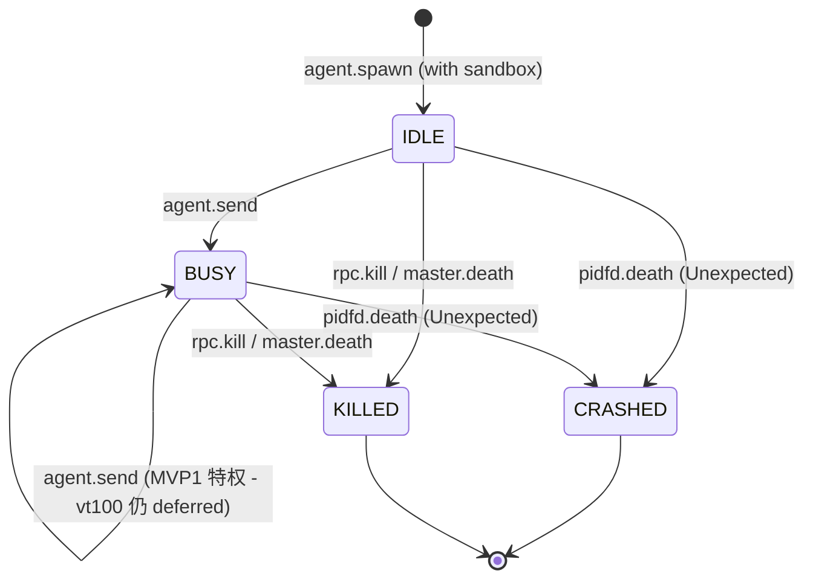

# Kiro Design: MVP 2 (隔离长城)

> **文档定位**：本文件是 ccbd-rust MVP 2 阶段的官方 D (Design) 规格。严格基于 `mvp2-R.md` 定义的边界，为 Codex 的 T 阶段（Task）提供无歧义的代码实施蓝图。本阶段把 MVP 1 的「裸进程」升级为「深层隔离执行体」，通过 Bubblewrap、Systemd Slice 和 Linux pidfd 技术栈构建物理级安全隔离与级联清理。

---

## 1. 状态机 Delta (继承 IDLE/BUSY/CRASHED)

MVP 2 在 MVP 1 已激活的 `IDLE / BUSY / CRASHED` 之外引入 `KILLED` 状态，并把死亡判定从 `Child::wait` 升级为 `pidfd` 事件驱动。

### 1.1 新增 KILLED 状态
*   **定义**：Agent 进程在 L2 调度层的主动干预（`agent.kill`）或主控生命周期结束（`master.death`）下被安全杀灭。
*   **进入时机**：
    - 接收到 RPC `agent.kill` 指令并成功下发 SIGKILL 后。
    - `pidfd_open(master_pid)` 监控发现 Master 死亡，对该 Session 下所有 active 进程执行强制收割后。
*   **物理差异**：与 `CRASHED` 不同，`KILLED` 是 L2 显式控制的预期终结，事件流的 `payload.reason` 标记为 `SIGKILL_BY_DAEMON` 或 `MASTER_DEATH`。

### 1.2 状态转移图（MVP 2 范围）



注：`BUSY → IDLE` 路径仍依赖 vt100 marker 解析，MVP 3 才会激活。MVP 2 的 `agent.send` 继续保留 MVP 1 的「BUSY 状态下也允许继续 send」特权。

### 1.3 CAS (Check-And-Set) 协议升级

所有状态流转 SQL 必须严格执行状态校验，**两个终态都要排除**：

```sql
UPDATE agents
SET state = 'CRASHED', error_code = 'AGENT_UNEXPECTED_EXIT',
    exit_code = ?, state_version = state_version + 1, updated_at = unixepoch()
WHERE id = ? AND state NOT IN ('CRASHED', 'KILLED');
```

### 1.4 master.death 级联清理伪代码（OwnedFd 模型）

```rust
// pidfd_open(master_pid) 的 epoll readable() 唤醒后执行：
async fn cascade_kill_on_master_death(session_id: &str, db: &Db) -> Result<()> {
    let active_ids: Vec<String> = db
        .query("SELECT id FROM agents WHERE session_id = ? AND state NOT IN ('CRASHED', 'KILLED')", [session_id])?;

    let mut tx = db.begin_immediate()?;
    for agent_id in &active_ids {
        // 物理杀灭：从 monitor registry 临时借 BorrowedFd 用 pidfd_send_signal（防 PID 回绕）
        // 不取走 OwnedFd 所有权，保持 registry 持有；watch task 仍可独立 close 它的副本
        monitor::with_borrowed(agent_id, |fd| {
            let _ = pidfd_send_sigkill(fd); // best-effort
        });
        tx.execute(
            "UPDATE agents SET state = 'KILLED', state_version = state_version + 1, updated_at = unixepoch() \
             WHERE id = ? AND state NOT IN ('CRASHED', 'KILLED')",
            [agent_id],
        )?;
        tx.execute(
            "INSERT INTO events (agent_id, event_type, payload) VALUES (?, 'state_change', ?)",
            [agent_id, &json!({"to": "KILLED", "reason": "MASTER_DEATH"}).to_string()],
        )?;
    }
    tx.commit()?;
    Ok(())
}
```

---

## 2. Schema Delta

MVP 2 严格遵循「不改表、不增字段」原则。仅激活 MVP 1 中预留字段的写入路径。

### 2.1 字段激活清单

*   **`agents.exit_code`**：由 pidfd 事件循环 `waitid(P_PIDFD)` 拿到的 `siginfo_t.si_status` 填入（CRASHED 路径）。`KILLED` 路径不写 exit_code（因为是我们主动 SIGKILL）。
*   **`agents.error_code`**：异常退出填 `AGENT_UNEXPECTED_EXIT`；沙盒启动失败填 `SANDBOX_*` 系列；`KILLED` 路径不写。
*   **`sessions.master_pid`**：MVP 1 已写入但未消费，MVP 2 正式作为 `pidfd_open` 监控目标。

### 2.2 维持现状的字段

*   **`agents.sub_state`**：MVP 3 用于标记 `Matched / Asserted`，本阶段保持 NULL。
*   **`evidence` 表**：MVP 4 激活，本阶段禁止任何写入。

### 2.3 防偏航

**禁止**新增 `agents.sandbox_path` 字段。沙盒目录路径完全由 `path::resolve_sandbox_dir(&agent_id)` 函数从 `resolve_state_dir() + "sandboxes/" + agent_id` 动态构造，无需持久化。

---

## 3. RPC 契约 Delta

### 3.1 `agent.spawn`（修改）

新增可选参数 `sandbox_overrides`，覆盖 baseline。

*   **Params**:
    ```json
    {
      "session_id": "sess_abc",
      "agent_id": "ag_1",
      "provider": "bash",
      "sandbox_overrides": {
        "network": "host" | "none",
        "extra_ro_binds": [
          { "host_path": "/etc/custom", "sandbox_path": "/etc/custom" }
        ]
      }
    }
    ```
    缺省 `sandbox_overrides` 时按 baseline 处理。
*   **Returns**: `{"state": "IDLE", "pid": 12345}`（MVP 2 仍不引入 `SPAWNING`，spawn 同步返回 `IDLE`，pid 是 `systemd-run --scope` 包裹后的根进程 PID）
*   **可能的 error_code**: `SANDBOX_BWRAP_NOT_FOUND`, `SANDBOX_USER_NS_DISABLED`, `SANDBOX_MOUNT_FAILED`, `AGENT_ALREADY_EXISTS`, `DB_CONSTRAINT_VIOLATION`
*   **执行逻辑伪代码（spawn-first 顺序，与 mvp2-T.md T4.2 一致）**:
    ```rust
    // 1. 启动期前置（缓存 EnvState 的结果，不每次重检 which）
    if !env_state.bwrap_available && !env_state.unsafe_no_sandbox {
        return Err(SANDBOX_BWRAP_NOT_FOUND);
    }
    // 2. advisory 唯一性检查（不上锁；step 8 INSERT 还会撞 UNIQUE 兜底）
    if db.agent_exists(agent_id)? { return Err(AGENT_ALREADY_EXISTS); }
    // 3. session 存在性校验
    if !db.session_exists(session_id)? { return Err(DB_CONSTRAINT_VIOLATION); }

    // 4. 物理沙盒目录
    let sandbox_dir = path::resolve_sandbox_dir(state_dir, agent_id)?;

    // 5. 组装 bwrap 参数
    let bwrap_args = bwrap::build_args(&sandbox_dir, &overrides)?;

    // 6. 包装 systemd-run
    let cmd = systemd::wrap_command(agent_id, &env_state, &bwrap_args, &provider_entrypoint);

    // 7. 配置 PTY (沿用 MVP1 portable-pty) + spawn
    let pty_pair = pty_system.openpty(PtySize { rows: 24, cols: 80, .. })?;
    let mut child = pty_pair.slave.spawn_command(cmd)?;
    let pid = child.process_id().ok_or(PTY_OPEN_FAILED)? as i32;

    // 8. pidfd_open（OwnedFd 所有权）
    let pidfd: OwnedFd = match monitor::pidfd_open(pid) {
        Ok(fd) => fd,
        Err(e) => {
            // 回滚（DB 还未写）：仅 kill + 删目录
            let _ = child.kill();
            let _ = fs::remove_dir_all(&sandbox_dir);
            return Err(e); // SandboxMountFailed 或 AgentUnexpectedExit (ESRCH)
        }
    };

    // 9. 物理资源都拿到，**此时**才 INSERT INTO agents
    if let Err(e) = db.insert_agent(agent_id, session_id, provider, "IDLE", pid) {
        // UNIQUE 冲突或其它 DB 错：物理资源回滚
        let _ = child.kill();
        let _ = fs::remove_dir_all(&sandbox_dir);
        return Err(e); // AgentAlreadyExists 等
    }

    // 10. 注册 PTY_MAP + pidfd registry（OwnedFd move 进 registry，try_clone 一份给 watch task）
    let pidfd_for_task = pidfd.try_clone()?; // 失败极少，万一失败按 step 9 回滚 + DELETE agent 兜底
    pty_map.lock().unwrap().insert(agent_id.into(), pty_pair.master.try_clone_writer()?);
    monitor::register(agent_id.into(), pidfd); // OwnedFd move 进去
    spawn_pty_reader_task(agent_id, pty_pair.master.try_clone_reader()?);
    spawn_agent_pidfd_watch_task(agent_id, pidfd_for_task, child, db_handle);

    Ok({"state": "IDLE", "pid": pid})
    ```

### 3.2 `agent.kill`（新增）

主动终止指定 Agent 的生命周期。

*   **Params**: `{"agent_id": "ag_1"}`
*   **Returns**: `{"state": "KILLED"}`
*   **可能的 error_code**: `AGENT_NOT_FOUND`（已 CRASHED/KILLED 或不存在）
*   **执行逻辑伪代码（OwnedFd 所有权协议）**:
    ```rust
    // 1. 先标 KILLED 再发信号（避免 watch task 抢先观察到死亡误判 CRASHED）
    //    db::queries::mark_agent_killed 内部用事务 CAS + state_change
    let changes = db::queries::mark_agent_killed(db, agent_id, "SIGKILL_BY_DAEMON")?;
    if changes == 0 { return Err(AGENT_NOT_FOUND); } // CAS 失败：已 CRASHED/KILLED 或不存在

    // 2. 通过 pidfd_send_signal 发 SIGKILL（防 PID 回绕）
    //    monitor::with_borrowed 临时借 BorrowedFd，不夺所有权
    monitor::with_borrowed(agent_id, |fd| {
        let _ = pidfd_send_sigkill(fd); // 错误只 log 不 abort
    });

    // 3. 清理：PTY_MAP 移除 + monitor::remove 取出 OwnedFd（drop 自动 close）
    //    pidfd_watch task 之后被唤醒时，CAS 看到 state 已是 KILLED → changes==0 → no-op
    pty_map.lock().unwrap().remove(agent_id);
    let _owned = monitor::remove(agent_id); // OwnedFd drop 自动 close

    Ok({"state": "KILLED"})
    ```

### 3.3 错误映射表

| 触发场景 | error_code |
| :--- | :--- |
| Daemon 启动期 `which bwrap` 失败且无 bypass | `SANDBOX_BWRAP_NOT_FOUND` |
| `bwrap` 进程退出码提示 user namespace 不可用 | `SANDBOX_USER_NS_DISABLED` |
| `extra_ro_binds` 路径不存在 / 命中 `validate_safe_path` 黑名单 / `pidfd_open` 失败 | `SANDBOX_MOUNT_FAILED` |
| pidfd watch 观察到非 KILLED 路径下的进程退出 | `AGENT_UNEXPECTED_EXIT` |
| `agent.kill` 时 agent 不存在 / 已 CRASHED / 已 KILLED | `AGENT_NOT_FOUND` |

---

## 4. 沙盒组装算法（MVP 2 简化版）

`SandboxAssembler` 模块负责把配置转化为物理隔离指令。s-5 的完整伪代码做以下简化：**不要 inotify、不要 evidence dump、不要 fallback to existing PID**。

### 4.1 启动期前置检查（Daemon main 启动时一次）

```rust
fn check_environment() -> Result<EnvState, CcbdError> {
    let bypass = env::var("CCBD_UNSAFE_NO_SANDBOX").as_deref() == Ok("1");
    let bwrap_available = which::which("bwrap").is_ok();
    if !bwrap_available && !bypass {
        return Err(CcbdError::SandboxBwrapNotFound);
    }
    if bypass {
        tracing::warn!("CCBD_UNSAFE_NO_SANDBOX=1 detected; running without sandbox isolation");
    }
    let systemd_run_available = which::which("systemd-run").is_ok();
    if !systemd_run_available && !bypass {
        return Err(CcbdError::EnvironmentNotSupported); // 非 Linux + systemd 直接退出
    }
    Ok(EnvState { bwrap_available, systemd_run_available, unsafe_no_sandbox: bypass })
}
```

### 4.2 bwrap Baseline 参数集（默认 deny-all 网络）

| Flag | 含义 |
| :--- | :--- |
| `--unshare-pid` | 独立 PID Namespace，看不到宿主机其他进程 |
| `--unshare-uts` | 独立 hostname namespace |
| `--unshare-ipc` | 独立 SysV IPC 隔离 |
| `--unshare-net` | **默认拒绝出站网络**；`sandbox_overrides.network=="host"` 时改用 `--share-net` |
| `--proc /proc` | 沙盒专用 /proc（必须配 `--unshare-pid`） |
| `--dev /dev` | 基础设备文件 |
| `--tmpfs /tmp` | 独立 tmpfs |
| `--ro-bind /usr /usr` | 只读挂载系统库 |
| `--ro-bind /bin /bin` | 只读挂载 `/bin`（多数 distro 上是 `/usr/bin` 软链；用 `try` 形式更稳） |
| `--ro-bind-try /bin /bin` | 上一行的 try 版本，目录不存在时跳过不报错 |
| `--ro-bind-try /sbin /sbin` | 同上 |
| `--ro-bind-try /lib /lib` | **关键**：动态链接器 `ld-linux*.so` 在 32 位 / 部分老 distro 位于 `/lib`，缺则二进制（含 bash）无法启动 |
| `--ro-bind-try /lib64 /lib64` | x86_64 主流 distro 上 ld-linux 在 `/lib64/ld-linux-x86-64.so.2`；ARM64 一般无 `/lib64`，所以用 try 形式 |
| `--ro-bind /etc/resolv.conf /etc/resolv.conf` | 仅透传 DNS（host 模式下必备） |
| `--dir /home/agent` | 创建虚拟 HOME |
| `--setenv HOME /home/agent` | 改写 HOME 环境变量 |
| `--bind <sandbox_dir> /workspace` | 把 host 沙盒目录读写绑定到沙盒内 /workspace |

**关于 `/etc` 的暴露策略**：baseline 故意**不**整体挂 `/etc`，只透传 `/etc/resolv.conf`。这意味着 sandbox 内 `cat /etc/shadow` 实际返回 `ENOENT`（No such file or directory），而不是 `EACCES`（Permission denied）。这是预期行为：从隔离严密度角度看 ENOENT 比 EACCES 更优（攻击面更小）。验收测试只断言"读取失败 + exit code 非零"，不死磕 errno 文案。如果 provider 需要更多 `/etc/*` 文件（如 `/etc/passwd` 给 git），通过 `sandbox_overrides.extra_ro_binds` 显式注入，不进 baseline。

### 4.3 沙盒目录解算

```rust
// path::resolve_sandbox_dir(&agent_id)
// CCB_ENV=dev: <repo>/target/dev_state/sandboxes/<agent_id>/
// 否则:        ~/.local/state/ccbd/sandboxes/<agent_id>/
```

### 4.4 systemd-run 包装层

```bash
systemd-run --user --scope \
  --slice=ccbd-agents.slice \
  --property=BindsTo=ccbd-rust.service \
  --description="ccbd-agent-<agent_id>" \
  bwrap [BASELINE_ARGS] [OVERRIDE_ARGS] <provider_entrypoint>
```

`BindsTo=ccbd-rust.service` 让 Daemon 崩溃后 systemd 自动级联清理这个 scope unit。

**关键进程模型澄清**：在 `--scope` 模式下，`systemd-run` **不会** detach 后退出，而是保持自己作为前台进程跑到目标进程结束。但更进一步，`systemd-run --scope` 实际行为是：fork 出一个子进程 → 该子进程加入新建的 transient scope cgroup → `execvp(bwrap)` 把自己换成 bwrap 进程。所以 portable-pty 的 `child.process_id()` 拿到的 PID **就是 bwrap 进程 PID**（exec 不改 PID），而 bwrap 内部又会 exec 成 provider entrypoint（`bash` / `gemini` 等）。整条链上 PID 不变，pidfd_open(child_pid) 监控的就是真实工作进程。

不过这条假设依赖 `systemd-run --user --scope` 的 wait 模式行为（默认即 wait 模式，不加 `--no-block`）。**强制约束**：组装命令时**禁止**追加 `--no-block`，否则 systemd-run 会异步返回，pidfd 监控的对象会变成已退出的 systemd-run 客户端。集成测试 AC4 必须验证：`agent.spawn` 后查 `/proc/<pid>/comm` 应得到 `bwrap` 或 entrypoint 名（如 `bash`），而非 `systemd-run`。

### 4.5 失败回滚顺序（spawn-first 顺序下的两类回滚）

按 §3.1 的 spawn-first 顺序，回滚分两类：

**类 A：物理资源失败（DB 还未 INSERT）**——发生在 §3.1 step 5/6/7/8 任一失败时：
1. `child.kill()` 物理杀进程（如果 child 已拿到）
2. `fs::remove_dir_all(sandbox_dir)` 清沙盒目录
3. **不需要**动 DB（agents 行还没 INSERT）

**类 B：DB INSERT 后失败**——发生在 §3.1 step 9 后的极少数路径（如 try_clone 失败）：
1. `child.kill()`
2. `fs::remove_dir_all(sandbox_dir)`
3. `db::queries::delete_agent(agent_id)`（T0.2 已实现的防御性 helper）

任何一步内部报错都不影响后续步骤继续（all best-effort），但每步失败都要 `tracing::error!` 留痕。

---

## 5. pidfd 事件循环

MVP 2 用 pidfd 事件驱动取代 MVP 1 的 `Child::wait` 阻塞轮询。

### 5.1 syscall 接入

直接走 `libc::syscall(SYS_pidfd_open, pid, 0)` 拿 raw int，**立刻**用 `unsafe { OwnedFd::from_raw_fd(raw) }` 包装为 OwnedFd 拿到所有权。`nix::sys::pidfd` 的 wrapper 在 nix 0.29 仍是 unstable feature，避免依赖。errno 通过 `std::io::Error::last_os_error().raw_os_error()` 读取，跨 glibc/musl 兼容。

### 5.2 agent_watch_task 监听逻辑（OwnedFd 模型）

```rust
// pidfd: OwnedFd 是 watch task 自己的副本（来自 spawn 路径上 pidfd.try_clone()）
// 跟 monitor::register 持有的那份独立，drop 时各自 close
async fn spawn_agent_pidfd_watch_task(
    agent_id: String,
    pidfd: OwnedFd,
    _child: Box<dyn Child>,
    db: Arc<Db>,
) {
    // AsyncFd::new 接受 T: AsRawFd + IntoRawFd，move 进 OwnedFd
    let async_fd = AsyncFd::new(pidfd).expect("AsyncFd registration");
    let _guard = async_fd.readable().await.expect("pidfd readable");

    // 拿 RawFd 给 waitid 用（仅 borrow，async_fd 仍持有 OwnedFd）
    let raw = async_fd.get_ref().as_raw_fd();
    let exit_code = unsafe {
        let mut info: libc::siginfo_t = std::mem::zeroed();
        libc::waitid(libc::P_PIDFD, raw as u32, &mut info, libc::WEXITED);
        info.si_status() // siginfo_t.si_status
    };

    // 调 db::queries::mark_agent_crashed_with_exit（T0.2 已实现）
    // 内部 CAS 排除 KILLED：agent.kill 已抢先转 KILLED 时本调用 changes==0，no-op
    let _ = db::queries::mark_agent_crashed_with_exit(&db, &agent_id, exit_code);

    // 清理 PTY_MAP + monitor::remove（registry OwnedFd drop 自动 close）
    pty_map.lock().unwrap().remove(&agent_id);
    let _ = monitor::remove(&agent_id);

    // task 退出，async_fd 持有的 OwnedFd 副本也自动 drop close
    // 全程禁止显式 libc::close
}
```

### 5.3 资源寿命与 pidfd ownership 协议（防 double-close）

`pidfd_registry: Arc<Mutex<HashMap<String, OwnedFd>>>` 与 `PTY_MAP` 是兄弟全局结构。**用 `std::os::fd::OwnedFd` 而不是裸 `RawFd`**，让所有权语义清晰：

- 注册时把 `OwnedFd` move 进 registry（registry 持有所有权）。
- watch_task 通过 `try_clone()` 拿一份独立 fd 副本（独立 close 语义），仅用于 `AsyncFd::new(borrowed_raw)` 监听 readable；task 末尾 OwnedFd 副本 drop 自动 close 自己那份，**不**影响 registry 持有的原 fd。
- 终态时（CRASHED / KILLED）调 `pidfd_registry.remove(&agent_id)`，得到 `Option<OwnedFd>`，drop 时自动 close registry 那份。
- 双重 close 的物理防护：所有 close 都通过 OwnedFd 的 Drop 自动完成，**禁止**任何位置直接 `libc::close(raw_fd)`。

任一终态都必须同时清 PTY_MAP（PtyWriter handle）+ pidfd_registry（OwnedFd）。两个 remove 之间允许有几毫秒间隔（不是 atomic），不影响正确性，因为状态机的事实来源是 SQLite。

---

## 6. master_pid pidfd 监控

### 6.1 注册时机

*   **session.create 时（事务边界澄清）**：handle_session_create 流程顺序必须是「先 pidfd_open → 成功后再 commit DB」：
    1. `BEGIN IMMEDIATE` 事务，`INSERT OR IGNORE INTO projects` + 准备 `INSERT INTO sessions`，但先**不** COMMIT。
    2. 调 `pidfd_open(master_pid, 0)`。若返回 `-ESRCH` → `tx.rollback()` 直接退出，返回 `IPC_INVALID_REQUEST { details: "master_pid not alive" }`，sessions 表不留任何痕迹。
    3. pidfd 拿到后 `tx.commit()` 落 sessions 记录。
    4. commit 成功后 register 进 PIDFD_REGISTRY 并 `tokio::spawn` master_watch task（这两步在事务外，因为 spawn task 不能在 SQLite 事务持锁内做）。

    极端时序（commit 后 / register 前 master 死）的兜底：master_watch task 启动时 AsyncFd::readable() 会立即 ready（已退出的 pidfd 也是 readable），cascade_kill 路径走通；session 已落库的事实不影响最终一致性。
*   **Daemon 启动期 Reconcile**：扫描 DB 中 sessions 表，为每个尚有 active agent 的 session 重新注册 `master_pid` 监控。如果此时 `pidfd_open` 返回 ESRCH（说明在 Daemon 离线期间 master 已死），立即对该 session 下所有 active agent 走 §1.4 级联清理。

### 6.2 master_watch_task 监听逻辑（OwnedFd 模型）

```rust
// master_pidfd: OwnedFd 是 task 自己的副本（来自 handle_session_create 的 try_clone）
// 跟 monitor::register("master:<sid>", ...) 持有的那份独立
async fn spawn_master_pidfd_watch_task(session_id: String, master_pidfd: OwnedFd, db: Arc<Db>) {
    let async_fd = AsyncFd::new(master_pidfd).expect("AsyncFd registration");
    let _guard = async_fd.readable().await.expect("master pidfd readable");

    // master 死 → 级联清理整个 session 下的 active agent
    let _ = db::queries::cascade_kill_session_agents(&db, &session_id, "MASTER_DEATH");

    // monitor::remove 的 OwnedFd drop close registry 那份
    let _ = monitor::remove(&format!("master:{session_id}"));
    // task 退出 async_fd 内的 OwnedFd 也自动 drop close
}
```

---

## 7. systemd-run 集成细节

### 7.1 环境变量预导入

Daemon 启动时检查 `XDG_RUNTIME_DIR / DBUS_SESSION_BUS_ADDRESS` 是否存在。缺失时 `tracing::warn!` 提示用户运行 `systemctl --user import-environment` 或确保 ccbd 在 user-systemd 会话里运行。systemd-run 启动失败时，把 stderr 内容附在 `details.stderr` 中，错误码统一映射 `SANDBOX_MOUNT_FAILED`（避免新增 SYSTEMD_* 错误码）。

### 7.2 ccbd-agents.slice 安装责任

`ccbd-agents.slice` unit 文件由部署脚本 / README 指引用户安装到 `~/.config/systemd/user/ccbd-agents.slice`，含 `TasksMax=1024 MemoryMax=2G CPUWeight=normal`。ccbd-rust 自身**不**生成或修改 systemd unit 文件，仅依赖该 slice 已存在。如果 slice 不存在，`systemd-run --slice=ccbd-agents.slice` 会自动创建 transient slice，仍可工作但失去 TasksMax 保护。

### 7.3 BindsTo 边界（手动 cargo run 场景）

如果 ccbd 是开发期手动 `cargo run` 起的（不在 systemd 下），`BindsTo=ccbd-rust.service` 不会生效（systemd 找不到这个 service）。MVP 2 接受这种降级：开发期 ccbd 崩溃后 agent 不会被自动级联杀死，依赖下次启动的 `Startup Reconcile` 兜底。`tracing::warn!` 提示 "ccbd not running under systemd; cascade cleanup will rely on Startup Reconcile only"。

---

## 8. 模块布局 Delta

基于 mvp1-D §5 既有结构，本阶段新增 `sandbox/` 与 `monitor/` 两个模块，并修改 `pty/tasks.rs` 与 `rpc/handlers.rs`：

```
src/
├── main.rs              // [修改] 启动时调 sandbox::check_environment + 注册 master pidfd watch
├── env.rs               // [复用 MVP1]
├── error.rs             // [修改] 新增 SandboxBwrapNotFound / SandboxUserNsDisabled / SandboxMountFailed / EnvironmentNotSupported / AgentUnexpectedExit 变体
├── db/
│   ├── queries.rs       // [修改] 新增 cascade_kill_session_agents / mark_agent_killed / mark_agent_crashed_with_exit
│   └── ...              // [复用 MVP1]
├── sandbox/             // [新增]
│   ├── mod.rs           // SandboxAssembler 主入口 + check_environment + EnvState
│   ├── bwrap.rs         // build_args(sandbox_dir, overrides) → Vec<String>
│   ├── systemd.rs       // wrap_command(agent_id, entrypoint, bwrap_args) → CommandBuilder
│   └── path.rs          // resolve_sandbox_dir(agent_id) → PathBuf
├── monitor/             // [新增]
│   ├── mod.rs           // pidfd_registry: Arc<Mutex<HashMap<String, OwnedFd>>> + pidfd_open / pidfd_send_sigkill / register / remove / with_borrowed
│   ├── agent_watch.rs   // spawn_agent_pidfd_watch_task
│   └── master_watch.rs  // spawn_master_pidfd_watch_task + cascade_kill_on_master_death
├── pty/
│   ├── mod.rs           // [复用 MVP1]
│   └── tasks.rs         // [修改] 删除 spawn_child_wait_task；保留 spawn_pty_reader_task
└── rpc/
    ├── mod.rs           // [复用 MVP1]
    ├── router.rs        // [修改] 注册 agent.kill
    └── handlers.rs      // [修改] handle_agent_spawn 改用 sandbox::Assembler；新增 handle_agent_kill
```

---

## 9. 依赖 Delta

`Cargo.toml` 新增（MVP 1 既有依赖全保留）：

```toml
[dependencies]
# 系统级原语
libc = "0.2"            # pidfd_open / pidfd_send_signal / waitid 裸 syscall
which = "6"             # which("bwrap") / which("systemd-run")

# Tokio 新加 features
tokio = { version = "1.36", features = [
  "rt-multi-thread", "macros", "net", "process", "io-util", "sync", "signal"
] }
```

**不引入** `nix`（pidfd_open 在 nix 0.29 仍处于 unstable feature，裸 libc syscall 更可控）。
**不引入** `systemd` / `dbus` 库（直接 `Command::new("systemd-run")` 调 CLI，保持单二进制纯净分发）。
**不引入** bwrap 的 Rust 绑定（同上理由，直接 CLI 调用）。
