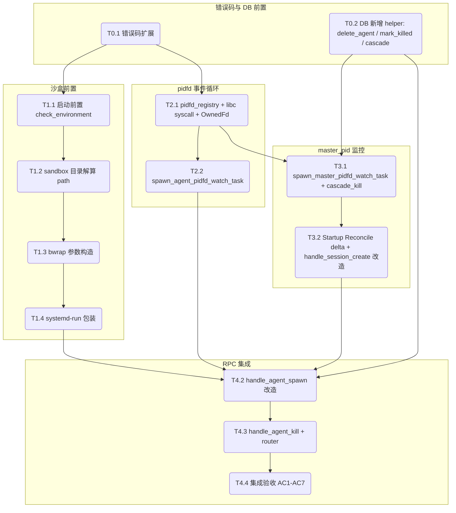

# Kiro Tasks: MVP 2 (隔离长城)

> **文档定位**：本文件是 MVP 2 由 Codex（或人类工程师）逐项实施的原子任务清单。每个任务必须独立编译、独立验证。禁止跨组跳跃执行。所有任务严格按 `mvp2-D.md` 的设计落地，禁止自创命名或偏离决策。

---

## 1. 任务依赖与执行图谱

MVP 2 划分为 5 个执行阶段（对应 3 个 PR/Commit 组）。



---

## 2. 原子任务定义

### Group 0: 错误码与 DB 前置 (Plumbing Foundation)

#### T0.1: 错误码扩展

* **依赖前置**: 无
* **设计输入**: `mvp2-D.md §3.3`
* **输出产物**: `src/error.rs`
* **执行步骤**:
  1. 在 `CcbdError` 枚举新增 5 个变体（**严格**按 D §3.3 命名，不发明新名）：
     - `SandboxBwrapNotFound`
     - `SandboxUserNsDisabled { details: String }`
     - `SandboxMountFailed { details: String }`
     - `EnvironmentNotSupported { details: String }`（systemd-run 缺失 / 非 Linux 等）
     - `AgentUnexpectedExit { details: String }`
  2. `to_rpc_error()` 把这 5 个变体映射为对应的 `error_code` 字符串（大写下划线版："SANDBOX_BWRAP_NOT_FOUND" / "SANDBOX_USER_NS_DISABLED" / "SANDBOX_MOUNT_FAILED" / "ENVIRONMENT_NOT_SUPPORTED" / "AGENT_UNEXPECTED_EXIT"），全部走 `code: -32000`。
  3. 把 `details` 字段也透传到 `to_rpc_error()` 输出的 `data.details` 中，方便排障。
* **独立验收**: 单测断言每个新变体的 `to_rpc_error()` 返回的 JSON 含正确 `error_code` 字符串 + `code: -32000` + 可读 `details`。`cargo test error::tests`。

#### T0.2: DB 新增 helper

* **依赖前置**: 无（与 T0.1 并行）
* **设计输入**: `mvp2-D.md §1.4`, `§3.2`, `§3.1` 失败回滚
* **输出产物**: `src/db/queries.rs`
* **执行步骤**:
  1. 新增 `pub fn delete_agent(db: &Db, agent_id: &str) -> Result<(), CcbdError>`：执行 `DELETE FROM agents WHERE id = ?`。供 `handle_agent_spawn` 失败回滚用（注意：本任务下面 §3 / T4.2 的最终方案是「先 spawn → 成功后 insert_agent」，所以 delete_agent 仅作为防御性 helper 保留，不在主路径调用；但若中间步骤失败仍可能需要它，故列入 helper 集合）。
  2. 新增 `pub fn mark_agent_killed(db: &Db, agent_id: &str, reason: &str) -> Result<usize, CcbdError>`：事务内 CAS `UPDATE agents SET state='KILLED', state_version+=1, updated_at=unixepoch() WHERE id=? AND state NOT IN ('CRASHED','KILLED')` + `INSERT INTO events (agent_id, event_type, payload) VALUES (?, 'state_change', ?)`（payload 含 `{"to":"KILLED", "reason": <reason>}`）。返回 changes。
  3. 新增 `pub fn mark_agent_crashed_with_exit(db: &Db, agent_id: &str, exit_code: i32) -> Result<usize, CcbdError>`：同上结构，但状态转 CRASHED + 写入 `agents.exit_code` + `agents.error_code='AGENT_UNEXPECTED_EXIT'` + payload reason=`AGENT_UNEXPECTED_EXIT`。返回 changes。
  4. 新增 `pub fn cascade_kill_session_agents(db: &Db, session_id: &str, reason: &str) -> Result<usize, CcbdError>`：先 SELECT session 下所有非终态 agent，对每个调 `mark_agent_killed`（事务可在外层），返回成功转移数。reason 由调用方传入（`MASTER_DEATH` 或 `MASTER_ALREADY_DEAD`）。
* **独立验收**: 单测 1）`mark_agent_killed` 重复调用，第二次 changes==0；2）`mark_agent_crashed_with_exit` 后查询 agents 表 `exit_code` / `error_code` 字段被正确写入；3）`cascade_kill_session_agents` 返回值 == session 下非终态 agent 数。

---

### Group 1: 沙盒前置 (Foundation)

#### T1.1: 启动期前置检查

* **依赖前置**: T0.1
* **设计输入**: `mvp2-D.md §4.1`, `§7.1`
* **输出产物**: `src/sandbox/mod.rs`, `Cargo.toml`（新增 `which = "6"` 依赖）
* **执行步骤**:
  1. 在 `Cargo.toml [dependencies]` 节按 `mvp2-D.md §9` 新增 `libc = "0.2"`、`which = "6"`，并把 `tokio` 的 features 列表追加 `"signal"`。
  2. 新建 `src/sandbox/mod.rs`，定义 `pub struct EnvState { pub bwrap_available: bool, pub systemd_run_available: bool, pub unsafe_no_sandbox: bool }`。
  3. 实现 `pub fn check_environment() -> Result<EnvState, CcbdError>`：
     - 读 `CCBD_UNSAFE_NO_SANDBOX` 环境变量（值为 `"1"` 即 bypass 开启）。
     - 用 `which::which("bwrap").is_ok()` / `which::which("systemd-run").is_ok()` 探测可执行文件。
     - bypass=false 且 bwrap 缺失 → 返回 `CcbdError::SandboxBwrapNotFound`。
     - bypass=false 且 systemd-run 缺失 → 返回 `CcbdError::EnvironmentNotSupported { details: "systemd-run not found in PATH; ccbd-rust requires Linux + systemd user session".into() }`。
     - bypass=true → `tracing::warn!("CCBD_UNSAFE_NO_SANDBOX=1 detected; running without sandbox isolation")`。
  4. 在 `src/main.rs` 中 Daemon 启动序列里、监听 UDS 之前调用 `check_environment()`，错误时直接 `eprintln!` + `std::process::exit(1)`。Result 缓存到 `Arc<EnvState>` 通过依赖注入传给 RPC handler。
* **独立验收**: 单元测试 1）设置 `CCBD_UNSAFE_NO_SANDBOX=1` 调 `check_environment` 不报错 + EnvState.unsafe_no_sandbox=true；2）正常环境下断言 EnvState.bwrap_available=true；3）`PATH=""` 注入构造 bwrap 缺失场景，断言返回 `SandboxBwrapNotFound`。

#### T1.2: 沙盒目录解算

* **依赖前置**: T1.1
* **设计输入**: `mvp2-D.md §2.3`, `§4.3`
* **输出产物**: `src/sandbox/path.rs`
* **执行步骤**:
  1. 新建 `src/sandbox/path.rs`，导出 `pub fn resolve_sandbox_dir(state_dir: &Path, agent_id: &str) -> Result<PathBuf, CcbdError>`。
  2. 校验 `agent_id` 仅含 `[A-Za-z0-9_-]+`（防路径穿越），违规返回 `CcbdError::IpcInvalidRequest`。
  3. 返回路径形如 `<state_dir>/sandboxes/<agent_id>/`。函数内部 `fs::create_dir_all` 自动建目录（含父目录）。
  4. 在 `src/sandbox/mod.rs` 顶部 `pub mod path;` 导出。
* **独立验收**: 单测使用 `tempfile::TempDir` 作为 state_dir，调用 `resolve_sandbox_dir(&tmpdir, "ag_1")` 后断言路径存在；调用 `resolve_sandbox_dir(&tmpdir, "../escape")` 返回 `IpcInvalidRequest`。

#### T1.3: bwrap 参数构造

* **依赖前置**: T1.2
* **设计输入**: `mvp2-D.md §3.1`, `§4.2`
* **输出产物**: `src/sandbox/bwrap.rs`
* **执行步骤**:
  1. 新建 `src/sandbox/bwrap.rs`，定义 `pub struct SandboxOverrides { pub network: Option<String>, pub extra_ro_binds: Vec<RoBind> }` 与 `pub struct RoBind { pub host_path: PathBuf, pub sandbox_path: PathBuf }`，配 `serde::Deserialize` derive 直接吃 `agent.spawn` 的 JSON。
  2. 实现 `pub fn build_args(sandbox_dir: &Path, overrides: &SandboxOverrides) -> Result<Vec<String>, CcbdError>`，返回字符串列表，**严格**按 D §4.2 表格顺序：
     - `--unshare-pid`、`--unshare-uts`、`--unshare-ipc`
     - 默认 `--unshare-net`；`overrides.network == Some("host")` 时改为 `--share-net`（仍透传 `/etc/resolv.conf`）
     - `--proc /proc`、`--dev /dev`、`--tmpfs /tmp`
     - `--ro-bind /usr /usr`、`--ro-bind /etc/resolv.conf /etc/resolv.conf`
     - `--dir /home/agent`、`--setenv HOME /home/agent`
     - `--bind <sandbox_dir> /workspace`
  3. 处理 `extra_ro_binds`：每条先调 `validate_safe_path`（拒绝 `host_path` 以 `/etc/`、`/root`、`/proc`、`/sys` 开头），通过则追加 `--ro-bind <host> <sandbox>`。命中黑名单返回 `CcbdError::SandboxMountFailed { details: "forbidden path" }`。
  4. **关键**：baseline 必须包含 `--ro-bind-try /lib /lib`、`--ro-bind-try /lib64 /lib64`、`--ro-bind-try /bin /bin`、`--ro-bind-try /sbin /sbin`，否则 sandbox 内 bash 等二进制因找不到动态链接器（`ld-linux-x86-64.so.2` 等）无法启动。`-try` 形式让目录不存在时跳过不报错，兼容 ARM64 等无 `/lib64` 的环境。
  5. **不**追加 seccomp / capability drop / vt100 相关参数（属于 MVP3+）。
* **独立验收**: 单测断言 1）默认 overrides 时输出含 `"--unshare-net"`、`"--bind"` + sandbox_dir 字符串、`"--ro-bind"` + `"/usr"`、`"--ro-bind-try"` + `"/lib64"`；2）`overrides.network = Some("host")` 时改出 `"--share-net"`；3）`extra_ro_binds` 含 `/etc/shadow` 时返回 `SandboxMountFailed`；4）合法 `extra_ro_binds = [{/var/data → /data}]` 时输出包含 `--ro-bind /var/data /data`。

#### T1.4: systemd-run 包装

* **依赖前置**: T1.3
* **设计输入**: `mvp2-D.md §4.4`, `§7.2`, `§7.3`
* **输出产物**: `src/sandbox/systemd.rs`
* **执行步骤**:
  1. 新建 `src/sandbox/systemd.rs`，导出 `pub fn wrap_command(agent_id: &str, env_state: &EnvState, bwrap_args: &[String], provider_entrypoint: &str) -> portable_pty::CommandBuilder`。
  2. 当 `env_state.unsafe_no_sandbox == true`：直接返回 `CommandBuilder::new(provider_entrypoint)`，不包 bwrap、不包 systemd（bypass 路径）。
  3. 否则按 D §4.4 构造 `CommandBuilder::new("systemd-run")`，依次 push args：
     - `--user`、`--scope`
     - `--slice=ccbd-agents.slice`
     - `--property=BindsTo=ccbd-rust.service`
     - `--description=ccbd-agent-<agent_id>`
     - `bwrap`
     - 把 `bwrap_args` 全部 push 进去
     - 最后 push `provider_entrypoint`
  4. **关键约束**：构造 args 时**禁止**追加 `--no-block`，`systemd-run --user --scope` 必须保持默认 wait 模式（详见 mvp2-D.md §4.4 进程模型澄清），否则 pidfd 会监控错对象。
  5. **不**实现 systemd-run 缺失时的隐式 fallback——T1.1 的 `check_environment` 已经在 Daemon 启动期硬拒。
  6. 在 main 的启动 banner 里加一句 `tracing::warn!` 提示用户：如果 ccbd 是 `cargo run` 起的（非 systemd 托管），`BindsTo` 不会触发级联清理，只能依赖 master pidfd 与 Startup Reconcile 兜底。
* **独立验收**: 单测断言 1）正常 env_state 下 CommandBuilder 的 program 是 `"systemd-run"`、args 列表里依次包含 `--scope`、`--slice=ccbd-agents.slice`、`bwrap`、`provider_entrypoint`；2）unsafe_no_sandbox=true 时 program 是 `provider_entrypoint`、args 列表为空。

---

### Group 2: pidfd 事件循环 (OS / I/O)

#### T2.1: pidfd_registry + syscall wrapper（OwnedFd 所有权模型）

* **依赖前置**: T0.1
* **设计输入**: `mvp2-D.md §5.1`, `§5.3`（OwnedFd 所有权协议）
* **输出产物**: `src/monitor/mod.rs`
* **执行步骤**:
  1. 新建 `src/monitor/mod.rs`，定义 `pub static PIDFD_REGISTRY: LazyLock<Arc<Mutex<HashMap<String, OwnedFd>>>> = LazyLock::new(...)`。key 格式：agent 路径用 `agent_id` 字符串原值；master 路径用 `format!("master:{session_id}")`。**全程使用 `std::os::fd::OwnedFd` 而非 `RawFd`**，避免 double close。
  2. 导出 `pub fn pidfd_open(pid: i32) -> Result<OwnedFd, CcbdError>`，内部用 `libc::syscall(libc::SYS_pidfd_open, pid, 0u32) as RawFd`。errno 用 `std::io::Error::last_os_error().raw_os_error()` 读取，**不**直接调 `libc::__errno_location` 以兼容 musl/glibc 差异。返回值 `< 0` 时：`Some(libc::ESRCH)` → 映射 `CcbdError::AgentUnexpectedExit { details: "pid already dead at pidfd_open" }`；其他 errno → 映射 `CcbdError::SandboxMountFailed { details: format!("pidfd_open errno={}", errno) }`。返回值 `>= 0` 时用 `unsafe { OwnedFd::from_raw_fd(raw) }` 包装。
  3. 导出 `pub fn pidfd_send_sigkill(pidfd: BorrowedFd<'_>) -> Result<(), CcbdError>`，参数用 `BorrowedFd` 不夺所有权。内部 `libc::syscall(libc::SYS_pidfd_send_signal, pidfd.as_raw_fd(), libc::SIGKILL, std::ptr::null::<libc::siginfo_t>(), 0u32)`。返回值 `< 0` 映射 `CcbdError::PtyIoError`。
  4. 导出 helper：
     - `pub fn register(key: String, fd: OwnedFd)`：把 OwnedFd move 进 registry，替换已有 key 时旧 OwnedFd 自动 drop close。
     - `pub fn remove(key: &str) -> Option<OwnedFd>`：从 map 取出 OwnedFd 返还给调用方，所有权转移；调用方 drop 时自动 close。
     - `pub fn with_borrowed<R>(key: &str, f: impl FnOnce(BorrowedFd<'_>) -> R) -> Option<R>`：临时借出 BorrowedFd 给 callback，map 持锁，**禁止**在 callback 内做长 I/O 操作（如 AsyncFd::readable）。
     - `pub fn contains(key: &str) -> bool`。
  5. **禁止**任何位置直接 `libc::close()` 一个 RawFd——所有 close 走 OwnedFd Drop。watch_task 末尾 OwnedFd 副本 drop 自动 close 它那份；registry remove 后的 OwnedFd drop 也自动 close。
* **独立验收**: 单测 1）`pidfd_open(std::process::id() as i32)` 返回 OwnedFd；2）`pidfd_open(999_999_999)` 返回 `AgentUnexpectedExit`；3）注册一个 fd → 记录 `/proc/self/fd` 数 N1 → remove 后让 OwnedFd drop → `/proc/self/fd` 数应回到 N1-1；4）replace 测试：先 register("k", fd1) 再 register("k", fd2)，断言 fd1 已被 close（用 `fcntl(F_GETFD)` 探测）。

#### T2.2: spawn_agent_pidfd_watch_task

* **依赖前置**: T2.1, T0.2
* **设计输入**: `mvp2-D.md §5.2`, `§5.3`
* **输出产物**: `src/monitor/agent_watch.rs`，修改 `src/pty/tasks.rs`
* **执行步骤**:
  1. 新建 `src/monitor/agent_watch.rs`，导出 `pub fn spawn_agent_pidfd_watch_task(agent_id: String, pidfd: OwnedFd, child: Box<dyn Child>, db: Arc<Db>)`。函数接收 OwnedFd——这是 watch task 自己的副本（来自 T4.2 spawn 路径上 `pidfd.try_clone()` 拿到的），跟 registry 持有的那份独立。
  2. 函数体内 `tokio::spawn(async move { ... })`：
     ```rust
     // AsyncFd::new 签名要求 T: AsRawFd + 实际 move 进 ownership
     // OwnedFd 实现了 AsRawFd + Into<RawFd>（tokio 1.36 AsyncFd<T> 接 T 直接 by-value）
     let async_fd = AsyncFd::new(pidfd).expect("AsyncFd registration");
     let _guard = async_fd.readable().await.expect("pidfd readable");

     // 此时 OwnedFd 已 move 进 async_fd 不能再用 pidfd 名字
     // 通过 async_fd.get_ref() 拿 &OwnedFd 引用，as_raw_fd() 拿 RawFd 给 waitid 用
     let raw = async_fd.get_ref().as_raw_fd();
     let mut info: libc::siginfo_t = unsafe { std::mem::zeroed() };
     let r = unsafe { libc::waitid(libc::P_PIDFD, raw as u32, &mut info, libc::WEXITED) };
     let exit_code = if r == 0 { unsafe { info.si_status() } } else { -1 };
     ```
  3. 调 `db::queries::mark_agent_crashed_with_exit(&db, &agent_id, exit_code)`（T0.2 已实现）。CAS 排除 `CRASHED / KILLED`，所以 agent.kill 已抢先标 KILLED 时本 task changes==0，自然 no-op。
  4. 任务末尾：`PTY_MAP.lock().unwrap().remove(&agent_id)`、`let _ = monitor::remove(&agent_id)`（registry 那份 OwnedFd drop 自动 close）。函数尾部 `async_fd` 离开作用域，里面的 OwnedFd 副本也自动 drop close。**禁止显式调 libc::close**。
  5. 在 `src/pty/tasks.rs` **删除** MVP1 的 `spawn_child_wait_task` 函数及其全部调用点，避免与新 watch task 重复转 CRASHED。
* **独立验收**: 单测 1）spawn `bash` 子进程，pidfd_open 后调本 task，外部 `kill -9 <pid>` 后轮询 DB 50ms 内观察到 agents.state=`CRASHED` + events 表新增 `state_change` + agents.exit_code 非空；2）先调 `mark_agent_killed` 把 state 标 `KILLED`、再 kill 进程，断言 events 表只有一条 state_change（`KILLED`），watch task 没补 CRASHED；3）大循环测试：spawn-kill 50 次，断言 `/proc/self/fd` 计数稳定（无 fd 泄漏）。

---

### Group 3: master_pid 监控

#### T3.1: master pidfd watch + cascade_kill

* **依赖前置**: T2.1, T0.2
* **设计输入**: `mvp2-D.md §1.4`, `§6.1`, `§6.2`
* **输出产物**: `src/monitor/master_watch.rs`，修改 `src/rpc/handlers.rs`
* **执行步骤**:
  1. `cascade_kill_session_agents` 已在 T0.2 实现，本任务里只用，不重写。补一个 SIGKILL 内联步骤：函数迭代非终态 agent 时，**先**用 `monitor::with_borrowed(&format!("master:..."))` 不行—— agent 路径直接 `monitor::with_borrowed(&agent_id, |fd| pidfd_send_sigkill(fd))` 发信号，再调 `mark_agent_killed(reason)`。错误 best-effort，单条 SIGKILL 失败不 abort 整个 cascade。
  2. 新建 `src/monitor/master_watch.rs`，导出 `pub fn spawn_master_pidfd_watch_task(session_id: String, master_pidfd: OwnedFd, db: Arc<Db>)`。逻辑同 T2.2 用 OwnedFd 模式。readable 唤醒后调 `cascade_kill_session_agents(&db, &session_id, "MASTER_DEATH")`，最后 `monitor::remove(&format!("master:{session_id}"))`。OwnedFd drop 自动 close。
  3. 修改 `handle_session_create`，**事务边界严格按 mvp2-D.md §6.1**：
     ```text
     BEGIN IMMEDIATE
       INSERT OR IGNORE INTO projects (id, absolute_path) VALUES (?, ?);
       // 先不 INSERT sessions，先做 pidfd_open 校验
     pidfd_open(master_pid)
       ESRCH → tx.rollback() → 返回 IpcInvalidRequest { details: "master_pid not alive" }
       OK    → 在同事务内 INSERT INTO sessions ...
     COMMIT
     // commit 成功后（事务外）：
     monitor::register("master:<sid>", owned_fd_clone)
     spawn_master_pidfd_watch_task(sid, owned_fd_for_task, db)
     ```
     pidfd_open 拿到 OwnedFd 后 `try_clone()` 一份给 task，原 OwnedFd register 进 registry。这两份独立 close。
* **独立验收**: 集成测试 1）tempfile DB 建一个 session（master 是当前 test process）+ 2 个 agent（state=BUSY）+ 手动 register 假 pidfd 进 registry，调 `cascade_kill_session_agents(db, sid, "MASTER_DEATH")` 后断言 events 表新增 2 条 state_change to=KILLED reason=MASTER_DEATH + agents.state 全 KILLED + 返回 2；2）调 `pidfd_open(999_999_999)` 模拟 master 已死，handle_session_create 返回 IpcInvalidRequest 且 sessions 表无新增（事务 rollback 验证）；3）正常 master 路径：handle_session_create 后 `monitor::contains(format!("master:{sid}").as_str()) == true`。

#### T3.2: Startup Reconcile delta

* **依赖前置**: T3.1
* **设计输入**: `mvp2-R.md §3 R-DISPATCH-1 Carve-out`, `mvp2-D.md §6.1 Daemon 启动期 Reconcile`
* **输出产物**: `src/db/queries.rs` 修改既有 `reconcile_active_agents_to_crashed`，`src/main.rs` 修改启动序列
* **执行步骤**:
  1. 修改 MVP1 的 `reconcile_active_agents_to_crashed`：在原有"把所有 active agent 转 CRASHED 写 events.state_change reason=STARTUP_RECONCILE"逻辑之前，新增"扫描 sessions 表，对每条 master_pid 调 `pidfd_open`：成功的 spawn master_watch task；ESRCH 的 → 调 `cascade_kill_session_agents`（reason=`MASTER_ALREADY_DEAD`，需要在 D §1.4 的 reason 枚举里也补这一项）"。
  2. 注意顺序：先做 master pidfd 注册/级联，再做 active agent 兜底（避免重复转移）。
  3. 在 `main.rs` 的启动序列里，确保 `reconcile_active_agents_to_crashed` 在 UDS 监听之前执行；既有的 MVP1 行为保持。
* **独立验收**: 集成测试 1）插入一条 session（master_pid 指向已退出的 PID）+ 一条 BUSY agent，启动 daemon 后断言 agent 转 KILLED + events 含 reason=`MASTER_ALREADY_DEAD`；2）插入 session（master_pid 指向当前 test process）+ agent，启动 daemon 后 agent 仍然按既有逻辑转 CRASHED reason=`STARTUP_RECONCILE`。

---

### Group 4: RPC 集成

> **错误码扩展已在 T0.1 完成**。本组直接消费这些变体。

#### T4.2: handle_agent_spawn 改造（spawn-first 顺序）

* **依赖前置**: T0.1, T0.2, T1.4, T2.2, T3.2
* **设计输入**: `mvp2-D.md §3.1`, `§4.5`
* **输出产物**: `src/rpc/handlers.rs`
* **执行步骤**:
  1. `handle_agent_spawn` 入参新增可选 `sandbox_overrides: Option<SandboxOverrides>`（用 T1.3 的 struct 直接 `serde_json::from_value`，缺省视为默认值）。
  2. **关键改动**：相比 mvp2-D.md §3.1 step 列出的「先 insert_agent，后 spawn」，实际实现采用 **spawn-first** 顺序，避免回滚时需要 delete_agent：
     ```text
     a. 校验 agent_id 唯一性 (SELECT 1 FROM agents WHERE id = ? LIMIT 1) — 命中返回 AGENT_ALREADY_EXISTS
        （这是 advisory check，不上锁；下面 step h 的 INSERT 还会再撞 UNIQUE 约束兜底）
     b. session 存在性校验 (SELECT 1 FROM sessions WHERE id = ?) — 不存在 → DB_CONSTRAINT_VIOLATION
     c. resolve_sandbox_dir(state_dir, agent_id) 创建沙盒目录
     d. bwrap::build_args(sandbox_dir, overrides) 拼参数
     e. systemd::wrap_command(agent_id, env_state, bwrap_args, provider_entrypoint) 得到 CommandBuilder
     f. pty_pair.slave.spawn_command(cmd) → 拿 child + pid
     g. monitor::pidfd_open(pid) → 拿 OwnedFd
        （任意 step c-g 失败，按下面 step k 回滚顺序清理，绝不写 DB）
     h. INSERT INTO agents (id, session_id, provider, state='IDLE', pid) VALUES (...)
        （UNIQUE 冲突 → 走回滚 + 返回 AGENT_ALREADY_EXISTS）
     i. PTY_MAP.insert(agent_id, master_writer)
     j. monitor::register(agent_id, owned_fd) — registry 持有 OwnedFd
        然后 spawn_pty_reader_task(reader) + spawn_agent_pidfd_watch_task(agent_id, owned_fd_clone, db)
     k. 任意一步失败的回滚顺序（best-effort，每步只 tracing::error! 不 abort）：
        child.kill() → fs::remove_dir_all(sandbox_dir) → 已 INSERT 的 agents 行 DELETE（仅 step h 之后的失败需要）
     ```
  3. 返回 `{"state": "IDLE", "pid": <i32>}`。这里的 pid 是 portable-pty `child.process_id()` 拿到的，依据 mvp2-D.md §4.4 进程模型澄清：systemd-run --scope wait 模式下 exec(bwrap) 不改 PID，所以这就是真实 bwrap/agent 进程 PID。
* **独立验收**: 集成测试 spawn provider="bash"：1）DB agents 表有该记录 state=IDLE pid=非零；2）`monitor::contains(agent_id) == true`；3）sandbox_dir 物理存在；4）`/proc/<pid>/comm` 内容为 `bwrap` 或 `bash`（**不**应是 `systemd-run`，验证 §4.4 的进程模型）；5）DB agent_id 重复 spawn 第二次返回 `AGENT_ALREADY_EXISTS` 且 sandbox_dir 与 PTY_MAP 都没有为第二次 spawn 创建/插入；6）模拟回滚：构造 build_args 失败（注入非法 extra_ro_binds），断言 sandbox_dir 没创建 + DB agents 没新增 + monitor registry 没污染。

#### T4.3: handle_agent_kill + router

* **依赖前置**: T2.2, T0.1, T0.2
* **设计输入**: `mvp2-D.md §3.2`
* **输出产物**: `src/rpc/handlers.rs`, `src/rpc/router.rs`
* **执行步骤**:
  1. 新增 `pub fn handle_agent_kill(db, params) -> Result<Value, CcbdError>`。
  2. 严格按 D §3.2 步骤实现：
     - 先调 `mark_agent_killed(db, agent_id, "SIGKILL_BY_DAEMON")`（T0.2 已实现，事务内 CAS + state_change 一起做）。`changes == 0` → 返回 `AgentNotFound`。
     - `monitor::with_borrowed(agent_id, |fd| pidfd_send_sigkill(fd))`：拿 BorrowedFd 发 SIGKILL。错误只 `tracing::error!`，不 abort——DB 已是权威。
     - `PTY_MAP.lock().unwrap().remove(agent_id)`（drop 自动 close writer）。
     - `monitor::remove(agent_id)`：从 registry 取出 OwnedFd 并 drop close。
  3. 返回 `{"state": "KILLED"}`。
  4. 在 `src/rpc/router.rs` 注册新方法 `"agent.kill" => handle_agent_kill`。
  5. **重复 kill 语义**：本 RPC **不是** kill -9 那种幂等接口。第二次调用因 CAS changes==0 返回 `AGENT_NOT_FOUND`（被视为"目标已不在 active 集合"）。这与 R-IDEMPOTENCY-1 不冲突——后者只针对 `agent.send` 通过 `request_id` 防重放。
* **独立验收**: 集成测试 spawn bash → agent.kill → 1) `agent.read since=0` 包含 state_change to=KILLED reason=SIGKILL_BY_DAEMON；2) 进程已死（`kill -0 <pid>` 返回 ESRCH）；3) `monitor::contains(agent_id) == false`；4) 重复 agent.kill 返回 `AGENT_NOT_FOUND`；5) `/proc/self/fd` 计数稳定。

#### T4.4: 集成验收 (AC1-AC7)

* **依赖前置**: T4.3
* **设计输入**: `mvp2-R.md §1`（7 条 AC 的逐条复刻）
* **输出产物**: `tests/mvp2_acceptance.rs`（Rust integration test）或 `scripts/mvp2_ac_e2e.sh`（bash + sqlite3 断言）
* **执行步骤**:
  1. 写一个集成测试 fixture：每个 AC 一个 `#[tokio::test]` 函数，启动 daemon 子进程 + UDS client + tempfile state_dir。
  2. AC1（沙盒权限边界）：spawn bash → send `cat /etc/shadow; echo X; ls $HOME/.ssh; echo Y` → read events.output_chunk → 断言 stdout 包含 "X" 与 "Y"（即两个命令都执行完了），且每条命令前都有 stderr 失败提示（"No such file or directory" 或 "cannot open" 任一即可，**不**死磕 errno 文案，因为 baseline 不挂 `/etc` 实际是 ENOENT）。
  3. AC2（master 死亡级联）：起辅助进程 `sleep 60 &` 拿 PID 作 master_pid → session.create → agent.spawn → `kill -9 <master_pid>` → **轮询上限 2s**内观察 `agent.read` 看到 state_change to=KILLED reason=MASTER_DEATH（与 mvp2-R.md AC2 的 2s 阈值对齐）。
  4. AC3a（生产路径，仅 systemd CI job 跑）：systemd user service 启动 daemon → spawn 1 agent → 记下 systemd-run scope unit name → `kill -9 <daemon_pid>` → 等 1s → `systemctl --user list-units 'ccbd-agent-*'` 应为空 + agent 进程不存在。本测试用 `#[cfg_attr(not(feature = "systemd-ci"), ignore)]` 标记，常规 cargo test 跳过。
  5. AC3b（开发降级路径）：用 cargo run 起 daemon 子进程 → spawn 1 agent → `kill -9 <daemon_pid>` → 等 100ms（agent 仍活着，BindsTo 不生效）→ 重启 daemon → 等 startup reconcile 完成 → `agent.read since=0` 看到 state_change to=CRASHED reason=STARTUP_RECONCILE。
  6. AC4（agent pidfd 捕获 + 进程模型校验）：spawn bash → 验证 `/proc/<pid>/comm` 内容 `bwrap` 或 `bash`（**不**应是 `systemd-run`，否则 §4.4 进程模型断言失败）→ `kill -9 <pid>` → 100ms-1s 内轮询 events 含 state_change to=CRASHED reason=AGENT_UNEXPECTED_EXIT + agents.exit_code 非空（bash 被 SIGKILL 通常 exit_code 为 128+9 编码或 Termination by signal）。
  7. AC5（agent.kill）：spawn bash → agent.kill → events 含 state_change to=KILLED reason=SIGKILL_BY_DAEMON + agents.state=KILLED + 进程不存在；重复 agent.kill 返回 AGENT_NOT_FOUND。
  8. AC6（unsafe bypass）：`CCBD_UNSAFE_NO_SANDBOX=1` 启动 daemon → spawn bash → 1）`/proc/<pid>/comm` 内容是 `bash` 直接（**不**经 systemd-run/bwrap 包装）；2）daemon stderr 含 `CCBD_UNSAFE_NO_SANDBOX=1 detected` WARN；3）作为非沙盒模式的存在性证明，bash 内 `ls $HOME` 能看到测试用户实际 HOME 内容（沙盒模式下因 `--dir /home/agent` 会得到空目录）。**不**断言 `cat /etc/shadow` 成功，因为非 root 用户在系统级仍 EACCES，与沙盒无关。
  9. AC7（bwrap 缺失硬拒）：用 `PATH=/nonexistent/bin` env override 启动 daemon → daemon 进程退出码 != 0 + stderr 含 `SANDBOX_BWRAP_NOT_FOUND` + UDS socket 文件**不**被创建（验证启动期硬拒：连监听都没起）。
* **独立验收**: `cargo test --test mvp2_acceptance -- --test-threads=1` 全部 7 条通过（AC3a 在常规跑里被 ignore 跳过）；CI 输出 `MVP2 AC1-AC7 ok`。

---

## 3. AC 追溯表 (Traceability Matrix)

| 验收标准 (mvp2-R §1) | 依赖的最后 Task | 验收测试方法 |
| :--- | :--- | :--- |
| **AC1: 沙盒权限边界**（cat /etc/shadow + ls ~/.ssh 失败，不死磕 errno） | T4.4 | T4.4 step 2 |
| **AC2: Master 死亡级联**（kill master → 2s 内 agents 全 KILLED reason=MASTER_DEATH） | T4.4 | T4.4 step 3 |
| **AC3a: Daemon 死亡级联（生产）** | T4.4 | T4.4 step 4（systemd CI job 专属） |
| **AC3b: Daemon 死亡降级（开发）**（cargo run 模式下 reconcile 兜底标 CRASHED） | T4.4 | T4.4 step 5 |
| **AC4: Agent 死亡 pidfd 捕获 + 进程模型校验**（/proc/comm 不是 systemd-run + state CRASHED + exit_code 落库） | T4.4 | T4.4 step 6 |
| **AC5: 主动终止 agent.kill**（state KILLED reason=SIGKILL_BY_DAEMON + 重复返回 AGENT_NOT_FOUND） | T4.4 | T4.4 step 7 |
| **AC6: CCBD_UNSAFE_NO_SANDBOX bypass**（不包 bwrap/systemd-run + WARN + ls $HOME 看到真实内容） | T4.4 | T4.4 step 8 |
| **AC7: bwrap 缺失硬拒**（启动期 exit != 0 + UDS socket 不创建） | T4.4 | T4.4 step 9 |

---

## 4. 执行节奏与工时估算建议

3 个 PR / Commit 增量合并：

1. **Commit 1 (G0 + G1): "Plumbing: error codes, DB helpers, sandbox foundation"**
   * **范畴**: T0.1 + T0.2 + T1.1 - T1.4。错误码扩展、DB helper、sandbox 模块骨架。
   * **代码量**: 约 400-550 行。CRUD + 命令行参数构造，风险低。

2. **Commit 2 (G2 + G3): "pidfd event loop & master cascade"**
   * **范畴**: T2.1 - T3.2。完成 pidfd 事件循环（OwnedFd 模型）、master 级联、handle_session_create 改造、Startup Reconcile 扩展。
   * **代码量**: 约 450-650 行。涉及 unsafe libc syscall 与 tokio AsyncFd，需要重点跑单测。

3. **Commit 3 (G4: T4.2 - T4.4): "RPC integration & MVP2 acceptance"**
   * **范畴**: T4.2 + T4.3 + T4.4。spawn 改造（spawn-first 顺序）+ agent.kill 新增 + 7 条 AC 集成测试。
   * **代码量**: 约 400-600 行。

---

## 5. 核心风险点提示 (Risks & Mitigations)

1. **pidfd_open ESRCH 时序竞态**
   * *风险*：`session.create` 时 master 已死、`agent.spawn` 后 pidfd_open 前 child 已秒退。
   * *兜底*：T2.1 把 ESRCH 显式映射为可处置错误（master 路径直接拒 session 创建；agent 路径走 D §4.5 回滚），不让其变成 panic 或资源泄漏。

2. **agent.kill 与 agent_pidfd_watch 转移竞态**
   * *风险*：handle_agent_kill 标 KILLED 后 watch_task 才被唤醒，可能再写一条 CRASHED。
   * *兜底*：T2.2 step 4 的 CAS WHERE 子句排除 `KILLED` 终态，watch_task 看到 changes==0 时只走清理逻辑，不写第二条 state_change。

3. **systemd-run 在 cargo run 场景下 BindsTo 不生效**
   * *风险*：开发期 ccbd 不在 systemd 单元下运行，BindsTo 不级联。
   * *兜底*：T1.4 启动 banner WARN 提示，AC3 测试在生产路径（systemd 托管）跑；开发期 daemon 崩溃后依赖 master pidfd + Startup Reconcile 兜底。

4. **bwrap baseline 跨 distro 路径差异**
   * *风险*：精简发行版可能没有 `/lib64`、ARM 系统挂载点不同；某些 distro 把 `/bin / /sbin` 软链到 `/usr/bin`。
   * *兜底*：T1.3 baseline 用 `--ro-bind-try` 形式挂 `/lib /lib64 /bin /sbin`——目录不存在时跳过不报错，兼容 ARM64 / merged-usr 等环境（见 mvp2-D.md §4.2 表格）。

5. **pidfd close 时机与 fd 泄漏**
   * *风险*：watch task 异常退出 / panic 导致 fd 没关；长跑 daemon 消耗 fd 上限。
   * *兜底*：T2.1 强制 `register/remove` helper 内部 close，T2.2 task 末尾显式 close。集成测试加 `/proc/self/fd` 计数断言（spawn 100 个 agent 后 kill 全部，fd 数应回到基线 ±5）。

6. **siginfo_t 跨 libc 版本兼容**
   * *风险*：不同 glibc/musl 版本 `siginfo_t.si_status()` 字段访问方式不同。
   * *兜底*：T2.2 只用 `waitid(P_PIDFD)` 拿 exit_code（标准 POSIX），不读非稳定字段（si_pid/si_uid 等）。

7. **WAL cascade 大事务锁持有时间**
   * *风险*：master 死亡级联涉及 N 个 agent，单事务 N 次 UPDATE+INSERT 可能持锁较久阻塞 reader task 写 output_chunk。
   * *兜底*：T3.1 接受这个风险（MVP2 不优化）。Reader task 用 `busy_timeout=5000ms`（已在 MVP1 配置），SQLite 内置重试足够覆盖。后续 MVP 视基准测试再决定是否分批。

8. **systemd-run --scope 进程模型误判**
   * *风险*：如果 systemd-run 因配置（误加 `--no-block`）或外部 systemd 版本异常 detach 退出，pidfd_open 监控的会变成已死的 systemd-run 客户端 PID，导致 agent 实际崩溃也不被探测到。
   * *兜底*：T1.4 step 4 显式禁止追加 `--no-block`；AC4（T4.4 step 6）通过 `/proc/<pid>/comm` 校验，监控 PID 必须是 `bwrap` 或 entrypoint 名（如 `bash`），不能是 `systemd-run`——这条断言会在 spawn 后立刻跑，运行时第一时间发现误判。

9. **bwrap baseline 动态链接器路径缺失**
   * *风险*：仅 ro-bind `/usr` 不挂 `/lib /lib64` 时，`bash` 启动会因为找不到 `/lib64/ld-linux-x86-64.so.2` 而报 `No such file or directory`，sandbox 内连最简单的进程都跑不起来，AC1/AC4/AC5 全挂。
   * *兜底*：T1.3 baseline 必含 `--ro-bind-try /lib`、`--ro-bind-try /lib64`、`--ro-bind-try /bin`、`--ro-bind-try /sbin`，详见 mvp2-D.md §4.2 表格。`-try` 形式应对 ARM64 等无 `/lib64` 的环境。

10. **Unsafe bypass 模式下安全测试覆盖不足**
    * *风险*：`CCBD_UNSAFE_NO_SANDBOX=1` 模式下沙盒被关闭，AC1-AC4 等沙盒相关测试如果在 bypass 下跑会全部失败但被误以为是回归。
    * *兜底*：AC6（T4.4 step 8）独立测试 bypass 模式行为；其余 AC 的 fixture 必须显式 `env::remove_var("CCBD_UNSAFE_NO_SANDBOX")` 确保非 bypass 路径。集成测试矩阵明确分两套：默认 + bypass。
