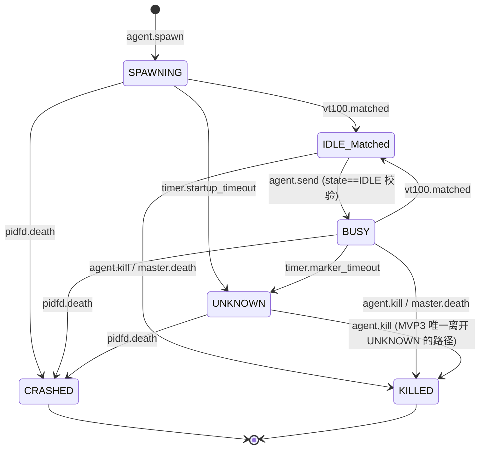

# Kiro Design: MVP 3 (语义感知 / The Retina)

> **文档定位**：本文件是 ccbd-rust MVP 3 阶段的官方 D (Design) 规格。严格基于 `mvp3-R.md` 定义的边界，为 Codex 的 T 阶段提供无歧义实施蓝图。本阶段为 L2 接入「视觉神经」——通过 VT100 终端模拟器 + Fast/Slow 双轨匹配算法，实现对 Agent prompt 的自动捕获，把状态机从被动猜测升级为主动感知。

---

## 1. 状态机 Delta

| 状态 | 进入条件 | 本阶段行为 |
|---|---|---|
| `SPAWNING` | `agent.spawn` 拉起进程 | 等待 vt100 首次匹配 prompt；`agent.send` 拒绝 |
| `IDLE(sub_state='Matched')` | vt100 在底部 5 行（或全屏 slow path）匹配到 prompt 正则 | 接受 `agent.send` |
| `BUSY` | `agent.send` 投递成功 | MarkerTimer 5s 启动，每次 PTY 输出后 reset |
| `UNKNOWN` (stub) | MarkerTimer 超时 | MVP3 视为事实终态，仅允许 `agent.kill` 进 KILLED |

### 1.1 状态转移图



### 1.2 CAS 协议（state + state_version 双校验）

所有 vt100/timer 触发的状态写都必须 CAS 校验 state 集合 + state_version 双重条件：

```sql
-- 实施期推荐顺序：
-- 1) SELECT state, state_version FROM agents WHERE id = ? (一次读)
-- 2) 内存检查 state ∈ {'SPAWNING','BUSY'} (期望状态)
-- 3) UPDATE 携带读到的 state_version
UPDATE agents
SET state = 'IDLE', sub_state = 'Matched',
    state_version = state_version + 1, updated_at = unixepoch()
WHERE id = ? AND state IN ('SPAWNING', 'BUSY')
  AND state_version = ?
```

CAS 排除集（`state IN ('SPAWNING','BUSY')`）+ `state_version` 双门防止：
- agent.kill 已抢先转 KILLED 时 vt100 触发不会覆盖（state 不匹配）；
- pidfd 已转 CRASHED 时不会回流（state 不匹配）；
- 并发的 vt100 触发与 timer 超时同时 fire 时只有一个生效（state_version 错位 → changes==0）。

CAS 失败（changes==0）时**不**写 state_change 事件，但要 log 一行 trace 表明触发被吞掉。

### 1.3 agent.send 状态校验（**新增校验，但保留 MVP1 幂等性**）

agent.send 实施顺序必须**先**做幂等检查、**再**做 state 校验，避免破坏 MVP1 既有 R-IDEMPOTENCY-1：

```text
1. 查询是否存在 (agent_id, request_id) 的既有 command_received 事件
   - 已存在且 status='SENT' or 'PENDING' → 走 MVP1 幂等返回（{state: <当前 agent state>, seq_id: <既有>}）
                                            注：BUSY 期间用同 request_id 重发也按既有路径返回，state 字段就是 BUSY，调用方据此判断
   - 已存在且 status='FAILED' → 返回 PTY_IO_ERROR（沿用 MVP1 行为）
2. (request_id 是新的 / 没有 request_id) 才做 state 预检
   - SELECT state FROM agents WHERE id = ?
   - state ≠ 'IDLE' → 返回 AGENT_WRONG_STATE { current_state }
3. 走 MVP1 既有 PENDING → PTY → SENT/FAILED 状态机
```

这样 MVP1 的幂等重试在 BUSY 期间仍然返回 BUSY 状态（caller 据此判断"已投递在跑"），而真正的"新指令但 agent 还在跑"才被 AGENT_WRONG_STATE 拒。

---

## 2. Schema Delta

**新增 `agents.sub_state` 字段**（MVP1 spec 列了但 schema.rs 实际未落，MVP3 落实）。不新增其它表。

### 2.1 DDL 增量

```sql
ALTER TABLE agents ADD COLUMN sub_state TEXT;
```

`src/db/schema.rs` 的 CREATE TABLE 模板与 `Agent` struct 都同步加 `sub_state: Option<String>` 字段。

### 2.2 迁移策略

- 开发期（ccbd-rust 仍是 pre-1.0、用 dev_state 临时数据库）：在 `db::init` 函数里加一个 best-effort `ALTER TABLE agents ADD COLUMN sub_state TEXT` 包在 `if let Err(e) = ...` 里——已存在字段时 SQLite 抛 duplicate column error，吞掉即可（不抛 panic）。
- 直接重建 dev_state 数据库（删 `target/dev_state/ccbd.sqlite`）也是合法路径——MVP3 阶段我们没有持久化数据要保留。
- 生产路径（XDG `~/.local/state/ccbd/`）现阶段没用户使用，先无 schema_version 表也行。

### 2.3 字段写入路径

- **`agents.sub_state`**：vt100 命中时同事务 UPDATE 为 `'Matched'`；其它路径不写入（保持 NULL）。
- **`agents.error_code`**：UNKNOWN 路径写入 `STARTUP_MARKER_TIMEOUT` 或 `PTY_MARKER_TIMEOUT`。

evidence 表仍 Deferred MVP4，本阶段所有代码路径**禁止** INSERT 该表。

---

## 3. RPC 契约 Delta

### 3.1 `agent.spawn` 返回值演进

* **变更**：返回值由 MVP2 的 `{state: "IDLE", pid}` 改为 `{state: "SPAWNING", pid}`。
* **设计抉择**：vt100 接入后 spawn 成功仅意味着进程拉起，不意味业务就绪。返回 IDLE 会诱导 L3 立即发送指令但 DB 实为 SPAWNING，触发 `AGENT_WRONG_STATE` 拒绝——这是协议歧义。返回 SPAWNING 让 L3 调用方主动通过 `agent.read` 等 vt100 触发的 `state_change to=IDLE` 事件后再投递。这是有意识的 breaking change，但 ccbd-rust 仍处于 pre-1.0 阶段，所有 caller 由我们自己维护，可接受。

### 3.2 `agent.send` 状态校验

非 IDLE 时返回：

```json
{
  "code": -32000,
  "message": "Agent is not in IDLE state",
  "data": { "error_code": "AGENT_WRONG_STATE", "current_state": "BUSY" }
}
```

### 3.3 错误码新增

| 错误码 | 触发场景 |
|---|---|
| `AGENT_WRONG_STATE` | agent.send 时状态非 IDLE |
| `STARTUP_MARKER_TIMEOUT` | SPAWNING 超时 10s 没 prompt 出现 |
| `PTY_MARKER_TIMEOUT` | BUSY 超时 5s 没新 prompt 出现 |

---

## 4. VT100 + Marker 算法（核心）

### 4.1 屏幕建模

- 每个 agent 持有独立 `vt100::Parser::new(200, 200, 0)`。
- 所有 PTY chunk 经 `parser.process(&bytes)` 喂入更新内存屏。
- 屏幕状态由 marker 模块独占，不在多线程共享，不需要 Mutex 保护——只在 reader task 内单线程访问。

### 4.2 Fast/Slow 双轨扫描伪代码

```rust
pub enum MatchResult { Matched, NoMatch }

pub struct MarkerMatcher {
    regex: regex::Regex, // r"[\$#>✦]\s*$"
}

impl MarkerMatcher {
    pub fn scan(&self, parser: &vt100::Parser) -> MatchResult {
        let screen = parser.screen();
        let (rows, cols) = screen.size(); // 应为 (200, 200)

        // Fast Path: 底部 5 行
        let start_row = rows.saturating_sub(5);
        let bottom = screen.contents_between(
            (start_row, 0).into(),
            (rows.saturating_sub(1), cols.saturating_sub(1)).into(),
        );
        for line in bottom.lines() {
            if self.regex.is_match(line.trim_end()) {
                return MatchResult::Matched;
            }
        }

        // Slow Path: 全屏（仅 fast 失败时）
        let full = screen.contents();
        for line in full.lines().rev().take(20) { // 最多扫 20 行避免极端 O(n)
            if self.regex.is_match(line.trim_end()) {
                return MatchResult::Matched;
            }
        }

        MatchResult::NoMatch
    }
}
```

注：vt100 crate 0.15 的 `screen.contents_between(...)` API 实际签名以源码为准；如签名不符，fallback 用 `screen.contents()` 拿全屏字符串后取最后 N 行 + 用 `\n` 分割再扫。这是实现期细节，T 阶段允许调整。

### 4.3 Marker 正则

硬编码组合正则：`r"[\$#>✦]\s*$"`——匹配以 `$ `、`# `、`> `、`✦ ` 结尾的行。涵盖 Bash / Zsh / Sh / Gemini CLI / Claude Code / Codex 等典型 prompt。

不做配置化（防偏航第 7 条）。

---

## 5. MarkerTimer 实施

### 5.1 数据结构

```rust
pub struct MarkerTimerHandle {
    reset_tx: tokio::sync::watch::Sender<Instant>,
    cancel_tx: tokio::sync::oneshot::Sender<()>,
}

pub struct MarkerTimerConfig {
    pub startup_timeout: Duration, // 10s
    pub busy_timeout: Duration,    // 5s
}
```

阈值常量在 `src/marker/timer.rs`：

```rust
pub const STARTUP_TIMEOUT: Duration = Duration::from_secs(10);
pub const BUSY_TIMEOUT: Duration = Duration::from_secs(5);
```

### 5.2 timer 协程

```rust
async fn marker_timer_task(
    agent_id: String,
    initial_kind: TimerKind, // Startup or Busy
    mut reset_rx: watch::Receiver<Instant>,
    cancel_rx: oneshot::Receiver<()>,
    db: Arc<Db>,
) {
    let kind = initial_kind;
    let timeout_duration = match kind {
        TimerKind::Startup => STARTUP_TIMEOUT,
        TimerKind::Busy => BUSY_TIMEOUT,
    };
    let reason = match kind {
        TimerKind::Startup => "STARTUP_MARKER_TIMEOUT",
        TimerKind::Busy => "PTY_MARKER_TIMEOUT",
    };

    tokio::select! {
        _ = cancel_rx => return, // 被 marker matched 取消
        _ = async {
            loop {
                let deadline = *reset_rx.borrow_and_update() + timeout_duration;
                let sleep_for = deadline.saturating_duration_since(Instant::now());
                tokio::select! {
                    _ = tokio::time::sleep(sleep_for) => break,
                    _ = reset_rx.changed() => continue, // 收到 reset
                }
            }
        } => {
            // Timeout: 转 UNKNOWN
            let _ = db::queries::mark_agent_unknown(&db, &agent_id, reason);
        }
    }
}
```

### 5.3 与 reader task 协同

- agent.spawn 时启动 `MarkerTimer(kind=Startup)`，handle 存进 `MARKER_TIMER_REGISTRY: HashMap<agent_id, MarkerTimerHandle>`
- reader task 每次 PTY 输出后：调 `marker.scan()`：
  - `Matched` → 调 `db::mark_agent_idle_matched(agent_id)`（CAS 转 IDLE_Matched + state_change reason=MARKER_MATCHED）+ `cancel_tx.send(())` 把 timer 杀掉 + 从 registry remove handle
  - `NoMatch` → `reset_tx.send(Instant::now())` 重置 timer
- agent.send 进 BUSY 时启动新的 `MarkerTimer(kind=Busy)`，注册 handle
- agent.kill / pidfd_death / master cascade 时**必须**清理 `MARKER_TIMER_REGISTRY` 对应 handle，否则 timer 会继续跑并最终对已 KILLED/CRASHED 的 agent 调 `mark_agent_unknown`（CAS 排除会让 changes==0 不出错，但仍是资源泄漏）。具体清理点：
  - `handle_agent_kill`：`mark_agent_killed` 之后、`pidfd_send_sigkill` 之前调 `marker::registry::take(agent_id)` 并 send cancel
  - `monitor::agent_watch_task`：readable 唤醒后、`mark_agent_crashed_with_exit` 之后同上
  - `monitor::master_watch_task` 的 `cascade_kill_session_agents`：内部对每个 agent 处理时一并 take + cancel timer

---

## 6. PTY Reader Task 改造

`src/pty/tasks.rs::spawn_pty_reader_task` 从纯转发器升级为感知决策环：

```rust
pub fn spawn_pty_reader_task(
    agent_id: String,
    reader: Box<dyn Read + Send>,
    db: Arc<Db>,
    // 新增参数：
    parser: vt100::Parser,           // move 进 task
    matcher: Arc<MarkerMatcher>,     // 全局共享 regex
) {
    tokio::task::spawn_blocking(move || {
        let mut parser = parser;
        let mut buf = [0u8; 8192];
        let mut reader = reader;
        loop {
            match reader.read(&mut buf) {
                Ok(0) => break, // EOF
                Ok(n) => {
                    let chunk = &buf[..n];
                    // 1. Record output_chunk (沿用 MVP1 既有 insert_event helper)
                    let payload = serde_json::json!({"text": String::from_utf8_lossy(chunk)}).to_string();
                    let _ = db::queries::with_conn(&db, |conn| {
                        db::queries::insert_event(conn, &agent_id, None, "output_chunk", &payload)
                    });
                    // 2. Feed vt100
                    parser.process(chunk);
                    // 3. Scan
                    match matcher.scan(&parser) {
                        MatchResult::Matched => {
                            let _ = db::queries::mark_agent_idle_matched(&db, &agent_id);
                            // cancel timer
                            if let Some(handle) = marker::registry::take(&agent_id) {
                                let _ = handle.cancel_tx.send(());
                            }
                        }
                        MatchResult::NoMatch => {
                            // reset timer (best-effort)
                            if let Some(handle) = marker::registry::peek(&agent_id) {
                                let _ = handle.reset_tx.send(Instant::now());
                            }
                        }
                    }
                }
                Err(_) => break,
            }
        }
    });
}
```

注：MVP1 既有的 `spawn_pty_reader_task` 参数签名变化属于 breaking change，但所有 caller 都在 `handle_agent_spawn` 一处，T 阶段一并改。

---

## 7. agent.send 状态校验

```rust
pub fn handle_agent_send(...) -> Result<Value, CcbdError> {
    let agent_id = params["agent_id"].as_str().ok_or(IpcInvalidRequest)?;
    let request_id = params["request_id"].as_str();
    let text = params["text"].as_str().ok_or(IpcInvalidRequest)?;

    // 新增：状态预检（MVP3 强校验）
    let current = db::queries::query_agent_state(&db, agent_id)?
        .ok_or(CcbdError::AgentNotFound)?;
    if current.as_str() != "IDLE" {
        return Err(CcbdError::AgentWrongState { current_state: current });
    }

    // 既有 MVP1 PENDING → PTY → SENT/FAILED 状态机不变
    ...
}
```

---

## 8. 模块布局 Delta

```
src/
├── marker/                           // [新增]
│   ├── mod.rs                        // re-export MarkerMatcher / MarkerTimerHandle / registry
│   ├── parser.rs                     // [可选] 仅当有更复杂的 parser 抽象需求；MVP3 简单情况下 vt100::Parser 直接用
│   ├── matcher.rs                    // MarkerMatcher::scan + 正则常量
│   ├── timer.rs                      // MarkerTimerHandle / marker_timer_task / 阈值常量
│   └── registry.rs                   // MARKER_TIMER_REGISTRY: LazyLock<Mutex<HashMap<String, MarkerTimerHandle>>>
├── pty/
│   └── tasks.rs                      // [修改] spawn_pty_reader_task 接 vt100 + matcher
├── rpc/
│   └── handlers.rs                   // [修改] handle_agent_spawn 改返回 SPAWNING + 启动 startup timer
│                                     //         handle_agent_send 加 state 校验 + 启动 busy timer
├── db/
│   └── queries.rs                    // [修改] 新增 query_agent_state / mark_agent_idle_matched / mark_agent_unknown
├── error.rs                          // [修改] 新增 AgentWrongState / StartupMarkerTimeout / PtyMarkerTimeout 变体
├── monitor/                          // [复用 MVP2]
├── sandbox/                          // [复用 MVP2]
└── ...
```

---

## 9. 依赖 Delta

```toml
[dependencies]
# vt100 终端解析器（doy/vt100）
vt100 = "0.15"
# 正则匹配
regex = "1.10"
# tokio 新增 features：time（已有 sync）
tokio = { version = "1.36", features = [
  "rt-multi-thread", "macros", "net", "process", "io-util", "sync", "signal", "time"
] }
```

**不引入** `regex-syntax` / `regex-automata`（regex crate 内部已含）。
**不引入** `vte` 或其他 terminal 库（vt100 一个就够）。
**不引入** scrollback 历史 / 256 色 / Sixel 解码相关 crate（防偏航第 4 条）。
