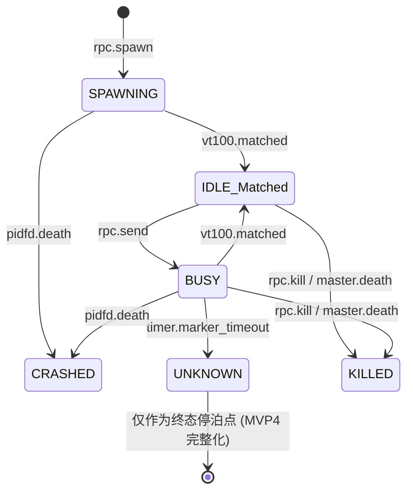

# Kiro Requirements: MVP 3 (语义感知 / The Retina)

> **文档定位**：本文件是 ccbd-rust MVP 3 阶段的官方 R (Requirements) 规格。本阶段把系统从「物理盲态」升级为具备视觉语义解析能力的 L2 操作员，通过接入 VT100 状态机正式打通对 Agent 内部工作进度的独立感知。

---

## 1. 最小可工作验收标准 (Acceptance Criteria)

MVP 3 的核心是验证 `vt100` 解析器与 Fast/Slow 双轨扫描算法对状态机的精准驱动。当且仅当以下场景全部跑通，MVP 3 验收合格：

1. **首次就绪捕获 (SPAWNING → IDLE)**：`agent.spawn` 拉起 bash 后状态先落 `SPAWNING`，PTY reader 把 prompt 字节流（`$ ` / `# `）通过 vt100 解析器画到 200x200 内存屏，底部 5 行匹配到 prompt 后状态自动转 `IDLE`，`sub_state=Matched`，`events` 表写入 `state_change` to=IDLE reason=`MARKER_MATCHED`。
2. **命令执行流转 (IDLE → BUSY → IDLE)**：对 `IDLE` agent 调 `agent.send("sleep 1; echo hello\n")`，立刻转 `BUSY`。约 1 秒后 prompt 重新出现在底部 5 行，状态精准回落 `IDLE` sub_state=Matched，`events` 表新增第二条 `state_change` to=IDLE。
3. **ANSI 转义抗干扰**：发送 `printf '\x1b[2J\x1b[H' && echo done` 这种含清屏 + 光标重定位的命令，vt100 解析器必须正确还原屏幕，最终在底部 5 行识别到 prompt 而不被字节流误导。
4. **MarkerTimer 超时**：发送 `sleep 30\n`（默认 5 秒后无新 prompt 出现），MarkerTimer 触发后状态转 `UNKNOWN`，`events` 表写入 `state_change` to=UNKNOWN reason=`PTY_MARKER_TIMEOUT`。**注意**：本阶段仅激活转移路径，不写 evidence 表（留给 MVP 4）。
5. **PTY 输出重置 Timer**：发送 `for i in 1 2 3 4 5; do sleep 2; echo $i; done`（每 2 秒一次输出，总 10 秒），底部内容持续变化但每次输出都重置 MarkerTimer，**绝对**不能在中途误判 UNKNOWN——直到最后 prompt 重现才转 IDLE。
6. **并发解析隔离**：同时拉起 3 个 bash agent，分别发送高频输出命令，验证各自的 200x200 屏 + MarkerTimer 独立运转互不干扰，无 panic 无内存越界。
7. **特权收紧**：对 `BUSY` 或 `SPAWNING` 状态的 agent 再次调 `agent.send`，必须返回 `AGENT_WRONG_STATE` 错误并拒绝写 PTY，**移除** MVP 1 遗留的「BUSY 下也能 send」特权。

---

## 2. 状态机激活范围 (Delta)

| MVP | 已激活状态 |
|---|---|
| MVP 1 | IDLE / BUSY / CRASHED |
| MVP 2 | + KILLED |
| **MVP 3** | **+ SPAWNING + IDLE(sub_state=Matched) + BUSY→IDLE 自动流转 + MarkerTimer + UNKNOWN（仅 stub，不挂 evidence）** |
| MVP 4 | + UNKNOWN 完整闭环（evidence dump + assert_state + discard_evidence） |

### 2.1 MVP3 状态转移图

### 2.2 MarkerTimer 默认值

- 启动期 SPAWNING 超时：**10 秒**（首个 prompt 在 10s 内没出现 → 转 UNKNOWN reason=`STARTUP_MARKER_TIMEOUT`）
- 命令期 BUSY 超时：**5 秒**（PTY 无新输出且无 marker 命中持续 5s → 转 UNKNOWN reason=`PTY_MARKER_TIMEOUT`）

阈值都设为常量在 `src/marker/timer.rs`（或同等位置），暂不通过 RPC 配置（MVP 4+ 再考虑配置层）。

---

## 3. R-* 需求切割矩阵 (Scope Definitions)

### R-DISPATCH-1: Agent ID 引用稳定性
*   **状态**：🟡 **Partial**
*   维持 MVP 2 现状（单 Daemon 生命周期内稳定，跨重启接管仍 Deferred）。

### R-DISPATCH-2: 显式投递失效通知
*   **状态**：🟢 **In-scope**
*   pidfd 已覆盖物理失效，本阶段 vt100 + MarkerTimer 补齐**业务级**失效通知（command 长时间无响应 → UNKNOWN）。

### R-ISOLATION-1: 物理环境强制隔离
*   **状态**：🟢 **In-scope**
*   维持 MVP 2 既有 bwrap 实现。

### R-RECONCILE-1: 状态唯一事实来源
*   **状态**：🟡 **Partial**
*   vt100 补齐业务事实，但 30s 全量 polling 对账（处理 epoll 事件丢失等极端场景）继续 Deferred。

### R-API-COMPAT-1: 协议破坏性变更约束
*   **状态**：🟢 **In-scope**
*   `agent.send` 增加 state 校验**不破坏**向后兼容（向 BUSY agent 投递本来就是逻辑越权，旧行为是 bug-tolerance 而非 contract）。新增 `AGENT_WRONG_STATE` 错误码也不属于 breaking change。

### R-OBSERVABILITY-1: 状态全量可观测
*   **状态**：🔴 **Deferred**
*   `system.dump` RPC 仍不实现。

### R-RECONNECT-1: 零丢失断线重连
*   **状态**：🟢 **In-scope**
*   维持 MVP 1 + MVP 2 实现。新增的 vt100 触发的 state_change 事件同样按 `since_event_id` 顺序拉取。

### R-IDEMPOTENCY-1: 选填投递幂等性
*   **状态**：🟢 **In-scope**
*   维持 PENDING/SENT 状态机原子插入逻辑。

### R-ERROR-CODES-1: 结构化错误处理
*   **状态**：🟡 **Partial**
*   新增 `PTY_MARKER_TIMEOUT` / `STARTUP_MARKER_TIMEOUT` / `AGENT_WRONG_STATE` 错误码。
*   **Carve-out**：UNKNOWN 完整生命周期相关的 `AGENT_STUCK`、evidence 错误码继续 Deferred。

### R-STATE-FALLBACK-LOOP: 状态识别异常闭环
*   **状态**：🟡 **Partial**
*   实现触发器入口：MarkerTimer + UNKNOWN 状态进入路径 + state_change 事件落库。
*   **Carve-out**：evidence 采集（Step 3）、`agent.assert_state` 兜底（Step 4-5）、规则固化反馈循环（Step 6-7）全部 Deferred 至 MVP 4。

---

## 4. 严格禁止的越界行为 (Anti-goals / 防偏航)

1. **禁止写 `evidence` 表**：MarkerTimer 触发 UNKNOWN 时**只**写 `events.state_change`，不写 evidence 表的任何 row。即使 evidence 表 schema 已存在，本阶段所有代码路径都不应包含对它的 INSERT 语句。
2. **禁止实现逃生舱 RPC**：`agent.assert_state` / `agent.discard_evidence` 全部 Deferred。router.rs 不注册这两个方法，handlers.rs 不实现。L3 在 MVP 3 阶段对 UNKNOWN 状态只能通过 `agent.kill` 终结。
3. **禁止 `session.subscribe` 推送 + 30s polling**：长连接通知与全量 polling 对账继续 Deferred。L3 仍通过 `agent.read since=N` 轮询感知 vt100 触发的 state_change。
4. **禁止过度设计 VT100 解析**：用 `vt100 = "0.15"`（doy/vt100 crate）或同级轻量库。**禁止**实现 scrollback 历史 / 鼠标事件 / Sixel / 256 色背景属性 / 滚动区域。屏幕尺寸固定 200x200，只做字符提取。匹配范围**严格**遵守"底部 5 行优先"——只在底部 5 行做正则匹配，全屏慢路径仅在 5 行没命中时才扫一次。
5. **禁止重构 sandbox / monitor 既有模块**：MVP 2 落地的 bwrap 参数构造、systemd-run 包装、pidfd 事件循环已封板。本阶段只**新增** `src/marker/` 模块 + 改 `src/pty/tasks.rs` 的 reader task 让它驱动 vt100 + 改 `handle_agent_send` 加 state 校验。**不许**动 `sandbox/*` `monitor/*` 任一文件。
6. **跨平台兼容仍 Deferred**：macOS / Windows 仍允许 cargo build 通过但 runtime panic 提示 "MVP3 requires Linux"。`HealthProvider` trait 抽象推迟。
7. **禁止把 marker 模式做成可热加载配置**：MVP 3 的 prompt 正则**硬编码**在 src/marker 里（如 `r"[$#>] $"` 末尾匹配），不做 provider profile 配置项。配置化推迟到 MVP 4 闭环里再讨论。
