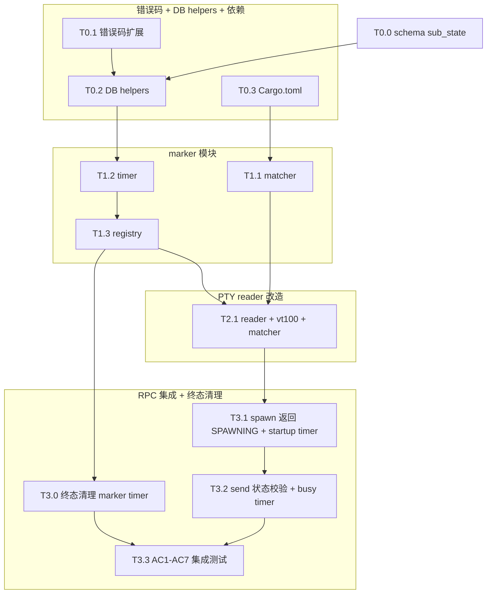

# Kiro Tasks: MVP 3 (语义感知)

> **文档定位**：MVP 3 由 Codex 逐项实施的原子任务清单。每个任务必须独立编译、独立验证。严格按 mvp3-D.md 决策落地，禁止自创命名或偏离决策。

---

## 1. 任务依赖与执行图谱



---

## 2. 原子任务定义

### T0.0: Schema delta - agents.sub_state

* **依赖前置**: 无
* **设计输入**: `mvp3-D.md §2`
* **输出产物**: `src/db/schema.rs`, `src/db/mod.rs`
* **执行步骤**:
  1. `src/db/schema.rs` 的 `CREATE TABLE agents` SQL 模板末尾在 `updated_at` 之前新增列：`sub_state TEXT,` （注意 SQLite STRICT 模式允许 NULL）。
  2. `Agent` struct 加 `pub sub_state: Option<String>` 字段，更新 `from_row` 等映射。
  3. `db::init` / migration 路径：CREATE TABLE 失败（因表已存在）回退到 `ALTER TABLE agents ADD COLUMN sub_state TEXT;` 包在 `if let Err(e) = ...` 里——若 SQLite 抛 `duplicate column name: sub_state`（SQLITE_ERROR），吞掉继续；其它 SQLITE_ERROR 抛上去。
  4. 既有 query 函数（如 `insert_agent` / `query_agent`）保持向后兼容——sub_state 默认 NULL，旧 caller 无感知。
* **独立验收**: 单测 1）新建 tempfile DB 跑 init，断言 agents 表 PRAGMA table_info 含 sub_state；2）已存在 schema 老 DB（手动 CREATE TABLE 不带 sub_state） + 跑一次 init，断言 ALTER 自动补字段 + 不抛 panic；3）insert_agent + query_agent 后 sub_state 字段是 None。

### T0.1: 错误码扩展

* **依赖前置**: 无
* **设计输入**: `mvp3-D.md §3.3`
* **输出产物**: `src/error.rs`
* **执行步骤**:
  1. 在 `CcbdError` 增加 `AgentWrongState { current_state: String }`、`StartupMarkerTimeout { details: String }`、`PtyMarkerTimeout { details: String }`。
  2. `to_rpc_error()` 映射 `"AGENT_WRONG_STATE"` / `"STARTUP_MARKER_TIMEOUT"` / `"PTY_MARKER_TIMEOUT"`。
  3. `data.current_state` 或 `data.details` 必须透传。
  4. 增加 3 条 round-trip 单测。
* **独立验收**: `cargo test error::tests --quiet` 通过，JSON error data 含稳定字段。

### T0.2: DB helpers (含 state_version CAS)

* **依赖前置**: T0.0, T0.1
* **设计输入**: `mvp3-D.md §1.2 / §2.3`
* **输出产物**: `src/db/queries.rs`
* **执行步骤**:
  1. 新增 `query_agent_state(db, agent_id) -> Result<Option<(String, i64)>, CcbdError>`，返回 `(state, state_version)` 元组——后续 helper 都基于这个元组做 CAS。或者拆成 `query_agent_state(db, agent_id) -> Option<String>` 与 `query_agent_state_and_version(db, agent_id) -> Option<(String, i64)>` 两个，让 handle_agent_send 用前者、marker 路径用后者。**建议**统一用后者，前者通过 `.map(|(s, _)| s)` 派生。
  2. 新增 `mark_agent_idle_matched(db, agent_id)` 事务内：
     - SELECT state,state_version → 内存检查 state ∈ {'SPAWNING','BUSY'}（不在则直接返回 changes=0 不抛错）
     - `UPDATE agents SET state='IDLE', sub_state='Matched', state_version=state_version+1, updated_at=unixepoch() WHERE id=? AND state IN ('SPAWNING','BUSY') AND state_version=?`
     - changes==1 时同事务 `INSERT INTO events ... 'state_change'` payload `{"to":"IDLE","sub_state":"Matched","reason":"MARKER_MATCHED"}`。
     - changes==0：tracing::trace! log "marker match swallowed: agent already in terminal state"，不抛错。
  3. 新增 `mark_agent_unknown(db, agent_id, reason)` 事务内：同样的双重 CAS（state ∈ {'SPAWNING','BUSY'} + state_version 匹配）→ 转 `UNKNOWN`，同事务 `UPDATE agents SET error_code=?` + `INSERT events.state_change` payload `{"to":"UNKNOWN","reason":<reason>}`。
  4. 不改既有 helper 签名。
* **独立验收**: 单测覆盖 a) SPAWNING→IDLE 写 state_change + sub_state='Matched'；b) BUSY→IDLE 同上；c) BUSY→UNKNOWN 写 error_code + state_change；d) CRASHED/KILLED 状态调 mark_agent_idle_matched 时 changes==0 不抛错；e) state_version 不匹配（手动构造）时 changes==0。

### T0.3: Cargo.toml

* **依赖前置**: 无
* **设计输入**: `mvp3-D.md §9`
* **输出产物**: `Cargo.toml`
* **执行步骤**:
  1. 加 `vt100 = "0.15"`。
  2. 加 `regex = "1.10"`。
  3. `tokio` features 追加 `"time"`。
  4. 不引入其它依赖。
* **独立验收**: `cargo build --quiet` 通过，无 dependency warning。

---

### T1.1: marker::matcher

* **依赖前置**: T0.3
* **设计输入**: `mvp3-D.md §4`
* **输出产物**: `src/marker/mod.rs`, `src/marker/matcher.rs`
* **执行步骤**:
  1. 新建 `MarkerMatcher { prompt_regex: regex::Regex }`，导出在 `mod.rs`。
  2. `MatchResult::{Matched, NoMatch}`。
  3. 默认正则 `r"[\$#>✦]\s*$"`（用 `Regex::new(...)`）。
  4. `scan(&vt100::Parser) -> MatchResult`：fast path 扫屏幕底部 5 行；未命中时 slow path 扫全屏倒数 20 行 fallback。
  5. **必须 line-by-line 扫描**——`screen.contents()` 返回的字符串含 `\n`，要 `.lines()` 切分后逐行 trim_end + regex.is_match，不能对整屏字符串只跑一次正则（否则 `$` 锚点会只匹整屏末尾）。
  6. vt100 0.15 的 `screen.contents_between` 若签名不符（实际是 `(start_pos, end_pos) -> String`），fallback 到 `screen.contents()` 整屏 + `.lines().rev().take(5)`。
* **独立验收**: 单测覆盖 `$ `、`# `、`> `、`✦ `、ANSI 彩色 prompt（vt100 解析后会被剥色）后仍命中、纯 echo 输出不命中。

### T1.2: marker::timer

* **依赖前置**: T0.2
* **设计输入**: `mvp3-D.md §5`
* **输出产物**: `src/marker/timer.rs`
* **执行步骤**:
  1. 定义 `pub const STARTUP_TIMEOUT: Duration = Duration::from_secs(10);` 与 `pub const BUSY_TIMEOUT: Duration = Duration::from_secs(5);`。
  2. 定义 `pub enum TimerKind { Startup, Busy }`。
  3. 定义 `pub struct MarkerTimerHandle { reset_tx: watch::Sender<Instant>, cancel_tx: oneshot::Sender<()> }`。
  4. `pub fn spawn_marker_timer_task(agent_id: String, kind: TimerKind, db: Arc<Db>) -> MarkerTimerHandle`：内部 `tokio::spawn`。tokio::select! 监听 reset / cancel / sleep；超时调 `mark_agent_unknown`。
  5. Startup timeout 调用 reason=`"STARTUP_MARKER_TIMEOUT"`；Busy timeout reason=`"PTY_MARKER_TIMEOUT"`。
* **独立验收**: 用短 timeout 常量（test-only override 或直接 patch test 内）测试 reset 延长、cancel 不落库、超时落 UNKNOWN。

### T1.3: marker::registry

* **依赖前置**: T1.2
* **设计输入**: `mvp3-D.md §5.3`
* **输出产物**: `src/marker/registry.rs`
* **执行步骤**:
  1. `pub static MARKER_TIMER_REGISTRY: LazyLock<Arc<Mutex<HashMap<String, MarkerTimerHandle>>>>`。
  2. `pub fn register(key: String, handle: MarkerTimerHandle)`：替换旧 handle 前先取出旧的并 send cancel（旧 timer 任务收到 cancel 后正常退出）。
  3. `pub fn take(key: &str) -> Option<MarkerTimerHandle>` 移除并返回。
  4. `pub fn reset(key: &str)`：闭包内 `if let Some(h) = map.get(key) { let _ = h.reset_tx.send(Instant::now()); }` 持锁短暂访问 reset_tx 后立即释放。**禁止**返回 `&MarkerTimerHandle`（会在 lock 之外悬空）。
  5. `pub fn cancel_all_for_session(session_id: &str)` 这种 helper 不需要——清理由 agent.kill / pidfd_death 路径单点驱动。
* **独立验收**: 单测覆盖 register/replace/take/reset，replace 时旧 timer 收到 cancel。

---

### T2.1: PTY reader 改造

* **依赖前置**: T1.1, T1.3
* **设计输入**: `mvp3-D.md §6`
* **输出产物**: `src/pty/tasks.rs`
* **执行步骤**:
  1. `spawn_pty_reader_task` 参数扩展：接收 `parser: vt100::Parser` 与 `matcher: Arc<MarkerMatcher>`。
  2. 循环顺序：read chunk → 用 MVP1 既有的 `db::queries::insert_event(conn, agent_id, None, "output_chunk", &payload)`（payload 是 `serde_json::json!({"text": String::from_utf8_lossy(chunk)}).to_string()`）→ `parser.process(&bytes)` → `matcher.scan(&parser)`。**不要**新增 insert_output_chunk helper——直接用既有 insert_event。
  3. 命中 marker：调用 `db::queries::mark_agent_idle_matched(&db, &agent_id)`；`marker::registry::take(&agent_id)` 拿出 handle 并 send cancel；继续循环（agent 后续可能再进 BUSY，新 timer 由 send handler 启动）。
  4. 未命中：`marker::registry::reset(&agent_id)`。
  5. 保持 `tokio::task::spawn_blocking`，**不要**在阻塞 reader 中 `.await`。`watch::Sender::send` 与 `oneshot::Sender::send` 都是同步 API 不需 await，可在 spawn_blocking 内安全调用。
  6. EOF / read 错误 → 退出 task（pidfd watch 会单独处理 CRASHED 状态，不需要 reader 写）。
* **独立验收**: 单测用 mock reader 灌入 `echo\n$ ` 输入，断言 output_chunk 写入、agent state 转 IDLE sub_state=Matched、timer registry 该 key 已被 take。

---

### T3.0: 终态路径清理 marker timer registry

* **依赖前置**: T1.3
* **设计输入**: `mvp3-D.md §5.3`
* **输出产物**: `src/rpc/handlers.rs`（handle_agent_kill）, `src/monitor/agent_watch.rs`, `src/monitor/master_watch.rs` / `src/db/queries.rs::cascade_kill_session_agents`
* **执行步骤**:
  1. **handle_agent_kill**：在调 `mark_agent_killed` 之后、`pidfd_send_sigkill` 之前，新增：
     ```rust
     if let Some(handle) = marker::registry::take(agent_id) {
         let _ = handle.cancel_tx.send(());
     }
     ```
  2. **monitor::agent_watch_task**：readable 唤醒后、`mark_agent_crashed_with_exit` 之后，同上 take + cancel 逻辑。
  3. **cascade_kill_session_agents**：内部对每个 agent 处理时（mark_agent_killed 之后），同步 take + cancel 该 agent 的 marker timer handle。
  4. **handle_session_create master pidfd registration**：master pidfd 死亡触发 cascade 时，cascade_kill_session_agents 已覆盖 agent timer 清理。master 自己**不**注册 marker timer（marker 只跟 agent 关联），不需要额外清理。
  5. 注意：marker::registry::take 的 Drop 不依赖 timer task 实际收到 cancel——MarkerTimerHandle 的 oneshot::Sender 被 drop 后接收端会收到 RecvError，timer task 退出。两条路径殊途同归。所以 `let _ = handle.cancel_tx.send(())` 失败也无妨。
* **独立验收**: 单测覆盖 a) handle_agent_kill 后 marker registry 该 agent_id 不在；b) agent_watch_task 模拟 child 退出后 marker registry 清理；c) cascade_kill 后 session 下所有 agent 的 marker registry 都清理。

### T3.1: handle_agent_spawn 改造

* **依赖前置**: T2.1
* **设计输入**: `mvp3-D.md §3.1`
* **输出产物**: `src/rpc/handlers.rs`
* **执行步骤**:
  1. `agent.spawn` DB INSERT 时 state 由 `'IDLE'` 改为 `'SPAWNING'`。
  2. 返回值由 `{"state":"IDLE","pid":pid}` 改为 `{"state":"SPAWNING","pid":pid}`。
  3. spawn 成功后构造 `let parser = vt100::Parser::new(200, 200, 0);` 与 `let matcher = Arc::new(MarkerMatcher::default());`，move/clone 给 reader task。
  4. 启动 Startup timer：`let handle = spawn_marker_timer_task(agent_id.clone(), TimerKind::Startup, db.clone());` 然后 `marker::registry::register(agent_id.clone(), handle);`。
  5. 失败回滚（既有 spawn-first 顺序的物理资源回滚）保持不变；新加：失败时如果 timer 已注册需 `marker::registry::take(&agent_id)` cancel 掉。
* **独立验收**: handler 单测断言 spawn 返回 `{state:"SPAWNING"}`，DB agents.state='SPAWNING'；mock 一段含 prompt 的 PTY 输出后轮询 100ms 内 DB state→IDLE sub_state=Matched。

### T3.2: handle_agent_send 改造（先幂等检查 → 再 state 预检）

* **依赖前置**: T3.1
* **设计输入**: `mvp3-D.md §1.3 / §3.2`
* **输出产物**: `src/rpc/handlers.rs`
* **执行步骤**（顺序极重要，错位会破坏 R-IDEMPOTENCY-1）：
  1. **第一步：幂等检查**。如果 params 含 `request_id`，调既有 `query_event_by_request_id(conn, agent_id, request_id)`：
     - 已有 row 且 `payload.status` 为 `"SENT"` 或 `"PENDING"` → 走 MVP1 既有幂等返回路径（返回 `{state: <当前 agent state>, seq_id: existing_seq_id}`，**state 字段是当前 DB 实际值**——可能是 BUSY，也可能 vt100 已转回 IDLE）
     - 已有 row 且 `payload.status == "FAILED"` → 返回 `PtyIoError`（沿用 MVP1）
     - **关键**：BUSY 期间用同 request_id 重发会幂等返回 BUSY，**不会**被 step 2 的 state 校验拒
  2. **第二步：新请求 / 没有 request_id 才做 state 校验**。`let s = query_agent_state(&db, agent_id)?.ok_or(AgentNotFound)?;` 取 `(state, _)` 元组的 state，`s != "IDLE"` → 返回 `Err(CcbdError::AgentWrongState { current_state: s })`，**不**写 events 表也**不**写 PTY。
  3. **第三步：state == "IDLE" 通过校验**进入 MVP1 既有 PENDING→PTY→SENT/FAILED 状态机。
  4. **第四步：转 BUSY 成功之后**启动 Busy timer：`let handle = spawn_marker_timer_task(agent_id.clone(), TimerKind::Busy, db.clone()); marker::registry::register(agent_id.clone(), handle);`。register 内部如发现旧 handle 会 cancel 它。
  5. 转 FAILED 时**不**启动 timer。
* **独立验收**: 单测覆盖：
  - a) IDLE + 新 request_id → send 成功 + state 转 BUSY + timer 已注册
  - b) BUSY + 新 request_id → AGENT_WRONG_STATE current_state="BUSY" + 不污染 events 表
  - c) BUSY + 同 request_id 重发（IDLE 时用过且 SENT）→ 幂等返回 {state:"BUSY", seq_id: <既有>}
  - d) SPAWNING + 新 request_id → AGENT_WRONG_STATE current_state="SPAWNING"
  - e) UNKNOWN + 新 request_id → AGENT_WRONG_STATE current_state="UNKNOWN"

### T3.3: 集成测试 AC1-AC7

* **依赖前置**: T3.2
* **设计输入**: `mvp3-R.md §1`
* **输出产物**: `tests/mvp3_acceptance.rs`
* **执行步骤**:
  1. 每条 AC 一个 `#[tokio::test]` 函数。可用 unsafe bypass 模式（`CCBD_UNSAFE_NO_SANDBOX=1`）跑真 bash agent，避免 bwrap 依赖。
  2. **AC1**：spawn bash → 轮询 1s 内观察 events.state_change to=IDLE reason=MARKER_MATCHED + agents.state='IDLE' sub_state='Matched'。
  3. **AC2**：AC1 完成后 send `echo ok\n` → 立刻 BUSY → 1s 内观察第二次 state_change to=IDLE reason=MARKER_MATCHED。
  4. **AC3**：send `printf '\x1b[2J\x1b[H' && echo done\n` → 1s 内 IDLE。
  5. **AC4** (`#[ignore]`)：send `sleep 30\n` → 等 6s → state UNKNOWN reason=PTY_MARKER_TIMEOUT。CI 显式 `cargo test --test mvp3_acceptance ac4_busy_timeout -- --ignored --include-ignored` 跑。
  6. **AC5**：send `for i in 1 2 3 4 5; do sleep 2; echo $i; done\n` → 等 12s → state 最终 IDLE（中途**不**该转 UNKNOWN，因为每 2s 输出 reset timer）。可标 `#[ignore]` 或限于 CI。
  7. **AC6**：并发 3 个 spawn agent → 各自轮询 IDLE → 互不干扰（单个失败时其它正常）。
  8. **AC7**：spawn bash → 等 IDLE → send `sleep 5\n` → 立刻第二次 send → 第二次返回 `AGENT_WRONG_STATE { current_state: "BUSY" }`，且 events 表只有第一次 PENDING/SENT 两条记录，无第二次污染。
* **独立验收**: `cargo test --test mvp3_acceptance --quiet` 全过；ignored 显式跑也过。

---

## 3. AC 追溯表

| mvp3-R §1 AC | 最后 Task | 验收方法 |
|---|---|---|
| AC1 首次就绪 marker | T3.3 | step 2：spawn 后轮询到 state_change MARKER_MATCHED |
| AC2 IDLE→BUSY→IDLE | T3.3 | step 3：send echo 后看二次匹配 |
| AC3 ANSI 抗干扰 | T3.3 | step 4：彩色/清屏 prompt 仍匹配 |
| AC4 Marker timeout | T3.3 | step 5：sleep 30 触发 PTY_MARKER_TIMEOUT (ignored) |
| AC5 timer reset | T3.3 | step 6：周期输出不提前 UNKNOWN |
| AC6 并发多 agent | T3.3 | step 7：3 agent 独立转 IDLE |
| AC7 BUSY 下 send 拒绝 | T3.3 | step 8：AGENT_WRONG_STATE |

---

## 4. commit 节奏

1. **Commit 1: G0 + G1 (schema + errors + DB helpers + marker module)**
   * 范围：T0.0 + T0.1 + T0.2 + T0.3 + T1.1 + T1.2 + T1.3。
   * 代码量：约 400-550 行。
   * 验收：`cargo build --quiet` + 新增 marker/timer/db 单测全过 + MVP1+MVP2 既有 60 单测无回归（schema 加 sub_state 但旧 caller 无感知）。

2. **Commit 2: G2 + T3.0 + T3.1 + T3.2 (PTY reader + 终态清理 + spawn/send 改造)**
   * 范围：T2.1 + T3.0 + T3.1 + T3.2。注意更新 MVP2 acceptance 受 SPAWNING breaking change 影响的预期。
   * 代码量：约 350-500 行。
   * 验收：全量 `cargo test`（修订 MVP2 acceptance 中所有 `agent.spawn` 后期望 `state="IDLE"` 的断言为期望 `state="SPAWNING"` + 等 vt100 转 IDLE）。

3. **Commit 3: T3.3 (mvp3 集成测试)**
   * 范围：tests/mvp3_acceptance.rs。
   * 代码量：约 250-400 行。
   * 验收：`cargo test --test mvp3_acceptance --quiet`（AC4/AC5 部分 #[ignore]）+ 显式 `--ignored` 跑也通过。

---

## 5. 风险点提示

1. **vt100 0.15 API 差异**：`screen.contents_between` 签名可能与预期不同（参数是 `(usize, usize, usize, usize)` 或 `(Position, Position)`）。实施时 fallback 到 `screen.contents()` + 手动 split lines。
2. **registry reset 死锁**：reader task 在 `spawn_blocking` 内运行，`reset` 持锁时间必须极短，**禁止**在锁内做 DB 调用或 I/O。
3. **SPAWNING breaking change**：`agent.spawn` 返回从 `IDLE` 改 `SPAWNING`，**MVP2 acceptance 测试**和 MVP2 既有 handler 单测都要更新预期（搜 `"state":"IDLE"` + `agent.spawn` 调用点）。
4. **同步/异步边界**：reader 是阻塞线程，timer 是 tokio task。`watch::Sender::send` / `oneshot::Sender::send` 都是同步 API 跨边界发送 reset/cancel 安全。**禁止**在 reader 内 `.await`。
5. **vt100 scrollback 不保留**：200x200 parser 对极大 chunk（>200 行）会丢旧屏幕内容。MVP3 接受这个代价（A-3 决议）；如果未来发现 prompt 因屏幕滚走丢匹配，再讨论扩屏或 scrollback。
6. **regex 多行误判**：`contents()` 含 `\n`，必须 line-by-line 扫描后逐行 `is_match`，否则 `$` 锚点只匹整屏末尾。T1.1 step 5 已强制。
7. **timeout 与 kill/crash 竞态**：timer 超时前 agent 可能已 CRASHED/KILLED；DB helper CAS WHERE 子句必须只覆盖 `state IN ('SPAWNING','BUSY')`，确保已转终态的 agent 不被错误转 UNKNOWN（T0.2 step 3 已强制）。
8. **幂等 send 与状态校验顺序**：MVP1 既有 request_id 幂等返回（PENDING/SENT 时返回原 seq_id）的语义，**必须在 state 校验之前**走，否则 BUSY 期间用同 request_id 重发会被 AGENT_WRONG_STATE 拒绝（破坏 R-IDEMPOTENCY-1）。T3.2 已修订为：第一步幂等检查 → 第二步 state 校验。

9. **agents.sub_state schema 缺失**：MVP1+MVP2 schema.rs 实际**没有** sub_state 字段（设计文档列了但未落地）。T0.0 显式补：CREATE TABLE 加列 + Agent struct 加字段 + ALTER TABLE 兼容旧 DB。如果遗漏会 SQLite 抛 "no such column: sub_state" runtime 错。

10. **终态路径 marker timer 泄漏**：agent.kill / pidfd_death / cascade 必须 take + cancel marker timer，否则 timer 继续跑且最终对已 KILLED/CRASHED agent 调 mark_agent_unknown（CAS 排除会让 changes==0 不出错，但 task / fd 资源仍占着）。T3.0 显式覆盖 4 个清理点。
