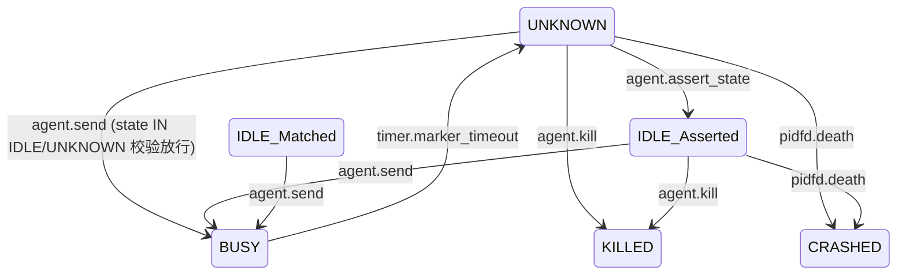

# Kiro Requirements: MVP 4 (反思闭环 / The Feedback)

> **文档定位**：本文件是 ccbd-rust 最后一个基础 MVP 阶段（MVP 4）的官方 R (Requirements) 规格。本阶段彻底打通议题 1b 确立的 `R-STATE-FALLBACK-LOOP`，从底层解析失效 → MarkerTimer 触发 UNKNOWN → evidence 现场采集 → L3 逃生舱介入（assert_state / discard_evidence / send 重试）→ 状态恢复，构建完整韧性闭环。

---

## 1. 最小可工作验收标准 (Acceptance Criteria)

MVP 4 验收必须全部通过：

1. **Evidence 事务写入**：发送致使 Agent 长时间静默的命令（如 `sleep 30`），`MarkerTimer` 超时（5s）后**单个 SQLite 事务**完成：a) `agents.state='UNKNOWN'` + `agents.error_code='PTY_MARKER_TIMEOUT'`；b) `events` 写入 `state_change` to=UNKNOWN reason=PTY_MARKER_TIMEOUT；c) `evidence` 表插入新 row，`pane_bytes` BLOB 含 vt100 屏幕 200x200 文字快照（UTF-8 序列化），`failed_rules` JSON 数组含当时尝试的 marker 正则；d) `evidence.event_seq_id` 外键指向同事务刚插入的 state_change 事件。
2. **L3 强制断言恢复 (`agent.assert_state`)**：`UNKNOWN` 状态下调 `agent.assert_state {agent_id, state:"IDLE", evidence_id}`，CAS 校验后 `agents.state='IDLE'` `sub_state='Asserted'`，`evidence.status='REVIEWED'` `evidence.l3_asserted_state='IDLE'`，`events` 写入 `state_change` reason=`L3_ASSERTED`。
3. **安全丢弃 (`agent.discard_evidence`)**：调 `agent.discard_evidence {evidence_id}`，断言 `evidence.status='DISCARDED'`，agents 表与物理进程**不**受影响。该 RPC 不要求 agent 处于特定状态（敏感快照随时可丢弃）。
4. **重试接管 (UNKNOWN → BUSY)**：`UNKNOWN` 状态下用**新** `request_id` 调 `agent.send`（携带补救命令如 `\n` 或 `echo recover`）。state 预检从 mvp3 的「state==IDLE」放宽为「state IN ('IDLE','UNKNOWN')」，CAS 转 BUSY 后走标准 PENDING→PTY→SENT 路径。**保留 mvp3 R-IDEMPOTENCY-1 的「先幂等检查 → 再 state 校验」顺序**——同 request_id 重发仍幂等返回原 seq_id。
5. **Evidence 防覆盖密封 (Seal)**：`UNKNOWN` 状态下若 MarkerTimer 再次触发（极端场景），新 evidence 写入前必须把该 agent 上一条 `evidence.status='PENDING'` 的 row 改为 `'SEALED'`，避免诊断线索丢失。`SEALED` 是 mvp4 新加的合法 status 值（PENDING / REVIEWED / DISCARDED / SEALED 四态）。
6. **干预边界硬校验**：a) `agent.assert_state` 用不存在的 `evidence_id` → `DB_EVIDENCE_NOT_FOUND`；b) `evidence_id` 存在但 `evidence.agent_id` 与 RPC 入参 `agent_id` 不匹配 → `DB_EVIDENCE_NOT_FOUND`（防跨 agent 越权）；c) 非 `UNKNOWN` 状态调 `agent.assert_state` → `AGENT_WRONG_STATE`；d) `agent.assert_state` 入参 `state` 字段值非 `"IDLE"` → `IPC_INVALID_REQUEST`（mvp4 暂不允许断言到其它状态）。
7. **R-STATE-FALLBACK-LOOP 全闭环演示**：脚本流程贯通——agent.spawn → vt100 marker 转 IDLE → agent.send `sleep 30` → 5s 后 MarkerTimer → UNKNOWN + evidence 现场 → L3 拿 `agent.read since=N` 看到 state_change events → L3 调 `agent.assert_state evidence_id=X state=IDLE` → state IDLE_Asserted → 后续 `agent.send echo done` 正常进 BUSY → vt100 命中转 IDLE。

---

## 2. 状态机激活范围 (Delta)

MVP4 不增加顶级状态值，但**完整化** UNKNOWN 与 IDLE 的 sub_state：

- `UNKNOWN`：从 mvp3 的「事实终态 stub」升级为「中间态」，可流出至 IDLE_Asserted（assert_state）/ BUSY（send 重试）/ KILLED（kill）/ CRASHED（pidfd）。
- `IDLE(sub_state='Asserted')`：mvp4 新激活的子状态，与 mvp3 的 `Matched` 区分语义——前者是 L3 强制兜底，后者是 vt100 自然命中。
- `evidence.status`：从 mvp1 spec 的 `PENDING/REVIEWED/DISCARDED` 三态扩为 `PENDING/REVIEWED/DISCARDED/SEALED` 四态。

### 2.1 mvp4 状态转移图

---

## 3. R-* 需求切割矩阵 (Scope Definitions)

### R-STATE-FALLBACK-LOOP: 状态识别异常闭环
*   **状态**：🟢 **In-scope (全量满足)**
*   异常现场保护（Evidence Dump）→ L3 决策输入（assert_state / discard_evidence）→ L2 状态复位，全套闭合。

### R-OBSERVABILITY-1: 状态全量可观测
*   **状态**：🟢 **In-scope (全量满足)**
*   MVP4 激活 `system.dump` RPC：返回 `{projects:[...], sessions:[...], agents:[...], evidence_pending:[...]}` 的全量快照供 L3 调试。

### R-DISPATCH-1: Agent ID 引用稳定性
*   **状态**：🟡 **Partial**
*   维持 MVP3 现状（跨 Daemon 重启重建仍 Deferred）。

### R-DISPATCH-2: 显式投递失效通知
*   **状态**：🟢 **In-scope** — 维持 MVP3。

### R-ISOLATION-1: 物理环境强制隔离
*   **状态**：🟢 **In-scope** — 维持 MVP2。

### R-RECONCILE-1: 状态唯一事实来源
*   **状态**：🟡 **Partial**
*   30s polling 全量对账继续 Deferred 至 future hardening；evidence 反馈+CAS 双保险已覆盖大多数对账场景。

### R-API-COMPAT-1: 协议破坏性变更约束
*   **状态**：🟢 **In-scope**
*   MVP4 新增 RPC（assert_state / discard_evidence / system.dump）都是**新增**方法，不破坏既有签名。evidence.status 新增 SEALED 值是值集合扩展（向后兼容）。

### R-RECONNECT-1: 零丢失断线重连
*   **状态**：🟢 **In-scope** — 维持 MVP1。新增的 state_change events（reason=L3_ASSERTED 等）按 since_event_id 顺序拉取。

### R-IDEMPOTENCY-1: 选填投递幂等性
*   **状态**：🟢 **In-scope** — 维持 MVP3。`agent.send` 在 UNKNOWN 状态下的同 request_id 重发仍走幂等返回。

### R-ERROR-CODES-1: 结构化错误处理
*   **状态**：🟢 **In-scope (全量满足)**
*   MVP4 新增 `DB_EVIDENCE_NOT_FOUND`。错误码树全树完工。

---

## 4. 严格禁止的越界行为 (Anti-goals / 防偏航)

1. **禁止 Evidence 数据无限膨胀**：`pane_bytes` 严格限制为 vt100 200x200 屏幕的 UTF-8 文字快照（约 80KB 上限）。**禁止**保存原始字节流、滚屏历史、全量 PTY 录像、attached binary log。如未来需要更多调试信息，新加字段而不是塞进 pane_bytes。
2. **禁止 L2 自动评估 Evidence**：ccbd-rust 仅做现场采集，**不**调 LLM、**不**做规则学习、**不**自动重试。判定能否恢复完全由 L3 / 人类决定。
3. **禁止跨 agent 越权访问 evidence（assert_state 路径）**：`agent.assert_state` 必须严格校验 `evidence.agent_id == params.agent_id`，防止跨 agent 把别人的 evidence 拿来给自己背书。`agent.discard_evidence` 是**全局敏感清理接口**（不带 agent_id 参数），按 evidence_id 全局工作——这是有意设计，方便 L3 在 system.dump 拿到 evidence 列表后批量清理敏感快照。
4. **禁止全能 assert_state 接口**：assert_state 仅允许 UNKNOWN → IDLE_Asserted 一条转移。**禁止**让 L3 把 BUSY → IDLE 或 CRASHED → IDLE 等任意改写。input state 字段值非 "IDLE" 直接 IPC_INVALID_REQUEST。
5. **禁止重构 sandbox / monitor / marker / spawn 既有逻辑**：MVP1-3 已稳定模块封板，MVP4 仅在 marker 路径上**新增** evidence 写入回调（`mark_agent_unknown` 同事务多写一行 evidence），不动 marker 算法本身。
6. **macOS 兼容仍 Deferred**：跨平台抽象推后。
7. **禁止把 evidence 做成可被 L3 直接 INSERT 的 RPC**：evidence 表只能由 `mark_agent_unknown` 内部产出，不暴露 `evidence.create` RPC 防止伪造证据。
