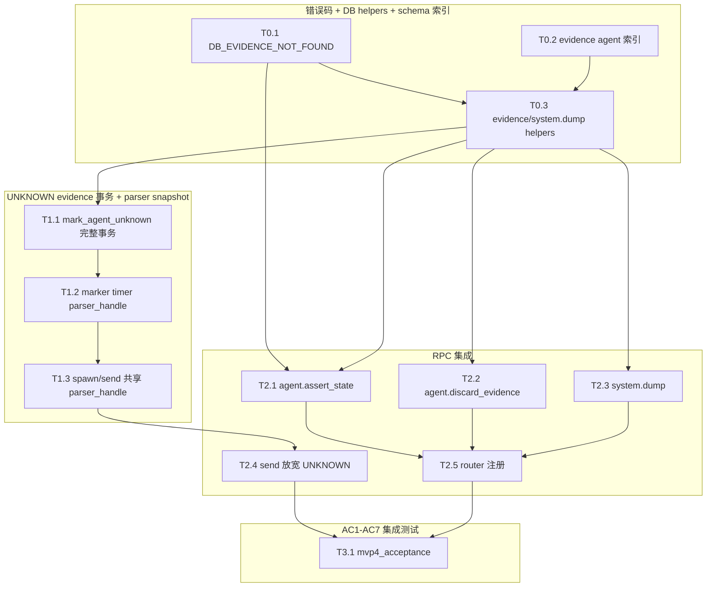

# Kiro Tasks: MVP 4 (反思闭环)

> **文档定位**：MVP 4 由 Codex 逐项实施的原子任务清单。每个任务必须独立编译、独立验证。严格按 `mvp4-D.md` 落地，禁止引入 MVP4 外能力。

---

## 1. 任务依赖与执行图谱



---

## 2. 原子任务定义

### T0.1: 错误码扩展

* **依赖前置**: 无
* **设计输入**: `mvp4-D.md §6`
* **输出产物**: `src/error.rs`
* **执行步骤**:
  1. 在 `CcbdError` 新增 `DbEvidenceNotFound { details: String }`。
  2. `to_rpc_error()` 映射 `error_code="DB_EVIDENCE_NOT_FOUND"`。
  3. `data.details` 必须透传 evidence_id 或 agent mismatch 说明。
  4. 增加 round-trip 单测。
* **独立验收**: `cargo test error::tests --quiet` 通过，JSON-RPC error code 为 `-32000`，data 含稳定 `error_code/details`。

### T0.2: evidence 表 + 索引（首次创建）

* **依赖前置**: 无
* **设计输入**: `mvp4-D.md §2.1`
* **输出产物**: `src/db/schema.rs`, `src/db/mod.rs`
* **执行步骤**:
  1. **关键纠正**：MVP1-3 实际**没有**创 evidence 表（虽然 mvp1 spec 写了）。MVP4 在 schema.rs 的 SCHEMA SQL 模板里**首次新增**：
     ```sql
     CREATE TABLE IF NOT EXISTS evidence (
         id TEXT PRIMARY KEY,
         agent_id TEXT NOT NULL REFERENCES agents(id) ON DELETE CASCADE,
         event_seq_id INTEGER NOT NULL REFERENCES events(seq_id),
         pane_bytes BLOB NOT NULL,
         failed_rules TEXT NOT NULL,
         status TEXT NOT NULL DEFAULT 'PENDING',
         l3_asserted_state TEXT,
         created_at INTEGER NOT NULL DEFAULT (unixepoch())
     ) STRICT;
     CREATE INDEX IF NOT EXISTS idx_evidence_pending ON evidence(status, created_at) WHERE status = 'PENDING';
     CREATE INDEX IF NOT EXISTS idx_evidence_agent ON evidence(agent_id);
     ```
  2. 用 `IF NOT EXISTS` 让 db::init 对已有 dev_state DB 也能补建。
  3. 不引入 CHECK 约束限制 status 值集（保留 SEALED 等扩展空间）。
* **独立验收**: 1）tempfile DB 初始化后查询 sqlite_master，断言 evidence 表 + 两个索引都存在；2）已存在 mvp3 era schema（无 evidence 表）的 DB 跑一次 init 后 evidence 表自动补建；3）重复 init 不抛错；4）跑 `INSERT INTO evidence (id, agent_id, event_seq_id, pane_bytes, failed_rules) VALUES (...)` 测试外键约束（agent_id 不存在时拒绝插入）。

### T0.3: evidence / dump DB helpers

* **依赖前置**: T0.1, T0.2
* **设计输入**: `mvp4-D.md §3.2 / §5 / §7`
* **输出产物**: `src/db/queries.rs`
* **执行步骤**:
  1. 新增 Evidence 轻量 struct 或内部 row mapper，至少含 `id, agent_id, status, event_seq_id`。
  2. `query_evidence_by_id(conn, evidence_id) -> Result<Option<Evidence>, CcbdError>`。
  3. `update_evidence_status(conn, evidence_id, status, l3_asserted_state) -> Result<usize, CcbdError>`，用于 DISCARD/REVIEWED。
  4. `system_dump_query(db) -> Result<Value, CcbdError>`：SELECT projects/sessions/agents/evidence_pending；`evidence_pending` 只返回 `id, agent_id, status, created_at`，`LIMIT 100`，**严禁**返回 `pane_bytes`。
  5. SQLite 错误统一映射 `DbConstraintViolation`。
* **独立验收**: 单测插入 evidence，query/update 成功；`system_dump_query` 返回 4 个顶级数组且 pending evidence 不含 pane_bytes/failed_rules。

---

### T1.1: mark_agent_unknown 完整事务化

* **依赖前置**: T0.3
* **设计输入**: `mvp4-D.md §4`
* **输出产物**: `src/db/queries.rs`
* **执行步骤**:
  1. 修改 `mark_agent_unknown` 签名为 `mark_agent_unknown(db, agent_id, reason, pane_bytes: Vec<u8>, failed_rules: serde_json::Value) -> Result<usize, CcbdError>`。
  2. 事务内先 SELECT `state,state_version`；缺 agent 返回 `Ok(0)`。
  3. CAS UPDATE：`state IN ('SPAWNING','BUSY') AND state_version=?`，设置 `state='UNKNOWN'`, `error_code=reason`, `state_version+1`。
  4. CAS 成功后才 `UPDATE evidence SET status='SEALED' WHERE agent_id=? AND status='PENDING'`（顺序极重要，不能在 CAS 之前 SEAL）。
  5. 插入 `events.state_change`，payload 含 `from,to="UNKNOWN",reason`，取 `last_insert_rowid()`。
  6. 插入 evidence：`id="evi_"+uuid.simple()`, `event_seq_id` 指向刚才 event，`pane_bytes` 为 BLOB，`failed_rules` 为 JSON 字符串，status 默认 PENDING。
  7. CAS 失败必须 rollback，不允许 seal/insert evidence。
* **独立验收**: 单测覆盖 BUSY→UNKNOWN 写 event+evidence、旧 PENDING 被 SEALED、新 evidence PENDING、CRASHED/KILLED/IDLE 调用 changes=0 且旧 evidence 不变。

### T1.2: marker::timer parser snapshot

* **依赖前置**: T1.1
* **设计输入**: `mvp4-D.md §8.1`
* **输出产物**: `src/marker/timer.rs`
* **执行步骤**:
  1. `spawn_marker_timer_task` 增加参数 `parser_handle: Arc<Mutex<vt100::Parser>>`（与 reader task 共享）。
  2. 超时时 lock parser，调用 `parser.screen().contents().into_bytes()` 得到 `pane_bytes`。**lock 持有时间极短**，仅 `contents()` 一次拷贝。
  3. `failed_rules` 固定为 `serde_json::json!(["[\\$#>✦]\\s*$"])`。
  4. 调新签名 `mark_agent_unknown(db, agent_id, reason, pane_bytes, failed_rules)`。
  5. test-only timeout helper 同步改签名。
* **独立验收**: 短 timeout 单测断言 UNKNOWN 后 evidence.pane_bytes 非空，failed_rules JSON 含 prompt regex。

### T1.3: spawn/send parser_handle 共享

* **依赖前置**: T1.2
* **设计输入**: `mvp4-D.md §7 / §8.1`
* **输出产物**: `src/pty/tasks.rs`, `src/rpc/handlers.rs`, `src/marker/registry.rs` (按需扩展)
* **执行步骤**:
  1. 当前 MVP3 reader 持有 `vt100::Parser` by value；改为 `Arc<Mutex<vt100::Parser>>`。
  2. `spawn_pty_reader_task` 参数改为 `parser_handle`，reader loop 中仅在 `parser.process(chunk)` + `matcher.scan(&parser)` 时短暂 lock。
  3. `handle_agent_spawn` 创建 `Arc::new(Mutex::new(vt100::Parser::new(200,200,0)))`，同一份 handle clone 两份：一份给 reader task，一份给 startup timer task。
  4. `handle_agent_send` 启动 Busy timer 时必须能拿到同一个 parser_handle。**采用方案 b（独立 PARSER_REGISTRY）**——避免方案 a 在 marker match 时 `registry::take(agent_id)` 同时把 parser_handle 也带走、下次 send 启动 Busy timer 时拿不到 parser 的生命周期问题：
     - 新建 `src/marker/parser_registry.rs`：`PARSER_REGISTRY: LazyLock<Arc<Mutex<HashMap<String, Arc<Mutex<vt100::Parser>>>>>>`
     - 提供 `register(agent_id, handle)` / `get(agent_id) -> Option<Arc<Mutex<vt100::Parser>>>` / `remove(agent_id)` 三个 API
     - **生命周期**：handle_agent_spawn 时 register；agent.kill / pidfd death / cascade 时 remove；marker match 时**不**清，让后续 send 仍能找到
  5. agent.kill / pidfd death / cascade 清理路径在原有 marker timer registry::take 之外新增 `parser_registry::remove(agent_id)` 调用。
* **独立验收**: spawn 后 startup timer 和 reader 共享同一 parser；send 启动 busy timer 后能取到同一 parser snapshot；agent.kill 后 parser handle 也被清。

---

### T2.1: handle_agent_assert_state

* **依赖前置**: T0.3, T1.1
* **设计输入**: `mvp4-D.md §3.1`
* **输出产物**: `src/rpc/handlers.rs`
* **执行步骤**:
  1. 新增 `handle_agent_assert_state(params, ctx)`。
  2. 校验 `params.state == "IDLE"`，否则 `IpcInvalidRequest`。
  3. BEGIN IMMEDIATE 事务。
  4. 查询 evidence；不存在 → `DbEvidenceNotFound { details: format!("evidence_id={}", id) }`；`evidence.agent_id != agent_id` → `DbEvidenceNotFound { details: "agent_id mismatch" }`。
  5. 查询 agent `state, state_version`；不存在 `AgentNotFound`；非 UNKNOWN `AgentWrongState { current_state }`。
  6. CAS UPDATE agents 到 `state='IDLE', sub_state='Asserted', state_version+1`，CAS WHERE 子句含 `state='UNKNOWN' AND state_version=?`。
  7. CAS changes==0（极少：vt100 抢先转 IDLE_Matched）→ rollback + 重读 state 返回 `AgentWrongState`。
  8. UPDATE evidence `status='REVIEWED', l3_asserted_state='IDLE' WHERE id=?`。
  9. INSERT `events.state_change` payload `{"from":"UNKNOWN","to":"IDLE","sub_state":"Asserted","reason":"L3_ASSERTED","evidence_id":?}`。
  10. COMMIT 返回 `{state:"IDLE", sub_state:"Asserted"}`。
* **独立验收**: 单测覆盖成功路径 + 缺 evidence + 跨 agent evidence + 非 UNKNOWN + state 非 IDLE 五类。

### T2.2: handle_agent_discard_evidence

* **依赖前置**: T0.3
* **设计输入**: `mvp4-D.md §3.2`
* **输出产物**: `src/rpc/handlers.rs`
* **执行步骤**:
  1. 新增 `handle_agent_discard_evidence(params, ctx)`。
  2. 参数只需 `evidence_id`。
  3. `UPDATE evidence SET status='DISCARDED' WHERE id=?`。
  4. changes==0 → `DbEvidenceNotFound`；已 DISCARDED 时 changes 也 ≥1（DISCARDED→DISCARDED 是 idempotent UPDATE，但 SQLite 仍报告 changes=1）——可接受幂等返回。
  5. 不触碰 agents、不发 signal、不写 events。
* **独立验收**: DISCARD 后 agent state/pid 不变；重复 discard 返回 `{status:"DISCARDED"}`，不抛错。

### T2.3: handle_system_dump

* **依赖前置**: T0.3
* **设计输入**: `mvp4-D.md §3.3 / §5`
* **输出产物**: `src/rpc/handlers.rs`
* **执行步骤**:
  1. 新增 `handle_system_dump(params, ctx)`。
  2. 忽略空 params，调用 `system_dump_query(&ctx.db)`。
  3. 返回 `{projects, sessions, agents, evidence_pending}`。
  4. evidence_pending 限 100，**禁止**返回 `pane_bytes` / `failed_rules`。
* **独立验收**: 插入 101 条 pending evidence，只返回 100；响应 JSON 不含 `pane_bytes`。

### T2.4: handle_agent_send 状态校验放宽

* **依赖前置**: T1.3
* **设计输入**: `mvp4-D.md §1.2 / §3.4`
* **输出产物**: `src/rpc/handlers.rs`
* **执行步骤**:
  1. 保留 MVP3 顺序：先 request_id 幂等检查，再 state 校验。
  2. state 校验从 `state != "IDLE"` 改为 `state != "IDLE" && state != "UNKNOWN"`。
  3. UNKNOWN 新 request_id 通过校验后走现有 PENDING→PTY→SENT，成功转 BUSY，启动 Busy timer。
  4. **不**修改 evidence.status；UNKNOWN 期 PENDING evidence 保留给 L3。
* **独立验收**: a) UNKNOWN + 新 request_id 成功转 BUSY；b) UNKNOWN + 同 request_id（已 SENT）幂等返回原 seq_id；c) BUSY + 新 request_id 仍 AGENT_WRONG_STATE。

### T2.5: router 注册

* **依赖前置**: T2.1, T2.2, T2.3
* **设计输入**: `mvp4-D.md §3`
* **输出产物**: `src/rpc/router.rs`
* **执行步骤**:
  1. METHODS 白名单新增 `agent.assert_state`, `agent.discard_evidence`, `system.dump`。
  2. dispatch match 绑定三个 handler。
  3. 更新 router 单测：unknown method 仍 IPC_INVALID_REQUEST。
* **独立验收**: 3 个新方法通过 router 返回 result/error，旧 5 个方法（session.create/agent.spawn/agent.send/agent.read/agent.kill）行为不变。

---

### T3.1: 集成测试 AC1-AC7

* **依赖前置**: T2.5
* **设计输入**: `mvp4-R.md §1`
* **输出产物**: `tests/mvp4_acceptance.rs`
* **执行步骤**:
  1. 每条 AC 一个 `#[tokio::test]`，沿用 unsafe bypass 真 bash fixture（CCBD_UNSAFE_NO_SANDBOX=1）。
  2. **AC1**：spawn bash → 等 IDLE → send `sleep 30` → 等 6s（BUSY_TIMEOUT=5s + 容忍）→ 断言 agents.state='UNKNOWN'，agents.error_code='PTY_MARKER_TIMEOUT'，events 表新增 state_change to=UNKNOWN，evidence 表新增 1 row PENDING，evidence.event_seq_id 外键正确指向那条 state_change，evidence.pane_bytes 非空，evidence.failed_rules JSON 含 prompt 正则。**标 #[ignore]**（6s 慢测）。
  3. **AC2**：AC1 之后调 `agent.assert_state {state:"IDLE", evidence_id}` → 断言 agents.state='IDLE' sub_state='Asserted'，evidence.status='REVIEWED' l3_asserted_state='IDLE'，events 新增 state_change reason=L3_ASSERTED。**标 #[ignore]**。
  4. **AC3**：spawn + 手动构造 evidence row（用 mark_agent_unknown 直接写）→ `agent.discard_evidence` → evidence.status='DISCARDED'，agents.state 不变。
  5. **AC4**：UNKNOWN 状态下用新 request_id `agent.send "echo recover"` → 断言 state=BUSY；同 request_id 重发 → 幂等返回。**标 #[ignore]**。
  6. **AC5**：UNKNOWN 后再次触发 timeout（手动调 mark_agent_unknown 二次）→ 断言第一条 evidence.status=SEALED，第二条 PENDING。
  7. **AC6**：a) assert_state 用不存在 evidence_id → DB_EVIDENCE_NOT_FOUND；b) 跨 agent evidence_id → DB_EVIDENCE_NOT_FOUND；c) BUSY 状态调 assert_state → AGENT_WRONG_STATE；d) state 字段非 "IDLE" → IPC_INVALID_REQUEST。
  8. **AC7**：完整闭环（综合上述）。**标 #[ignore]**（涉及 6s 等待）。
* **独立验收**: `cargo test --test mvp4_acceptance --quiet` 全过；显式 `--ignored --include-ignored` 跑慢测也过。

---

## 3. AC 追溯表

| mvp4-R §1 AC | 最后 Task | 验收方法 |
|---|---|---|
| AC1 Evidence 事务写入 | T3.1 | sleep 超时后查 agents/events/evidence 同事务结果 |
| AC2 agent.assert_state 恢复 | T3.1 | assert 后 IDLE Asserted + REVIEWED |
| AC3 discard_evidence | T3.1 | evidence DISCARDED 且 agent 不变 |
| AC4 UNKNOWN send 重试 | T3.1 | UNKNOWN 新 request_id 转 BUSY，幂等顺序保留 |
| AC5 Evidence Seal | T3.1 | 旧 PENDING→SEALED，新 evidence PENDING |
| AC6 干预边界 | T3.1 | 四类错误码断言 |
| AC7 fallback loop 全闭环 | T3.1 | spawn→UNKNOWN→assert→send→IDLE |

---

## 4. commit 节奏

1. **Commit 1: G0 + G1**
   * 范围：T0.1 + T0.2 + T0.3 + T1.1 + T1.2 + T1.3。
   * 代码量：约 350-550 行。
   * 验收：`cargo build --quiet` + DB/timer/parser snapshot 单测 + MVP1-3 80 单测无回归。

2. **Commit 2: G2**
   * 范围：T2.1 + T2.2 + T2.3 + T2.4 + T2.5。
   * 代码量：约 300-450 行。
   * 验收：handler/router 单测全过；UNKNOWN send 放宽不破坏 MVP3 幂等测试。

3. **Commit 3: G3**
   * 范围：T3.1。
   * 代码量：约 250-400 行。
   * 验收：`cargo test --test mvp4_acceptance --quiet`，慢测 ignored 时显式跑 ignored 也通过。

---

## 5. 风险点提示

1. **mark_agent_unknown 事务顺序**：必须 CAS 成功后才 SEAL 和 INSERT evidence；顺序错会污染旧 evidence。T1.1 step 4 强制。
2. **parser 共享锁**：reader 是 `spawn_blocking`，timer 是 tokio task；`Arc<Mutex<vt100::Parser>>` lock 只包 `process/scan/contents`，**禁止**锁内 DB/I/O 调用。否则 reader 与 timer 互相阻塞。
3. **assert_state 双 CAS**：先校验 evidence 归属，再校验 agent UNKNOWN + state_version；跨 agent evidence 必须伪装成 not found（防探测攻击）。T2.1 step 4 强制。
4. **system.dump 响应体控制**：`pane_bytes` 不进 JSON-RPC，`evidence_pending` 限 100 条，避免 socket 单帧过大。T2.3 step 4 强制。
5. **UNKNOWN send 后 evidence 保留**：MVP4 选择不清 PENDING evidence；即使 vt100 后续匹配 IDLE_Matched，evidence 仍保留给 L3 discard/review。T2.4 step 4 明确。
6. **timer timeout 与 kill/crash 竞态**：mark_agent_unknown CAS 只允许 SPAWNING/BUSY，防止 KILLED/CRASHED 被回写 UNKNOWN。T1.1 step 3 强制。
7. **registry 扩展兼容**：如果 registry value 从 `MarkerTimerHandle` 扩为含 parser_handle 的 struct（推荐 a 方案），所有 `register/take/reset/contains` 测试和调用点必须同步改。T1.3 step 4 标注。
8. **discard 幂等语义**：D §3.2 允许方便选择；T2.2 固定为重复 discard 成功，避免 L3 清理脚本因重试失败。
