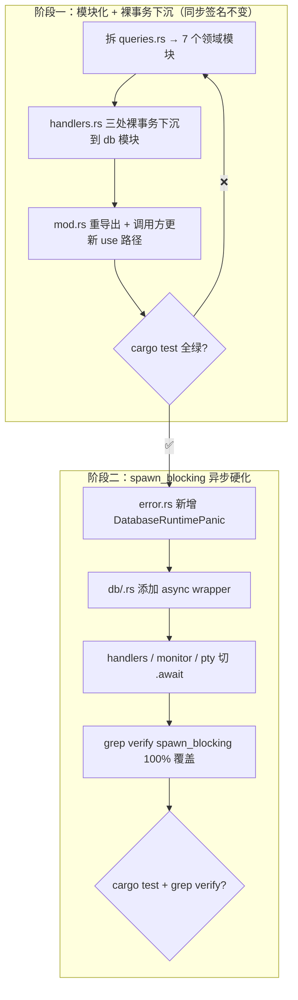

# Kiro Design: MVP 5 (内核硬化 / The Hardening)

> **文档定位**：本文件是 ccbd-rust MVP 5 阶段的官方 D (Design) 规格。严格基于 `mvp5-R.md` 边界，为 Codex T 阶段提供无歧义实施蓝图。本阶段是**纯重构**：先把 `db/queries.rs` 1303 行巨石按领域拆为 7 个模块文件 + 把 `handlers.rs` 内裸 SQL 事务下沉，再统一在 `db::*` 模块对外暴露 `spawn_blocking` 包裹的 async wrapper。**整个 MVP 不动 RPC 接口、不改状态机、不改 schema**。

---

## 1. 总体路线图（两阶段）



**铁律**：阶段一**不**碰 `spawn_blocking`，阶段二**不**新增任何 SQL 函数。两阶段独立 commit，独立可回滚。

---

## 2. 阶段一：模块化 + 裸事务下沉

### 2.1 模块切分图（最终目标）

```
src/db/
├── mod.rs              (现有 - Db struct 不变 + 重导出 pub use 子模块对外稳定 API)
├── schema.rs           (现有 - 不动)
├── common.rs           (新增, ~30 行) - is_constraint_error / is_unique_constraint_error / map_db_error
├── sessions.rs         (新增, ~80 行)  - insert_session + 阶段一新增 create_session_tx
├── agents.rs           (新增, ~240 行) - insert_agent / update_agent_state / query_agent / query_agent_state / delete_agent / mark_agent_killed / mark_agent_crashed_with_exit
├── events.rs           (新增, ~120 行) - insert_event / query_event_by_request_id / query_events_since + 阶段一新增 record_send_progress_tx
├── evidence.rs         (新增, ~40 行)  - query_evidence_by_id / update_evidence_status
├── state_machine.rs    (新增, ~200 行) - mark_agent_idle_matched / mark_agent_unknown + 阶段一新增 assert_state_to_idle_tx
└── system.rs           (新增, ~250 行) - system_dump_query / cascade_kill_session_agents / reconcile_startup / reconcile_active_agents_to_crashed
```

`queries.rs` 在阶段一结束时**完全删除**（不保留兼容外壳，由 `mod.rs` 的 `pub use` 直接重导出对外稳定路径）。

### 2.2 函数迁移表（精确到当前文件行号）

| 当前位置（queries.rs） | 当前函数签名 | 目标文件 | 备注 |
|---|---|---|---|
| `:10 fn is_constraint_error` | `fn(SqlError) -> bool` | `db/common.rs` | 改为 `pub(crate)` |
| `:18 fn is_unique_constraint_error` | `fn(SqlError) -> bool` | `db/common.rs` | 改为 `pub(crate)` |
| `:26 fn map_db_error` | `fn(&str, SqlError) -> CcbdError` | `db/common.rs` | 改为 `pub(crate)` |
| `:30 pub fn insert_session` | `(&Connection, ...)` | `db/sessions.rs` | 签名不变 |
| `:52 pub fn insert_agent` | `(&Connection, ...)` | `db/agents.rs` | 签名不变 |
| `:75 pub fn update_agent_state` | `(&Connection, ...)` | `db/agents.rs` | 签名不变 |
| `:89 pub fn query_event_by_request_id` | `(&Connection, ...)` | `db/events.rs` | 签名不变 |
| `:112 pub fn insert_event` | `(&Connection, ...)` | `db/events.rs` | 签名不变 |
| `:143 pub fn query_agent` | `(&Connection, &str)` | `db/agents.rs` | 签名不变 |
| `:167 pub fn query_agent_state` | `(&Db, &str)` | `db/agents.rs` | 签名不变 |
| `:178 pub fn mark_agent_idle_matched` | `(&Db, &str)` | `db/state_machine.rs` | 签名不变 |
| `:229 pub fn query_evidence_by_id` | `(&Connection, ...)` | `db/evidence.rs` | 签名不变 |
| `:250 pub fn update_evidence_status` | `(&Connection, ...)` | `db/evidence.rs` | 签名不变 |
| `:263 pub fn system_dump_query` | `(&Db) -> Value` | `db/system.rs` | 签名不变 |
| `:350 pub fn mark_agent_unknown` | `(&Db, ...)` | `db/state_machine.rs` | 签名不变 |
| `:429 pub fn query_events_since` | `(&Connection, ...)` | `db/events.rs` | 签名不变 |
| `:457 pub fn delete_agent` | `(&Db, &str)` | `db/agents.rs` | 签名不变 |
| `:465 pub fn mark_agent_killed` | `(&Db, ...)` | `db/agents.rs` | 签名不变 |
| `:505 pub fn mark_agent_crashed_with_exit` | `(&Db, ...)` | `db/agents.rs` | 签名不变 |
| `:550 pub fn cascade_kill_session_agents` | `(&Db, ...)` | `db/system.rs` | 签名不变 |
| `:588 pub fn reconcile_startup` | `(&Db) -> usize` | `db/system.rs` | 签名不变 |
| `:640 pub fn reconcile_active_agents_to_crashed` | `(&mut Connection)` | `db/system.rs` | 签名不变 |

**所有原 pub fn 在阶段一保持公共签名（参数 / 返回值）零改动**。这是测试零回归的根基。

### 2.3 handlers.rs 裸事务下沉（阶段一新增三个 db 函数）

#### 2.3.1 `db::sessions::create_session_tx`

**当前位置**：`src/rpc/handlers.rs:20-86` `handle_session_create`，包含 `transaction_with_behavior(Immediate)` + `INSERT OR IGNORE INTO projects` + `monitor::pidfd_open` + `INSERT INTO sessions`。

**下沉签名**：

```rust
// src/db/sessions.rs

pub fn create_session_tx(
    db: &Db,
    session_id: &str,
    project_id: &str,
    absolute_path: &str,
    master_pid: i32,
    master_pidfd: PidFdHandle,  // 由 caller 传入，db 层不调 monitor 模块
) -> Result<(), CcbdError> {
    let mut conn = db.conn();
    let tx = conn
        .transaction_with_behavior(TransactionBehavior::Immediate)
        .map_err(|err| map_db_error("begin session.create", err))?;
    tx.execute(
        "INSERT OR IGNORE INTO projects (id, absolute_path) VALUES (?, ?)",
        params![project_id, absolute_path],
    )
    .map_err(|err| map_db_error("insert project", err))?;
    tx.execute(
        "INSERT INTO sessions (id, project_id, master_pid, ...) VALUES (...)",
        params![...],
    )
    .map_err(|err| map_db_error("insert session", err))?;
    tx.commit().map_err(|err| map_db_error("commit session.create", err))
}
```

**关键决策**：`pidfd_open` 必须在**事务外**调用（系统调用，不该在 SQLite 锁里跑）。caller (handlers.rs) 顺序变为：

```rust
// handlers.rs::handle_session_create 阶段一改动后
let master_pidfd = monitor::pidfd_open(master_pid as i32)?;  // 事务外
db::sessions::create_session_tx(&ctx.db, ..., master_pidfd)?; // 事务内
```

#### 2.3.2 `db::events::record_send_progress_tx`

**当前位置**：`src/rpc/handlers.rs:373-394` `handle_agent_send` 内的事务，包含 `UPDATE events SET payload = ?` + 条件性 `UPDATE agents SET state = 'BUSY'`。

**下沉签名**：

```rust
// src/db/events.rs

pub fn record_send_progress_tx(
    db: &Db,
    seq_id: i64,
    final_payload: &Value,
    agent_id: &str,
    write_succeeded: bool,
) -> Result<(), CcbdError> {
    let mut conn = db.conn();
    let tx = conn
        .transaction_with_behavior(TransactionBehavior::Immediate)
        .map_err(|err| map_db_error("begin send.update", err))?;
    tx.execute(
        "UPDATE events SET payload = ? WHERE seq_id = ?",
        params![final_payload.to_string(), seq_id],
    )
    .map_err(|err| map_db_error("update send event", err))?;
    if write_succeeded {
        tx.execute(
            "UPDATE agents SET state = 'BUSY', sub_state = NULL, \
             state_version = state_version + 1, updated_at = unixepoch() \
             WHERE id = ? AND state != 'CRASHED'",
            params![agent_id],
        )
        .map_err(|err| map_db_error("update agent busy", err))?;
    }
    tx.commit().map_err(|err| map_db_error("commit send.update", err))
}
```

#### 2.3.3 `db::state_machine::assert_state_to_idle_tx`

**当前位置**：`src/rpc/handlers.rs:445+` `handle_agent_assert_state` 内的事务，包含 evidence 校验 + agents CAS + evidence status 更新 + state_change event 写入。

**下沉签名**：

```rust
// src/db/state_machine.rs

pub struct AssertStateOutcome {
    pub state_change_seq_id: i64,
}

pub fn assert_state_to_idle_tx(
    db: &Db,
    agent_id: &str,
    evidence_id: &str,
) -> Result<AssertStateOutcome, CcbdError> {
    // 实施完整搬迁：
    // 1) BEGIN IMMEDIATE
    // 2) SELECT evidence WHERE id=? AND agent_id=? → 不存在 → DbEvidenceNotFound
    // 3) SELECT agents (state, state_version) WHERE id=?
    // 4) state != UNKNOWN → AgentWrongState
    // 5) UPDATE agents CAS (state='IDLE', sub_state='Asserted', state_version+=1)
    //    changes==0 → AgentWrongState
    // 6) UPDATE evidence SET status='REVIEWED', l3_asserted_state='IDLE'
    // 7) INSERT events (state_change, reason='L3_ASSERTED') → seq_id
    // 8) COMMIT
    // 返回 seq_id 给 caller 用于 RPC 响应
}
```

**关键约束**：整个事务**单 `transaction_with_behavior(Immediate)` 边界完整保留**——这是 R 文档 AC5 的核心。caller 拿到 `AssertStateOutcome` 后只做 RPC 响应组装，不再回 SQL 做任何事情。

### 2.4 调用方更新（阶段一）

| 文件 | 当前 use 路径 | 阶段一目标 |
|---|---|---|
| `src/rpc/handlers.rs` | `use crate::db::queries::{...}` | `use crate::db::{sessions, agents, events, evidence, state_machine, system}` 按需 |
| `src/main.rs` | `db::queries::reconcile_startup` | `db::system::reconcile_startup` |
| `src/monitor/agent_watch.rs` | `db::queries::*` | `db::agents::*` / `db::system::*` 按需 |
| `src/monitor/master_watch.rs` | `db::queries::*` | `db::system::cascade_kill_session_agents` |
| `src/marker/timer.rs` | `db::queries::mark_agent_unknown` | `db::state_machine::mark_agent_unknown` |
| `src/marker/matcher.rs` | `db::queries::mark_agent_idle_matched` | `db::state_machine::mark_agent_idle_matched` |
| `tests/mvp*_acceptance.rs` | `ccbd::db::queries::*` | 按上面映射改 |

**`src/db/mod.rs` 必须 `pub use` 子模块**，否则 `ccbd::db::queries::*` 旧路径会全断。但目标是**直接改 use 路径**，不留兼容外壳。

### 2.5 阶段一安全检查点

完成 §2.1-§2.4 全部改动后：

```bash
cargo test --quiet 2>&1 | tail -30
# 预期：91 单测全绿 + mvp2/3/4 acceptance 全绿，与改动前完全一致
```

任何一项失败 → 立即 `git reset --hard HEAD~1`（commit 应该是阶段一独立的），定位问题再来。

---

## 3. 阶段二：spawn_blocking 异步硬化

### 3.1 `error.rs` 新增

```rust
// src/error.rs

pub enum CcbdError {
    // ... 原有变体 ...
    DatabaseRuntimePanic { details: String },
}

impl CcbdError {
    pub fn to_rpc_error(&self) -> RpcError {
        match self {
            // ...
            Self::DatabaseRuntimePanic { details } => RpcError {
                code: -32000,
                message: "Database runtime panic".into(),
                data: Some(json!({
                    "error_code": "DB_RUNTIME_PANIC",
                    "details": details,
                })),
            },
        }
    }
}
```

### 3.2 Async wrapper 模式（在每个 db 子模块内）

每个 `db/<domain>.rs` 文件内部，对外暴露的 async wrapper 紧贴在同步函数下方：

```rust
// src/db/state_machine.rs（示例）

// ========== 同步层（pub(crate) 给单测和 db 内部用）==========

pub(crate) fn assert_state_to_idle_tx(
    db: &Db,
    agent_id: &str,
    evidence_id: &str,
) -> Result<AssertStateOutcome, CcbdError> {
    // 阶段一搬迁的同步实现，原样保留
}

// ========== 异步层（pub 对 handlers / monitor / pty 暴露）==========

pub async fn assert_state_to_idle(
    db: Db,             // 注意：值传递（Arc 内部 clone 廉价）
    agent_id: String,   // 值传递
    evidence_id: String,
) -> Result<AssertStateOutcome, CcbdError> {
    tokio::task::spawn_blocking(move || {
        assert_state_to_idle_tx(&db, &agent_id, &evidence_id)
    })
    .await
    .map_err(|join_err| CcbdError::DatabaseRuntimePanic {
        details: format!("assert_state_to_idle: {join_err}"),
    })?
}
```

**关键约定**：
1. 同步层签名 `(&Db, &str, ...)`，async 层签名 `(Db, String, ...)`——所有引用换成 owned。这是因为 `spawn_blocking` 闭包需要 `'static`，借用没法跨线程。
2. 同步层 `pub(crate)`：crate 内（单测、db 模块间互调）可见；crate 外（handlers / monitor 等其他模块通过 lib facade 用 async 层）不可见。
3. async 层只做两件事：spawn_blocking 包裹 + JoinError 映射。不做参数变换 / 业务判断。

### 3.3 Async 化的同步函数清单（哪些必须出 async wrapper）

**判定规则**：所有当前在 `handlers.rs / monitor/* / pty/* / marker/timer.rs` 内**通过 `db.conn()` 拿锁后调用的 db 函数**必须出 async wrapper。其他纯 db 内部辅助函数（如 `is_constraint_error`、map_db_error）保持私有同步。

清单（按目标模块归类）：

| 模块 | 出 async wrapper 的函数 |
|---|---|
| `db/sessions.rs` | `create_session` |
| `db/agents.rs` | `insert_agent_async` / `update_agent_state_async` / `query_agent_async` / `query_agent_state_async` / `delete_agent_async` / `mark_agent_killed_async` / `mark_agent_crashed_with_exit_async` |
| `db/events.rs` | `insert_event_async` / `query_event_by_request_id_async` / `query_events_since_async` / `record_send_progress` |
| `db/evidence.rs` | `query_evidence_by_id_async` / `update_evidence_status_async` |
| `db/state_machine.rs` | `mark_agent_idle_matched` / `mark_agent_unknown` / `assert_state_to_idle` |
| `db/system.rs` | `system_dump` / `cascade_kill_session_agents_async` / `reconcile_startup`（注：仅 daemon 启动时被同步 main 调一次，async 化非必需，但建议统一）|

**命名约定**：
- 阶段一新增的下沉函数（`create_session_tx` / `record_send_progress_tx` / `assert_state_to_idle_tx`）：同步层带 `_tx` 后缀，async 层去掉 `_tx`。
- 原有函数（`insert_agent` 等）：同步层保持原名，async 层加 `_async` 后缀。
- **不强求**：唯一硬约束是 R 文档 AC4（grep verify 通过即可）。命名怎么定看 Codex 实施时的可读性判断。

### 3.4 调用方切换（阶段二）

`src/rpc/handlers.rs` 内**所有** `db.conn()` 调用 + `db::*` 同步函数调用替换为 `db::*_async(...).await`。判定脚本：

```bash
grep -n "db\.conn()\|\.lock()\.unwrap()" src/rpc/handlers.rs src/monitor/ src/pty/ src/marker/timer.rs
# 预期：0 行返回
```

唯一例外：`src/main.rs` 的 daemon 启动序列（`reconcile_startup`）。daemon 启动时还没进入 Tokio 多线程调度，sync 调用本身不会阻塞 worker。但仍建议改成 async 保持一致性。

### 3.5 事务原子性 review 清单（人工 review，不靠 grep）

阶段二 commit 前必须人工逐一 review 以下三个事务路径，确认**整个事务在单 `spawn_blocking` 闭包内完整执行**，没有被异步切分：

1. `agent.send`（handlers.rs）：先调 `db::events::query_event_by_request_id_async` 做幂等检查（这是合法的——事务边界外的 SELECT），再调 `db::events::record_send_progress` 做事务（事务内单原子）。两步之间允许 await，因为幂等检查失败直接返回，不影响后续事务的 CAS。**这条与 mvp3 R-IDEMPOTENCY-1 兼容。**
2. `agent.assert_state`（handlers.rs）：调 `db::state_machine::assert_state_to_idle` 一次到位。**整个事务在单闭包**，禁止拆。
3. `mark_agent_unknown`（marker/timer.rs）：调 `db::state_machine::mark_agent_unknown` 一次到位。**整个事务在单闭包**，禁止拆。

### 3.6 阶段二最终验收

```bash
# 1. 测试零回归
cargo test --quiet 2>&1 | tail -30

# 2. spawn_blocking 100% 覆盖（AC4）
grep -n 'db\.conn()\|\.lock()\.unwrap()' src/rpc/handlers.rs src/monitor/ src/pty/ src/marker/timer.rs
# 预期：0 行

# 3. handlers.rs 内零裸 SQL（AC3）
grep -nE 'rusqlite::|TransactionBehavior::|conn\.execute|conn\.transaction' src/rpc/handlers.rs
# 预期：0 行

# 4. 文件体积上限（AC2）
wc -l src/db/*.rs | awk '$1 > 300 && $2 != "total" && $2 != "src/db/schema.rs" {print "OVER LIMIT: " $0; bad=1} END {exit bad}'
# 预期：exit 0
```

四项全过 = 阶段二验收通过。

---

## 4. 错误处理细节

### 4.1 `JoinError` → `DatabaseRuntimePanic` 的语义

`spawn_blocking` 的闭包发生 panic（极小概率，但要兜底），`JoinHandle::await` 返回 `Err(JoinError)`。映射策略：

- **panic 内容能拿到**：`JoinError::is_panic()` true 时 `into_panic()` 拿 panic payload，序列化为 string 塞 `details`
- **task cancelled**：本 daemon 内 `spawn_blocking` 不主动 abort，正常路径不会出现 cancelled。出现即 bug，按 panic 同等处理

### 4.2 `DatabaseRuntimePanic` 不期望出现

正常运行 daemon `DB_RUNTIME_PANIC` 永远 0 次。出现一次 = 严重 bug，但 daemon 不该崩——错误码返给 caller，caller 决定要不要 retry。

### 4.3 round-trip 单测要求

```rust
// src/error.rs::tests
#[test]
fn db_runtime_panic_round_trip() {
    let err = CcbdError::DatabaseRuntimePanic {
        details: "spawned task panicked: SqliteFailure(BUSY)".into(),
    };
    let rpc_err = err.to_rpc_error();
    assert_eq!(rpc_err.code, -32000);
    let data = rpc_err.data.unwrap();
    assert_eq!(data["error_code"], "DB_RUNTIME_PANIC");
    assert!(data["details"].as_str().unwrap().contains("BUSY"));
}
```

---

## 5. 性能与一致性预期

### 5.1 性能预期（不设硬指标）

阶段二完成后，**预期**：
- 单测耗时与阶段一持平或微增（spawn_blocking 引入的线程切换开销在毫秒级 SQL 调用上不显著）
- 真实负载下 daemon 响应抖动消失（M7 部署后实测，本 MVP 不验）

**不设硬性 bench 验收**——R 文档 §5 已明确不做 bench。

### 5.2 一致性预期

- 阶段一前后 `cargo test` 输出**完全一致**（包括测试数 + ignored 数）
- 阶段二前后 `cargo test` 输出**功能一致**（数字不变，但单测耗时可能微变）
- 任何一处 mvp1-4 功能用例的语义出现差异 = MVP 5 失败

---

## 6. 实施时长预期与回滚策略

| 阶段 | 预期工作量 | 回滚成本 |
|---|---|---|
| 阶段一 | 4-6 小时（拆模块 ~3h + 裸事务下沉 ~2h + 调用方改 use 路径 ~1h） | 低（单 commit `git reset --hard HEAD~1`）|
| 阶段二 | 3-4 小时（async wrapper 添加 ~2h + 调用方切 await ~1h + grep verify ~30min）| 低（独立 commit，回到阶段一末态）|

**总计 7-10 小时**，符合 R 文档 §0.1 的"半天到一天"预期。

回滚策略：

- 阶段一失败：回到 main 分支
- 阶段一通过 + 阶段二失败：回到阶段一 commit（保留模块化收益，放弃 spawn_blocking 改造）。这是个有价值的中间态——巨石问题已解决，async 阻塞问题留待下次再做。

---

## 7. 与 mvp1-4 的兼容性矩阵

| 维度 | 兼容性 | 验收方式 |
|---|---|---|
| RPC schema | 完全一致 | mvp2/3/4 acceptance 不改一行业务断言全绿 |
| 错误码 | 仅新增 `DB_RUNTIME_PANIC`（向后兼容扩展）| 错误码 round-trip 测试 |
| 状态机 | 完全一致 | 状态机 sub_state 转移测试不改 |
| schema | 完全一致 | `db::init` 行为零变化 |
| 公共 API 命名 | **变化**（同步函数 / 异步函数命名按 §3.3 约定） | 调用方更新 use 路径——但 RPC client（L3）感知为零变化 |

---

## 8. Open Questions（实施时由 Codex 决断）

| # | 问题 | 默认选择 | 决断时机 |
|---|---|---|---|
| Q1 | async wrapper 命名前缀 / 后缀（`_async` vs 无后缀）？ | 阶段一新增 `_tx` → 阶段二去掉；原有保持原名 → 阶段二加 `_async` | 阶段二开头 |
| Q2 | `query_agent` 的入参是 `&Connection`（事务内调用复用）vs `&Db`（独立调用）？ | 保持现状（`&Connection`），调用方用 `db.conn()` 拿连接传入 | 阶段一开头 |
| Q3 | `db/mod.rs` 是否需要保留 `pub use queries::*` 兼容外壳？ | 不保留——直接改所有调用方 use 路径，避免长期残留 | 阶段一末尾 |
| Q4 | `query_events_since_async` 入参 `since_event_id: i64` 在 spawn_blocking 闭包里如何 move？ | 值类型 i64 直接 Copy，不涉及 owned/borrow 问题 | 阶段二实施时 |
| Q5 | 阶段一三个新增 `_tx` 函数的单测放在哪？ | `db/<domain>.rs` 文件内 `mod tests` | 阶段一实施时 |
