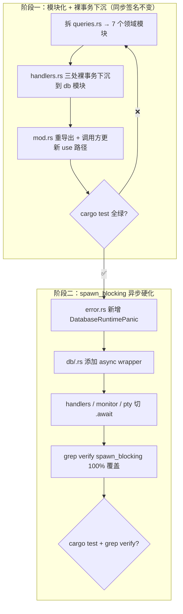

# Kiro Design: MVP 5 (内核硬化 / The Hardening)

> **文档定位**：本文件是 ccbd-rust MVP 5 阶段的官方 D (Design) 规格。严格基于 `mvp5-R.md` 边界，为 Codex T 阶段提供无歧义实施蓝图。本阶段是**纯重构**：先把 `db/queries.rs` 1303 行巨石按领域拆为 7 个模块文件 + 把 `handlers.rs` 内裸 SQL 事务下沉，再统一在 `db::*` 模块对外暴露 `spawn_blocking` 包裹的 async wrapper。**整个 MVP 不动 RPC 接口、不改状态机、不改 schema**。

---

## 1. 总体路线图（两阶段）



**铁律**：阶段一**不**碰 `spawn_blocking`，阶段二**不**新增任何 SQL 函数。两阶段独立 commit，独立可回滚。

---

## 2. 阶段一：模块化 + 裸事务下沉

### 2.1 模块切分图（最终目标）

```
src/db/
├── mod.rs              (现有 - Db struct 不变 + 重导出 pub use 子模块对外稳定 API)
├── schema.rs           (现有 - 不动)
├── common.rs           (新增, ~30 行) - is_constraint_error / is_unique_constraint_error / map_db_error
├── sessions.rs         (新增, ~80 行)  - insert_session + 阶段一新增 create_session_tx
├── agents.rs           (新增, ~240 行) - insert_agent / update_agent_state / query_agent / query_agent_state / delete_agent / mark_agent_killed / mark_agent_crashed_with_exit
├── events.rs           (新增, ~120 行) - insert_event / query_event_by_request_id / query_events_since + 阶段一新增 record_send_progress_tx
├── evidence.rs         (新增, ~40 行)  - query_evidence_by_id / update_evidence_status
├── state_machine.rs    (新增, ~200 行) - mark_agent_idle_matched / mark_agent_unknown + 阶段一新增 assert_state_to_idle_tx
└── system.rs           (新增, ~250 行) - system_dump_query / cascade_kill_session_agents / reconcile_startup / reconcile_active_agents_to_crashed
```

`queries.rs` 在阶段一结束时**完全删除**（不保留兼容外壳，由 `mod.rs` 的 `pub use` 直接重导出对外稳定路径）。

### 2.2 函数迁移表（精确到当前文件行号）

| 当前位置（queries.rs） | 当前函数签名 | 目标文件 | 备注 |
|---|---|---|---|
| `:10 fn is_constraint_error` | `fn(SqlError) -> bool` | `db/common.rs` | 改为 `pub(crate)` |
| `:18 fn is_unique_constraint_error` | `fn(SqlError) -> bool` | `db/common.rs` | 改为 `pub(crate)` |
| `:26 fn map_db_error` | `fn(&str, SqlError) -> CcbdError` | `db/common.rs` | 改为 `pub(crate)` |
| `:30 pub fn insert_session` | `(&Connection, ...)` | `db/sessions.rs` | 签名不变 |
| `:52 pub fn insert_agent` | `(&Connection, ...)` | `db/agents.rs` | 签名不变 |
| `:75 pub fn update_agent_state` | `(&Connection, ...)` | `db/agents.rs` | 签名不变 |
| `:89 pub fn query_event_by_request_id` | `(&Connection, ...)` | `db/events.rs` | 签名不变 |
| `:112 pub fn insert_event` | `(&Connection, ...)` | `db/events.rs` | 签名不变 |
| `:143 pub fn query_agent` | `(&Connection, &str)` | `db/agents.rs` | 签名不变 |
| `:167 pub fn query_agent_state` | `(&Db, &str)` | `db/agents.rs` | 签名不变 |
| `:178 pub fn mark_agent_idle_matched` | `(&Db, &str)` | `db/state_machine.rs` | 签名不变 |
| `:229 pub fn query_evidence_by_id` | `(&Connection, ...)` | `db/evidence.rs` | 签名不变 |
| `:250 pub fn update_evidence_status` | `(&Connection, ...)` | `db/evidence.rs` | 签名不变 |
| `:263 pub fn system_dump_query` | `(&Db) -> Value` | `db/system.rs` | 签名不变 |
| `:350 pub fn mark_agent_unknown` | `(&Db, ...)` | `db/state_machine.rs` | 签名不变 |
| `:429 pub fn query_events_since` | `(&Connection, ...)` | `db/events.rs` | 签名不变 |
| `:457 pub fn delete_agent` | `(&Db, &str)` | `db/agents.rs` | 签名不变 |
| `:465 pub fn mark_agent_killed` | `(&Db, ...)` | `db/agents.rs` | 签名不变 |
| `:505 pub fn mark_agent_crashed_with_exit` | `(&Db, ...)` | `db/agents.rs` | 签名不变 |
| `:550 pub fn cascade_kill_session_agents` | `(&Db, ...)` | `db/system.rs` | 签名不变 |
| `:588 pub fn reconcile_startup` | `(&Db) -> usize` | `db/system.rs` | 签名不变 |
| `:640 pub fn reconcile_active_agents_to_crashed` | `(&mut Connection)` | `db/system.rs` | 签名不变 |

**所有原 pub fn 在阶段一保持公共签名（参数 / 返回值）零改动**。这是测试零回归的根基。

### 2.3 handlers.rs 裸事务下沉（阶段一新增三个 db 函数）

#### 2.3.1 `db::sessions::create_session_tx`（修订版 - Codex Round 1 反馈采纳）

**当前位置**：`src/rpc/handlers.rs:20-86` `handle_session_create`，包含 `transaction_with_behavior(Immediate)` + `INSERT OR IGNORE INTO projects` + `monitor::pidfd_open` + `INSERT INTO sessions`。

**Round 1 plan 的 bug**（已修订）：原签名 `master_pidfd: PidFdHandle` 让 caller 把 pidfd 传入，会消费所有权——但 caller 后续还要 `try_clone` + `register` + `spawn_master_pidfd_watch_task`。这会编译失败。

**修订后签名（Direction E：函数返回 OwnedFd）**：

```rust
// src/db/sessions.rs
use std::os::fd::OwnedFd;

pub fn create_session_tx(
    db: &Db,
    session_id: &str,
    project_id: &str,
    absolute_path: &str,
    master_pid: i32,
) -> Result<OwnedFd, CcbdError> {
    let mut conn = db.conn();
    let tx = conn
        .transaction_with_behavior(TransactionBehavior::Immediate)
        .map_err(|err| map_db_error("begin session.create", err))?;
    tx.execute(
        "INSERT OR IGNORE INTO projects (id, absolute_path) VALUES (?, ?)",
        params![project_id, absolute_path],
    )
    .map_err(|err| map_db_error("insert project", err))?;

    // pidfd_open 在事务内做存活检查——失败则 tx drop 自动 ROLLBACK
    // 这里 caller -> db -> monitor 调用是合法的，因为 monitor::pidfd_open
    // 不依赖 db 模块（src/monitor/mod.rs 仅依赖 crate::error，无循环依赖）
    let master_pidfd = match monitor::pidfd_open(master_pid as i32) {
        Ok(fd) => fd,
        Err(CcbdError::AgentUnexpectedExit { .. }) => {
            return Err(CcbdError::IpcInvalidRequest(format!(
                "master_pid {master_pid} not alive"
            )));
        }
        Err(err) => return Err(err),
    };

    tx.execute(
        "INSERT INTO sessions (id, project_id, master_pid) VALUES (?, ?, ?)",
        params![session_id, project_id, master_pid],
    )
    .map_err(|err| map_db_error("insert session", err))?;
    tx.commit().map_err(|err| map_db_error("commit session.create", err))?;

    Ok(master_pidfd)
}
```

**关键决策**：
1. **`pidfd_open` 在事务内**（不是事务外）：因为 pidfd_open 是事务能否提交的存活检查前置条件——master_pid 不存活就不能插 session。在事务内 + 失败 ROLLBACK，保留了原有的 atomic 语义。
2. **`pidfd_open` 是阻塞系统调用**：放在 spawn_blocking 闭包内执行（async wrapper 包整个 `create_session_tx`）合法且必要——避免 Tokio worker 跑阻塞调用。
3. **OwnedFd 通过返回值流转**：`OwnedFd: Send`，可从 spawn_blocking 阻塞线程安全 move 回 async 上下文，由 caller 接管 register / watch。
4. **不引入循环依赖**：`monitor::pidfd_open` 在 `src/monitor/mod.rs:16`，仅依赖 `crate::error::CcbdError`，**不依赖 `crate::db`**（`src/monitor/master_watch.rs` 才依赖 db，但那是 sibling 模块）。所以 `db::sessions` → `monitor::pidfd_open` 的调用方向是单向的，无环。

**修订后 caller (handlers.rs::handle_session_create) 流程**：

```rust
pub async fn handle_session_create(params: Value, ctx: &Ctx) -> Result<Value, CcbdError> {
    let project_id = required_str(&params, "project_id")?;
    let absolute_path = required_str(&params, "absolute_path")?;
    let master_pid = required_i64(&params, "master_pid")?;
    let session_id = format!("sess_{}", Uuid::new_v4());

    // 阶段二走 async wrapper；阶段一走同步 db::sessions::create_session_tx
    let master_pidfd = db::sessions::create_session(
        ctx.db.clone(),
        session_id.clone(),
        project_id.to_string(),
        absolute_path.to_string(),
        master_pid as i32,
    ).await?;

    // 后续 fd 处理在异步上下文里完成（不进 spawn_blocking）
    let task_fd = master_pidfd.try_clone()
        .map_err(|err| CcbdError::EnvironmentNotSupported {
            details: format!("clone master pidfd for session {session_id}: {err}"),
        })?;
    monitor::register(format!("master:{session_id}"), master_pidfd);
    spawn_master_pidfd_watch_task(session_id.clone(), task_fd, Arc::new(ctx.db.clone()));

    Ok(json!({ "session_id": session_id }))
}
```

#### 2.3.2 `db::events::record_send_progress_tx`

**当前位置**：`src/rpc/handlers.rs:373-394` `handle_agent_send` 内的事务，包含 `UPDATE events SET payload = ?` + 条件性 `UPDATE agents SET state = 'BUSY'`。

**下沉签名**：

```rust
// src/db/events.rs

pub fn record_send_progress_tx(
    db: &Db,
    seq_id: i64,
    final_payload: &Value,
    agent_id: &str,
    write_succeeded: bool,
) -> Result<(), CcbdError> {
    let mut conn = db.conn();
    let tx = conn
        .transaction_with_behavior(TransactionBehavior::Immediate)
        .map_err(|err| map_db_error("begin send.update", err))?;
    tx.execute(
        "UPDATE events SET payload = ? WHERE seq_id = ?",
        params![final_payload.to_string(), seq_id],
    )
    .map_err(|err| map_db_error("update send event", err))?;
    if write_succeeded {
        tx.execute(
            "UPDATE agents SET state = 'BUSY', sub_state = NULL, \
             state_version = state_version + 1, updated_at = unixepoch() \
             WHERE id = ? AND state != 'CRASHED'",
            params![agent_id],
        )
        .map_err(|err| map_db_error("update agent busy", err))?;
    }
    tx.commit().map_err(|err| map_db_error("commit send.update", err))
}
```

#### 2.3.3 `db::state_machine::assert_state_to_idle_tx`

**当前位置**：`src/rpc/handlers.rs:445+` `handle_agent_assert_state` 内的事务，包含 evidence 校验 + agents CAS + evidence status 更新 + state_change event 写入。

**下沉签名**：

```rust
// src/db/state_machine.rs

pub struct AssertStateOutcome {
    pub state_change_seq_id: i64,
}

pub fn assert_state_to_idle_tx(
    db: &Db,
    agent_id: &str,
    evidence_id: &str,
) -> Result<AssertStateOutcome, CcbdError> {
    // 实施完整搬迁：
    // 1) BEGIN IMMEDIATE
    // 2) SELECT evidence WHERE id=? AND agent_id=? → 不存在 → DbEvidenceNotFound
    // 3) SELECT agents (state, state_version) WHERE id=?
    // 4) state != UNKNOWN → AgentWrongState
    // 5) UPDATE agents CAS (state='IDLE', sub_state='Asserted', state_version+=1)
    //    changes==0 → AgentWrongState
    // 6) UPDATE evidence SET status='REVIEWED', l3_asserted_state='IDLE'
    // 7) INSERT events (state_change, reason='L3_ASSERTED') → seq_id
    // 8) COMMIT
    // 返回 seq_id 给 caller 用于 RPC 响应
}
```

**关键约束**：整个事务**单 `transaction_with_behavior(Immediate)` 边界完整保留**——这是 R 文档 AC5 的核心。caller 拿到 `AssertStateOutcome` 后只做 RPC 响应组装，不再回 SQL 做任何事情。

#### 2.3.4 其他下沉项（Codex Round 1 反馈采纳）

除了 §2.3.1 / §2.3.2 / §2.3.3 三个事务下沉，handlers.rs 还有若干**散落的同步 SQL 调用**（非事务但仍然是直接 rusqlite API），必须一并下沉到 db 模块以满足 AC3 的"零裸 SQL"。具体：

##### 2.3.4.a `handle_agent_spawn` 的 existence check

**当前位置**：`src/rpc/handlers.rs:86+` 用 `conn.query_row` 直接查 agent / session 是否已存在。

**下沉签名**：

```rust
// src/db/agents.rs
pub fn agent_exists(conn: &Connection, agent_id: &str) -> Result<bool, CcbdError>;

// src/db/sessions.rs
pub fn session_exists(conn: &Connection, session_id: &str) -> Result<bool, CcbdError>;
```

**caller 改造**：handlers.rs 内 `conn.query_row(...)` 替换为 `db::agents::agent_exists(&conn, ...)?`（阶段一）/ `db::agents::agent_exists(ctx.db.clone(), ...).await?`（阶段二，async wrapper 用原名，详见 §3.3 命名约定）。

##### 2.3.4.b `handle_agent_assert_state` 内的 SELECT/INSERT

**当前位置**：`src/rpc/handlers.rs:445+` `handle_agent_assert_state` 内除了已纳入 §2.3.3 的事务体外，还有事务前的 evidence 校验 SELECT。

**处置方案**：这些 SELECT 必须包在 §2.3.3 的 `assert_state_to_idle_tx` 同事务内（避免 evidence 校验和后续 CAS 之间出现 TOCTOU 窗口）。**§2.3.3 实施时必须把这部分 SELECT 也搬入 db::state_machine**。原 §2.3.3 描述已隐含覆盖，本节明确强调。

##### 2.3.4.c `handle_agent_discard_evidence` 的 UPDATE

**当前位置**：handlers.rs 内 `handle_agent_discard_evidence` 直接调 `db::queries::update_evidence_status` —— 这一项**已在 §2.2 的迁移表内**（`update_evidence_status` 搬到 `db/evidence.rs`）。但 handler 层的入参校验 + 错误映射 + 跨 agent 越权防护应该下沉为 `discard_evidence_tx`，使 handlers.rs 这部分代码净化。

**下沉签名**：

```rust
// src/db/evidence.rs
pub fn discard_evidence_tx(
    db: &Db,
    evidence_id: &str,
) -> Result<(), CcbdError>;
```

##### 2.3.4 通用规则

handlers.rs 内**任何**直接出现的 `conn.query_row` / `conn.execute` / `conn.prepare` / `conn.query_map` / `conn.transaction` / `OptionalExtension` 调用，**全部**视为需要下沉。AC3 grep 命令（R 文档新版）覆盖这些模式，会在阶段一末尾自动 catch 漏网之鱼。

### 2.4 调用方更新（阶段一）

| 文件 | 当前 use 路径 | 阶段一目标 |
|---|---|---|
| `src/rpc/handlers.rs` | `use crate::db::queries::{...}` | `use crate::db::{sessions, agents, events, evidence, state_machine, system}` 按需 |
| `src/main.rs` | `db::queries::reconcile_startup` | `db::system::reconcile_startup` |
| `src/monitor/agent_watch.rs` | `db::queries::*` | `db::agents::*` / `db::system::*` 按需 |
| `src/monitor/master_watch.rs` | `db::queries::*` | `db::system::cascade_kill_session_agents` |
| `src/marker/timer.rs` | `db::queries::mark_agent_unknown` | `db::state_machine::mark_agent_unknown` |
| `src/marker/matcher.rs` | `db::queries::mark_agent_idle_matched` | `db::state_machine::mark_agent_idle_matched` |
| `tests/mvp*_acceptance.rs` | `ccbd::db::queries::*` | 按上面映射改 |

**`src/db/mod.rs` 必须 `pub use` 子模块**，否则 `ccbd::db::queries::*` 旧路径会全断。但目标是**直接改 use 路径**，不留兼容外壳。

### 2.5 阶段一安全检查点

完成 §2.1-§2.4 全部改动后：

```bash
cargo test --quiet 2>&1 | tail -30
# 预期：91 单测全绿 + mvp2/3/4 acceptance 全绿，与改动前完全一致
```

任何一项失败 → 立即 `git reset --hard HEAD~1`（commit 应该是阶段一独立的），定位问题再来。

---

## 3. 阶段二：spawn_blocking 异步硬化

### 3.1 `error.rs` 新增

```rust
// src/error.rs

pub enum CcbdError {
    // ... 原有变体 ...
    DatabaseRuntimePanic { details: String },
}

impl CcbdError {
    pub fn to_rpc_error(&self) -> RpcError {
        match self {
            // ...
            Self::DatabaseRuntimePanic { details } => RpcError {
                code: -32000,
                message: "Database runtime panic".into(),
                data: Some(json!({
                    "error_code": "DB_RUNTIME_PANIC",
                    "details": details,
                })),
            },
        }
    }
}
```

### 3.2 Async wrapper 模式（在每个 db 子模块内）

每个 `db/<domain>.rs` 文件内部，对外暴露的 async wrapper 紧贴在同步函数下方：

```rust
// src/db/state_machine.rs（示例 - Round 3 命名）

// ========== 同步层（pub(crate) 给单测和 db 内部用，加 _sync 后缀）==========

pub(crate) fn assert_state_to_idle_sync(
    db: &Db,
    agent_id: &str,
    evidence_id: &str,
) -> Result<AssertStateOutcome, CcbdError> {
    // 阶段一名为 assert_state_to_idle_tx，阶段二开头改名加 _sync 后缀
    // 同步实现原样保留
}

// ========== 异步层（pub 对 handlers / monitor / marker 暴露，使用原名 assert_state_to_idle）==========

pub async fn assert_state_to_idle(
    db: Db,             // 注意：值传递（Arc 内部 clone 廉价）
    agent_id: String,   // 值传递
    evidence_id: String,
) -> Result<AssertStateOutcome, CcbdError> {
    crate::db::common::spawn_db("state_machine::assert_state_to_idle", move || {
        assert_state_to_idle_sync(&db, &agent_id, &evidence_id)
    }).await
}
```

**关键约定**：
1. 同步层签名 `(&Db, &str, ...)`，async 层签名 `(Db, String, ...)`——所有引用换成 owned。这是因为 `spawn_blocking` 闭包需要 `'static`，借用没法跨线程。
2. 同步层 `pub(crate)`：crate 内（单测、db 模块间互调）可见；crate 外（handlers / monitor 等其他模块通过 lib facade 用 async 层）不可见。
3. async 层只做两件事：spawn_blocking 包裹 + JoinError 映射。不做参数变换 / 业务判断。

### 3.3 Async 化的同步函数清单（哪些必须出 async wrapper）

**判定规则修订（采纳 Codex Round 1 反馈）**：

A. **必须出 async wrapper 的调用环境**：所有当前在 `handlers.rs / monitor/agent_watch.rs / monitor/master_watch.rs / marker/timer.rs / marker/matcher.rs` 内**通过 `db.conn()` 拿锁后调用的 db 函数**，因为这些位置都跑在 Tokio async 上下文（`async fn` 或 `tokio::spawn` 出来的 task），不能阻塞 worker。

B. **合法 sync 例外**：`src/pty/tasks.rs` 整体跑在 `tokio::task::spawn_blocking` 闭包内（PTY 阻塞 read 的必然要求），其内部调 db 函数**继续走 sync 接口**（`pub(crate) fn xxx`，不是 `xxx_async`）。这是 spawn_blocking 语义的正确用法——闭包内同步 SQLite 与同步 PTY I/O 共线程是高效的，强行在闭包内 `Handle::block_on` async wrapper 会引入 deadlock 风险和 context-switch 开销。本例外由 R 文档 R-PTY-EXEMPT-1 明确认可。

C. **`db::*` 子模块内 `mod tests` 测试代码**：保持调 sync 接口（`pub(crate)`），无须 async。原因：测试是 `#[test]` 同步函数，加 `#[tokio::test]` 会大幅拖慢测试套且无收益。

D. **其他纯 db 内部辅助函数**（`is_constraint_error` / `map_db_error` 等）：保持 `pub(crate)` 同步，永不出 async wrapper。

清单（按目标模块归类）：

清单（按目标模块归类，**Round 2 修订**：sync 函数阶段二改名加 `_sync` 后缀，async wrapper 用原名 → 让 caller 误调 sync 时 grep `_sync\(` 能机械捕获）：

| 模块 | sync 接口（pub(crate)，加 _sync 后缀） | async wrapper（pub，原名）|
|---|---|---|
| `db/sessions.rs` | `create_session_sync`（含 pidfd_open + 返 OwnedFd）/ `insert_session_sync` / `session_exists_sync` | `create_session` / `insert_session` / `session_exists` |
| `db/agents.rs` | `insert_agent_sync` / `update_agent_state_sync` / `query_agent_sync` / `query_agent_state_sync` / `delete_agent_sync` / `mark_agent_killed_sync` / `mark_agent_crashed_with_exit_sync` / `agent_exists_sync` | 各对应 async 同名（不带 _sync）|
| `db/events.rs` | `insert_event_sync` / `query_event_by_request_id_sync` / `query_events_since_sync` / `record_send_progress_sync` | 各对应 async 同名 |
| `db/evidence.rs` | `query_evidence_by_id_sync` / `update_evidence_status_sync` / `discard_evidence_sync`（事务版）| 各对应 async 同名 |
| `db/state_machine.rs` | `mark_agent_idle_matched_sync` / `mark_agent_unknown_sync` / `assert_state_to_idle_sync` | `mark_agent_unknown` / `assert_state_to_idle`（注：`mark_agent_idle_matched` **不出 async wrapper**——见下文 PTY 例外）|
| `db/system.rs` | `system_dump_sync` / `cascade_kill_session_agents_sync` / `reconcile_startup_sync` | `system_dump` / `cascade_kill_session_agents` / `reconcile_startup` |

**关键命名约定**：
- **阶段一**：所有 sync 函数保持原名（迁移阶段名字不动，最低风险）
- **阶段二开头**：把 sync 函数**改名加 `_sync` 后缀**（仅在写 async wrapper 时一次性改名 + 改 `pub(crate)`），async wrapper 用**原名**对外暴露。这样 caller 视角函数名不变，从 sync 切 async 只需加 `.await`。
- **唯一例外（PTY exempt）**：`pty/tasks.rs` 因为整体在 spawn_blocking 闭包内合法走 sync 接口，所以它会调 `db::events::insert_event_sync(&conn, ...)` / `db::state_machine::mark_agent_idle_matched_sync(&db, ...)` 等带 `_sync` 后缀的函数。
- **`mark_agent_idle_matched` 永不出 async wrapper**：当前调用点在 `src/pty/tasks.rs:43`（不是 marker/matcher.rs，Round 2 事实纠正），位于 PTY exempt 区域；唯一调用方天然走 sync。出 async 反而引入误用风险。

**为什么用 `_sync` 后缀而不是 `_async` 后缀**：让"误用"的成本可见。caller 视角，写 `db::agents::insert_agent(...)` 编译错（缺 await）→ 强制 caller 看清这是 async；如果 caller 想绕开 spawn_blocking 直接调 sync，必须显式写 `db::agents::insert_agent_sync(...)`，而 grep 黑名单立刻捕获这种误调。

### 3.4 调用方切换（阶段二）

`src/rpc/handlers.rs` 内**所有** `db.conn()` 调用 + `db::*` 同步函数调用替换为 `db::*(...).await`（async wrapper 用**原名**——按 §3.3 命名约定，sync 函数加 `_sync` 后缀退到 `pub(crate)`，async 用原名对外）。判定脚本：

```bash
grep -n "db\.conn()\|\.lock()\.unwrap()" src/rpc/handlers.rs src/monitor/ src/pty/ src/marker/timer.rs
# 预期：0 行返回
```

唯一例外：`src/main.rs` 的 daemon 启动序列（`reconcile_startup`）。daemon 启动时还没进入 Tokio 多线程调度，sync 调用本身不会阻塞 worker。但仍建议改成 async 保持一致性。

### 3.5 事务原子性 review 清单（人工 review，不靠 grep）

阶段二 commit 前必须人工逐一 review 以下 8 个事务路径（采纳 Codex Round 1 反馈扩容 + Round 2 事实纠正），确认**整个事务在单 `spawn_blocking` 闭包内完整执行**，没有被异步切分：

1. **`agent.send`**（handlers.rs）：先调 `db::events::query_event_by_request_id` 做幂等检查（这是合法的事务边界外 SELECT，跨 await 不影响后续 CAS 正确性，因为幂等检查只是早退路径）。**幂等检查通过**后调 `db::events::record_send_progress` 做事务（事务内仅 UPDATE event payload + UPDATE agent BUSY，单原子）。**事务体内禁止拆**。这条与 mvp3 R-IDEMPOTENCY-1 兼容。
2. **`agent.assert_state`**（handlers.rs）：调 `db::state_machine::assert_state_to_idle` 一次到位（包含事务内的 evidence 校验 SELECT + agents CAS UPDATE + evidence status UPDATE + state_change INSERT）。**整个事务在单闭包**，禁止拆。
3. **`mark_agent_unknown`**（marker/timer.rs）：调 `db::state_machine::mark_agent_unknown` 一次到位（含 SEAL old evidence + INSERT new evidence + state_change INSERT）。**整个事务在单闭包**，禁止拆。
4. **`mark_agent_idle_matched`**（**pty/tasks.rs:43**，受 PTY exempt 保护）：调 `db::state_machine::mark_agent_idle_matched_sync` 一次到位（含 BUSY→IDLE_Matched CAS + state_change INSERT）。整事务在 pty/tasks.rs 的 `spawn_blocking` reader loop 闭包内（PTY exempt 例外，**不**走 async wrapper）。
5. **`mark_agent_killed`**（handlers.rs:220 `handle_agent_kill`）：调 `db::agents::mark_agent_killed` 一次到位（含 active state→KILLED CAS + state_change INSERT）。整事务在闭包内。
6. **`mark_agent_crashed_with_exit`**（monitor/agent_watch.rs:34）：调 `db::agents::mark_agent_crashed_with_exit` 一次到位（含 active state→CRASHED CAS + 退出码记录 + state_change INSERT）。整事务在闭包内。
7. **`cascade_kill_session_agents`**（monitor/master_watch.rs:27）：调 `db::system::cascade_kill_session_agents` 一次到位（含 master 死亡级联 KILL session 下所有 agents + 多事件 INSERT）。整事务在闭包内。
8. **`create_session`**（handlers.rs `handle_session_create`）：调 `db::sessions::create_session` 一次到位（含 INSERT projects + pidfd_open 存活检查 + INSERT sessions + 失败 ROLLBACK + 返回 OwnedFd）。整事务+pidfd_open 在同一个 spawn_blocking 闭包内。

**与 R AC5 的对齐**：R AC5 描述 agent.send 时已采用同样的"幂等 SELECT 在事务外、UPDATE 二连在事务内"语义，两份文档无歧义。

### 3.6 阶段二最终验收（采纳 Codex Round 1 反馈精度修订）

```bash
# ========== 1. 测试零回归 ==========
cargo test --quiet 2>&1 | tail -30
# 预期：91 + acceptance 全绿，与 main 一致

# ========== 2. spawn_blocking 100% 覆盖（AC4）==========
# 排除 #[cfg(test)] 模块；pty/tasks.rs 是合法例外不查
for f in src/rpc/handlers.rs src/monitor/agent_watch.rs src/monitor/master_watch.rs \
         src/marker/timer.rs src/marker/matcher.rs; do
  awk '/^#\[cfg\(test\)\]/{intest=1} intest==0' "$f" \
    | grep -nE '\bdb\.conn\(\)|\bctx\.db\.conn\(\)' \
    && echo "VIOLATION in $f"
done
# 预期：无任何 VIOLATION 输出

# ========== 3. handlers.rs 内零裸 SQL（AC3）==========
# 排除 #[cfg(test)] 模块；扩展模式覆盖 query_row/query_map/prepare/OptionalExtension
awk '/^#\[cfg\(test\)\]/{intest=1} intest==0' src/rpc/handlers.rs \
  | grep -nE 'rusqlite::|TransactionBehavior::|conn\.(execute|transaction|query_row|query_map|prepare)|OptionalExtension'
# 预期：0 行返回

# ========== 4. 文件体积上限（AC2，有效代码行数）==========
for f in src/db/*.rs; do
  [[ "$f" =~ schema\.rs|mod\.rs ]] && continue
  n=$(grep -cvE '^\s*$|^\s*//' "$f")
  (( n > 300 )) && echo "OVER LIMIT: $f ($n)"
done
# 预期：无 OVER LIMIT 输出

# ========== 5. pty/tasks.rs 例外校验（R-PTY-EXEMPT-1）==========
# pty/tasks.rs 应该有且仅有一处 spawn_blocking，且其内部 db 调用走 sync 接口
grep -c "tokio::task::spawn_blocking" src/pty/tasks.rs
# 预期：1（且这一处包裹整个 reader loop）

grep -nE '\.await' src/pty/tasks.rs | grep -v 'spawn_blocking'
# 预期：reader loop 内不出现 .await（不能在 spawn_blocking 同步闭包内 .await）

# ========== 6. sync 接口误调防护（Round 2 新增 AC4 强化）==========
# 阶段二 sync 函数加了 _sync 后缀（pub(crate)）；任何非 pty/tasks.rs 的生产代码调用 _sync 函数 = 违规
for f in src/rpc/handlers.rs src/monitor/agent_watch.rs src/monitor/master_watch.rs \
         src/marker/timer.rs src/marker/matcher.rs; do
  awk '/^#\[cfg\(test\)\]/{intest=1} intest==0' "$f" \
    | grep -nE '\b[a-z_]+_sync\(' \
    && echo "VIOLATION sync call in $f"
done
# 预期：无 VIOLATION 输出（main.rs 启动允许 reconcile_startup() 用 async 版，不查它；pty/tasks.rs 是 PTY exempt 不查它）
```

6 项全过 = 阶段二验收通过。

---

## 4. 错误处理细节

### 4.1 `JoinError` → `DatabaseRuntimePanic` 的语义

`spawn_blocking` 的闭包发生 panic（极小概率，但要兜底），`JoinHandle::await` 返回 `Err(JoinError)`。映射策略：

- **panic 内容能拿到**：`JoinError::is_panic()` true 时 `into_panic()` 拿 panic payload，序列化为 string 塞 `details`
- **task cancelled**：本 daemon 内 `spawn_blocking` 不主动 abort，正常路径不会出现 cancelled。出现即 bug，按 panic 同等处理

### 4.2 `DatabaseRuntimePanic` 不期望出现

正常运行 daemon `DB_RUNTIME_PANIC` 永远 0 次。出现一次 = 严重 bug，但 daemon 不该崩——错误码返给 caller，caller 决定要不要 retry。

### 4.3 round-trip 单测要求

```rust
// src/error.rs::tests
#[test]
fn db_runtime_panic_round_trip() {
    let err = CcbdError::DatabaseRuntimePanic {
        details: "spawned task panicked: SqliteFailure(BUSY)".into(),
    };
    let rpc_err = err.to_rpc_error();
    assert_eq!(rpc_err.code, -32000);
    let data = rpc_err.data.unwrap();
    assert_eq!(data["error_code"], "DB_RUNTIME_PANIC");
    assert!(data["details"].as_str().unwrap().contains("BUSY"));
}
```

---

## 5. 性能与一致性预期

### 5.1 性能预期（不设硬指标）

阶段二完成后，**预期**：
- 单测耗时与阶段一持平或微增（spawn_blocking 引入的线程切换开销在毫秒级 SQL 调用上不显著）
- 真实负载下 daemon 响应抖动消失（M7 部署后实测，本 MVP 不验）

**不设硬性 bench 验收**——R 文档 §5 已明确不做 bench。

### 5.2 一致性预期

- 阶段一前后 `cargo test` 输出**完全一致**（包括测试数 + ignored 数）
- 阶段二前后 `cargo test` 输出**功能一致**（数字不变，但单测耗时可能微变）
- 任何一处 mvp1-4 功能用例的语义出现差异 = MVP 5 失败

---

## 6. 实施时长预期与回滚策略

| 阶段 | 预期工作量 | 回滚成本 |
|---|---|---|
| 阶段一 | 4-6 小时（拆模块 ~3h + 裸事务下沉 ~2h + 调用方改 use 路径 ~1h） | 低（单 commit `git reset --hard HEAD~1`）|
| 阶段二 | 3-4 小时（async wrapper 添加 ~2h + 调用方切 await ~1h + grep verify ~30min）| 低（独立 commit，回到阶段一末态）|

**总计 7-10 小时**，符合 R 文档 §0.1 的"半天到一天"预期。

回滚策略：

- 阶段一失败：回到 main 分支
- 阶段一通过 + 阶段二失败：回到阶段一 commit（保留模块化收益，放弃 spawn_blocking 改造）。这是个有价值的中间态——巨石问题已解决，async 阻塞问题留待下次再做。

---

## 7. 与 mvp1-4 的兼容性矩阵

| 维度 | 兼容性 | 验收方式 |
|---|---|---|
| RPC schema | 完全一致 | mvp2/3/4 acceptance 不改一行业务断言全绿 |
| 错误码 | 仅新增 `DB_RUNTIME_PANIC`（向后兼容扩展）| 错误码 round-trip 测试 |
| 状态机 | 完全一致 | 状态机 sub_state 转移测试不改 |
| schema | 完全一致 | `db::init` 行为零变化 |
| 公共 API 命名 | **变化**（同步函数 / 异步函数命名按 §3.3 约定） | 调用方更新 use 路径——但 RPC client（L3）感知为零变化 |

---

## 8. Open Questions（实施时由 Codex 决断）

| # | 问题 | 默认选择 | 决断时机 |
|---|---|---|---|
| Q1 | async wrapper 命名约定（**Round 3 最终决议**）| **阶段一**：新增下沉函数带 `_tx` 后缀（`create_session_tx` 等），原有函数保持原名。**阶段二**：sync 函数全部改名加 `_sync` 后缀（`create_session_tx → create_session_sync`，`insert_agent → insert_agent_sync` 等），改 `pub(crate)`；async wrapper 用**原名**对外（`pub async fn create_session` / `pub async fn insert_agent`）。caller sync→async 切换的 diff 仅是加 `.await` | 阶段二开头一次性改名 |
| Q2 | `query_agent` 的入参是 `&Connection`（事务内调用复用）vs `&Db`（独立调用）？ | 保持现状（`&Connection`），调用方用 `db.conn()` 拿连接传入 | 阶段一开头 |
| Q3 | `db/mod.rs` 是否需要保留 `pub use queries::*` 兼容外壳？ | 不保留——直接改所有调用方 use 路径，避免长期残留 | 阶段一末尾 |
| Q4 | `query_events_since` async wrapper 入参 `since_event_id: i64` 在 spawn_blocking 闭包里如何 move？ | 值类型 i64 直接 Copy，不涉及 owned/borrow 问题 | 阶段二实施时 |
| Q5 | 阶段一三个新增 `_tx` 函数的单测放在哪？阶段二改名后单测怎么处理？ | 阶段一加单测在 `db/<domain>.rs` 文件内 `mod tests`；阶段二改名 `_tx` → `_sync` 时单测引用同步更新 | 各自实施时 |
| Q6 | 是否引入统一的 `spawn_db("op", move \|\| ...)` helper 减少 JoinError 映射重复？（Codex non-blocking 建议）| 引入。在 `src/db/common.rs` 内新增 `pub(crate) async fn spawn_db<T, F>(op: &'static str, f: F) -> Result<T, CcbdError> where F: FnOnce() -> Result<T, CcbdError> + Send + 'static, T: Send + 'static`，每个 async wrapper 内调它，统一错误码文案。详见 T3.2 | 阶段二开头 |
| Q7 | 测试模块（`#[cfg(test)]`）是否允许保留 sync `db.conn()`？ | 允许。R 文档 AC3/AC4 grep 已用 `awk` 排除 `#[cfg(test)]` 区段。原因：`#[tokio::test]` 改造工程量大且无收益，sync 测试本就在测试线程上跑不影响生产 | 阶段一末尾，写文档说明 |
