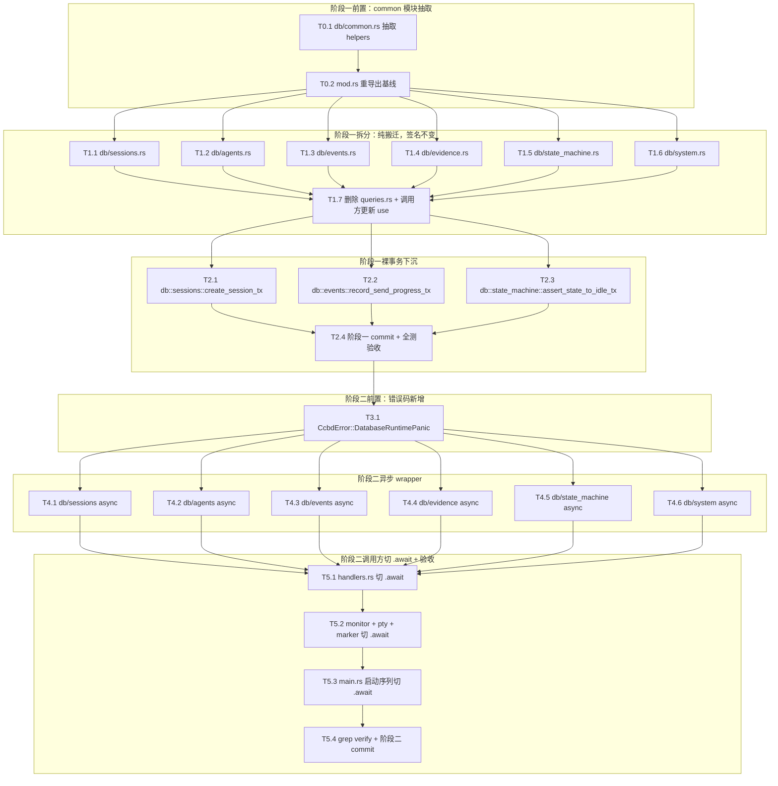

# Kiro Tasks: MVP 5 (内核硬化)

> **文档定位**：MVP 5 由 Codex 逐项实施的原子任务清单。每个任务必须独立编译、独立验证。严格按 `mvp5-D.md` 落地，禁止引入 MVP5 外能力（不动 RPC、不动状态机、不动 schema）。**两阶段必须独立 commit**：阶段一（G0-G2）一个 commit，阶段二（G3-G5）另一个 commit。

---

## 1. 任务依赖与执行图谱



---

## 2. 原子任务定义（阶段一）

### T0.1: 抽取 `db/common.rs`

* **依赖前置**: 无
* **设计输入**: `mvp5-D.md §2.1, §2.2`
* **输出产物**: `src/db/common.rs`（新文件，~30 行）
* **执行步骤**:
  1. 新建 `src/db/common.rs`
  2. 把 `src/db/queries.rs:10-29` 的三个私有 helper 函数（`is_constraint_error` / `is_unique_constraint_error` / `map_db_error`）整体搬到 `common.rs`
  3. 三个函数签名加 `pub(crate)`（原 `queries.rs` 内同模块可用，crate 内其他 db 子模块需要 `pub(crate)` 暴露）
  4. `common.rs` 加必要 `use` 引入（`rusqlite::Error as SqlError`、`crate::error::CcbdError`）
  5. **保留** `queries.rs` 内这三个函数的旧定义不删（后续 G1 任务搬其他函数时会复用，等所有领域函数搬完再统一清 `queries.rs`）
* **独立验收**: `cargo check` 通过；`cargo test --quiet` 全绿（91 + acceptance 全过，与 main 一致）

### T0.2: `db/mod.rs` 重导出基线

* **依赖前置**: T0.1
* **设计输入**: `mvp5-D.md §2.1`
* **输出产物**: `src/db/mod.rs` 修改
* **执行步骤**:
  1. `mod.rs` 内新增 `pub mod common;`（即使 common.rs 是 `pub(crate)` helpers，模块本身要 `pub mod` 否则 sibling 子模块无法 use）
  2. 不要在 `mod.rs` 重导出 common 内的具体函数——子模块自己 `use crate::db::common::map_db_error`
  3. 暂不动 `pub mod queries;`（queries.rs 还在）
* **独立验收**: `cargo check` 通过；后续 T1.x 任务能 `use crate::db::common::*`

---

### T1.1: `db/sessions.rs` 搬迁 + 单测同步

* **依赖前置**: T0.2
* **设计输入**: `mvp5-D.md §2.2 行号 :30 → sessions.rs`
* **输出产物**: `src/db/sessions.rs`（新文件）
* **执行步骤**:
  1. 新建 `src/db/sessions.rs`，把 `queries.rs:30-51` 的 `pub fn insert_session` 整体搬入（**签名一字不改**）
  2. 加 `use crate::db::common::map_db_error;` + `use crate::error::CcbdError;` + `use rusqlite::*;` 必要引入
  3. `mod.rs` 加 `pub mod sessions;`
  4. **暂不删** `queries.rs` 里的旧 `insert_session`——T1.7 统一清
  5. 把 `queries.rs` 里 `insert_session` 周边的 `mod tests` 中相关测试同步搬入 `sessions.rs::tests`，保持测试代码不改一行（仅改 use 路径指向 `super::insert_session`）
* **独立验收**: `cargo test --lib db::sessions --quiet` 通过；`cargo test --quiet` 整体仍全绿（旧 `queries::insert_session` 和新 `sessions::insert_session` 同时存在不冲突，因为同名函数在不同模块）

### T1.2: `db/agents.rs` 搬迁

* **依赖前置**: T0.2
* **设计输入**: `mvp5-D.md §2.2 行号 :52 / :75 / :143 / :167 / :457 / :465 / :505 → agents.rs`
* **输出产物**: `src/db/agents.rs`
* **执行步骤**:
  1. 新建 `src/db/agents.rs`，搬入 7 个函数（`insert_agent` / `update_agent_state` / `query_agent` / `query_agent_state` / `delete_agent` / `mark_agent_killed` / `mark_agent_crashed_with_exit`）
  2. 同步搬运对应单测到 `agents.rs::tests`
  3. `mod.rs` 加 `pub mod agents;`
  4. 文件总行数应在 240 ± 30 行，全部 ≤ 300 行硬约束
* **独立验收**: `cargo test --lib db::agents --quiet` 通过；整体 `cargo test` 全绿

### T1.3: `db/events.rs` 搬迁

* **依赖前置**: T0.2
* **设计输入**: `mvp5-D.md §2.2 行号 :89 / :112 / :429 → events.rs`
* **输出产物**: `src/db/events.rs`
* **执行步骤**: 同 T1.2，搬入 3 个函数（`query_event_by_request_id` / `insert_event` / `query_events_since`）
* **独立验收**: 同上

### T1.4: `db/evidence.rs` 搬迁

* **依赖前置**: T0.2
* **设计输入**: `mvp5-D.md §2.2 行号 :229 / :250 → evidence.rs`
* **输出产物**: `src/db/evidence.rs`
* **执行步骤**: 同 T1.2，搬入 2 个函数（`query_evidence_by_id` / `update_evidence_status`）
* **独立验收**: 同上

### T1.5: `db/state_machine.rs` 搬迁

* **依赖前置**: T0.2
* **设计输入**: `mvp5-D.md §2.2 行号 :178 / :350 → state_machine.rs`
* **输出产物**: `src/db/state_machine.rs`
* **执行步骤**: 同 T1.2，搬入 2 个函数（`mark_agent_idle_matched` / `mark_agent_unknown`）
* **独立验收**: 同上

### T1.6: `db/system.rs` 搬迁

* **依赖前置**: T0.2
* **设计输入**: `mvp5-D.md §2.2 行号 :263 / :550 / :588 / :640 → system.rs`
* **输出产物**: `src/db/system.rs`
* **执行步骤**: 同 T1.2，搬入 4 个函数（`system_dump_query` / `cascade_kill_session_agents` / `reconcile_startup` / `reconcile_active_agents_to_crashed`）
* **独立验收**: 同上

### T1.7: 删除 `queries.rs` + 调用方更新 use

* **依赖前置**: T1.1 ~ T1.6
* **设计输入**: `mvp5-D.md §2.4`
* **输出产物**:
  - `src/db/queries.rs` 删除
  - `src/db/mod.rs` 移除 `pub mod queries;`
  - 7 个调用方文件（`src/main.rs` / `src/rpc/handlers.rs` / `src/monitor/agent_watch.rs` / `src/monitor/master_watch.rs` / `src/marker/timer.rs` / `src/marker/matcher.rs` / `tests/mvp*_acceptance.rs`）的 `use` 路径全部改写
* **执行步骤**:
  1. `git rm src/db/queries.rs`
  2. `mod.rs` 删 `pub mod queries;`
  3. 按 D §2.4 表格逐文件改 use 路径
  4. `cargo build` 直到无错（编译器会全量报告每个未解析的旧路径）
  5. `cargo test --quiet`
* **独立验收**: 文件不存在 `ls src/db/queries.rs` 应失败；`cargo test --quiet` 全绿，与 main 一致

---

### T2.1: `db::sessions::create_session_tx` 下沉（修订版）

* **依赖前置**: T1.7
* **设计输入**: `mvp5-D.md §2.3.1`（修订版，Direction E）
* **输出产物**: `src/db/sessions.rs` 新增函数；`src/rpc/handlers.rs` 改写 `handle_session_create`
* **执行步骤**:
  1. `sessions.rs` 新增 `pub fn create_session_tx(db: &Db, session_id: &str, project_id: &str, absolute_path: &str, master_pid: i32) -> Result<OwnedFd, CcbdError>` 按 D §2.3.1 修订签名实现（**返回 OwnedFd**，不消费 caller 的 pidfd）
  2. **`monitor::pidfd_open` 在事务内调用**（D §2.3.1 关键决策 1）：失败 → tx drop ROLLBACK + 转 `IpcInvalidRequest("master_pid {} not alive")`
  3. 顺序：BEGIN IMMEDIATE → INSERT projects → pidfd_open（失败回滚）→ INSERT sessions → COMMIT → 返回 OwnedFd
  4. `handlers.rs::handle_session_create` 改为：调 `db::sessions::create_session_tx(...)?` 拿 OwnedFd → `try_clone()` → `monitor::register` + `spawn_master_pidfd_watch_task`
  5. `sessions.rs::tests` 加单测覆盖：a) 插入新 session 成功返回 OwnedFd；b) project 已存在不冲突；c) master_pid 不存活时返回 `IpcInvalidRequest` + projects 也回滚（用一个不存在的高 pid 触发）
* **独立验收**: `cargo test --lib db::sessions::tests --quiet` 通过；mvp2/3/4 acceptance 跑 `agent.spawn` 路径全绿（`session.create` 是 spawn 前置）；`grep monitor::pidfd_open src/rpc/handlers.rs` 返回 0 行（pidfd_open 已下沉到 db 层）

### T2.2: `db::events::record_send_progress_tx` 下沉

* **依赖前置**: T1.7
* **设计输入**: `mvp5-D.md §2.3.2`
* **输出产物**: `src/db/events.rs` 新增函数；`src/rpc/handlers.rs::handle_agent_send` 改写
* **执行步骤**:
  1. `events.rs` 新增 `pub fn record_send_progress_tx(...)` 按 D §2.3.2 签名
  2. 搬迁 `handlers.rs::handle_agent_send:373-394` 的事务到 `record_send_progress_tx`
  3. `handlers.rs` 内调用替换为 `db::events::record_send_progress_tx(&ctx.db, seq_id, &final_payload, agent_id, write_result.is_ok())?`
  4. `events.rs::tests` 加单测：write 成功路径（agent state 转 BUSY）+ write 失败路径（agent state 不变）+ CRASHED 状态被 WHERE 过滤
* **独立验收**: `cargo test --lib db::events::tests --quiet` 通过；`mvp3_acceptance` 全绿（agent.send 是 mvp3 主流程）

### T2.3: `db::state_machine::assert_state_to_idle_tx` 下沉

* **依赖前置**: T1.7
* **设计输入**: `mvp5-D.md §2.3.3`
* **输出产物**: `src/db/state_machine.rs` 新增函数；`src/rpc/handlers.rs::handle_agent_assert_state` 改写
* **执行步骤**:
  1. `state_machine.rs` 新增 `pub struct AssertStateOutcome { pub state_change_seq_id: i64 }`
  2. 新增 `pub fn assert_state_to_idle_tx(...)` 按 D §2.3.3 8 步语义实现，**整事务在单 `transaction_with_behavior(Immediate)` 边界**
  3. 搬迁 `handlers.rs::handle_agent_assert_state:445+` 的事务到 `assert_state_to_idle_tx`
  4. `handlers.rs` 改为：调 `assert_state_to_idle_tx(...)?` 拿 `AssertStateOutcome`，然后组装 RPC 响应
  5. `state_machine.rs::tests` 加单测：
     - evidence 不存在 → `DbEvidenceNotFound`
     - evidence agent_id mismatch → `DbEvidenceNotFound`
     - agent state != UNKNOWN → `AgentWrongState`
     - 正常路径 → state_change seq_id 返回 + agents 改 IDLE_Asserted + evidence 改 REVIEWED
* **独立验收**: `cargo test --lib db::state_machine::tests --quiet` 通过；`mvp4_acceptance` 全绿（assert_state 是 mvp4 主流程）

### T2.4a: handlers.rs 散落 SQL 下沉（Codex Round 1 反馈采纳）

* **依赖前置**: T1.7
* **设计输入**: `mvp5-D.md §2.3.4`
* **输出产物**: `src/db/agents.rs` / `src/db/sessions.rs` / `src/db/evidence.rs` 新增 helper 函数；`src/rpc/handlers.rs` 移除所有直接 rusqlite API 调用
* **执行步骤**:
  1. `agents.rs` 新增 `pub fn agent_exists(conn: &Connection, agent_id: &str) -> Result<bool, CcbdError>`（封装 `query_row` existence check）
  2. `sessions.rs` 新增 `pub fn session_exists(conn: &Connection, session_id: &str) -> Result<bool, CcbdError>`
  3. `evidence.rs` 新增 `pub fn discard_evidence_tx(db: &Db, evidence_id: &str) -> Result<(), CcbdError>`（封装 `handle_agent_discard_evidence` 的入参校验 + UPDATE）
  4. `handle_agent_spawn`（handlers.rs:86+）改用 `db::agents::agent_exists` + `db::sessions::session_exists`，移除直接 `conn.query_row`
  5. `handle_agent_discard_evidence` 改用 `db::evidence::discard_evidence_tx`
  6. **此时不必动 `handle_agent_assert_state` 的 SELECT/INSERT** —— 它们已经在 T2.3 的 `assert_state_to_idle_tx` 事务内（按 D §2.3.4.b 的处置），但 T2.3 的实施步骤需要确保 evidence 校验 SELECT 也搬入 db 层（在事务前部）
  7. 全部下沉完，跑 D §3.6 第 3 项的 grep 命令验证 handlers.rs 内 0 行裸 SQL
* **独立验收**: `cargo test --quiet` 全绿；handlers.rs 内 `grep -nE 'rusqlite::|TransactionBehavior::|conn\.(execute|transaction|query_row|query_map|prepare)|OptionalExtension'` 返回 0 行（不含 #[cfg(test)] 区段）

### T2.4: 阶段一 commit + 全测验收

* **依赖前置**: T2.1 / T2.2 / T2.3 / T2.4a
* **设计输入**: `mvp5-D.md §2.5 + §3.6 修订验收脚本`
* **输出产物**: 一个 git commit
* **执行步骤**:
  1. `cargo test --quiet 2>&1 | tail -30` 验证全绿（91 + acceptance 与 main 一致）
  2. 跑 D §3.6 第 4 项验收脚本（有效代码行数 ≤ 300）
  3. 跑 D §3.6 第 3 项验收脚本（handlers.rs 内零裸 SQL，含 query_row/query_map/prepare/OptionalExtension）
  4. `git status` 确认工作树没有意外文件改动；`git add src/db/ src/rpc/handlers.rs src/main.rs src/monitor/ src/marker/ tests/`
  5. commit message: `refactor(mvp5): G0-G2 split db/queries.rs by domain + sink raw txn from handlers`
* **独立验收**: 单 commit + `cargo test` 全绿 + 第 3 项 + 第 4 项 grep 验收全过 0 行

---

## 3. 原子任务定义（阶段二）

### T3.1: `CcbdError::DatabaseRuntimePanic` 新增

* **依赖前置**: T2.4
* **设计输入**: `mvp5-D.md §3.1, §4.1, §4.3`
* **输出产物**: `src/error.rs` 修改
* **执行步骤**:
  1. `CcbdError` enum 新增 `DatabaseRuntimePanic { details: String }`
  2. `to_rpc_error()` 加分支返回 `error_code="DB_RUNTIME_PANIC"`、`code: -32000`
  3. round-trip 单测：构造 → to_rpc_error → 校验 code/error_code/details 透传
* **独立验收**: `cargo test error::tests --quiet` 通过；不影响其他测试

### T3.2: `db/common.rs::spawn_db` 统一 helper（Codex Round 1 non-blocking 建议采纳）

* **依赖前置**: T3.1
* **设计输入**: `mvp5-D.md §8 Q6`
* **输出产物**: `src/db/common.rs` 新增 helper
* **执行步骤**:
  1. `common.rs` 新增：

     ```rust
     pub(crate) async fn spawn_db<T, F>(op: &'static str, f: F) -> Result<T, CcbdError>
     where
         F: FnOnce() -> Result<T, CcbdError> + Send + 'static,
         T: Send + 'static,
     {
         tokio::task::spawn_blocking(f)
             .await
             .map_err(|join_err| CcbdError::DatabaseRuntimePanic {
                 details: format!("{op}: {join_err}"),
             })?
     }
     ```
  2. T4.x 系列每个 async wrapper 都用 `spawn_db("create_session", move || { ... })` 形式调用，错误码文案统一含 op 名
* **独立验收**: `cargo build` 通过；T4.x 实施时 wrapper 代码量大幅减少

---

### T4.1 ~ T4.6: 各 db 子模块添加 async wrapper

每个子模块走相同模板，命名按 `mvp5-D.md §3.3`：

#### T4.1: `db/sessions.rs` async 化

* **依赖前置**: T3.1
* **设计输入**: `mvp5-D.md §3.2, §3.3`
* **输出产物**: `src/db/sessions.rs` 追加 async wrapper
* **执行步骤**:
  1. 把现有 `pub fn create_session_tx` 改为 `pub(crate) fn create_session_tx`
  2. 新增 `pub async fn create_session(db: Db, session_id: String, project_id: String, absolute_path: String, master_pid: i32, master_pidfd: PidFdHandle) -> Result<(), CcbdError>`，内部 `tokio::task::spawn_blocking + map JoinError`
  3. 同样模式：`pub fn insert_session` 保持 `pub(crate)`，新增 `pub async fn insert_session_async`
* **独立验收**: `cargo build` 通过；同步层单测仍绿

#### T4.2: `db/agents.rs` async 化

* **依赖前置**: T3.1
* **设计输入**: `mvp5-D.md §3.2, §3.3`
* **输出产物**: 同步 7 函数全部加 `_async` wrapper
* **执行步骤**: 按 §3.2 模板套 7 个函数；签名按 D §3.3 表
* **独立验收**: `cargo build` 通过；同步层单测仍绿

#### T4.3: `db/events.rs` async 化

* **依赖前置**: T3.1
* **设计输入**: 同上
* **输出产物**: 同步 4 函数（含 `record_send_progress_tx`）全部加 async wrapper
* **执行步骤**: 同上
* **独立验收**: 同上

#### T4.4: `db/evidence.rs` async 化

* **依赖前置**: T3.1
* **设计输入**: 同上
* **输出产物**: 同步 2 函数加 async wrapper
* **执行步骤**: 同上
* **独立验收**: 同上

#### T4.5: `db/state_machine.rs` async 化

* **依赖前置**: T3.1
* **设计输入**: 同上
* **输出产物**: 同步 3 函数（`mark_agent_idle_matched` / `mark_agent_unknown` / `assert_state_to_idle_tx`）加 async wrapper
* **执行步骤**: 同上
* **独立验收**: 同上

#### T4.6: `db/system.rs` async 化

* **依赖前置**: T3.1
* **设计输入**: 同上
* **输出产物**: 同步 4 函数加 async wrapper
* **执行步骤**: 同上。`reconcile_active_agents_to_crashed(&mut Connection)` 因为入参是 `&mut Connection` 不持 Db，**不**出 async wrapper（仅 `reconcile_startup` 内部调用）
* **独立验收**: 同上

---

### T5.1: `handlers.rs` 切 `.await`

* **依赖前置**: T4.1 ~ T4.6
* **设计输入**: `mvp5-D.md §3.4, §3.5`
* **输出产物**: `src/rpc/handlers.rs` 全面替换 `db.conn()` + 同步 db 调用为 `db::*_async(...).await`
* **执行步骤**:
  1. 每个 `pub async fn handle_*` 内部，把所有 `let conn = ctx.db.conn();` + 同步 db 函数调用替换为 `db::<domain>::<fn>_async(ctx.db.clone(), args...).await?`
  2. 注意：`Db` 的 `clone()` 是 `Arc::clone`，廉价；不要担心性能
  3. **人工 review §3.5 三个事务路径**（agent.send / agent.assert_state / mark_agent_unknown）：每个事务必须在单 spawn_blocking 闭包内完整执行，禁止跨 await 拆事务
  4. `cargo test --quiet` 全绿
* **独立验收**: `cargo test --quiet` 全绿；`grep -n 'db\.conn()\|\.lock()\.unwrap()' src/rpc/handlers.rs` 返回 0 行

### T5.2: `monitor` + `marker` 切 `.await`（pty/tasks.rs 例外处理）

* **依赖前置**: T5.1
* **设计输入**: `mvp5-D.md §3.3 修订（PTY 例外）+ §3.4`
* **输出产物**: `src/monitor/agent_watch.rs` / `src/monitor/master_watch.rs` / `src/marker/timer.rs` / `src/marker/matcher.rs` 修改；`src/pty/tasks.rs` **不变**（合法 sync 例外）
* **执行步骤**:
  1. **monitor/agent_watch.rs / monitor/master_watch.rs / marker/timer.rs / marker/matcher.rs** 内所有 `db.conn()` + 同步 db 调用替换为 `_async(...).await`
  2. **`marker/timer.rs::mark_agent_unknown` 调用必须替换为 `mark_agent_unknown_async`**——这是 D §3.5 事务清单 #3，timer 跑在 tokio::spawn 异步上下文，必须走 async wrapper 不能阻塞 worker
  3. **`marker/matcher.rs::mark_agent_idle_matched` 同理**——D §3.5 事务清单 #4
  4. **`src/pty/tasks.rs` 整体不动**：该文件的 spawn_blocking 闭包是 PTY 阻塞 I/O 必需，闭包内继续直接调 sync db 接口（`db::events::insert_event` 等 `pub(crate)` sync 函数）。这是 R-PTY-EXEMPT-1 认可的合法例外
  5. 跑 D §3.6 第 5 项验收脚本：`grep -c "tokio::task::spawn_blocking" src/pty/tasks.rs` 应等于 1（且这一处包裹整个 reader loop）
* **独立验收**: `cargo test --quiet` 全绿；按 D §3.6 第 2 项的精准 grep（含 awk 排除 cfg(test)）扫 monitor / marker 路径返回 0 violation；pty/tasks.rs 内 `db::events::insert_event(...)` 调用保留（不改 _async），且整个 reader loop 仍在唯一一处 `spawn_blocking` 闭包内

### T5.3: `main.rs` 启动序列切 `.await`

* **依赖前置**: T5.2
* **设计输入**: `mvp5-D.md §3.4`
* **输出产物**: `src/main.rs:41` 调用改写
* **执行步骤**: `db::queries::reconcile_startup(&db)` → `db::system::reconcile_startup_async(db.clone()).await`（路径在 T1.7 已经改成 `db::system::reconcile_startup`）
* **独立验收**: `cargo build` 通过；daemon 启动行为不变

### T5.4: 阶段二最终 grep verify + commit

* **依赖前置**: T5.1 / T5.2 / T5.3
* **设计输入**: `mvp5-D.md §3.6` 修订版（5 项验收）
* **输出产物**: 一个 git commit
* **执行步骤**:
  1. 跑 D §3.6 修订版的 5 个验收脚本：
     - 第 1 项 `cargo test --quiet` 全绿
     - 第 2 项 spawn_blocking 100% 覆盖（精准 grep + awk 排除 cfg(test)）
     - 第 3 项 handlers.rs 零裸 SQL（扩展模式 + 排除 cfg(test)）
     - 第 4 项 文件有效代码 ≤ 300 行
     - 第 5 项 pty/tasks.rs 例外校验（恰好 1 处 spawn_blocking）
  2. 5 项全过
  3. `git status` 确认工作树干净，没有意外文件改动
  4. `git add src/`
  5. commit message: `refactor(mvp5): G3-G5 wrap db calls with spawn_blocking + add DB_RUNTIME_PANIC`
* **独立验收**: 单 commit + 5 项验收全过

---

## 4. 验收命令快速参考

```bash
# 总测试
cargo test --quiet 2>&1 | tail -30

# AC2 文件大小
wc -l src/db/*.rs

# AC3 handlers 内零裸 SQL
grep -nE 'rusqlite::|TransactionBehavior::|conn\.execute|conn\.transaction' src/rpc/handlers.rs

# AC4 spawn_blocking 100% 覆盖
grep -n 'db\.conn()\|\.lock()\.unwrap()' src/rpc/handlers.rs src/monitor/ src/pty/ src/marker/timer.rs src/marker/matcher.rs

# AC5 事务路径人工 review（不能 grep，靠 D §3.5 清单）

# AC6 错误码 round-trip
cargo test --lib error::tests::db_runtime_panic_round_trip --quiet
```

---

## 5. 失败回滚指南（采纳 Codex Round 1 non-blocking 建议安全化）

**前置条件**：执行任何 `git checkout --` / `git reset --hard` 之前，必须先 `git status`确认**本次 MVP5 实施工作树外没有用户的进行中改动**。如果发现非预期文件修改（不属于本任务的），**先报告主控不要执行回滚**——可能是用户的并行工作或意外改动，回滚会丢失。

| 失败时机 | 安全回滚步骤 |
|---|---|
| T0.x / T1.x 失败（未 commit）| 1) `git status` 确认仅 src/db/ + src/rpc/handlers.rs + src/main.rs + src/monitor/ + src/marker/ + tests/ 内文件被改 + 没有 `??` 用户文件；2) 执行 `git checkout -- src/db/ src/rpc/ src/main.rs src/monitor/ src/marker/ tests/`；3) `cargo test --quiet` 应回到 main 全绿基线 |
| T2.4 commit 后发现 fail | 1) `git log -1` 确认 HEAD 是 T2.4 的 commit；2) `git reset --soft HEAD~1`（保留改动到工作树，先看再决定丢弃）；3) 检查后再 `git checkout -- 路径` 丢弃 |
| T3.x / T4.x 失败（未 commit）| 同 T0.x 步骤但回到 T2.4 commit 后状态：`git checkout -- src/db/ src/error.rs` |
| T5.4 commit 后发现 fail | 1) `git log -1` 确认 HEAD 是 T5.4 commit；2) `git reset --soft HEAD~1` 保留改动；3) 检查后丢弃。**保留阶段一 commit（T2.4），不动它** |

阶段一通过但阶段二失败 = **不重做阶段二**，把 main 留在阶段一末态作为有价值的中间产物（巨石问题已解决，async 阻塞问题留待下次再做），等问题搞清楚再来。
