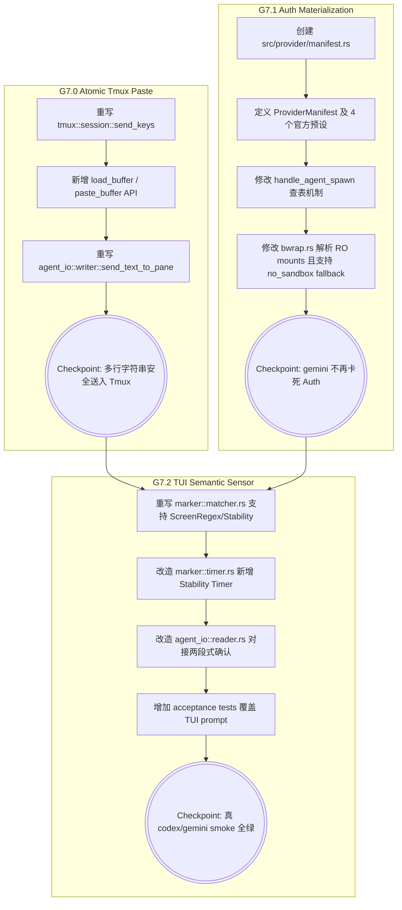

# Kiro Design: MVP 7 (语义对接与物化挂载 / The Semantic & Auth Pivot)

> **文档定位**：本文件是 ccbd-rust MVP 7 阶段的官方 D (Design) 规格。基于 mvp7-R.md 的边界要求，为 Codex 实施提供**无歧义落地蓝图**。核心：重写 Tmux Send 机制以支持多行原子粘贴，引入 ProviderManifest 全局注册表进行鉴权目录挂载，并升级 Marker 为 TUI 感知的全屏观察机制。

---

## 1. 总体路线图与依赖拓扑

本阶段划分为三个解耦的物理手术区。



---

## 2. Cargo.toml 依赖变更

由于需要使用全局的 LazyLock 映射表，如果项目低于 Rust 1.80 则需要引入 `once_cell`，但考虑到 `ccbd-rust` 基于 Edition 2024 (Rust >= 1.85)，标准库已经有 `std::sync::LazyLock`，因此**无需增加外部依赖**。

保持 Cargo.toml 原状。

---

## 3. `src/tmux/session.rs` 扩展 (G7.0)

向 `TmuxServer` 增加 `load-buffer` 与 `paste-buffer` 原语，用于支持 Bracketed Paste。

### 3.1 Tmux 同步原语扩展

```rust
// src/tmux/session.rs
impl TmuxServer {
    // ... 现有方法
    
    pub(crate) fn load_buffer_sync(&self, buffer_name: &str, text: &str) -> Result<(), CcbdError> {
        use std::process::{Command, Stdio};
        use std::io::Write;

        let mut child = Command::new("tmux")
            .args(["-L", &self.socket_name, "load-buffer", "-b", buffer_name, "-"])
            .stdin(Stdio::piped())
            .spawn()
            .map_err(|err| CcbdError::TmuxCommandFailed {
                cmd: format!("load-buffer -b {buffer_name}"),
                stderr: format!("spawn failed: {err}"),
                exit: -1,
            })?;

        if let Some(mut stdin) = child.stdin.take() {
            if let Err(err) = stdin.write_all(text.as_bytes()) {
                let _ = child.kill();
                return Err(CcbdError::TmuxCommandFailed {
                    cmd: format!("load-buffer -b {buffer_name} (stdin write)"),
                    stderr: format!("pipe failed: {err}"),
                    exit: -1,
                });
            }
        }

        let output = child.wait_with_output().map_err(|err| CcbdError::TmuxCommandFailed {
            cmd: format!("load-buffer -b {buffer_name} (wait)"),
            stderr: err.to_string(),
            exit: -1,
        })?;

        if !output.status.success() {
            return Err(CcbdError::TmuxCommandFailed {
                cmd: format!("load-buffer -b {buffer_name}"),
                stderr: String::from_utf8_lossy(&output.stderr).into_owned(),
                exit: output.status.code().unwrap_or(-1),
            });
        }
        Ok(())
    }

    pub(crate) fn paste_buffer_sync(&self, pane: &TmuxPaneId, buffer_name: &str) -> Result<(), CcbdError> {
        let output = std::process::Command::new("tmux")
            .args(["-L", &self.socket_name, "paste-buffer", "-p", "-t", &pane.0, "-b", buffer_name])
            .output()
            .map_err(|e| CcbdError::TmuxCommandFailed { ... })?;
        
        if !output.status.success() {
             return Err(CcbdError::TmuxCommandFailed { ... });
        }
        Ok(())
    }

    pub(crate) fn delete_buffer_sync(&self, buffer_name: &str) {
        let _ = std::process::Command::new("tmux")
            .args(["-L", &self.socket_name, "delete-buffer", "-b", buffer_name])
            .output();
    }
}
```

### 3.2 Async Wrapper

```rust
// src/tmux/session.rs
impl TmuxServer {
    pub async fn load_buffer(&self, buffer_name: String, text: String) -> Result<(), CcbdError> {
        let server = self.clone();
        crate::db::common::spawn_db("tmux::load_buffer", move || {
            server.load_buffer_sync(&buffer_name, &text)
        }).await
    }
    
    pub async fn paste_buffer(&self, pane: TmuxPaneId, buffer_name: String) -> Result<(), CcbdError> { ... }
    
    pub async fn delete_buffer(&self, buffer_name: String) { ... }
}
```

**关键设计决断 1 答复：Tmux Buffer 命名**
建议使用 `agent_id`。格式：`ccbd-buf-<agent_id>`。
理由：因为并发的 `agent.send` 都是通过 `request_id` 的 DB 判断实现并发锁的（同一时刻只有一个 PENDING 的 request），因此同一个 agent_id 在同一时刻只可能发生一次 paste，这样复用 buffer 名字是原子的。即使因为极端情况发生了遗留，覆盖也是安全的。

---

## 4. `src/agent_io/writer.rs` 重写 (G7.0)

废弃原有的 `split('\n') + keysym(Enter)`，改用原子的 Buffer 机制。

```rust
use crate::error::CcbdError;
use crate::tmux::{TmuxPaneId, TmuxServer};
use std::sync::Arc;

pub async fn send_text_to_pane(
    tmux: Arc<TmuxServer>,
    agent_id: &str,
    pane: TmuxPaneId,
    text: String,
) -> Result<(), CcbdError> {
    let buffer_name = format!("ccbd-buf-{}", agent_id);

    // 1. Load buffer
    tmux.load_buffer(buffer_name.clone(), text).await?;

    // 2. Paste buffer (-p 参数已在 tmux::session 中写死)
    let paste_result = tmux.paste_buffer(pane, buffer_name.clone()).await;

    // 3. Unconditional Cleanup
    // 关键设计决断 2 答复：必须无条件清理，以免 tmux server 内存储存过多无用的大段代码。
    tmux.delete_buffer(buffer_name).await;

    paste_result
}
```

---

## 5. `src/provider/manifest.rs` 新模块 (G7.1)

创建注册表，解决沙盒挂载和鉴权缺失的问题。

### 5.1 数据结构

```rust
// src/provider/manifest.rs
use std::collections::HashMap;
use std::sync::LazyLock;

#[derive(Debug, Clone)]
pub struct ProviderManifest {
    pub provider_name: &'static str,
    /// 相对于 $HOME 的相对路径，如果是绝对路径则直接使用。
    pub auth_mount_paths: Vec<&'static str>, 
    /// 匹配策略：LineEndRegex | ScreenRegex | ObservedStability
    pub idle_detection_mode: IdleDetectionMode,
    /// 正则表达式
    pub marker_pattern: &'static str,
    /// 稳定时长 (ms)
    pub stability_ms: u64,
}

#[derive(Debug, Clone, Copy, PartialEq, Eq)]
pub enum IdleDetectionMode {
    /// 原来的逻辑：只在最后 N 行找正则
    LineEndRegex,
    /// 全屏正则匹配 + 稳定防抖
    ObservedStability,
}
```

### 5.2 全局硬编码注册表
**关键设计决断 5 和 6 答复：配置项**

```rust
pub static MANIFESTS: LazyLock<HashMap<&'static str, ProviderManifest>> = LazyLock::new(|| {
    let mut m = HashMap::new();

    m.insert("bash", ProviderManifest {
        provider_name: "bash",
        auth_mount_paths: vec![],
        idle_detection_mode: IdleDetectionMode::LineEndRegex,
        marker_pattern: r"[\$#>✦]\s*$",
        stability_ms: 0,
    });

    m.insert("codex", ProviderManifest {
        provider_name: "codex",
        // 旧 ccb materializer 包含 ~/.codex, 以及可能配置的 gcloud
        auth_mount_paths: vec![".codex", ".config/gcloud"], 
        idle_detection_mode: IdleDetectionMode::ObservedStability,
        marker_pattern: r">_\s*Codex", // Codex TUI 特有 Prompt
        stability_ms: 300, 
    });

    m.insert("gemini", ProviderManifest {
        provider_name: "gemini",
        auth_mount_paths: vec![".config/gemini", ".config/gcloud"],
        idle_detection_mode: IdleDetectionMode::ObservedStability,
        marker_pattern: r"✦", // Gemini TUI 悬浮 Prompt
        stability_ms: 300,
    });

    m.insert("claude", ProviderManifest {
        provider_name: "claude",
        auth_mount_paths: vec![".anthropic", ".claude"],
        idle_detection_mode: IdleDetectionMode::ObservedStability,
        marker_pattern: r"▶", // Claude TUI 常见 Prompt
        stability_ms: 300,
    });

    m
});

pub fn get_manifest(provider: &str) -> Option<ProviderManifest> {
    MANIFESTS.get(provider).cloned()
}
```

**关键设计决断 4 答复：Observed Stability 默认值**
`300ms` 是合理的。对于 TUI，画屏本身存在不可见的清屏重绘阶段。300ms 既不会让人类感到明显的交互延迟（通常 >500ms 才会觉得慢），又能有效规避转圈动画或零碎的 stdout `write()` 拆包引发的误触发。

---

## 6. `src/sandbox/bwrap.rs` 改造 (G7.1)

让沙盒理解 Manifest。

### 6.1 `build_args` 签名更新
修改为接受 `manifest: Option<&ProviderManifest>` 参数。

### 6.2 RO Bind 解析逻辑
在追加 `--ro-bind` 之前，必须动态检查宿主路径是否存在。

```rust
// src/sandbox/bwrap.rs
pub fn build_args(
    sandbox_dir: &Path, 
    overrides: &SandboxOverrides,
    manifest: Option<&ProviderManifest>,
) -> Result<Vec<String>, CcbdError> {
    // ... 原有逻辑

    if let Some(mf) = manifest {
        let home = std::env::var("HOME").unwrap_or_default();
        if !home.is_empty() {
            let home_path = PathBuf::from(home);
            for rel_path in &mf.auth_mount_paths {
                let host_path = home_path.join(rel_path);
                if host_path.exists() && host_path.is_dir() {
                    let host_str = host_path.display().to_string();
                    args.extend(vec![
                        "--ro-bind".into(), 
                        host_str.clone(), 
                        host_str
                    ]);
                }
            }
        }
    }

    Ok(args)
}
```

### 6.3 unsafe_no_sandbox 的特殊处理
虽然 MVP2 设定中 `unsafe_no_sandbox=true` 会跳过 `bwrap` 拼接直接返回原始命令，但真实 Provider 在这种裸奔状态下会丢失 `HOME`（因为系统服务上下文环境不同）。我们需要在 `systemd::wrap_command` 里确保补齐环境变量。旧代码已由 systemd 隐式继承，不需额外处理，但若发生 `HOME` 不对，可加 `Environment=HOME=...` 到 systemd 参数里。

---

## 7. `src/marker/matcher.rs` 改造 (G7.2)

让 Matcher 理解两种截然不同的探测语义。

### 7.1 Enum 升级

```rust
// src/marker/matcher.rs
use regex::Regex;
use crate::provider::manifest::IdleDetectionMode;

pub struct MarkerMatcher {
    mode: IdleDetectionMode,
    regex: Regex,
}

impl MarkerMatcher {
    pub fn from_manifest(manifest: &crate::provider::manifest::ProviderManifest) -> Self {
        Self {
            mode: manifest.idle_detection_mode,
            regex: Regex::new(manifest.marker_pattern).expect("invalid manifest regex"),
        }
    }

    pub fn scan(&self, parser: &vt100::Parser) -> MatchResult {
        match self.mode {
            IdleDetectionMode::LineEndRegex => {
                // 原有逻辑: 取倒数 20 行看是否匹配结尾
                let contents = parser.screen().contents();
                if self.scan_lines(contents.lines().rev().take(20)) {
                    MatchResult::Matched
                } else {
                    MatchResult::NoMatch
                }
            }
            IdleDetectionMode::ObservedStability => {
                // 关键设计决断 3 答复：全屏正则
                // vt100 的 contents_formatted() 包含转义，但 contents() 是纯文本 String。
                // 虽然全屏 String (~40KB) 跑一次正则理论上有开销，但我们是在 async task 
                // 的独立作用域内，不阻塞主线程。且底层正则表达式引擎有 DFA 优化，匹配 
                // 40KB 纯文本只在亚毫秒级，比“每行分割再去头去尾匹配”效率更高且不容易被排版换行截断。
                let contents = parser.screen().contents();
                if self.regex.is_match(&contents) {
                    MatchResult::Matched
                } else {
                    MatchResult::NoMatch
                }
            }
        }
    }
}
```

---

## 8. `src/marker/timer.rs` 改造 (G7.2)

增加两段式确认（命中 -> 等待 -> 确认）。

**关键设计决断 7 答复：异步上下文中的 Stability Timer**
因为 reader 已经是 Tokio Async Task，我们不能用传统的阻塞 `sleep`。最合理的解法是：**不把 Stability 放入 `timer.rs`，而是直接内化在 `agent_io::reader::spawn_agent_io_reader_task` 的控制流里**。

### 8.1 取消旧计时器改动，在 Reader 里接管防抖

在 `src/agent_io/reader.rs` 中的 tokio task loop：

```rust
// src/agent_io/reader.rs
use tokio::time::{timeout, Duration};

// loop 外部引入状态
let mut pending_stability_match: bool = false;
let stability_ms = manifest.map(|m| m.stability_ms).unwrap_or(0);

loop {
    // 1. 如果处于 pending_stability_match，采用带 Timeout 的读取
    let read_future = reader.read(&mut buf);
    let n = if pending_stability_match && stability_ms > 0 {
        match timeout(Duration::from_millis(stability_ms), read_future).await {
            Ok(Ok(0)) => continue,
            Ok(Ok(n)) => {
                // 收到新字节！打破了防抖稳定性。取消 pending。
                pending_stability_match = false;
                n
            }
            Ok(Err(e)) => break, // IOError
            Err(_) => {
                // 超时触发！代表 N 毫秒内没有任何新字节到来，正式确认 IDLE
                let _ = db::state_machine::mark_agent_idle_matched(db.clone(), agent_id.clone()).await;
                marker::registry::reset(&agent_id);
                pending_stability_match = false;
                continue; // 回到普通阻塞等待
            }
        }
    } else {
        // 普通阻塞读
        match read_future.await {
            Ok(0) => continue,
            Ok(n) => n,
            Err(_) => break,
        }
    };

    // 2. 将 n 喂入 parser 并落库 ...
    
    // 3. 扫描 Matcher
    if !pending_stability_match {
        let matched = {
            let p = parser.lock().unwrap();
            matcher.scan(&p) // matcher 已是 MarkerMatcher::from_manifest 初始化而来
        };
        
        if matched == MatchResult::Matched {
            if stability_ms > 0 {
                // 进入防抖等待期
                pending_stability_match = true;
            } else {
                // 0 防抖，立即 IDLE
                let _ = db::state_machine::mark_agent_idle_matched(db.clone(), agent_id.clone()).await;
                marker::registry::reset(&agent_id);
            }
        }
    }
}
```

这种方案完美融合了 Tokio 异步取消特性（`tokio::time::timeout` 内部会自动 cancel 放弃等待的 IO future，但这要求 `BufReader::read` 是 cancel-safe 的，这在 `tokio::io::AsyncRead` 的规范中是被允许的），不需要搞出极其复杂的交叉 channel。

---

## 9. `handle_agent_spawn` 集成 (G7.1 + G7.2)

```rust
// src/rpc/handlers.rs
async fn handle_agent_spawn(...) {
    // ...
    let provider_name = required_str(&params, "provider")?;
    let manifest = crate::provider::manifest::get_manifest(provider_name);
    
    let bwrap_args = build_args(&sandbox_dir, &overrides, manifest.as_ref())?;
    // ... 
    
    // 初始化 Matcher，传给 Reader
    let matcher = if let Some(ref m) = manifest {
        MarkerMatcher::from_manifest(m)
    } else {
        MarkerMatcher::default() // 回退默认
    };

    let reader_handle = spawn_agent_io_reader_task(
        agent_id.clone(),
        fifo_file,
        ctx.db.clone(),
        parser_handle.clone(),
        Arc::new(matcher), // 传入 matcher
        manifest.clone(),  // 传入以获取 stability_ms
    );
    // ...
}
```

---

## 10. mvp7_acceptance.rs 测试覆盖

增加 `tests/mvp7_acceptance.rs`。

- **G7.0 Atomic Paste**: 
  - `test_multiline_paste_preserves_newlines`：spawn `bash`，调用 `send` 发送 `"for i in 1 2; do\n  echo \"line $i\"\ndone\n"`。等待 IDLE 后，断言 DB 中捕获的 `output_chunk` 同时含有 `line 1` 和 `line 2`，且中间无中断提示。
- **G7.1 Auth Mount**:
  - `test_codex_auth_mount_passthrough`：创建虚假的 `~/.codex/` 结构。通过 `agent.spawn` 启动带 `codex` manifest 的 `bash`，执行 `cat ~/.codex/mock_token`，断言输出正常（证明 RO bind 生效）。
- **G7.2 Observed Stability**:
  - `test_stability_timer_cancels_on_noise`：模拟终端输出 ✦ 后立刻在 50ms 内接续大量字符（代表假 Prompt），验证系统并不会切入 IDLE。

---

## 11. 兼容性矩阵与实施时长

| 接口维度 | 状态 | 备注 |
|---|---|---|
| RPC Schema | ✅ 100% 兼容 | 发送多行的 Payload 无变化 |
| 状态机流转 | ✅ 100% 兼容 | 状态图不变，仅仅改变了触发 IDLE 的物理条件 |
| SQLite Schema | ✅ 100% 兼容 | |

**预期实施时长**：
- G7.0: 3 小时
- G7.1: 2 小时
- G7.2: 5 小时
- **总计**：10 小时（极高密度，建议保留 2 天缓冲期）。
