# Kiro Tasks: MVP 7 (语义对接与物化挂载)

> **文档定位**：MVP 7 由 Codex 逐项实施的原子任务清单。每个任务必须尽量独立 `cargo build` 通过、独立验证。严格按 `mvp7-R.md` / `mvp7-D.md` 落地，禁止引入 MVP7 范围外能力：不做 mailbox/job queue、不做 `ccb ask`、不做动态 TOML Provider 加载、不改 JSON-RPC schema、不改 SQLite schema。**三个子阶段独立 commit**：G7.0 / G7.1 / G7.2 各一个 commit。

> **实施顺序说明**：本文在不改变 D 文档设计决断的前提下，按"先建兼容层 → 切 caller → 加 acceptance → commit"的顺序微调落地步骤，避免出现 mvp6 G6.2 期间的中间态编译断裂。

---

## 1. 任务依赖与执行图谱

```mermaid
graph TD
  subgraph G70[G7.0 Atomic Tmux Paste]
    T01[T0.1 tmux load/paste/delete buffer sync 原语]
    T02[T0.2 tmux buffer async wrapper + 单测]
    T03[T0.3 writer 改用 paste-buffer + caller 签名同步]
    T04[T0.4 mvp7 paste acceptance + SC1]
    T05[T0.5 G7.0 commit]
    SC1(((SC1: 多行原子粘贴安全)))
  end

  subgraph G71[G7.1 Provider Registry + Auth Materialization]
    T11[T1.1 src/provider/manifest.rs + 4 个内置 manifest]
    T12[T1.2 bwrap build_args 接 manifest + auth ro-bind]
    T13[T1.3 handle_agent_spawn 查 manifest 并传给 bwrap]
    T14[T1.4 auth mount acceptance + SC2]
    T15[T1.5 G7.1 commit]
    SC2(((SC2: Provider Auth 物化)))
  end

  subgraph G72[G7.2 TUI Semantic Sensor]
    T21[T2.1 marker matcher 支持 IdleDetectionMode + from_manifest]
    T22[T2.2 reader 新增兼容配置入口，不切 caller]
    T23[T2.3 reader 内化 observed stability timeout/cancel]
    T24[T2.4 handle_agent_spawn 传 manifest matcher/stability 到 reader]
    T25[T2.5 stability acceptance + true smoke hooks + SC3]
    T26[T2.6 G7.2 commit]
    SC3(((SC3: Codex/Gemini TUI idle 语义可用)))
  end

  T01 --> T02 --> T03 --> T04 --> SC1 --> T05
  T05 --> T11 --> T12 --> T13 --> T14 --> SC2 --> T15
  T15 --> T21 --> T22 --> T23 --> T24 --> T25 --> SC3 --> T26
```



---

## 2. 原子任务定义（G7.0 Atomic Tmux Paste）

### T0.1: `TmuxServer` 增加 buffer sync 原语

* **依赖前置**: 无
* **设计输入**: `mvp7-D.md §3.1`，`mvp7-R.md AC1`
* **输出产物**: `src/tmux/session.rs`
* **执行步骤**:
  1. 在 `impl TmuxServer` 内新增 `load_buffer_sync(&self, buffer_name: &str, text: &str) -> Result<(), CcbdError>`。
  2. `load_buffer_sync` 必须用 `std::process::Command` + `Stdio::piped()`，执行：
     `tmux -L <socket> load-buffer -b <buffer_name> -`
  3. 通过 child stdin 写入 `text.as_bytes()`，禁止把 text 放入 argv，避免 ARG_MAX 和 shell escaping 风险。
  4. stdin 写失败时 kill child，并返回 `CcbdError::TmuxCommandFailed { cmd, stderr, exit: -1 }`。
  5. `wait_with_output()` 后，非 0 exit 映射为 `TmuxCommandFailed`，stderr 使用 tmux stderr。
  6. 新增 `paste_buffer_sync(&self, pane: &TmuxPaneId, buffer_name: &str) -> Result<(), CcbdError>`：
     `tmux -L <socket> paste-buffer -p -t <pane> -b <buffer_name>`。
  7. 新增 `delete_buffer_sync(&self, buffer_name: &str) -> Result<(), CcbdError>`：
     `tmux -L <socket> delete-buffer -b <buffer_name>`；delete 失败可返回错误，但 caller 后续会 best-effort 处理。
  8. 保留现有 `send_keys_literal_sync` / `send_keys_keysym_sync`，不删除，方便 tmux 低层测试和后续特殊按键能力。
* **独立验收**: `cargo build --quiet` 通过；`grep -n "load_buffer_sync\|paste_buffer_sync\|delete_buffer_sync" src/tmux/session.rs` 能看到 3 个 sync 原语。

### T0.2: tmux buffer async wrapper + tmux 单测

* **依赖前置**: T0.1
* **设计输入**: `mvp7-D.md §3.2`
* **输出产物**: `src/tmux/session.rs`，`src/tmux/mod.rs` tests
* **执行步骤**:
  1. 给 T0.1 三个 sync 原语加 async wrapper：
     - `pub async fn load_buffer(&self, buffer_name: String, text: String) -> Result<(), CcbdError>`
     - `pub async fn paste_buffer(&self, pane: TmuxPaneId, buffer_name: String) -> Result<(), CcbdError>`
     - `pub async fn delete_buffer(&self, buffer_name: String) -> Result<(), CcbdError>`
  2. wrapper 内统一用 `crate::db::common::spawn_db("tmux::load_buffer", move || ...)`，保持 tmux subprocess 不阻塞 Tokio worker。
  3. 新增 tmux 测试，开头 `which::which("tmux").expect("tmux binary required")`。
  4. 测试流程：temp state_dir → `TmuxServer::new` → ensure session → spawn bash pane → `load_buffer("ccbd-test", "printf 'a\\nb\\n'\\n")` → `paste_buffer(..., "ccbd-test")` → capture pane / FIFO 读输出 → `delete_buffer` → kill pane/server。
  5. 单测必须覆盖大文本或含引号文本，例如 `for i in 1 2; do\n  echo "line $i"\ndone\n`，证明 stdin load 不需要 shell escaping。
* **独立验收**: `cargo test --lib tmux --quiet` 通过；`cargo test --quiet` 不回归。

### T0.3: `agent_io::writer` 改用 paste-buffer + caller 签名同步

* **依赖前置**: T0.2
* **设计输入**: `mvp7-D.md §4`，`mvp7-R.md AC1`
* **输出产物**: `src/agent_io/writer.rs`，`src/rpc/handlers.rs`
* **执行步骤**:
  1. 修改 `send_text_to_pane` 签名为：
     `pub async fn send_text_to_pane(tmux: Arc<TmuxServer>, agent_id: &str, pane: TmuxPaneId, text: String) -> Result<(), CcbdError>`。
  2. buffer 名称使用 `format!("ccbd-buf-{agent_id}")`。如需要规避特殊字符，先确认 agent_id 已由现有 spawn 校验约束；若没有约束，则本任务内用 `replace(|c: char| !c.is_ascii_alphanumeric() && c != '_' && c != '-', "_")` 做本地安全化。
  3. 实现顺序：`load_buffer` → `paste_buffer` → `delete_buffer`。
  4. `delete_buffer` 必须在 paste 成功/失败后都 best-effort 执行：
     - `let paste_result = tmux.paste_buffer(...).await;`
     - `let cleanup_result = tmux.delete_buffer(...).await;`
     - 优先返回 `paste_result`；paste 成功但 cleanup 失败时只 `tracing::warn!`，不让业务 send 失败。
  5. 删除旧的 `text.split('\n') + send_keys_keysym("Enter")` 逻辑。
  6. 修改 `src/rpc/handlers.rs::handle_agent_send` 调用点：
     `send_text_to_pane(ctx.tmux_server.clone(), agent_id, pane_id, text.to_string()).await`。
  7. 保留 `record_send_progress` 事务语义不变：写入成功才转 BUSY，失败写 FAILED 并返回 `PtyIoError`。
* **独立验收**: `cargo build --quiet` 通过；`cargo test --lib agent_io --quiet` 通过；`grep -n "split('\\\\n')\|send_keys_keysym" src/agent_io/writer.rs` 返回 0 行。

### T0.4: 新增 mvp7 paste acceptance + SC1

* **依赖前置**: T0.3
* **设计输入**: `mvp7-D.md §10`，`mvp7-R.md AC1`
* **输出产物**: `tests/mvp7_acceptance.rs`
* **执行步骤**:
  1. 新建 `tests/mvp7_acceptance.rs`，复用 `tests/mvp6_acceptance.rs` 的 Harness 模式：temp DB + temp state_dir + `unsafe_no_sandbox=true` + `TmuxServer::new`。
  2. 增加 helper：
     - `insert_session`
     - `spawn_bash`
     - `send_text`
     - `wait_for_event`
     - `wait_for_state`
  3. 实现 `test_multiline_paste_preserves_newlines`：
     - spawn `bash`
     - send:
       ```text
       for i in 1 2; do
         echo "line $i"
       done
       ```
     - 等待输出事件包含 `line 1` 和 `line 2`
     - 等待 agent 回到 IDLE
  4. 断言 output_chunk 不应表现为逐行提前提交造成的 shell syntax error；至少检查 payload 不含 `syntax error near unexpected token`。
  5. 测试结束调用 `handle_agent_kill` cleanup。
* **独立验收**: `cargo test --test mvp7_acceptance test_multiline_paste_preserves_newlines --quiet` 通过；`cargo test --test mvp6_acceptance --quiet` 仍通过。

### T0.5: G7.0 commit

* **依赖前置**: T0.1 - T0.4
* **设计输入**: `mvp7-D.md §11`
* **输出产物**: 一个 git commit
* **执行步骤**:
  1. `cargo fmt`
  2. `cargo test --test mvp7_acceptance test_multiline_paste_preserves_newlines --quiet`
  3. `cargo test --test mvp6_acceptance --quiet`
  4. `cargo test --quiet`
  5. commit message: `feat(mvp7): G7.0 atomic tmux paste-buffer send`
* **独立验收**: 单 commit；SC1 通过；全测绿。

---

## 3. 原子任务定义（G7.1 Provider Registry + Auth Materialization）

### T1.1: 新建 `src/provider/manifest.rs` + 静态 ProviderManifest 注册表

* **依赖前置**: T0.5
* **设计输入**: `mvp7-D.md §5`，`mvp7-R.md AC4`
* **输出产物**: `src/provider/mod.rs`，`src/provider/manifest.rs`，`src/lib.rs`
* **执行步骤**:
  1. 新建 `src/provider/mod.rs`：
     `pub mod manifest;`
  2. `src/lib.rs` 加 `pub mod provider;`。
  3. 在 `src/provider/manifest.rs` 定义：
     ```rust
     #[derive(Debug, Clone)]
     pub struct ProviderManifest {
         pub provider_name: &'static str,
         pub auth_mount_paths: Vec<&'static str>,
         pub idle_detection_mode: IdleDetectionMode,
         pub marker_pattern: &'static str,
         pub stability_ms: u64,
     }
     ```
  4. 定义 `IdleDetectionMode`，先放在 `provider::manifest` 中：
     `LineEndRegex` / `ObservedStability`，derive `Debug, Clone, Copy, PartialEq, Eq`。
  5. 用 `std::sync::LazyLock<HashMap<&'static str, ProviderManifest>>` 定义 4 个内置 manifest：
     - `bash`: no auth mounts, `LineEndRegex`, pattern `r"[\$#>✦]\s*$"`, stability 0
     - `codex`: auth mounts `.codex`, `.config/gcloud`, `ObservedStability`, D 文档 codex pattern, stability 300
     - `gemini`: auth mounts `.config/gemini`, `.config/gcloud`, `ObservedStability`, pattern `r"✦"`, stability 300
     - `claude`: auth mounts `.anthropic`, `.claude`, `ObservedStability`, D 文档 claude pattern, stability 300
  6. 提供 `pub fn get_manifest(provider: &str) -> ProviderManifest`，未知 provider 返回 `bash` 风格 default manifest，但 `provider_name` 可保留为 `"bash"` 或 `"unknown"`；为减少 caller Option 分支，建议返回 manifest 而不是 Option。
  7. 单测覆盖：
     - 4 个 provider 均可查到
     - unknown provider 不 panic
     - codex/gemini auth_mount_paths 非空
     - bash stability_ms = 0
* **独立验收**: `cargo test --lib provider::manifest --quiet` 通过；`cargo build --quiet` 通过。

### T1.2: `bwrap::build_args` 接 manifest + 安全 auth ro-bind

* **依赖前置**: T1.1
* **设计输入**: `mvp7-D.md §6`，`mvp7-R.md AC2`
* **输出产物**: `src/sandbox/bwrap.rs`
* **执行步骤**:
  1. 修改签名：
     `pub fn build_args(sandbox_dir: &Path, overrides: &SandboxOverrides, manifest: Option<&ProviderManifest>) -> Result<Vec<String>, CcbdError>`。
  2. 更新 `bwrap.rs` 内全部测试调用，先传 `None`，确保旧测试语义不变。
  3. 在原有 baseline args 和 `extra_ro_binds` 后追加 manifest auth mounts。
  4. 获取 host HOME：`std::env::var_os("HOME")`；为空时跳过 manifest mounts，不报错。
  5. 对每个 `auth_mount_paths`：
     - 相对路径：`home.join(rel_path)`
     - 绝对路径：直接 `PathBuf::from(path)`
     - `exists()` 且 `is_dir()` 时才追加 ro-bind
     - 不存在时跳过，不报错
  6. 对 manifest 生成的 host_path 也调用安全校验：拒绝 `/etc/`, `/root`, `/proc`, `/sys`；路径非 UTF-8 返回 `SandboxMountFailed`。
  7. ro-bind 目的路径按 D 文档"同等位置"处理：`--ro-bind <host_path> <host_path>`。
  8. 单测：
     - 设置临时 HOME，创建 `.codex/mock_token`，codex manifest 会追加 `--ro-bind <tmp_home/.codex> <tmp_home/.codex>`
     - 不存在目录不追加
     - forbidden absolute path manifest 使用本地 test manifest 验证会失败
* **独立验收**: `cargo test --lib sandbox::bwrap --quiet` 通过；`cargo build --quiet` 通过。

### T1.3: `handle_agent_spawn` 集成 manifest 到 bwrap

* **依赖前置**: T1.2
* **设计输入**: `mvp7-D.md §9`，`mvp7-R.md AC2 / AC4`
* **输出产物**: `src/rpc/handlers.rs`
* **执行步骤**:
  1. 在 `handle_agent_spawn` 解析 `provider` 后调用：
     `let manifest = crate::provider::manifest::get_manifest(provider);`
  2. `unsafe_no_sandbox=true` 时仍然不调用 bwrap，不做 mount；manifest 仅留给 G7.2 reader 语义使用。
  3. `unsafe_no_sandbox=false` 时调用：
     `bwrap::build_args(dir, &overrides, Some(&manifest))`。
  4. 更新所有直接调用 `bwrap::build_args` 的生产代码和测试代码。
  5. 保持 `systemd::wrap_command(agent_id, &ctx.env_state, &bwrap_args, provider)` 不变，不引入 provider entrypoint 映射。
  6. handlers 单测新增或更新：
     - bash provider 时 bwrap args 无额外 auth mount
     - codex provider + temp HOME 有 `.codex` 时，bwrap args 包含 ro-bind
  7. 不在本任务把 manifest 传给 reader；G7.2 再切，保证本任务职责只覆盖 Auth。
* **独立验收**: `cargo test --lib rpc::handlers --quiet` 通过；`cargo test --lib sandbox::bwrap --quiet` 通过；`cargo build --quiet` 通过。

### T1.4: mvp7 auth mount acceptance + SC2

* **依赖前置**: T1.3
* **设计输入**: `mvp7-D.md §10`，`mvp7-R.md AC2`
* **输出产物**: `tests/mvp7_acceptance.rs`
* **执行步骤**:
  1. 在 `tests/mvp7_acceptance.rs` 增加 `test_codex_auth_mount_passthrough`。
  2. 测试需要在 `unsafe_no_sandbox=false` 路径验证 bwrap args 或真实 spawn。优先采用"直接验证 bwrap args"的可机械版本，避免测试环境无 systemd/bwrap 导致不稳定：
     - 创建 temp HOME
     - 创建 temp HOME `.codex/mock_token`
     - 暂存并设置 `HOME=<temp_home>`
     - 调 `bwrap::build_args(temp_sandbox, default_overrides, Some(&codex_manifest))`
     - 断言 `--ro-bind <temp_home/.codex> <temp_home/.codex>` 存在
  3. 如果环境具备 bwrap/systemd，可额外加 ignored 真 spawn 测试：
     - fake provider script 名为 `codex`，放入 temp PATH
     - script 行为等同 shell，可执行 `cat ~/.codex/mock_token`
     - spawn provider=`codex` 后 send `cat ~/.codex/mock_token\n`
     - 断言 output_chunk 含 token
  4. 测试结束必须 restore HOME/PATH，避免污染后续 acceptance。
* **独立验收**: `cargo test --test mvp7_acceptance test_codex_auth_mount_passthrough --quiet` 通过；可选 ignored 真 spawn 用 `--ignored --include-ignored` 手动跑。

### T1.5: G7.1 commit

* **依赖前置**: T1.1 - T1.4
* **输出产物**: 一个 git commit
* **执行步骤**:
  1. `cargo fmt`
  2. `cargo test --lib provider::manifest --quiet`
  3. `cargo test --lib sandbox::bwrap --quiet`
  4. `cargo test --test mvp7_acceptance test_codex_auth_mount_passthrough --quiet`
  5. `cargo test --quiet`
  6. commit message: `feat(mvp7): G7.1 provider manifests and auth materialization`
* **独立验收**: 单 commit；SC2 通过；全测绿。

---

## 4. 原子任务定义（G7.2 TUI Semantic Sensor）

### T2.1: `marker::matcher` 支持 `IdleDetectionMode` + `from_manifest`

* **依赖前置**: T1.5
* **设计输入**: `mvp7-D.md §7`，`mvp7-R.md AC3 / AC4`
* **输出产物**: `src/marker/matcher.rs`
* **执行步骤**:
  1. 修改 `MarkerMatcher`：
     ```rust
     pub struct MarkerMatcher {
         mode: IdleDetectionMode,
         regex: Regex,
     }
     ```
  2. `Default` 保持 bash 兼容：`LineEndRegex` + 原 regex `r"[\$#>✦]\s*$"`。
  3. `new(prompt_regex: Regex)` 保持存在，默认 mode 为 `LineEndRegex`，避免旧测试大改。
  4. 新增：
     `pub fn from_manifest(manifest: &ProviderManifest) -> Result<Self, CcbdError>` 或 `Self`。
     - 若选择 `Result`，regex 编译失败返回 `IpcInvalidRequest` 或 `EnvironmentNotSupported`；但内置 manifest 是静态常量，推荐 `.expect("valid provider marker regex")`，保持简单。
  5. `scan` 分支：
     - `LineEndRegex`: 保留现有倒数 5 / 20 行扫描
     - `ObservedStability`: 对 `parser.screen().contents()` 整屏 regex match
  6. 单测：
     - bash prompt 仍匹配
     - plain output 不匹配
     - fake observed stability manifest，prompt 不在最后一行也能匹配
     - 输出中含普通 `$` 但不符合 manifest regex 时不匹配
* **独立验收**: `cargo test --lib marker::matcher --quiet` 通过；`cargo build --quiet` 通过。

### T2.2: reader 新增兼容配置入口，不切 caller

* **依赖前置**: T2.1
* **设计输入**: `mvp7-D.md §8 / §9`
* **输出产物**: `src/agent_io/reader.rs`
* **执行步骤**:
  1. 定义内部配置结构：
     ```rust
     #[derive(Clone)]
     pub struct ReaderMarkerConfig {
         pub matcher: Arc<MarkerMatcher>,
         pub stability_ms: u64,
     }
     ```
  2. 新增 `spawn_agent_io_reader_task_with_config(agent_id, fifo, db, parser, config) -> JoinHandle<()>`。
  3. 保留现有 `spawn_agent_io_reader_task(agent_id, fifo, db, parser)`，内部用 `ReaderMarkerConfig { matcher: Arc::new(MarkerMatcher::default()), stability_ms: 0 }` 调新函数。
  4. 将当前 reader loop 实现迁移到 `*_with_config`，但本任务先不改变逻辑：`stability_ms=0` 时行为与旧版完全一致。
  5. 确保 `Arc<MarkerMatcher>` 可跨 task：如需要，给 `MarkerMatcher` derive/实现 `Send + Sync` 由 Regex 自然满足，不需要手写 unsafe。
* **独立验收**: `cargo build --quiet` 通过；`cargo test --lib agent_io --quiet` 通过；现有 mvp6 acceptance 仍绿。

### T2.3: reader 内化 Observed Stability timeout/cancel

* **依赖前置**: T2.2
* **设计输入**: `mvp7-D.md §8.1`，`mvp7-R.md AC3`
* **输出产物**: `src/agent_io/reader.rs`
* **执行步骤**:
  1. 在 reader loop 外增加：
     - `let mut pending_stability_match = false;`
     - `let stability = Duration::from_millis(config.stability_ms);`
  2. 读取逻辑封装成内部 async/helper 块，支持两种模式：
     - 非 pending：正常 `AsyncFd::readable().await` + `try_io(read)`
     - pending 且 `stability_ms > 0`：`tokio::time::timeout(stability, async_fifo.readable())`
  3. timeout 返回 `Err(_)` 时，说明稳定窗口内没有新字节：
     - 调 `db::state_machine::mark_agent_idle_matched(db.clone(), agent_id.clone()).await`
     - `registry::take(&agent_id)` 并 cancel marker timer
     - `pending_stability_match = false`
     - continue 等下一次输出
  4. timeout 内如果收到新字节：
     - `pending_stability_match = false`
     - 正常处理新字节，落库 output_chunk，更新 parser
  5. scan 后：
     - `MatchResult::Matched` 且 `stability_ms > 0`：只设置 `pending_stability_match = true`，不立刻写 DB
     - `MatchResult::Matched` 且 `stability_ms == 0`：保持旧行为，立刻 mark IDLE
     - NoMatch：`registry::reset(&agent_id)`，且 pending false
  6. 保持 parser mutex guard 不跨 `.await`：扫描、process 均在独立 scope 完成，DB await 在锁释放后执行。
  7. `Ok(0)` 仍 break，不恢复 busy loop。
  8. 单测可用 fake parser/matcher 或小粒度 helper 测：
     - stability_ms=0 立即 mark
     - stability_ms>0 命中后有新字节则取消
     - stability_ms>0 命中后无新字节最终 mark
* **独立验收**: `cargo test --lib agent_io --quiet` 通过；`cargo test --test mvp6_acceptance --quiet` 通过。

### T2.4: `handle_agent_spawn` 传 manifest matcher/stability 到 reader

* **依赖前置**: T2.3
* **设计输入**: `mvp7-D.md §9`
* **输出产物**: `src/rpc/handlers.rs`
* **执行步骤**:
  1. 复用 G7.1 已取得的 `manifest`。
  2. 在 spawn reader 前构造：
     ```rust
     let matcher = Arc::new(MarkerMatcher::from_manifest(&manifest));
     let config = ReaderMarkerConfig {
         matcher,
         stability_ms: manifest.stability_ms,
     };
     ```
  3. 将 `spawn_agent_io_reader_task(...)` 调用替换为 `spawn_agent_io_reader_task_with_config(...)`。
  4. 启动阶段 `seed_parser_from_tmux_capture` 仍可保留，但应使用 manifest matcher 而不是默认 matcher；否则 codex/gemini 首屏 prompt 可能继续 timeout。
  5. send 后的 capture assist 若仍存在，也必须使用 manifest matcher；并确保不重新扫描发送前历史 prompt。
  6. 更新 `use` 路径：`crate::agent_io::ReaderMarkerConfig`，`crate::provider::manifest::get_manifest` 等。
  7. handlers tests 的 `test_ctx` 保持 provider 默认为 bash，旧测试不需要认知 manifest。
* **独立验收**: `cargo build --quiet` 通过；`cargo test --lib rpc::handlers --quiet` 通过；`cargo test --test mvp3_acceptance --quiet` 仍绿。

### T2.5: mvp7 stability acceptance + true smoke hooks + SC3

* **依赖前置**: T2.4
* **设计输入**: `mvp7-D.md §10`，`mvp7-R.md AC3 / AC5`
* **输出产物**: `tests/mvp7_acceptance.rs`，可选 `scripts/smoke-codex.sh` / `scripts/smoke-gemini.sh` 调整（如已存在则只读引用，不强改）
* **执行步骤**:
  1. 增加 `test_stability_timer_cancels_on_noise`：
     - 使用 test-only fake provider manifest 或直接构造 reader config
     - 向 parser/fifo 写入含 `✦` 的屏幕内容
     - 50ms 内继续写 noise
     - 断言 agent 不会进入 IDLE
     - 停止 noise 后再次输出真实 prompt，等待 stability_ms 后进入 IDLE
  2. 确认 `test_multiline_paste_preserves_newlines` 仍在 G7.0 通过。
  3. 确认 `test_codex_auth_mount_passthrough` 仍在 G7.1 通过。
  4. 增加 ignored 真现场 smoke tests（若 D §10 要求接 playground）：
     - `#[ignore] test_true_codex_smoke_idle_roundtrip`
     - `#[ignore] test_true_gemini_smoke_idle_roundtrip`
     - 手动运行时要求宿主已登录对应 CLI，并设置 `CCBD_UNSAFE_NO_SANDBOX=1` 或具备 bwrap/systemd。
  5. smoke 断言：
     - spawn provider 后 SPAWNING -> IDLE
     - send 多行代码问题后 BUSY -> IDLE
     - 不出现 `STARTUP_MARKER_TIMEOUT`
     - output_chunk 不含 authentication waiting/failure 文案
* **独立验收**:
  - `cargo test --test mvp7_acceptance --quiet`：3 个核心 case 通过，真 smoke ignored
  - 手动：`cargo test --test mvp7_acceptance -- --ignored --include-ignored` 在 playground 环境通过

### T2.6: G7.2 commit

* **依赖前置**: T2.1 - T2.5
* **输出产物**: 一个 git commit
* **执行步骤**:
  1. `cargo fmt`
  2. 跑 quick reference 全部命令
  3. 检查 `rg -n "split\('\\\\n'\)|send_keys_keysym\(.*Enter" src/agent_io src/rpc` 不应出现 send 主路径旧实现
  4. 检查 `rg -n "ProviderManifest|ObservedStability|ReaderMarkerConfig" src/` 能看到 manifest/matcher/reader 三段集成
  5. commit message: `feat(mvp7): G7.2 provider-aware TUI idle stability sensor`
* **独立验收**: 单 commit；SC3 通过；全测绿；真 codex/gemini smoke 在 playground 可通过。

---

## 5. 验收命令快速参考

```bash
# 基础全量
cargo fmt --check
cargo test --quiet

# G7.0: Atomic Paste
cargo test --lib tmux --quiet
cargo test --test mvp7_acceptance test_multiline_paste_preserves_newlines --quiet
grep -n "split('\\\\n')\|send_keys_keysym" src/agent_io/writer.rs

# G7.1: Provider + Auth
cargo test --lib provider::manifest --quiet
cargo test --lib sandbox::bwrap --quiet
cargo test --test mvp7_acceptance test_codex_auth_mount_passthrough --quiet
grep -n "ProviderManifest\|auth_mount_paths\|get_manifest" src/provider/manifest.rs src/rpc/handlers.rs src/sandbox/bwrap.rs

# G7.2: Stability Sensor
cargo test --lib marker::matcher --quiet
cargo test --lib agent_io --quiet
cargo test --test mvp7_acceptance test_stability_timer_cancels_on_noise --quiet
cargo test --test mvp7_acceptance --quiet

# MVP6 回归，确保 tmux pivot 不坏
cargo test --test mvp6_acceptance --quiet
cargo test --test mvp3_acceptance --quiet

# 真现场 smoke（playground，有真实登录态时手动跑）
cargo test --test mvp7_acceptance -- --ignored --include-ignored
# 或若 scripts 已存在：
# scripts/smoke-codex.sh
# scripts/smoke-gemini.sh
```

---

## 6. commit 切分

1. **G7.0 Atomic Tmux Paste**
   - 范围：`src/tmux/session.rs`, `src/agent_io/writer.rs`, `src/rpc/handlers.rs`, `tests/mvp7_acceptance.rs`
   - commit message: `feat(mvp7): G7.0 atomic tmux paste-buffer send`
   - 验收：SC1 + `cargo test --quiet`

2. **G7.1 Provider Registry + Auth Materialization**
   - 范围：`src/provider/`, `src/lib.rs`, `src/sandbox/bwrap.rs`, `src/rpc/handlers.rs`, `tests/mvp7_acceptance.rs`
   - commit message: `feat(mvp7): G7.1 provider manifests and auth materialization`
   - 验收：SC2 + `cargo test --quiet`

3. **G7.2 TUI Semantic Sensor**
   - 范围：`src/marker/matcher.rs`, `src/agent_io/reader.rs`, `src/rpc/handlers.rs`, `tests/mvp7_acceptance.rs`
   - commit message: `feat(mvp7): G7.2 provider-aware TUI idle stability sensor`
   - 验收：SC3 + `cargo test --quiet` + playground smoke

---

## 7. 失败回滚指南

**前置条件**：任何回滚前必须先 `git status`，确认工作树里只有 MVP7 范围文件改动。如果发现非本任务文件或用户并行改动，先报告主控，不执行回滚。

| 失败时机 | 安全回滚步骤 |
|---|---|
| T0.x 未 commit 失败 | `git checkout -- src/tmux/session.rs src/agent_io/writer.rs src/rpc/handlers.rs tests/mvp7_acceptance.rs`，再 `cargo test --quiet` 回到 MVP6 末态 |
| T0.5 commit 后发现 G7.0 问题 | `git reset --soft HEAD~1` 保留改动检查；确认只需丢弃时再 checkout 对应文件 |
| T1.x 未 commit 失败 | `git checkout -- src/provider/ src/lib.rs src/sandbox/bwrap.rs src/rpc/handlers.rs tests/mvp7_acceptance.rs`，保留 G7.0 commit |
| T1.5 commit 后发现 G7.1 问题 | `git reset --soft HEAD~1` 回到 G7.0 末态，保留 Atomic Paste 收益 |
| T2.x 未 commit 失败 | `git checkout -- src/marker/matcher.rs src/agent_io/reader.rs src/rpc/handlers.rs tests/mvp7_acceptance.rs`，保留 G7.0 + G7.1 |
| T2.6 commit 后发现 G7.2 问题 | `git reset --soft HEAD~1` 回到 G7.1 末态；若只是 matcher/stability bug，优先 fix-forward，不动 G7.0/G7.1 |

阶段独立 commit 是防灾设计：G7.2 的 TUI sensor 若复杂度超预期，不应回滚 G7.0 的 paste-buffer 和 G7.1 的 auth materialization。
