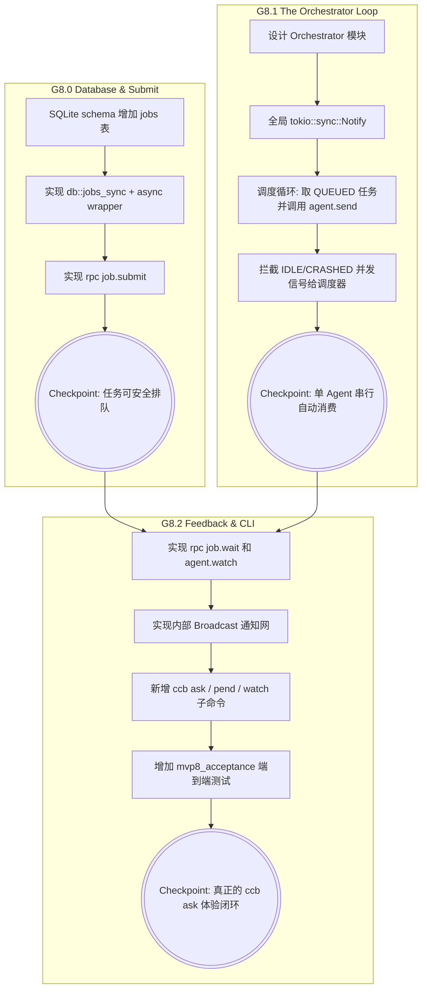

# Kiro Design: MVP 8 (任务编排与信箱内核 / The Mailbox & Orchestration Pivot)

> **文档定位**：本文件是 ccbd-rust MVP 8 阶段的官方 D (Design) 规格。基于 `mvp8-R.md` 的边界要求，为 Codex 实施提供**无歧义落地蓝图**。核心：在 Rust 内部长出 L3 调度大脑，实现持久化 `jobs` 队列、Serial-Per-Agent 串行调度器，并提供用户级命令 `ask/pend/watch`。

---

## 1. 总体路线图与依赖拓扑

本阶段划分为三个解耦的物理手术区，逐步建立 L3 编排能力。



---

## 2. Cargo.toml 依赖变更

由于需要使用更高级的 Async 原语（Broadcast, Notify），Tokio 的 features 已经包含。对于 UUID，我们已经在使用 `uuid = { version = "1.8", features = ["v4"] }`，足够用于生成 `job_id`。

**依赖变更：无** (保持现状)。

---

## 3. G8.0: SQLite jobs 表与 DB Helpers

建立独立的持久化 Mailbox。

### 3.1 Schema 扩展
在 `src/db/schema.rs` 中追加 `SCHEMA_DDL`：

```sql
CREATE TABLE IF NOT EXISTS jobs (
    id TEXT PRIMARY KEY,
    agent_id TEXT NOT NULL REFERENCES agents(id) ON DELETE CASCADE,
    request_id TEXT,
    prompt_text TEXT NOT NULL,
    reply_text TEXT,
    status TEXT NOT NULL DEFAULT 'QUEUED',
    error_reason TEXT,
    created_at INTEGER NOT NULL DEFAULT (unixepoch()),
    dispatched_at INTEGER,
    completed_at INTEGER
) STRICT;

-- 必须提供这两个 Index 支撑 Orchestrator 高效查询和队列 FIFO
CREATE INDEX IF NOT EXISTS idx_jobs_queue ON jobs(agent_id, status, created_at) WHERE status IN ('QUEUED', 'DISPATCHED');
CREATE UNIQUE INDEX IF NOT EXISTS idx_jobs_idempotent ON jobs(agent_id, request_id) WHERE request_id IS NOT NULL;
```

并在 `src/db/schema.rs` 中定义对应的 `Job` struct：
```rust
#[derive(Debug, Clone)]
pub struct Job {
    pub id: String,
    pub agent_id: String,
    pub request_id: Option<String>,
    pub prompt_text: String,
    pub reply_text: Option<String>,
    pub status: String, // 'QUEUED', 'DISPATCHED', 'COMPLETED', 'FAILED'
    pub error_reason: Option<String>,
    pub created_at: i64,
    pub dispatched_at: Option<i64>,
    pub completed_at: Option<i64>,
}
```

### 3.2 `src/db/jobs.rs` 模块
实现双层封装范式 (`_sync` + async wrapper)：

- `insert_job`: 插入 `QUEUED` 任务，生成并返回 `job_id` (前缀 `job_`)。处理幂等（若 `request_id` 冲突则返回已存在的 `job_id`，若抛错转义为 `CcbdError::DuplicateRequest`）。
- `claim_next_job`: (Orchestrator 专用) 传入 `agent_id`，按 `created_at` ASC 寻找最老的一条 `QUEUED` 记录。如果找到，将其状态更新为 `DISPATCHED`，并记录 `dispatched_at = unixepoch()`。返回 `Option<Job>`。
- `mark_job_completed`: 传入 `job_id` 和 `reply_text`，更新状态为 `COMPLETED` 和 `completed_at`。
- `mark_job_failed`: 传入 `job_id` 和 `error_reason`，更新状态为 `FAILED` 和 `completed_at`。
- `query_job`: 传入 `job_id`，返回 `Option<Job>`。
- `mark_dispatched_jobs_failed_for_agent`: 传入 `agent_id` 和 `reason`，把该 agent 之下所有 `DISPATCHED` 的任务标为 `FAILED`（用于崩溃恢复）。

---

## 4. G8.0: `handle_job_submit` RPC

处理客户端的异步派发请求。

```rust
// src/rpc/handlers.rs
pub async fn handle_job_submit(params: Value, ctx: &Ctx) -> Result<Value, CcbdError> {
    let agent_id = required_str(&params, "agent_id")?;
    let prompt_text = required_str(&params, "text")?;
    let request_id = params.get("request_id").and_then(Value::as_str).map(String::from);

    // 1. 验证 Agent 存在，且不处于终态（CRASHED/KILLED）
    let agent = query_agent(ctx.db.clone(), agent_id.to_string())
        .await?
        .ok_or_else(|| CcbdError::AgentNotFound(agent_id.to_string()))?;
    if agent.state == "CRASHED" || agent.state == "KILLED" {
        return Err(CcbdError::AgentWrongState { current_state: agent.state });
    }

    // 2. 落库 (status = QUEUED)
    let job_id = format!("job_{}", uuid::Uuid::new_v4());
    let returned_job_id = match db::jobs::insert_job(
        ctx.db.clone(), job_id.clone(), agent_id.to_string(), request_id, prompt_text.to_string()
    ).await {
        Ok(id) => id,
        Err(CcbdError::DuplicateRequest { existing_seq_id: _ }) => {
            // 幂等逻辑：通过 request_id 反查 job_id 返回
            db::jobs::query_job_by_request_id(ctx.db.clone(), agent_id.to_string(), request_id.unwrap()).await?.unwrap().id
        },
        Err(e) => return Err(e),
    };

    // 3. 唤醒 Orchestrator
    crate::orchestrator::wake_up();

    Ok(json!({ "job_id": returned_job_id, "status": "QUEUED" }))
}
```

---

## 5. G8.1: `src/orchestrator/` 核心调度循环

**关键设计决断 1 答复：Single Task with Internal State**
我们使用一个全局单一的后台 Task。相比 per-agent task，单例模式更省资源，也免去了动态跟踪和回收 task 生命周期（尤其是 Agent Crash/Spawn 频发时）的烦恼。

### 5.1 全局唤醒源
```rust
// src/orchestrator/mod.rs
use std::sync::LazyLock;
use tokio::sync::Notify;

pub static WAKER: LazyLock<Notify> = LazyLock::new(Notify::new);

pub fn wake_up() {
    WAKER.notify_one();
}
```

### 5.2 The Orchestrator Task
在 `src/bin/ccbd.rs` (Daemon 启动序列) 中调用 `orchestrator::spawn_orchestrator_task(ctx.clone())`。

```rust
pub fn spawn_orchestrator_task(ctx: Ctx) {
    tokio::spawn(async move {
        loop {
            // 1. 获取所有目前处于 IDLE 的 agents
            let idle_agents = db::agents::query_agents_by_state(ctx.db.clone(), "IDLE").await.unwrap_or_default();
            let mut did_work = false;

            for agent in idle_agents {
                // 2. CAS 拉取队头 (QUEUED -> DISPATCHED)
                if let Ok(Some(job)) = db::jobs::claim_next_job(ctx.db.clone(), agent.id.clone()).await {
                    did_work = true;
                    
                    // 3. 投递任务
                    // 内部复用 send_text_to_pane。注意这里直接传入 text，不走 handle_agent_send 的 events 查重逻辑。
                    let pane_id = if let Some(pane_id) = crate::agent_io::pane_id(&agent.id) {
                        pane_id
                    } else {
                        // Pane 已死，标记 FAILED
                        let _ = db::jobs::mark_job_failed(ctx.db.clone(), job.id, "tmux pane not registered".into()).await;
                        continue;
                    };

                    let write_result = crate::agent_io::send_text_to_pane(
                        ctx.tmux_server.clone(),
                        &agent.id,
                        pane_id,
                        job.prompt_text,
                    ).await;

                    if let Err(e) = write_result {
                        // 发送失败，立刻标记 FAILED 并释放通道
                        let _ = db::jobs::mark_job_failed(ctx.db.clone(), job.id, format!("send failed: {}", e)).await;
                    } else {
                        // 投递成功！将 Agent 置为 BUSY 并挂上 Timeout
                        // 复用现有的 PTY_MARKER_TIMEOUT 机制
                        let _ = db::agents::update_agent_state(ctx.db.clone(), agent.id.clone(), "BUSY").await;
                        
                        let parser_handle = crate::marker::parser_registry::get(&agent.id).unwrap();
                        let marker_handle = crate::marker::spawn_marker_timer_task(
                            agent.id.clone(),
                            crate::marker::TimerKind::Busy,
                            Arc::new(ctx.db.clone()),
                            parser_handle,
                        );
                        crate::marker::registry::register(agent.id.clone(), marker_handle);
                        
                        // 生成一个 command_received event，以满足现有的 Event Log (对旧工具链友好)
                        let _ = db::events::insert_event(
                            ctx.db.clone(),
                            agent.id.clone(),
                            None,
                            "command_received".to_string(),
                            json!({ "cmd": job.prompt_text, "status": "SENT", "job_id": job.id }).to_string(),
                        ).await;
                    }
                }
            }

            // 如果这一轮没做任何事，就挂起等待 WAKER 的通知
            if !did_work {
                WAKER.notified().await;
            }
        }
    });
}
```

### 5.3 集成点与清理逻辑
- **唤醒触发**：在 `db::state_machine_assert::assert_state_to_idle` 和 `db::state_machine::mark_agent_idle_matched` 完成落库后，必须调用 `crate::orchestrator::wake_up()`，告诉调度器"有 Agent 空闲了"。
- **崩溃清理**：如果 Agent 转为 `CRASHED` 或 `UNKNOWN`，我们需要把该 Agent 正在处理的 `DISPATCHED` 任务标记为 `FAILED`，否则这笔任务会永远挂起。在 `mark_agent_unknown` 和 `mark_agent_killed` 的 DB 事务中，顺手执行 `mark_dispatched_jobs_failed_for_agent(agent_id, reason)`，并调用 `crate::orchestrator::wake_up()` 通知所有在 `job.wait` 的客户端。

**关键设计决断 5 答复**：Agent 在 DISPATCHED 期间崩溃，Job 直接转为 `FAILED`。不重新排队，将重试策略留给 L4/人类。

---

## 6. G8.2: 通知网关与 Sync Feedback

**关键设计决断 2 & 6 答复**：为 `ccb pend` / `ccb watch` 提供实时的阻塞等待。

### 6.1 `src/orchestrator/pubsub.rs` 订阅网格
使用 `tokio::sync::broadcast`。不关心积压（Slow Consumer 直接报错），因为客户端断线重连时可以通过 SQLite 重新查到完整数据。
```rust
use tokio::sync::broadcast;
use std::sync::LazyLock;

pub static JOB_UPDATES: LazyLock<broadcast::Sender<String>> = LazyLock::new(|| {
    let (tx, _) = broadcast::channel(1024); // 容量 1024 足够，仅发送 job_id
    tx
});

pub static AGENT_OUTPUT: LazyLock<broadcast::Sender<String>> = LazyLock::new(|| {
    let (tx, _) = broadcast::channel(1024); // 容量 1024，仅发送 agent_id
    tx
});

// 在 mark_job_completed / failed 之后调用
pub fn notify_job_update(job_id: &str) {
    let _ = JOB_UPDATES.send(job_id.to_string());
}

// 在 agent_io::reader 写入 output_chunk 之后调用
pub fn notify_agent_output(agent_id: &str) {
    let _ = AGENT_OUTPUT.send(agent_id.to_string());
}
```

### 6.2 `handle_job_wait` (ccb pend)
**关键设计决断 3 答复**：Server 端设默认超时 `30s`，Client 收到超时错误后可以选择是否自动发起 Retry。防止僵尸连接耗尽 fd。

```rust
// src/rpc/handlers.rs
pub async fn handle_job_wait(params: Value, ctx: &Ctx) -> Result<Value, CcbdError> {
    let job_id = required_str(&params, "job_id")?;
    let timeout_secs = params.get("timeout").and_then(Value::as_u64).unwrap_or(30);
    
    let mut rx = crate::orchestrator::pubsub::JOB_UPDATES.subscribe();

    // Fast path: 是否已经完成？
    if let Some(job) = db::jobs::query_job(ctx.db.clone(), job_id.to_string()).await? {
        if job.status == "COMPLETED" || job.status == "FAILED" {
            return Ok(json!({ "status": job.status, "reply_text": job.reply_text, "error": job.error_reason }));
        }
    } else {
        return Err(CcbdError::IpcInvalidRequest(format!("job_id not found: {job_id}")));
    }

    // Long poll
    let timeout_duration = std::time::Duration::from_secs(timeout_secs);
    let wait_future = async {
        loop {
            if let Ok(updated_id) = rx.recv().await {
                if updated_id == job_id {
                    let job = db::jobs::query_job(ctx.db.clone(), job_id.to_string()).await?.unwrap();
                    return Ok(json!({ "status": job.status, "reply_text": job.reply_text, "error": job.error_reason }));
                }
            } else {
                // channel lagged, client needs to retry and hit fast path
                return Err(CcbdError::IpcInvalidRequest("Subscription lagged".into()));
            }
        }
    };

    match tokio::time::timeout(timeout_duration, wait_future).await {
        Ok(res) => res,
        Err(_) => Err(CcbdError::PtyIoError("Timeout waiting for job completion".into())),
    }
}
```

**关键：** 必须在 Agent 从 `BUSY` 转回 `IDLE`（或者 `CRASHED`）时，系统把这段时间内产生的所有的 `output_chunk` 拼合起来，更新到 `jobs.reply_text` 中，再触发 `notify_job_update`。建议在 `mark_agent_idle_matched` 内聚完成这段文本抽取的逻辑。

### 6.3 `handle_agent_watch` (ccb watch)
提供流式输出，类似 `handle_agent_read`，但如果当前 `since_event_id` 没有新数据，则挂起等待 `AGENT_OUTPUT` 通道。
```rust
pub async fn handle_agent_watch(params: Value, ctx: &Ctx) -> Result<Value, CcbdError> {
    let agent_id = required_str(&params, "agent_id")?;
    let since_event_id = required_i64(&params, "since_event_id")?;

    let mut rx = crate::orchestrator::pubsub::AGENT_OUTPUT.subscribe();

    // Fast path
    let events = query_events_since(ctx.db.clone(), agent_id.to_string(), since_event_id).await?;
    if !events.is_empty() {
        return Ok(json!({ "events": format_events(events) }));
    }

    // Long poll waiting for new chunk
    let wait_future = async {
        loop {
            if let Ok(id) = rx.recv().await {
                if id == agent_id {
                    let events = query_events_since(ctx.db.clone(), agent_id.to_string(), since_event_id).await?;
                    if !events.is_empty() {
                        return Ok(json!({ "events": format_events(events) }));
                    }
                }
            } else {
                return Err(CcbdError::IpcInvalidRequest("Subscription lagged".into()));
            }
        }
    };

    match tokio::time::timeout(std::time::Duration::from_secs(30), wait_future).await {
        Ok(res) => res,
        Err(_) => Ok(json!({ "events": [] })), // 没新数据不报错，返回空由客户端重试
    }
}
```

---

## 7. CCB CLI 新增 Subcommand

### 7.1 `ccb ask`
**关键设计决断 4 答复**：与 Python 版对齐，默认非阻塞。
```rust
// src/bin/ccb.rs
Ask {
    agent_id: String,
    text: String,
    #[arg(long)]
    wait: bool,
    #[arg(long)]
    request_id: Option<String>,
}
```
流程：调 `job.submit`。如果不带 `--wait`，打印 `job_id=<xxx> QUEUED`。如果带 `--wait`，进入一个 `while` 循环不断调用 `job.wait`，直到拿到 COMPLETED 并打印 `reply_text`。

### 7.2 `ccb pend`
```rust
Pend {
    job_id: String,
}
```
流程：单纯的 `while` 循环调用 `job.wait` 直到终态。打印最终结果。

### 7.3 `ccb watch`
```rust
Watch {
    agent_id: String,
}
```
流程：从 `since_event_id = 0` 开始（或者可以通过 `--tail` 跳到最新），在一个死循环中不断请求 `agent.watch`，把拿到的 `payload.text` 实时吐到 stdout，遇到状态变迁事件打印分割线。

---

## 8. 测试覆盖 (mvp8_acceptance.rs)

新增完整的 Mailbox 端到端测试。

- `test_job_submit_returns_id_then_dispatched_when_idle`:
  - spawn agent，断言 IDLE。提交 `ask`，验证 DB `jobs` 出现。验证几百毫秒后 Orchestrator 将其消费，Job 转为 `DISPATCHED`，Agent 转为 `BUSY`。
- `test_serial_per_agent_two_concurrent_asks`:
  - 连续发送两个 ask。断言第一个为 `DISPATCHED`，第二个保持 `QUEUED`。等待 Agent 处理完第一个回到 IDLE，断言 Orchestrator 自动将第二个转为 `DISPATCHED`。
- `test_pend_blocks_until_completed`:
  - 提交耗时任务，立即调 `job.wait` 阻塞。验证阻塞返回后能拿到 `COMPLETED` 和对应的 reply_text。
- `test_persistence_across_daemon_restart`:
  - 启动 daemon，提交 ask。人为干预杀掉 daemon 进程（保留 DB）。
  - 重启 daemon，断言原 Job 仍处于 QUEUED，并在 Agent 恢复后被执行。

---

## 9. 兼容性矩阵与实施时长

| 接口维度 | 状态 | 备注 |
|---|---|---|
| RPC Schema | ✅ 100% 兼容 | 原 `agent.send` 和 `agent.read` 原样保留。 |
| SQLite Schema | ✅ 100% 兼容 | 新增 `jobs` 表，不动旧表。 |
| Orchestrator 并发 | 安全 | 依赖 CAS (乐观锁) 避免双重调度。 |

**预期实施时长**：
- G8.0 (DB Model): 2 小时
- G8.1 (Orchestrator): 4 小时
- G8.2 (Feedback & CLI): 4 小时
- **总计**：10 小时。
