# Kiro Tasks: MVP 8 (任务编排与信箱内核)

> **文档定位**：MVP 8 由 Codex 逐项实施的原子任务清单。每个任务必须尽量独立 `cargo build` 通过、独立验证。严格按 `mvp8-R.md` / `mvp8-D.md` 落地，禁止引入 MVP8 范围外能力：不做 launcher / `ccb start`、不做 job cancel / priority、不重写 agent 状态机、不破坏现有 `agent.*` RPC。**三个子阶段独立 commit**：G8.0 / G8.1 / G8.2 各一个 commit。

> **实施顺序说明**：本文按"先建兼容层 → 接 caller → 加 acceptance → commit"的顺序落地。与 D 文档相比，G8.2 的 broadcast 通知网先于 `job.wait` / `agent.watch` 建立，避免 handler 先落地但缺订阅源的中间断裂。

---

## 1. 任务依赖与执行图谱

```mermaid
graph TD
  subgraph G80[G8.0 Database Extension + job.submit]
    T01[T0.1 schema.rs 增加 jobs 表 + Job struct]
    T02[T0.2 db/jobs.rs 基础 query/insert wrapper]
    T03[T0.3 db/jobs.rs claim/complete/fail wrapper]
    T04[T0.4 handle_job_submit RPC]
    T05[T0.5 router 注册 job.submit]
    T06[T0.6 mvp8 submit acceptance + SC1]
    T07[T0.7 G8.0 commit]
    SC1(((SC1: Job 可持久排队)))
  end

  subgraph G81[G8.1 Orchestrator Loop]
    T11[T1.1 orchestrator scaffold + wake_up]
    T12[T1.2 db helpers: idle agents + dispatched job lookup]
    T13[T1.3 spawn orchestrator task in daemon]
    T14[T1.4 orchestrator claim QUEUED -> send -> DISPATCHED]
    T15[T1.5 IDLE completion hook + reply_text 归档]
    T16[T1.6 UNKNOWN/KILLED/CRASHED failure hook]
    T17[T1.7 serial-per-agent acceptance + SC2]
    T18[T1.8 G8.1 commit]
    SC2(((SC2: 单 Agent 串行自动消费)))
  end

  subgraph G82[G8.2 Feedback + CLI]
    T21[T2.1 pubsub broadcast 通知网]
    T22[T2.2 output_chunk 通知接入 reader]
    T23[T2.3 handle_job_wait RPC]
    T24[T2.4 handle_agent_watch RPC]
    T25[T2.5 router 注册 job.wait/agent.watch]
    T26[T2.6 ccb ask/pend/watch CLI]
    T27[T2.7 mvp8 feedback acceptance + smoke hooks + SC3]
    T28[T2.8 G8.2 commit]
    SC3(((SC3: ask/pend/watch 闭环)))
  end

  T01 --> T02 --> T03 --> T04 --> T05 --> T06 --> SC1 --> T07
  T07 --> T11 --> T12 --> T13 --> T14 --> T15 --> T16 --> T17 --> SC2 --> T18
  T18 --> T21 --> T22 --> T23 --> T24 --> T25 --> T26 --> T27 --> SC3 --> T28
```



---

## 2. 原子任务定义（G8.0 Database Extension + `job.submit`）

### T0.1: `schema.rs` 增加 `jobs` 表 + `Job` struct

* **依赖前置**: 无
* **设计输入**: `mvp8-D.md §3.1`，`mvp8-R.md AC1/AC5`
* **输出产物**: `src/db/schema.rs`
* **执行步骤**:
  1. 在 `SCHEMA_DDL` 末尾追加 `jobs` 表 DDL：
     - `id TEXT PRIMARY KEY`
     - `agent_id TEXT NOT NULL REFERENCES agents(id) ON DELETE CASCADE`
     - `request_id TEXT`
     - `prompt_text TEXT NOT NULL`
     - `reply_text TEXT`
     - `status TEXT NOT NULL DEFAULT 'QUEUED'`
     - `error_reason TEXT`
     - `created_at INTEGER NOT NULL DEFAULT (unixepoch())`
     - `dispatched_at INTEGER`
     - `completed_at INTEGER`
  2. 增加 `idx_jobs_queue`：
     `CREATE INDEX IF NOT EXISTS idx_jobs_queue ON jobs(agent_id, status, created_at) WHERE status IN ('QUEUED', 'DISPATCHED');`
  3. 增加 `idx_jobs_idempotent`：
     `CREATE UNIQUE INDEX IF NOT EXISTS idx_jobs_idempotent ON jobs(agent_id, request_id) WHERE request_id IS NOT NULL;`
  4. 在 schema structs 区域新增 `pub struct Job`，字段与 D §3.1 一致。
  5. 不修改旧表，不改旧 struct 字段。
* **独立验收**: `cargo build --quiet` 通过；`rg -n "CREATE TABLE IF NOT EXISTS jobs|struct Job|idx_jobs_queue" src/db/schema.rs` 命中。

### T0.2: 新建 `src/db/jobs.rs` 基础查询与插入 wrapper

* **依赖前置**: T0.1
* **设计输入**: `mvp8-D.md §3.2`
* **输出产物**: `src/db/jobs.rs`，`src/db/mod.rs`
* **执行步骤**:
  1. `src/db/mod.rs` 增加 `pub mod jobs;`。
  2. 新建 `src/db/jobs.rs`，沿用 MVP5 双层范式：`pub(crate) fn *_sync(...)` + `pub async fn *(db: Db, owned_args...)`。
  3. 实现 row mapper `row_to_job(row) -> rusqlite::Result<Job>`，复用 `crate::db::schema::Job`。
  4. 实现 `insert_job_sync(conn: &Connection, id, agent_id, request_id, prompt_text) -> Result<String, CcbdError>`：
     - 插入状态固定为 `QUEUED`
     - request_id 唯一冲突时转成可识别错误，或通过 `query_job_by_request_id_sync` 返回既有 job id
  5. 实现 async `insert_job(db, id, agent_id, request_id, prompt_text) -> Result<String, CcbdError>`。
  6. 实现 `query_job_sync(conn, job_id) -> Result<Option<Job>, CcbdError>` 与 async wrapper。
  7. 实现 `query_job_by_request_id_sync(conn, agent_id, request_id) -> Result<Option<Job>, CcbdError>` 与 async wrapper。
  8. 单测覆盖：
     - insert 后 query 可读回
     - request_id 相同的重复提交返回同一 job
     - unknown job 返回 `None`
* **独立验收**: `cargo test --lib db::jobs --quiet` 通过；`cargo build --quiet` 通过。

### T0.3: `db/jobs.rs` 增加 claim / complete / fail 状态流转

* **依赖前置**: T0.2
* **设计输入**: `mvp8-D.md §3.2`，`mvp8-R.md §2`
* **输出产物**: `src/db/jobs.rs`
* **执行步骤**:
  1. 实现 `claim_next_job_sync(db: &Db, agent_id: &str) -> Result<Option<Job>, CcbdError>`：
     - 开事务
     - 按 `created_at ASC, id ASC` 查询最老 `QUEUED`
     - CAS 更新 `status='DISPATCHED', dispatched_at=unixepoch()`
     - 提交后返回被 claim 的 `Job`
  2. 实现 async `claim_next_job(db, agent_id)`.
  3. 实现 `mark_job_completed_sync(db, job_id, reply_text) -> Result<usize, CcbdError>`：
     - 只允许 `DISPATCHED -> COMPLETED`
     - 写 `reply_text`、`completed_at`
  4. 实现 `mark_job_failed_sync(db, job_id, error_reason) -> Result<usize, CcbdError>`：
     - 允许 `QUEUED` 或 `DISPATCHED -> FAILED`
     - 写 `error_reason`、`completed_at`
  5. 实现 `mark_dispatched_jobs_failed_for_agent_sync(db, agent_id, reason) -> Result<usize, CcbdError>`。
  6. 实现 `query_dispatched_job_for_agent_sync(conn, agent_id) -> Result<Option<Job>, CcbdError>`，G8.1 完成归档会用。
  7. 单测覆盖 FIFO claim、CAS 不重复 claim、completed/failed 终态。
* **独立验收**: `cargo test --lib db::jobs --quiet` 通过。

### T0.4: 实现 `handle_job_submit`

* **依赖前置**: T0.3
* **设计输入**: `mvp8-D.md §4`，`mvp8-R.md AC1`
* **输出产物**: `src/rpc/handlers.rs`
* **执行步骤**:
  1. 在 `src/rpc/handlers.rs` 新增 `pub async fn handle_job_submit(params: Value, ctx: &Ctx) -> Result<Value, CcbdError>`。
  2. 解析字段：
     - required `agent_id`
     - required `text`
     - optional `request_id`
  3. 调 `db::agents::query_agent` 验证 agent 存在。
  4. 若 agent state 为 `CRASHED` / `KILLED`，返回 `AgentWrongState`。
  5. 生成 `job_id = format!("job_{}", Uuid::new_v4())`。
  6. 调 `db::jobs::insert_job(...)` 落库；重复 `request_id` 返回既有 job id。
  7. 暂时不依赖 orchestrator；如果 `crate::orchestrator` 尚不存在，本任务只落库返回。
  8. 返回：
     ```json
     { "job_id": "...", "status": "QUEUED" }
     ```
  9. handler 单测覆盖正常提交、unknown agent、terminal agent、request_id 幂等。
* **独立验收**: `cargo test --lib rpc::handlers::tests::test_handle_job_submit --quiet` 通过；`cargo build --quiet` 通过。

### T0.5: Router 注册 `job.submit`

* **依赖前置**: T0.4
* **设计输入**: `mvp8-D.md §4`
* **输出产物**: `src/rpc/router.rs`
* **执行步骤**:
  1. 在 handler import 中加入 `handle_job_submit`。
  2. `METHODS` 增加 `"job.submit"`。
  3. `match method` 增加 `"job.submit" => handle_job_submit(params, ctx).await`。
  4. 增加 router 单测：`job.submit` 缺字段时返回 `IPC_INVALID_REQUEST`，证明 method 已被识别而不是 unknown method。
* **独立验收**: `cargo test --lib rpc::router --quiet` 通过。

### T0.6: 新增 mvp8 submit acceptance + SC1

* **依赖前置**: T0.5
* **设计输入**: `mvp8-D.md §8`，`mvp8-R.md AC1`
* **输出产物**: `tests/mvp8_acceptance.rs`
* **执行步骤**:
  1. 新建 `tests/mvp8_acceptance.rs`，复用 mvp7 Harness：temp DB、temp state_dir、`unsafe_no_sandbox=true`、`TmuxServer::new`。
  2. 增加 helper：`insert_session`、`spawn_bash`、`query_job`。
  3. 实现 `test_job_submit_returns_id_and_queues_when_idle_or_busy`：
     - spawn bash agent 并等待 IDLE
     - 调 `handle_job_submit`
     - 断言返回 `job_id` 前缀为 `job_`
     - DB 中存在 `status='QUEUED'`
  4. 实现 `test_job_submit_is_idempotent_by_request_id`。
  5. 此阶段不要求 orchestrator 消费 job。
* **独立验收**: `cargo test --test mvp8_acceptance --quiet` 通过；`cargo test --quiet` 不回归。

### T0.7: G8.0 commit

* **依赖前置**: T0.1 - T0.6
* **设计输入**: `mvp8-D.md §1`
* **输出产物**: 一个 git commit
* **执行步骤**:
  1. `cargo fmt`
  2. `cargo test --lib db::jobs --quiet`
  3. `cargo test --test mvp8_acceptance --quiet`
  4. `cargo test --quiet`
  5. commit message: `feat(mvp8): G8.0 add persistent jobs queue and submit RPC`
* **独立验收**: SC1 通过；全测绿；单 commit。

---

## 3. 原子任务定义（G8.1 The Orchestrator Loop）

### T1.1: 新建 `src/orchestrator/` scaffold + `wake_up`

* **依赖前置**: T0.7
* **设计输入**: `mvp8-D.md §5.1`
* **输出产物**: `src/orchestrator/mod.rs`，`src/lib.rs`
* **执行步骤**:
  1. 新建 `src/orchestrator/mod.rs`。
  2. 定义：
     ```rust
     pub static WAKER: LazyLock<Notify> = LazyLock::new(Notify::new);
     pub fn wake_up() { WAKER.notify_one(); }
     ```
  3. 先提供空实现 `pub fn spawn_orchestrator_task(ctx: crate::rpc::Ctx)`，内部只 `tokio::spawn` 后 await `WAKER.notified()` 循环，不做业务。
  4. `src/lib.rs` 加 `pub mod orchestrator;`。
  5. 不接 caller，确保兼容。
* **独立验收**: `cargo build --quiet` 通过；`rg -n "pub mod orchestrator|wake_up|spawn_orchestrator_task" src/` 命中。

### T1.2: 增加 Orchestrator 所需 DB helper

* **依赖前置**: T1.1
* **设计输入**: `mvp8-D.md §5.2`
* **输出产物**: `src/db/agents.rs`，`src/db/jobs.rs`
* **执行步骤**:
  1. 在 `db::agents` 增加 `query_agents_by_state_sync(conn, state) -> Result<Vec<Agent>, CcbdError>` 与 async wrapper。
  2. 在 `db::jobs` 确认 T0.3 的 `query_dispatched_job_for_agent` 可用。
  3. 在 `db::jobs` 增加 `collect_reply_for_dispatched_job_sync(conn, agent_id, dispatched_at) -> Result<String, CcbdError>`：
     - 查询该 agent 在 `dispatched_at` 后的 `output_chunk` events
     - 解析 payload 中 `text`
     - 拼接为 `reply_text`
  4. 若实现中需要更精确的 seq_id 边界，可在不改旧表的前提下使用 `events.created_at >= dispatched_at`；不要改 DDL 增字段，除非 D 文档后续修订。
  5. 单测覆盖 `query_agents_by_state` 与 reply 拼接。
* **独立验收**: `cargo test --lib db::agents db::jobs --quiet` 分别通过；`cargo build --quiet` 通过。

### T1.3: Daemon 启动 Orchestrator task

* **依赖前置**: T1.2
* **设计输入**: `mvp8-D.md §5.2`
* **输出产物**: `src/bin/ccbd.rs`
* **执行步骤**:
  1. 在 daemon 创建 `Ctx` 后、`rpc::run_server` 前调用：
     `orchestrator::spawn_orchestrator_task(ctx.clone());`
  2. 确保 `Ctx` 已 derive/impl `Clone`，当前已有 clone 能力则不改。
  3. 不改变 socket bind / reconcile_startup 顺序。
  4. 增加启动 smoke 单测如现有结构允许；否则仅 build 验收。
* **独立验收**: `cargo build --quiet` 通过；`rg -n "spawn_orchestrator_task" src/bin/ccbd.rs` 命中。

### T1.4: Orchestrator claim `QUEUED` 并投递到 tmux pane

* **依赖前置**: T1.3
* **设计输入**: `mvp8-D.md §5.2`，`mvp8-R.md AC2`
* **输出产物**: `src/orchestrator/mod.rs`
* **执行步骤**:
  1. 在 orchestrator loop 中查询所有 `IDLE` agents。
  2. 对每个 IDLE agent 调 `db::jobs::claim_next_job`。
  3. 若无 job，继续下一个 agent。
  4. 若有 job：
     - 通过 `agent_io::pane_id(&agent.id)` 获取 pane
     - 无 pane 时 `mark_job_failed(job.id, "tmux pane not registered")`
     - 有 pane 时调用 `agent_io::send_text_to_pane(ctx.tmux_server.clone(), &agent.id, pane, job.prompt_text.clone()).await`
  5. send 成功后：
     - 调 `db::agents::update_agent_state(..., "BUSY")`
     - 注册 Busy marker timer，逻辑与 `handle_agent_send` 保持一致
     - 插入 `command_received` event，payload 包含 `{ "cmd": ..., "status": "SENT", "job_id": ... }`
  6. send 失败后标 `FAILED`，不要重新排队。
  7. loop 若做了任何工作，继续下一轮；若没有工作，await `WAKER.notified()`。
  8. 不复用 `handle_agent_send`，避免 JSON/RPC/idempotency 路径互相递归。
* **独立验收**: 新增 orchestrator 单测或 mvp8 acceptance 临时测试：IDLE agent + QUEUED job 能转 `DISPATCHED` 且 agent 转 `BUSY`；`cargo test --lib orchestrator --quiet` 通过。

### T1.5: IDLE 完成 hook：归档 `COMPLETED` + 唤醒 orchestrator

* **依赖前置**: T1.4
* **设计输入**: `mvp8-D.md §5.3`，`mvp8-D.md §6.2`
* **输出产物**: `src/db/state_machine.rs`，`src/db/jobs.rs`
* **执行步骤**:
  1. 在 `mark_agent_idle_matched_sync` 成功 `BUSY/SPAWNING -> IDLE` 的事务中，查找该 agent 当前 `DISPATCHED` job。
  2. 若存在 dispatched job：
     - 收集该 job 执行期间产生的 `output_chunk` 文本
     - 更新 job 为 `COMPLETED`
     - 写 `reply_text`、`completed_at`
  3. 事务提交后，async wrapper `mark_agent_idle_matched` 调用 `orchestrator::wake_up()`。
  4. 若完成了 job，也调用后续 G8.2 的 `notify_job_update`；本任务 pubsub 未存在时只保留 TODO-free 的 local helper no-op，或延后到 T2.1 接入。
  5. 注意不能让无 job 的普通 agent.send 逻辑回归。
  6. 单测覆盖：DISPATCHED job + output_chunk 后 marker matched 会把 job 置 `COMPLETED`。
* **独立验收**: `cargo test --lib db::state_machine --quiet` 通过；`cargo test --quiet` 不回归。

### T1.6: UNKNOWN / KILLED / CRASHED failure hook

* **依赖前置**: T1.5
* **设计输入**: `mvp8-D.md §5.3`，`mvp8-R.md §2`
* **输出产物**: `src/db/state_machine.rs`，`src/db/agents_lifecycle.rs`
* **执行步骤**:
  1. 在 `mark_agent_unknown_sync` 成功转 `UNKNOWN` 的同一事务中，把该 agent 所有 `DISPATCHED` jobs 标 `FAILED`，reason 使用 marker timeout reason。
  2. 在 `mark_agent_killed_sync` 成功转 `KILLED` 的同一事务中，把该 agent 所有 `DISPATCHED` jobs 标 `FAILED`，reason 使用 kill reason。
  3. 在 `mark_agent_crashed_with_exit_sync` 成功转 `CRASHED` 的同一事务中，把该 agent 所有 `DISPATCHED` jobs 标 `FAILED`，reason 使用 crash reason。
  4. 对 `QUEUED` jobs 不做失败处理，保留持久队列语义；若 agent 终态后仍有 QUEUED，orchestrator 因 agent 非 IDLE 不会消费。
  5. async wrapper 成功后调用 `orchestrator::wake_up()`。
  6. 单测覆盖 BUSY + DISPATCHED job 进入 UNKNOWN/KILLED/CRASHED 后 job `FAILED`。
* **独立验收**: `cargo test --lib db::state_machine db::agents_lifecycle --quiet` 分别通过。

### T1.7: Serial-per-agent acceptance + SC2

* **依赖前置**: T1.6
* **设计输入**: `mvp8-D.md §8`，`mvp8-R.md AC2/AC5`
* **输出产物**: `tests/mvp8_acceptance.rs`
* **执行步骤**:
  1. 扩展 `tests/mvp8_acceptance.rs`。
  2. 实现 `test_job_submit_returns_id_then_dispatched_when_idle`：
     - spawn bash 到 IDLE
     - submit job
     - `orchestrator::wake_up()`
     - poll job 到 `DISPATCHED`
     - 断言 agent 转 `BUSY`
  3. 实现 `test_serial_per_agent_two_concurrent_asks`：
     - 连续 submit 两个 jobs
     - 断言某一时刻第一个 `DISPATCHED`，第二个仍 `QUEUED`
     - 等第一个完成后，第二个自动 `DISPATCHED`
  4. 实现轻量 persistence 测试：
     - 同一 DB file 初始化
     - insert QUEUED job
     - drop/reinit DB
     - query job 仍存在
  5. 测试中不要依赖真实 codex；使用 bash。
* **独立验收**: `cargo test --test mvp8_acceptance --quiet` 通过；`cargo test --quiet` 不回归。

### T1.8: G8.1 commit

* **依赖前置**: T1.1 - T1.7
* **设计输入**: `mvp8-D.md §1`
* **输出产物**: 一个 git commit
* **执行步骤**:
  1. `cargo fmt`
  2. `cargo test --lib orchestrator --quiet`
  3. `cargo test --test mvp8_acceptance --quiet`
  4. `cargo test --quiet`
  5. commit message: `feat(mvp8): G8.1 dispatch queued jobs with orchestrator`
* **独立验收**: SC2 通过；全测绿；单 commit。

---

## 4. 原子任务定义（G8.2 Feedback + CLI）

### T2.1: 新建 pubsub broadcast 通知网

* **依赖前置**: T1.8
* **设计输入**: `mvp8-D.md §6.1`
* **输出产物**: `src/orchestrator/pubsub.rs`，`src/orchestrator/mod.rs`
* **执行步骤**:
  1. 新建 `src/orchestrator/pubsub.rs`。
  2. 定义 `JOB_UPDATES: LazyLock<broadcast::Sender<String>>`，容量 1024。
  3. 定义 `AGENT_OUTPUT: LazyLock<broadcast::Sender<String>>`，容量 1024。
  4. 提供：
     - `pub fn notify_job_update(job_id: &str)`
     - `pub fn subscribe_job_updates() -> broadcast::Receiver<String>`
     - `pub fn notify_agent_output(agent_id: &str)`
     - `pub fn subscribe_agent_output() -> broadcast::Receiver<String>`
  5. `src/orchestrator/mod.rs` 加 `pub mod pubsub;`。
  6. 暂不接业务 caller，保持 build 通过。
* **独立验收**: `cargo build --quiet` 通过；`cargo test --lib orchestrator --quiet` 通过。

### T2.2: 接入 output_chunk 与 job update 通知源

* **依赖前置**: T2.1
* **设计输入**: `mvp8-D.md §6.1`
* **输出产物**: `src/agent_io/reader.rs`，`src/db/state_machine.rs`，`src/db/agents_lifecycle.rs`
* **执行步骤**:
  1. 在 `agent_io::reader` 成功 `db::events::insert_event(..., "output_chunk", ...)` 后调用 `orchestrator::pubsub::notify_agent_output(&agent_id)`。
  2. 在 `mark_agent_idle_matched` async wrapper 成功完成 job 后调用 `notify_job_update(job_id)`。
  3. 在 UNKNOWN/KILLED/CRASHED failure hook 成功标记 jobs failed 后，对每个 failed job 调 `notify_job_update(job_id)`。
  4. 如果 sync 事务只返回 count，不返回 job ids，则在 wrapper 事务后查一遍受影响 job ids；不要在 sync 层调用 async pubsub。
  5. 保持现有 agent.read 行为不变。
* **独立验收**: `cargo build --quiet` 通过；新增 pubsub 单测可通过。

### T2.3: 实现 `handle_job_wait`

* **依赖前置**: T2.2
* **设计输入**: `mvp8-D.md §6.2`，`mvp8-R.md AC3`
* **输出产物**: `src/rpc/handlers.rs`
* **执行步骤**:
  1. 新增 `pub async fn handle_job_wait(params: Value, ctx: &Ctx) -> Result<Value, CcbdError>`。
  2. 解析 required `job_id`，optional `timeout`，默认 30s。
  3. Fast path：
     - query job
     - 不存在返回 `IpcInvalidRequest("job_id not found")`
     - `COMPLETED` / `FAILED` 立即返回 `{ status, reply_text, error_reason }`
  4. Slow path：
     - `let mut rx = subscribe_job_updates()`
     - `tokio::time::timeout(timeout, async loop recv)` 等待同一 job_id
     - 收到后重新 query DB 并返回终态
  5. broadcast lagged 时返回可重试错误；client 后续 fast path 能恢复。
  6. timeout 时返回 `PtyIoError("Timeout waiting for job completion")` 或 D 文档指定错误。
  7. handler 单测覆盖 fast path completed、not found、timeout。
* **独立验收**: `cargo test --lib rpc::handlers::tests::test_handle_job_wait --quiet` 通过。

### T2.4: 实现 `handle_agent_watch`

* **依赖前置**: T2.3
* **设计输入**: `mvp8-D.md §6.3`，`mvp8-R.md AC4`
* **输出产物**: `src/rpc/handlers.rs`
* **执行步骤**:
  1. 新增 `pub async fn handle_agent_watch(params: Value, ctx: &Ctx) -> Result<Value, CcbdError>`。
  2. 解析 required `agent_id`、required `since_event_id`，optional `timeout` 默认 30s。
  3. 先验证 agent 存在，复用 `query_agent`。
  4. Fast path：调用 `query_events_since`，有事件直接返回，与 `agent.read` 格式兼容。
  5. Slow path：
     - subscribe `AGENT_OUTPUT`
     - 等待同一 agent_id
     - 醒来后重新查 `query_events_since`
  6. 超时时返回 `{ "events": [] }`，不报错，方便 CLI watch 循环。
  7. 格式化 events 的代码若当前在 `handle_agent_read` 内联，抽出 private helper `format_events(events) -> Vec<Value>`，避免双写。
* **独立验收**: `cargo test --lib rpc::handlers::tests::test_handle_agent_watch --quiet` 通过；`cargo build --quiet` 通过。

### T2.5: Router 注册 `job.wait` / `agent.watch`

* **依赖前置**: T2.4
* **设计输入**: `mvp8-D.md §6`
* **输出产物**: `src/rpc/router.rs`
* **执行步骤**:
  1. import `handle_job_wait`、`handle_agent_watch`。
  2. `METHODS` 加 `"job.wait"` 和 `"agent.watch"`。
  3. `match method` 加对应分支。
  4. router 单测覆盖两个 method 被识别。
* **独立验收**: `cargo test --lib rpc::router --quiet` 通过。

### T2.6: CLI 增加 `ask` / `pend` / `watch`

* **依赖前置**: T2.5
* **设计输入**: `mvp8-D.md §7`，`mvp8-R.md AC1/AC3/AC4`
* **输出产物**: `src/bin/ccb.rs`
* **执行步骤**:
  1. 在 `Cmd` enum 增加：
     - `Ask { agent_id: String, text: String, #[arg(long)] wait: bool, #[arg(long)] request_id: Option<String> }`
     - `Pend { job_id: String }`
     - `Watch { agent_id: String, #[arg(long, default_value_t = 0)] since_event_id: i64 }`
  2. 实现 `cmd_ask`：
     - 调 `job.submit`
     - 打印 `job_id=<id> status=QUEUED`
     - 若 `--wait`，循环调用 `job.wait` 直到 `COMPLETED` / `FAILED`
  3. 实现 `cmd_pend`：
     - 循环调用 `job.wait`
     - COMPLETED 打印 `reply_text`
     - FAILED stderr 打印 `error_reason` 并 exit 2
  4. 实现 `cmd_watch`：
     - 从 `since_event_id` 开始循环调 `agent.watch`
     - 对 `output_chunk` payload.text 直接写 stdout
     - 对 `state_change` 打印简短分隔标记
     - 每次更新 since_event_id 为最大 seq_id
  5. 复用现有 `rpc_call`，不要引入新传输协议。
  6. CLI 单测若当前无 harness，可只 build 验收。
* **独立验收**: `cargo build --quiet` 通过；`target/debug/ccb --help` 手动可见 ask/pend/watch。

### T2.7: mvp8 feedback acceptance + true smoke hooks + SC3

* **依赖前置**: T2.6
* **设计输入**: `mvp8-D.md §8`，`mvp8-R.md AC3/AC4/AC6`
* **输出产物**: `tests/mvp8_acceptance.rs`
* **执行步骤**:
  1. 实现 `test_pend_blocks_until_completed`：
     - spawn bash
     - submit job `echo mvp8_done\n`
     - 调 `handle_job_wait`
     - 断言 `status=COMPLETED` 且 `reply_text` 包含 `mvp8_done`
  2. 实现 `test_agent_watch_receives_output_chunk`：
     - spawn bash
     - 启动 `handle_agent_watch` long poll
     - send/submit 产生输出
     - 断言 watch 返回 output_chunk
  3. 实现 `test_persistence_across_daemon_restart` 的 DB 级版本：
     - file-backed DB
     - insert QUEUED job
     - drop DB handle
     - re-init DB
     - query job remains QUEUED
  4. 添加 ignored 真现场 smoke：
     - `#[ignore] test_true_codex_ask_pend_roundtrip`
     - 手动环境要求：已登录 Codex，daemon running，spawn codex agent 后 `ask/pend` 能闭环。
  5. 不把 true smoke 纳入默认 CI。
* **独立验收**: `cargo test --test mvp8_acceptance --quiet` 通过；默认应至少 5 个核心 case 通过，true codex smoke ignored。

### T2.8: G8.2 commit

* **依赖前置**: T2.1 - T2.7
* **设计输入**: `mvp8-D.md §1`
* **输出产物**: 一个 git commit
* **执行步骤**:
  1. `cargo fmt`
  2. `cargo test --test mvp8_acceptance --quiet`
  3. `cargo test --test mvp7_acceptance --quiet`
  4. `cargo test --quiet`
  5. 手动可选：
     - `ccb ask <agent> "echo hi" --wait`
     - `ccb watch <agent>`
  6. commit message: `feat(mvp8): G8.2 add job wait watch and CLI mailbox commands`
* **独立验收**: SC3 通过；全测绿；单 commit。

---

## 5. 验收命令快速参考

```bash
# G8.0
cargo test --lib db::jobs --quiet
cargo test --test mvp8_acceptance test_job_submit --quiet
cargo test --quiet

# G8.1
cargo test --lib orchestrator --quiet
cargo test --test mvp8_acceptance --quiet
cargo test --quiet

# G8.2
cargo test --test mvp8_acceptance --quiet
cargo test --test mvp7_acceptance --quiet
cargo test --quiet

# RPC method grep
rg -n '"job.submit"|"job.wait"|"agent.watch"' src/rpc/router.rs src/rpc/handlers.rs

# CLI help
cargo build --quiet
target/debug/ccb --help
target/debug/ccb ask --help
target/debug/ccb pend --help
target/debug/ccb watch --help

# DB schema grep
rg -n "CREATE TABLE IF NOT EXISTS jobs|idx_jobs_queue|idx_jobs_idempotent" src/db/schema.rs
```

---

## 6. 失败回滚指南

### 回滚 G8.0
适用：`jobs` schema 或 `job.submit` 破坏现有测试。

1. revert G8.0 commit。
2. 确认 `src/db/schema.rs` 不含 `jobs` DDL。
3. 确认 `src/db/mod.rs` 不含 `pub mod jobs;`。
4. 确认 `src/rpc/router.rs` 不含 `job.submit`。
5. 验证：
   ```bash
   cargo test --quiet
   ```

### 回滚 G8.1
适用：orchestrator loop 导致 agent.send / marker 状态机回归。

1. revert G8.1 commit，保留 G8.0 的 `jobs` 表和 submit RPC。
2. 确认 `src/bin/ccbd.rs` 不再启动 `spawn_orchestrator_task`。
3. 确认 `mark_agent_idle_matched` / UNKNOWN / KILLED / CRASHED hooks 回到无 job 副作用状态。
4. 验证：
   ```bash
   cargo test --test mvp8_acceptance test_job_submit --quiet
   cargo test --quiet
   ```

### 回滚 G8.2
适用：`job.wait` / `agent.watch` long-poll 或 CLI 破坏 UDS/CLI。

1. revert G8.2 commit，保留 G8.0/G8.1。
2. 确认 router 不含 `job.wait` / `agent.watch`。
3. 确认 `src/bin/ccb.rs` 只剩原有 ping/ps 或回到 G8.1 前状态。
4. 验证：
   ```bash
   cargo test --test mvp8_acceptance --quiet
   cargo test --quiet
   ```

### 数据库回滚注意
MVP8 新增表为 additive schema。若只回滚代码但保留 dev DB，旧代码会忽略 `jobs` 表，不需要手动清库。若需要清理 dev state：

```bash
rm -f target/dev_state/ccbd.sqlite3
```

不要在生产/真实 smoke DB 上执行删除，除非主控明确要求。
