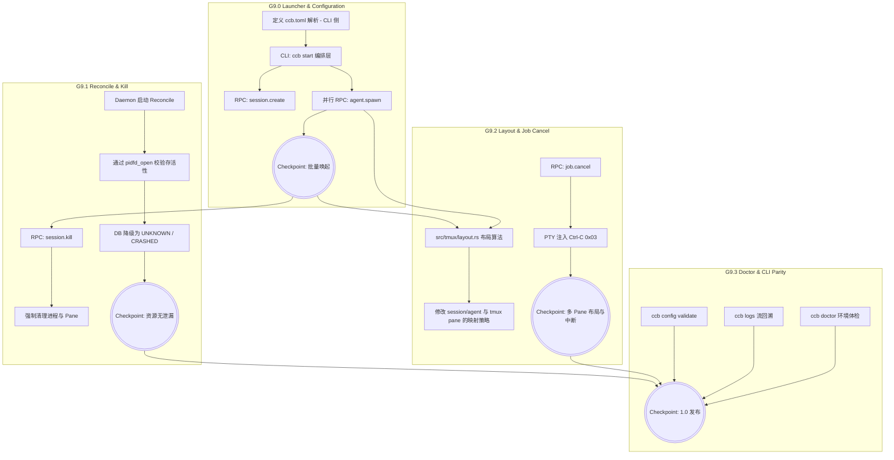

# Kiro Design: MVP 9 (项目启动器与生命周期回收 / The Launcher & Lifecycle Convergence)

> **文档定位**：本文件是 ccbd-rust MVP 9 阶段的官方 D (Design) 规格。基于 `mvp9-R.md` 的要求，为系统补齐 `ccb.toml` 解析、批量启动（Launcher）、Tmux 布局（Layout）、系统自愈（Reconcile）以及 Job 取消（Cancel）等 1.0 交付层的最终核心特性。

---

## 1. 总体架构图与依赖拓扑



---

## 2. 配置文件 (`ccb.toml`)

### 2.1 格式设计与示例
放弃旧版的 `.ccb/ccb.config` (JSON)，采用对人类更友好的 TOML 格式放在项目根目录。由于旧项目多使用旧版格式，CLI 需要提供 `ccb config migrate` 子命令进行静默转换，并在 `ccb start` 找不到 TOML 时给出建议。

```toml
# ccb.toml
version = "1"
layout = "grid" # 可选: single, stack, grid

[env]
# 全局环境变量，将被注入到所有 Agent 的 Sandbox 中
PROJECT_ROOT = "/absolute/path/to/project"
DEBUG = "1"

[agents.a1]
provider = "bash"

[agents.codex]
provider = "codex"
# Agent 级别的 override
[agents.codex.env]
ANTHROPIC_API_KEY = "sk-ant-..."

[agents.claude]
provider = "claude"

[agents.review]
provider = "claude"
```

### 2.2 查找与解析策略
- **CLI 查找算法**：优先读取 `CCB_CONFIG_PATH` 环境变量。如果未设置，从 `cwd` 向上逐层遍历寻找 `ccb.toml`。
- **内部映射**：CLI 侧定义 `ProjectConfig` struct (使用 `serde_derive` 派生)，解析后只做校验和组装 RPC 参数，不做复杂的持久化。

---

## 3. G9.0: Launcher 流程设计

**目标**：CLI 端一键 `ccb start` 体验。

### 3.1 端到端流程 (CLI 侧编排)
由于 ccbd Daemon 是一个低级别的 L3 引擎，**批量启动的编排应该放在 CLI 端实现**。

1. **解析 Config**：读取并校验 `ccb.toml`。
2. **连接 Daemon**：发起 RPC `session.create` 拿到 `session_id`。
3. **并行 Spawn**：通过 Tokio 的 `join_all`，针对配置中的每个 agent 并发调用 `agent.spawn(session_id, agent_id, provider)`。
4. **统一 Layout**：所有 agent `SPAWNING` 成功（返回 PID）后，CLI 调用新增的 RPC `session.apply_layout(session_id, layout_type)`。
5. **阻塞等待就绪**：CLI 进入长轮询，调用 `agent.watch` 监听所有 Agent，直到它们全部变为 `IDLE` 或超时报错。

### 3.2 失败语义
如果在并发 Spawn 阶段有任何一个 `agent.spawn` 失败，CLI 端必须触发整体回滚，调用 `session.kill(session_id, true)`，并向用户报告启动失败。遵循 "All or Nothing" 原则。

---

## 4. G9.2: 核心架构演进：Tmux 布局 (Layout) 算法

这是 MVP 9 最大的底层变革。
- **旧语义 (MVP 6-8)**：Agent = Window = Pane (1:1:1)。
- **新语义 (MVP 9)**：Session = Window (1:1)，Agent = Pane (N:1)。即属于同一个 Session (项目) 的所有 Agent，都在同一个 Tmux Window 中分屏显示。

### 4.1 方案决断：集中式 Layout 编排
采用**方案二：统一 Window 内分屏**。
- 架构变更：不再每个 Agent 一个 Window。`agent.spawn` 的实现需要调整，检测 `session_id` 对应的 Tmux Window 是否存在。如果不存在，创建 Window（附带第一个 Agent Pane）。如果存在，执行 `split-window` 并将进程运行在新的 Pane 里。
- 为了追踪，`agents` 表或者内存的 `PaneRegistry` 必须保存属于自己的唯一 `pane_id`（如 `%7`）。

### 4.2 具体实现 (`src/tmux/layout.rs`)
新增 RPC `session.apply_layout(session_id, layout_type)`。Daemon 根据传入的 `layout_type`，找到该 Session 对应的 Window Name，执行不同的 Tmux 布局命令：

- **Single**: 不需要额外操作（适用于仅 1 个 Agent）。
- **Stack (Vertical)**: 调用 `tmux select-layout -t ccb:<project_id> even-vertical`
- **Grid (2x2 等)**: 调用 `tmux select-layout -t ccb:<project_id> tiled`

*理由：Tmux 原生支持 `even-vertical`, `even-horizontal`, 和 `tiled` 等布局预设，我们不需要手动计算面板的行列坐标和像素，直接利用 Tmux 的内置布局功能即可实现整齐划一。*

---

## 5. G9.1: Reconcile 设计与 `session.kill`

### 5.1 启动期的自我修复 (Self-Healing on Boot)
在 Daemon 的 `main.rs` 初始化阶段，扩展现有的 Reconcile：
1. 查出数据库中所有处于 `SPAWNING` 或 `BUSY` 或 `IDLE` 状态的 Agent。
2. 取出其记录的 `pid`，通过 `nix::sys::signal::kill(Pid::from_raw(pid as i32), None)` (发信号 0) 探测存活性。
3. **如果探测失败 (进程已死)**：将该 Agent 状态降级为 `CRASHED`，调用 `mark_agent_unknown` 进行级联清理（使绑定的 `DISPATCHED` 任务变为 `FAILED`），并关闭残留的 Tmux Pane/Window。
4. **如果存活且是正在运行中的 Agent**：Daemon 必须像 MVP 6 那样，重新拉起 `agent_io::reader` Task 去监听对应的 FIFO 文件，并根据当前状态（如果是 BUSY）重新启动 Timeout Marker。

*失败路径考虑*：Reconcile 操作必须是幂等的。由于修改状态是在 SQLite 的事务中进行的，如果中途 Daemon 崩溃，下一次启动会重新扫描那些还没被标记为 CRASHED 的进程。

### 5.2 强制资源回收 (`session.kill`)
新增 RPC `session.kill(session_id, force: bool)`。
1. 找出关联的所有 `agent_id`。
2. 逐一调用 `pidfd_send_sigkill`（或 `kill -9`）。
3. 调用 `tmux kill-window -t ccb:<project_id>` 连根拔起整个项目的视图。
4. DB 清理（如删除 agents 记录，或者将其标记为 `KILLED` 以保留历史日志，取决于后续设计，推荐保留但标为终态）。
5. 递归删除所有相关的 Sandbox 挂载点残留。

---

## 6. G9.2: Job Cancel 设计

### 6.1 RPC 接口
新增 RPC `job.cancel(job_id)`。

### 6.2 状态流转策略
- **如果当前状态是 `QUEUED`**：直接在 DB 里 UPDATE 为 `CANCELLED`。幂等，直接返回成功。
- **如果当前状态是 `DISPATCHED` (正在执行)**：
  1. 通过 tmux 发送 `0x03` (Ctrl-C) 给该 Agent 对应的 Pane。
  2. **不能立即改状态**。因为子进程还在跑，需要等 Agent 的进程收到 Ctrl-C 后执行清理逻辑，最终退回到 Shell Prompt，触发 Marker 匹配，转回 `IDLE` 状态。
  3. 为此，`jobs` 表需要新增一个字段 `cancel_requested` (BOOLEAN DEFAULT 0)。当发起 cancel 请求时，设此字段为 true。
  4. 在 `state_machine.rs` 处理 `mark_agent_idle_matched_sync` 时，顺带检查当前挂载的 Job。如果该 Job 的 `cancel_requested` 是 true，则将其最终状态标记为 `CANCELLED` 而不是 `COMPLETED`。

---

## 7. G9.3: ccb doctor 与 CLI 收尾

### 7.1 `ccb doctor` 检查项 (CLI 侧执行)
1. **System Binaries**: 检查 `tmux`、`bwrap` (如果未启用 unsafe_no_sandbox)、`systemd-run` 是否在 PATH 中且可执行。
2. **Daemon Status**: 尝试连接 `ccbd.sock`（复用 `ping` RPC），如果失败，检查进程表看是否有孤儿 Daemon，并提示通过 `scripts/start-daemon.sh` 启动。
3. **Provider Health**: 检查常见的凭证文件，如 `~/.codex/auth.json`，确保提供商能连通。
4. **Permissions**: 检查当前项目目录及其 `.ccb` 子目录的读写权限。

### 7.2 `ccb logs <agent>`
在 CLI 侧实现，无需新增 RPC。直接复用已有的 RPC `agent.read(since_event_id=0)`，将其格式化为不带 JSON 包装的原始文本流（彩色高亮），打印到终端。

---

## 8. RPC Schema 变更摘要

- **新增** `session.apply_layout`: `{"session_id": "...", "layout": "grid"}`
- **新增** `session.kill`: `{"session_id": "...", "force": true}`
- **新增** `session.list`: 无参数，返回当前所有 Session 的摘要列表，供 `ccb ps` 升级使用。
- **新增** `job.cancel`: `{"job_id": "..."}`

---

## 9. 验收测试场景 (MVP 9 AC Coverage)

需要在 `tests/mvp9_acceptance.rs` 中覆盖：

1. **test_launcher_batch_spawn_and_layout**：
   CLI 触发批量启动，模拟 `ccb start`。并发发送 3 个 `agent.spawn`，确保它们都被绑定在同一个 Session ID 之下，并且 `session.apply_layout` 执行不抛错，Tmux 中确实呈现多 Pane 状态。
2. **test_session_kill_cleans_resources**：
   启动 Session 并挂载 2 个 Agent。调用 `session.kill(force=true)`，断言 DB 中无活跃残余（被标为 KILLED），底层的 Tmux 窗口已被摧毁，且 PTY 对应的 FIFO 已被移除。
3. **test_reconcile_cleans_dead_pids_on_boot**：
   在 DB 手动插入一个状态为 `BUSY` 但 PID 是假定已死进程（如一个短生命周期的临时进程的 pid）的 Agent 记录。直接调用 Daemon 内部的 Reconcile 函数，断言其状态被更正为 `CRASHED`，与其关联的 `DISPATCHED` Job 转为 `FAILED`。
4. **test_job_cancel_queued**：
   通过 `job.submit` 提交 2 个任务，第一个任务耗时较长导致第二个任务处于 `QUEUED` 状态。对第二个任务调用 `job.cancel`，断言其在 DB 中直接变成 `CANCELLED`。
5. **test_job_cancel_dispatched_sends_sigint**：
   发起一个 `sleep 10` 的任务，等 Orchestrator 将其调度变为 `DISPATCHED` 后，调用 `job.cancel`。验证后台是否发送了 0x03 导致命令提前中止（通过等待其回到 IDLE 状态的时间远小于 10 秒来验证），且最终 Job 状态是 `CANCELLED`。
