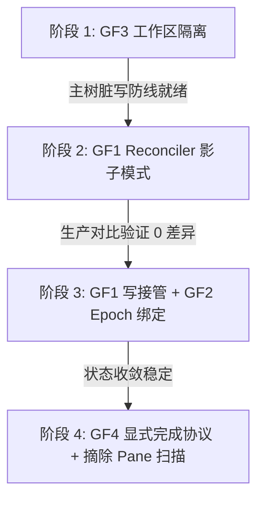

# o1 反驳单 · 分阶段灰度上线可行性评估

## 一、 核心判定：完全可以分阶段灰度上线，拒绝 Big-Bang 一刀切

针对 [design-substrate-redesign-draft-2026-07-12.md](file:///home/sevenx/coding/ccbd-rust/research/orchestration-substrate-redesign/design-substrate-redesign-draft-2026-07-12.md) 收敛稿 §七（139行）中关于 **"四项地基级变更彼此高度耦合，难以拆开单独上"** 的论断，o1 提出强烈反驳：**四项地基级变更（GF1 至 GF4）在架构演进上可以清晰解耦，完全不支持 Big-Bang 式推倒重来。通过“影子模式”与“配置门控”，我们能够设计出一条零风险、渐进式、可随时回退的灰度路径。**

具体而言，我们无需一次性替换整个编排底座，而是可以通过四个清晰的物理阶段渐进推进。

---

## 二、 灰度上线四阶段路径设计

### 阶段 1：GF3（工作区物理隔离）先行上线（降噪防线）
- **可行性分析**：GF3 作用于文件系统侧，改变的是 Agent 启动时的 `cwd` 装配。在 [agent.rs](file:///home/sevenx/coding/ccbd-rust/src/rpc/handlers/agent.rs#L135)，当前的 `agent_cwd` 直接指向 `session.absolute_path`。GF3 仅需在此处通过配置开关切换为 slot 级别的隔离目录（如 `session.absolute_path.join(".workspace").join(format!("slot_{}_{}", agent_id, state_version))`）。
- **耦合度**：**与状态机写引擎（GF1）、Epoch 协议（GF2）、完成协议（GF4）完全解耦**。它不动任何 DB 写权限和事务状态，仅影响 worker 进程的物理运行环境。
- **价值**：作为第一刀，优先阻断“多 Agent 在 main 主树脏写”的历史高发问题（如文件冲突、临时文件污染），为后续状态机的高频 reconcile 提供干净的物理环境。

### 阶段 2：GF1（StateReconciler 与事件日志脊柱）“影子模式”（只读仿真）
- **可行性分析**：新建 `StateReconciler` 与事件日志表 `perception_events`，但 Reconciler **不持有物理资源的实际控制权，也不接管 DB 的生产写权限**。
- **运行机制**：
  1. 现有的 legacy 写路径（如 [state_machine.rs](file:///home/sevenx/coding/ccbd-rust/src/db/state_machine.rs#L188-L208) 中的 `mark_agent_waiting_for_ack_sync`）照常运行，负责生产环境的真实写入。
  2. 当 legacy 写操作发生时，系统同步向 `perception_events` 写入一条审计事件，或由一个后台线程/钩子捕获该事件。
  3. `StateReconciler` 影子运行：读取当前 DB 状态快照，基于事件计算其“预期状态转移”，但不进行物理写入。
  4. 对比与告警：对比影子 Reconciler 的判定与 legacy 代码的真实写行为。若发生不一致，向日志系统抛出 `MismatchedStateTransition` 警报。
- **价值**：在不改变生产行为的前提下，验证 Reconciler 的状态收敛逻辑是否 100% 正确，用真实的生产流量进行无风险压测与 debug。

### 阶段 3：GF1 写接管推广 + GF2（Epoch 绑定）落地（底座切流）
- **可行性分析**：在影子模式验证不一致率达到 0% 后，开启写接管开关（`[reconciler].write_enabled = true`）。
- **运行机制**：
  1. 关闭 legacy 的直接写入口（使 `mark_agent_*_sync` 路由失效或只读）。
  2. `StateReconciler` 正式成为唯一的 DB 写入者，独占写连接，直接进行声明式状态收敛与物理资源 GC（物理 GC 作为 Reconciler 的内在 pass 同步上线）。
  3. GF2（Epoch 物理绑定）在此阶段同步激活。由于已裁决复用现有的 `state_version` 作为 epoch 版本标识，此步骤不需要对数据库表进行不兼容的 schema 变更，仅需在 spawn IPC payload 及 tmux session 命名中穿透携带 `state_version`。

### 阶段 4：GF4（显式完成协议与 API 化）切流与旧逻辑摘除（收尾阶段）
- **可行性分析**：在 GF1 稳定运行后，上线 `ah job done` 显式协议，并由配置项驱动是否废弃 pane 扫描。
- **运行机制**：
  1. 首先在 worker 中注入完成 hook，开始收集显式完成信号。
  2. 稳定后，置灰并最终彻底移除依赖 tmux pane 终端文本扫描的生命周期推断逻辑，彻底关闭看门狗扫描，将编排完全移交控制面 API。

---

## 三、 对抗性论证：窄口径子问题逐项答辩

### Q1: 切入顺序：哪一项可以先独立上线并在生产验证？
**结论**：**GF3（工作区物理隔离）** 拥有绝对的独立性，可以最先单飞上线。
**论据**：GF3 仅在 `spawn` 时调整工作路径参数，与 DB 的复杂状态转移逻辑无涉。
**影子验证设计**：对于 GF1，设计 **“影子模式（Shadow Mode）”** 作为切入点。让新 Reconciler 跑“只读计算”，与 legacy 的 [state_machine.rs](file:///home/sevenx/coding/ccbd-rust/src/db/state_machine.rs) 里的 `mark_agent_*_sync` 双轨运行，通过比对引擎输出的 `Diff` 来验证其正确性，而无需等 GF2/GF4 就绪。

### Q2: 共存期的双写/双轨风险：影子模式下如何确保零不一致？
**结论**：**设计“零物理写入，只读审计”的安全隔离边界，将双写风险完全降为零。**
**防线机制**：
1. **只读连接约束**：影子 Reconciler 实例化时，仅分配只读的 SQLite 连接句柄，从物理上剥夺其对 `agents` 和 `jobs` 表的写入能力。
2. **审计日志旁路化**：Reconciler 产出的“状态建议”仅写入专用的旁路审计表（如 `shadow_reconciler_audit_logs`）或直接打印为 stdout/stderr 日志，绝不干扰主状态机。
3. **副作用截断**：影子模式下，Reconciler 内部的所有物理执行器（如 tmux 销毁、cgroup 调整）均被 Mock 掉，只做逻辑演练，不对宿主机产生任何物理副作用。

### Q3: GF3（slot 工作区隔离）与其它三项的真实耦合度？
**结论**：**真实耦合度极低，可以独立于 Reconciler 脊柱先行上线。**
**论据**：
- d1 认为“四项彼此高度耦合”是一个概括性的假设。实际上，GF3 动的是 `agent_cwd` 的物理计算（[agent.rs:135](file:///home/sevenx/coding/ccbd-rust/src/rpc/handlers/agent.rs#L135)），而 GF1 动的是 DB 写逻辑与 Reconciler 状态环。
- 即使没有 GF1 的单写收敛， legacy 代码依然可以通过传入 `state_version` 来建立隔离的工作区路径。这证明了 GF3 在数据依赖和控制依赖上对 GF1 均无强耦合。
- 第一批灰度 GF3，可以用极低的爆炸半径解决脏写问题，完全不需要等整个 Reconciler 脊柱重写完工。

### Q4: 失败回退路径：如何设计一键降级？
**设计如下四级回退防线**：

1. **GF3 工作区隔离回退**：
   - **配置开关**：`[isolation].use_per_slot_workdir = false`。
   - **效果**：回退后，代码将 `agent_cwd` 重新指向 session 根目录，零物理痕迹，不影响已存在的历史任务。
2. **GF1 Reconciler 影子模式关闭**：
   - **配置开关**：`[reconciler].shadow_mode = false`。
   - **效果**：完全关闭 shadow reconciler 的旁路线程与事件监听，系统回归到纯粹的 legacy write 逻辑，不留任何运行时消耗。
3. **GF1 写接管回退**：
   - **配置开关**：`[reconciler].write_enabled = false`。
   - **效果**：若接管后发生严重死锁或事务延迟，关闭此开关即可让 `mark_agent_*_sync` 重获写权限，Reconciler 退回影子只读状态。由于 GF2 复用了已有的 `state_version`，**不涉及 schema rollback 难题**，可无缝回退。
4. **GF4 完成协议回退**：
   - **配置开关**：`[completion].enforce_explicit_done = false`。
   - **效果**：重新激活旧的 pane 终端扫描机制，兜底感知 Agent 状态，确保旧 harness 在没有适配新 hook 时系统不卡死。

---

## 四、 给设计主笔 d1 的输入建议

请 d1 在更新收敛稿（冻结稿）时，将以下改动合并入 **§九（实施排期与切换策略）**，替换掉原有的 "本稿未展开" 的陈述：
- 采纳 **"GF3 先行、GF1 影子运行、写接管门控、显式协议渐进替代"** 的分阶段迁移路线。
- 引入 `[isolation]`、`[reconciler]`、`[completion]` 的配置开关，以取代 big-bang 推倒重写的一次性高风险部署方案。
