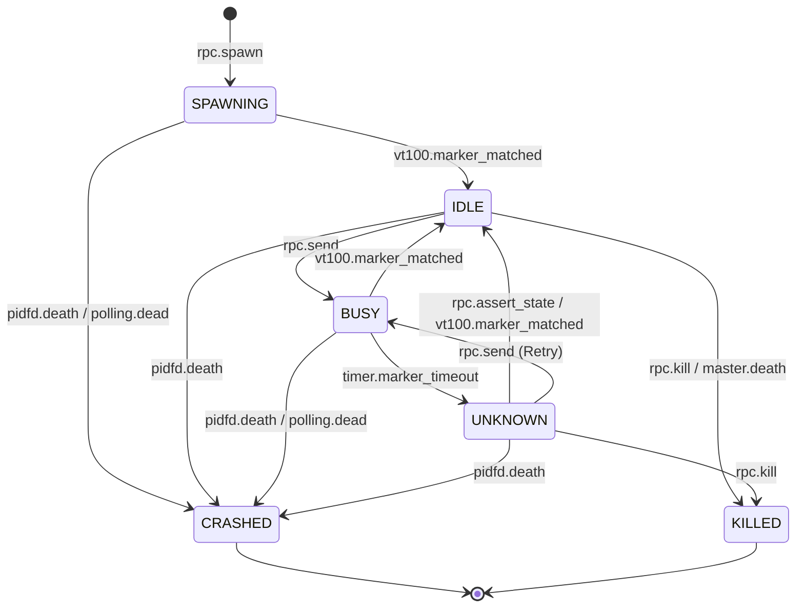

# S-1：核心状态机与生命周期图谱 (State Machine & Lifecycle)

> **设计哲学**：状态机是系统的唯一事实来源。所有 PTY 流量、RPC 调用和 OS 信号必须被归一化为状态转移。通过 SQLite 的 CAS (Check-and-Set) 机制确保多源触发下的幂等性。

## 1. 状态枚举定义 (State Enum)

| 状态变体 | 物理含义 | 允许的 Stdin 输入 | 备注 |
| :--- | :--- | :--- | :--- |
| `SPAWNING` | 进程已拉起，正在等待首个交互提示符（Banner/Prompt）。 | 禁止 | 此阶段丢弃所有 L3 指令。 |
| `IDLE` | 稳定就绪状态。 | **允许** | 包含子类型：`Matched` (VT100 识别) / `Asserted` (L3 强制)。 |
| `BUSY` | 命令已投递，Agent 正在执行。 | 禁止 | 此时 PTY 流量由 vt100 解析器持续监控。 |
| `UNKNOWN` | 识别模糊或超时（MarkerTimer 溢出）。 | **允许** | 议题 1b 闭环入口。必须挂载 Evidence。 |
| `CRASHED` | [终态] 进程非预期退出或监控探测失效。 | 禁止 | 触发资源收割逻辑。 |
| `KILLED` | [终态] 用户主动终止或主控退出触发级联清理。 | 禁止 | 触发资源收割逻辑。 |

---

## 2. 状态转移图 (Mermaid)



---

## 3. 状态流转矩阵 (Transition Matrix)

| 触发源 | 当前状态 | 目标状态 | 前置条件 | 副作用 (Side Effects) |
| :--- | :--- | :--- | :--- | :--- |
| `rpc.spawn` | None | `SPAWNING` | 沙箱目录已就绪 | Fork 进程；`pidfd_open`；启动 `StartupTimer`。 |
| `vt100.matched`| `SPAWNING` | `IDLE(Matched)` | 解析到首个 Marker | 停止 `StartupTimer`；发送 `agent.ready` 通知。 |
| `rpc.send` | `IDLE` | `BUSY` | Stdin 写入成功 | 启动 `MarkerTimer` (默认 10s)。 |
| `vt100.matched`| `BUSY` | `IDLE(Matched)` | 解析到结束 Marker | 停止 `MarkerTimer`；写入 `DeliveryAck` 到 DB。 |
| `timer.timeout`| `BUSY` | `UNKNOWN` | `MarkerTimer` 溢出 | **Dump Evidence (PTY 截图)**；发送 `agent.unknown` 通知。 |
| `rpc.assert` | `UNKNOWN` | `IDLE(Asserted)`| L3 强行断言 | 停止 `MarkerTimer`；记录断言日志。 |
| `pidfd.death` | Active* | `CRASHED` | 内核通过 epoll 唤醒 | 关闭 PTY；清理 Sandbox；发送 `agent.crashed` 通知。 |
| `polling.dead` | Active* | `CRASHED` | `/proc/<pid>` 消失 | (同上，用于 pidfd 不可用或事件丢失场景) |
| `rpc.kill` | Any | `KILLED` | L3 发起指令 | 发送 SIGKILL；回收资源；标 DB。 |

---

## 4. 关键竞争条件处理 (Race Condition Handling)

### 4.1 CAS (Check-And-Set) 更新协议
所有写入 SQLite 的状态更新必须携带 `state_version` 和 `current_state` 校验。
**伪代码实现**：
```sql
-- 确保在 Polling 对账时不会覆盖已经被 pidfd 更新为 CRASHED 的状态
UPDATE agents 
SET 
    state = 'CRASHED', 
    version = version + 1,
    exit_code = ? 
WHERE 
    id = ? AND 
    version = ? AND 
    state NOT IN ('CRASHED', 'KILLED');
```

### 4.2 Push (pidfd) vs Polling (Reconcile)
1. **场景**：Agent 进程崩溃。
2. **Push 路径**：`pidfd` 在 epoll 唤醒，Daemon 立即执行 CAS 更新，版本号 +1。
3. **Polling 路径**：30s 后的对账循环检查 `/proc`，发现 PID 已无。尝试执行 CAS 更新。
4. **结果**：由于 Polling 路径携带的是旧版本号，或者更新语句中的 `state NOT IN` 逻辑，Polling 会静默失败（或返回 0 rows affected），保证了终态清理逻辑只执行一次。

### 4.3 PTY 解析与 Unknown 超时竞态
1. **场景**：Agent 正在吐出超大日志，`vt100` 解析正在进行，此时 `MarkerTimer` 刚好到期。
2. **处理逻辑**：Timer 任务持有 Agent 的 Mutex 锁。如果 PTY 解析逻辑正在持有锁处理最后一块 Chunk，Timer 会阻塞等待。若解析逻辑在这一块中发现了 Marker 并成功将状态转为 `IDLE`，Timer 任务被唤醒后由于 `current_state` 校验不通过，将不再触发 `UNKNOWN` 流转。

---

## 5. 失败设计 (Failure Design)

1. **Startup 僵死**：如果进程拉起后 10s 仍未出现欢迎 Marker（`SPAWNING` 停滞），L2 强制将其转为 `CRASHED` 并抛出 `STARTUP_MARKER_TIMEOUT` 错误码。
2. **Evidence 覆盖**：如果在 `UNKNOWN` 状态下收到下一条 `rpc.send`，系统必须先归档（Seal）上一个 Evidence，再进行状态转移，确保调查线索不丢失。
3. **Ghost Process**：调谐循环若发现 SQLite 中没有任何记录，但 OS 进程树中存在 `ccbd-agent` 特征的进程，必须主动 SIGKILL 回收。
