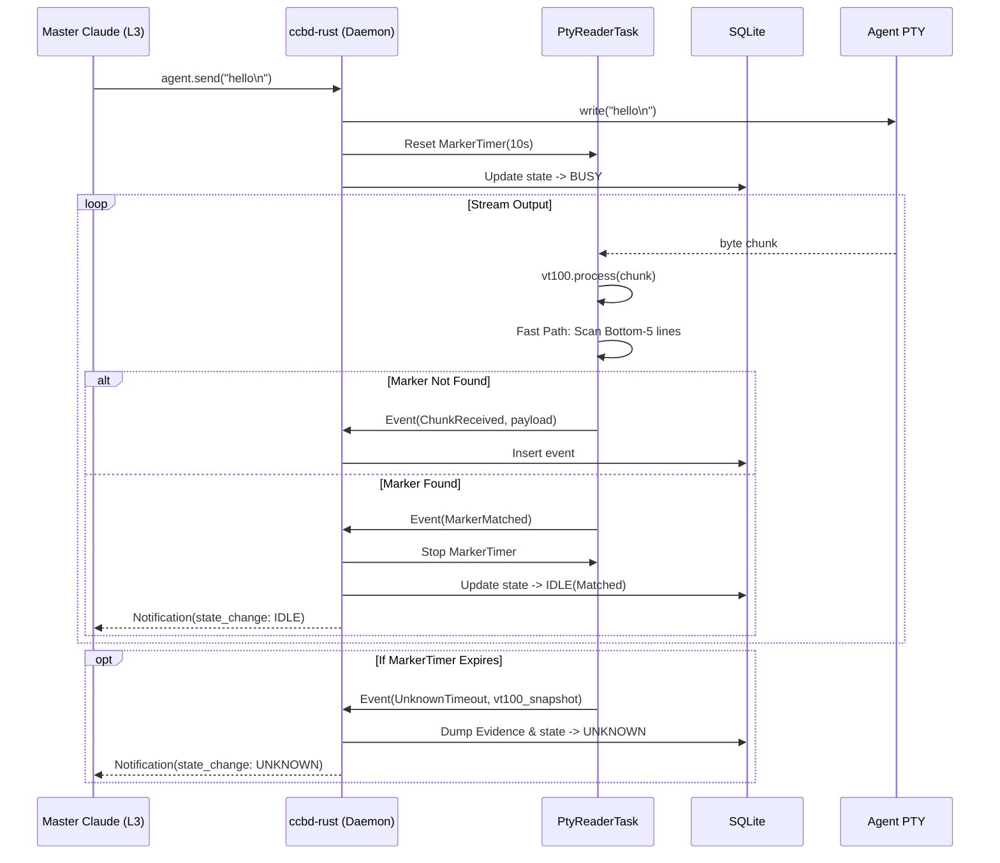

# S-4：VT100 解析与 Marker 算法 (PTY Processing Algorithm)

> **设计哲学**：该算法是系统作为「代理操作员」的视觉神经。必须在极低延迟（实时响应）和容错性（全屏兜底）之间取得平衡。同时，它是触发 `UNKNOWN` 反馈闭环的唯一守门人。

## 1. 核心架构与数据流

采用异步生产者-消费者模式，隔离阻塞的 I/O 操作与状态机更新。

*   **PtyReaderTask**：一个专用的 `tokio` 任务，持有 PTY 的 Read End 和 `vt100::Parser` 实例。
*   **State Channel**：通过 `tokio::sync::mpsc` 向主调度器发送状态转移事件（如 `Matched`, `Unknown`, `ChunkReceived`）。

### 1.1 数据流时序图 (Mermaid)



---

## 2. 规则引擎与配置加载

为了支撑议题 1b 的「双跑模式」，Marker 匹配引擎必须能够动态加载多套规则。

### 2.1 规则配置模型 (`ProviderProfile`)
规则以外置 TOML 文件形式存在，通过 `include_str!` 打包内建默认值。

```toml
# .ccb/providers/gemini.toml
[markers]
# L2 主路径：必须严格匹配
prompt_ready = [
    { type = "regex", pattern = r"^\s*✦\s*$" },
    { type = "exact", pattern = "Gemini CLI > " }
]
# 识别失败时，记录哪些旧规则/备选规则被尝试过，存入 Evidence
legacy_or_candidate = [
    { type = "regex", pattern = r"Thinking\.\.\." }
]
```

### 2.2 内存规则编译
在系统启动或配置变更时，将配置加载为内存结构，使用 `aho-corasick` 或预编译 `regex::Regex` 实现微秒级匹配。

---

## 3. 核心解析算法伪代码 (Pseudocode)

以下是 `PtyReaderTask` 内部循环的核心伪代码实现。

```rust
struct PtyReaderTask {
    parser: vt100::Parser,
    rules: Vec<CompiledRule>,
    marker_timer: Option<tokio::time::Sleep>,
    channel: mpsc::Sender<PtyEvent>,
}

impl PtyReaderTask {
    async fn run(&mut self, mut pty_rx: PtyStream) {
        // A-3 决议：初始化 200x200 屏幕
        self.parser = vt100::Parser::new(200, 200, 0);
        
        // 1Hz 慢路径兜底定时器
        let mut slow_scan_interval = tokio::time::interval(Duration::from_secs(1));

        loop {
            tokio::select! {
                // 分支 1：PTY 有新数据到达
                Some(chunk) = pty_rx.next() => {
                    // 1. 更新 VT100 状态机
                    self.parser.process(chunk);
                    
                    // 2. 发送原始 Chunk 用于 L3 流式读取
                    self.channel.send(PtyEvent::Chunk(chunk));
                    
                    // 3. 尝试重置超时 Timer (只有在 BUSY 或 SPAWNING 时有 Timer)
                    if let Some(timer) = &mut self.marker_timer {
                        timer.reset(Instant::now() + Duration::from_secs(10));
                    }
                    
                    // 4. 执行快路径扫描
                    self.fast_path_scan();
                }
                
                // 分支 2：慢路径 1Hz 定时器触发
                _ = slow_scan_interval.tick() => {
                     self.slow_path_scan();
                }
                
                // 分支 3：MarkerTimer 超时 (触发 UNKNOWN)
                () = async { self.marker_timer.as_mut().unwrap().await }, if self.marker_timer.is_some() => {
                    self.trigger_unknown_fallback();
                }
            }
        }
    }
    
    // --- 算法实现 ---

    fn fast_path_scan(&mut self) {
        let screen = self.parser.screen();
        // 提取底部 5 行非空文本
        let bottom_lines = extract_bottom_n_lines(screen, 5);
        
        for rule in &self.rules {
            if rule.is_match(&bottom_lines) {
                // 发送状态转移事件，并停止 Timer
                self.channel.send(PtyEvent::Matched);
                self.marker_timer = None;
                return;
            }
        }
    }

    fn slow_path_scan(&mut self) {
        // 如果当前没有期待 Marker (即处于 IDLE 状态)，跳过扫描节省 CPU
        if self.marker_timer.is_none() { return; }
        
        let screen = self.parser.screen();
        // 提取全屏 200 行文本
        let full_text = extract_all_lines(screen);
        
        for rule in &self.rules {
            if rule.is_match(&full_text) {
                self.channel.send(PtyEvent::Matched);
                self.marker_timer = None;
                return;
            }
        }
    }

    fn trigger_unknown_fallback(&mut self) {
        // 抓取当前屏幕快照 (字节数组)
        let snapshot = self.parser.screen().contents_formatted();
        // 记录当时尝试过但失败的规则
        let failed_rules = self.rules.iter().map(|r| r.id).collect();
        
        // 推送给主守护进程，执行 S-2 定义的 DB 事务
        self.channel.send(PtyEvent::Unknown {
            pane_bytes: snapshot,
            failed_rules
        });
        
        self.marker_timer = None; // 停止计时，等待 L3 介入或新的 send
    }
}
```

---

## 4. 异常防御边界 (Failure Guardrails)

1. **巨量输出防御 (Flood Protection)**：如果 Agent 短时间内输出超大日志（例如 `cat` 一个几 MB 的文件），PTY 可能会被撑爆。由于 `vt100` parser 在遇到换行时会自动卷动并丢弃顶部内容（超过 200 行），因此内存永远不会泄漏。但在这种高 I/O 情况下，必须确保 `fast_path_scan` 操作足够轻量（这也是为什么限制底部 5 行的原因），避免 CPU 被字符串匹配占满。
2. **控制序列攻击**：恶意或损坏的输出可能包含导致解析器崩溃的不规范 Escape Sequence。`doy/vt100` 设计时已有一定的容错，若遇到 `unwrap` Panic，`PtyReaderTask` 将崩溃。此时依托 A-6 架构，主调谐循环（Polling）会发现 PTY 管道破裂，从而强制回收该 Agent 转为 `CRASHED`。
3. **Timer 停滞**：如果 `tokio` 反应器过载导致 Timer 延迟调度，这只会使得 `UNKNOWN` 状态晚一点触发，不会破坏状态机的正确性（Fail-safe）。
